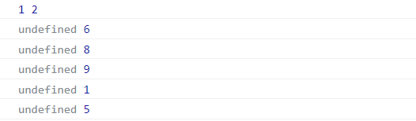
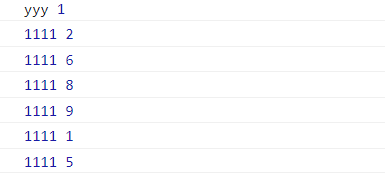

# 数组
## 基本知识
### 创建数组
使用对象方式创建数组
```js
const arr = new Array(1,2,3,4,5)
console.log(arr)          // [1, 2, 3, 4, 5]
console.log(arr.length)  //5
```
使用字面量创建是推荐的简单作法
```js
const arr = [1,2,3,4,5]
```
### Array.of
使用`Array.of` 与 `new Array` 不同的是设置一个参数时不会创建空元素数组
```js
const array = new Array(3)  // 传一个参数
console.log(array.length)   // 3
console.table(array)       // 空的

const arr= Array.of(3)
console.log(arr.length)  // 1
console.log(arr)        // [3]
```
### 类型检测
检测变量是否为数组类型 `Array.isArray()`
```js
console.log(Array.isArray(1))
console.log(Array.isArray([]))
console.log(Array.isArray({}))
// false
// true
// false
```
### 生成随机的数据(mock)
```js
import {Random} from 'mockjs'

new Array(30).fill().map((article,index) =>{
    return {
        id:index,
        title:Random.ctitle(),
        content:Random.cparagraph()
    }
})
```
## 类型转换
可以将数组转换为字符串 , 也可以将其他类型转换为数组
### 转为字符串
大部分数据类型都可以使用`.toString()` 函数转换为字符串
```js
const arr = [1, 2, 3 , 'hello']
console.log(arr.toString())
// 1,2,3,hello
```
也可以使用函数 `String()` 转换为字符串
```js
console.log(String(arr))
```
或使用`join()`把数组连接为字符串
```js
const  arr = [1,2,3,4,5]
console.log(arr.join('-'))  // 1-2-3-4-5
```
### Array.from
可以将伪数组转换为数组 , 类数组指包含 `length` 属性或可迭代的对象
```js
const str = 'frank'
console.log(Array.from(str)) //['f', 'r', 'a', 'n', 'k']
```
为对象设置`length`属性后也可以转换为数组，但要下标为数值或数值字符串
```js
const  obj = {
    0:'hello',
    '1':'hi',
    length:2
}
const arr = Array.from(obj)
console.log(arr);
```
`document.querySelectorAll`得到的数组是伪数组 , `Array.from()`的第二个参数类似于`map`函数的方法，可以对数组元素执行函数处理
```js
const divs = document.querySelectorAll('div')
console.log(divs instanceof Array )   // false
// divs 是个伪数组

Array.from(divs , function(item){
    item.style.background = 'red'
})
```
## ...展开操作符
### 数组合并
```js
const a = ['frank' , 'john']
const b = [18 , 15 ]
console.log([...a , ...b])  //['frank', 'john', 18, 15]
```
### 函数的参数
使用 ...操作符 可以替代 `arguments` 来接收任意数量的参数
```js
function log(...args) {
    console.log(args)
}

log(1,2,3,4,'frank')   // [1, 2, 3, 4, 'frank']
```
也可以接收部分的参数
```js
function log(name , ...args) {
    console.log(name)
    console.log(args)
}
log('frank' , 1,2,3,4,5)
// 'frank'
// [1,2,3,4,5]
```
### DOM节点
`document.querySelectorAll`得到的是伪数组 , 需要转换为数组才能使用`map`等的方法
```js
const  divs = document.querySelectorAll('div');
const arr = [...divs];
arr.map((item)=>{
    item.addEventListener('click',()=>{
        console.log('被点击了')
    })
})
```
## 解析解构
解构是一种简洁的赋值特性，可以理解为分解一个数据的结构

* 建议使用 let/const 声明
### 基本使用
```js
let [name ,url] = ['frank' , 'baidu.com']
console.log(name) // 'frank'
```
继续
```js
function x(){
    return ['hello' ,'hi']
}
let [a,b] = x()
console.log(a) // 'hello'
console.log(b)  // 'hi'
```
与 ...操作符 一起用
```js
const [a, ...args] = ['frank' , 'john' , 'jack', 'eren']
console.log(a)      // 'frank'
console.log(args)  // ['john', 'jack', 'eren']
```
### 默认值
可设置默认值
```js
let [name, site = 'baidu.com'] = ['后盾人'];
console.log(site); // 'baidu.com'
```
### 函数参数
直接在参数里解构
```js
function log([name, age]) {
    console.log(name)
    console.log(age)
}

log(['frank', 18])
// 'frank'
// 18
```
## 增删改查
### push
直接改变原数组 , 返回值为数组元素数量
```js
let arr = ['frank' , 'eren','jack']
console.log(arr.push('nancy'))   // 4
console.log(arr)  // ['frank', 'eren', 'jack', 'nancy']
```
```js
let a = ['frank' , 'eren','jack']
let b = [1,2,3]
a.push(...b)
console.log(a)  // ['frank', 'eren', 'jack', 1, 2, 3]
```
根据区间创建新数组
```js
function rangeArray(begin,end) {
    const arr = []
    for (let i= begin;i<=end;i++){
        arr.push(i)
    }
    return arr
}
console.log(rangeArray(1,5))
```
### pop
末尾弹出一个元素 , 改变原数组 , 返回值为弹出的那个元素
```js
let arr = ['frank' , 1 ,5, 'end']
console.log(arr.pop()) // 'end'
console.log(arr)       // ['frank', 1, 5]
```
### shift 
从数组最前面弹出一个元素 , 直接改变原数组 , 返回值为弹出的那个元素
```js
let arr = ['frank' , 1 ,5, 'john']
console.log(arr.shift()) // 'frank'
console.log(arr)       // [1, 5, 'john']
```
### unshift
从数组最前面添加元素 , 直接改变原数组 , 返回值为数组的长度
```js
let arr = ['frank' , 1 ,5, 'john']
console.log(arr.unshift('hello')) // 5
console.log(arr)       // ['hello', 'frank', 1, 5, 'john']
```
### slice
`slice` 方法从数组中截取部分元素组合成新数组（并不会改变原数组），不传第二个参数时截取到数组的最后元素
```js
const a = ['frank', 1, 3, 5, 7, 'end']
const b = a.slice()

console.log(a)            // ['frank', 1, 3, 5, 7, 'end']
console.log(a === b )     // false
console.log(a.slice(1,4)) // [1, 3, 5]
```
### splice
使用 `splice` 方法可以添加、删除、替换数组中的元素，会对原数组进行改变，返回值为删除的元素。

第一个参数为从哪开始删除，第二个参数为要删除的数量, 第三个参数开始是要添加的元素
```js
const a = ['frank', 1, 3, 5, 7, 'end']

console.log(a.splice(1,4))  // [1, 3, 5, 7]
console.log(a)   //['frank', 'end']
```
通过`length`删除最后一个元素
```js
const a = ['frank', 1, 3, 5, 7, 'end']

a.splice(a.length-1 , 1)
console.log(a)  //['frank', 1, 3, 5, 7]
```
指定第三个参数设置在删除位置添加的元素
```js
const a = [0,1,2,3,4,5,'end']

a.splice(6,0 , 'add1','add2')
console.log(a)   // [0, 1, 2, 3, 4, 5, 'add1', 'add2', 'end']
```
向末尾添加元素
```js
const a = [0,1,2,3,4,5,'end']

a.splice(a.length,0 , 'xxx')
console.log(a)   //[0, 1, 2, 3, 4, 5, 'end', 'xxx']
```
向数组最前前面添加元素
```js
const a = [0,1,2,3,4,5,'end']

a.splice(0,0 , 'xxx')
console.log(a)      // ['xxx', 0, 1, 2, 3, 4, 5, 'end']
```

## 合并拆分
### join
使用`join`把数组连接成字符串
```js
const arr = [1 , 'frank' ,'john']
console.log(arr.join('-'))    // 1-frank-john
```
### split
`split` 方法会把字符串分割成数组，类似`join`方法的反函数
```js
const str = 'frank,1,2'
console.log(str.split(','));  // ['frank', '1', '2']
```
### concat
`concat` 方法用于连接两个或多个数组，
```js
const array = [1,2,3]
const arr2 = ['frank','john','eren']
const arr3 = [4,5,6]
console.log(array.concat(arr2 , arr3))  // [1, 2, 3, 'frank', 'john', 'eren', 4, 5, 6]
```
也可以用 ...操作符
```js
console.log([...array,...arr2,...arr3])
```
## 查找元素
### indexOf
`indexOf` 从前向后查找元素出现的位置，如果找不到返回 `-1`, 第二个参数指定要开始查找的位置
```js
const arr = ['frank', 1, 2, 3,'end']
console.log(arr.indexOf(2))    // 2
console.log(arr.indexOf('hi'))  // -1
```
第二个参数用于指定查找开始位置
```js
const arr = ['frank', 1, 2, 3,1,2,3,'end']
console.log(arr.indexOf(2,3))    // 5
```
### lastIndexOf
`lastIndexOf` 从后向前查找元素出现的位置，如果找不到返回 `-1`
```js
let arr = [7, 3, 2, 8, 2, 6];
console.log(arr.lastIndexOf(2));   // 4    从后查找2出现的位置

console.log(arr.lastIndexOf(2,3));  // 2
```
### includes
`includes`会检查字符串是否存在 , 返回值是布尔值
```js
let arr = [7, 3, 2, 6];
console.log(arr.includes(6));  // true
console.log(arr.includes(10)); // false
```
#### 手写 includes
```js
function include(array , str){
    for(const item of array) {
        if(item === str){
            return true
        }
    }
    return false
}
```
**注意** , `includes`是不能查找引用类型，因为它们的内存地址是不相等的
```js
const  user = [{name:'frank'},{name:'john'},{name:'eren'}]
console.log(user.includes({name: 'frank'}));   //false 
//因为内存地址不相等
```
### find
`find` 方法找到后会把**值**返回出来
* 如果找不到返回值为undefined

返回第一次找到的值，不继续查找

`find`方法可以方便的查找引用类型
```js
const  user = [{name:'frank'},{name:'john'},{name:'eren'}]

let find = user.find(item=>{
    return item.name ==='frank'    
})
console.log(find)  // {name: 'frank'} 
```
### findIndex
`findIndex`是返回索引值
* 查找不到时返回 -1

```js
const  user = [{name:'frank'},{name:'john'},{name:'eren'}]

let findIndex = user.findIndex(item=>{
    return item.name ==='eren'
})
console.log(findIndex)  //2
```
#### 手写 find
```js
function findValue (array , callback) {
    for (const value of array) {
        if(callback(value)) {
            return value
        }
    }
    return undefined
}
```
## 数组排序
### sort
`sort` 每次使用两个值进行比较 `arr.sort((a,b)=>a-b` , `sort()`默认就是从小到大

* 返回负数 a排在b前面,从小到大
* 返回正数 b排在a前面,从大到小
* 返回0 不动

`sort`会改变原数组!

就这么理解 a-b 就是从小到大 , b-a 就是从大到小

```js
let  arr = [6,5,6,8,7,1,5,]
arr.sort((a,b)=>{
    return a-b
})
console.log(arr);  // [1, 5, 5, 6, 6, 7, 8]
```
在巩固一下
```js
let  cart = [
    {name:'衣服',price:3000},
    {name:'鞋子',price:1990},
    {name:'帽子',price:5222},
    {name:'内裤',price:1200},
]
cart.sort((a,b)=>{
    return a.price-b.price
})
console.log(cart);  
```
### reverse
```js
let arr = [1, 4, 2, 9];
console.log(arr.reverse()); //[9, 2, 4, 1]
```
## 拓展方法
### forEach
`forEach` 使函数作用在每个数组元素上，但是没有返回值
```js
let lessons = [
    {title: 'flex布局',category: 'css'},
    {title: '响应式',category: 'css'},
    {title: '闭包',category: 'jjs'}
];

lessons.forEach((item , index)=>{
     item.title = item.title.substr(0,2)
})
console.table(lessons)
```
### every
`every` 用于递归的检测元素，要所有元素操作都要返回真结果才为真, 返回值为布尔值, 如果监测到有假就直接停止检测

第一个参数为元素，第二个参数为索引，第三个参数为原数组

查看学生们成绩是否都合格
```js
const students = [
    {name:'frank',score:68},
    {name:'jack',score:92},
    {name:'john' , score:77}
]
let status  = students.every((student,index)=>{
    return student.score >= 60
})
status ? console.log('所有同学都过了及格线') : console.log('有同学不及格')
```
### some
使用 `some` 函数可以递归的检测元素，如果有一个返回 `true`，表达式结果就是真 , 表达式的返回值是布尔值

第一个参数为元素，第二个参数为索引，第三个参数为原数组

使用 `some` 检测规则关键词的示例，输入框里用户没填写关键字则提醒
```html
<input type="text" name="message">
<span></span>
```
```js
const  keywords = ['js' , 'css']
const input = document.querySelector(`[name="message"]`)
input.addEventListener('keyup',function(e){
    e.target.value
    let status = keywords.some(function(value , index){
        return  e.target.value.indexOf(value) !== -1
    })
   document.querySelector('span').innerHTML = status ? '' : '必须包含js或者css'
})
```
### filter
筛选过滤 , 返回的是新的**数组**
```js
const students = [
    {name:'frank',score:58},
    {name:'jack',score:92},
    {name:'john' , score:77}
]
const arr = students.filter((student , index)=>{
    return student.score >= 60
})
console.log(arr) 
```

#### 手写 filter
```js
function filter(array , callback){
    const newArray = []
    for (const value of array) {  // 遍历
        if (callback(value)) {
            newArray.push(value)
        }
    }
   return newArray   // return 新的数组
}
const arr = filter([1,2,3,4,5,],function (item){
    return item >2
})
console.log(arr)
```
### map 
`map`返回新的数组 , 回调里面的 return 里面我写了什么 , 返回的就是什么

使用 `map` 映射可以在数组的所有元素上应用函数，用于映射出新的值
```js
const students = [
    {name:'frank',score:58},
    {name:'jack',score:92},
    {name:'john' , score:77}
]
const arr = students.map((student , index)=>{
    return student.score * 2               //注意要 return
})
console.log(arr)           // [116, 184, 154]
console.log(students)     // 原来的数组
```
### reduce

`reduce`方法的第一个参数是**回调函数**，第二个参数为**初始值**(可以是空数组[])

* 传入第二个参数时将所有元素循环一遍
* 不传第二个参数时从第二个元素开始循环

回调函数的参数是
|  参数   | 说明  |
|  ----  | ----  |
| pre   | 上次回调函数返回值 |
| cur  | 当前的元素值 |
| index  | 当前的元素索引  |
| array |  原数组 |

**记住** , pre是回调的返回值 ,  cur是数组的元素

基本语法细节:
```js
const  arr = [1,2,6,8,9,1,5]
arr.reduce((pre,cur,index,array)=>{
    console.log(pre , cur)  //不传第二个函数 , 第一次 pre 就等于数组第一个元素
    return undefined
})
```

```js
arr.reduce((pre,cur,index,array)=>{
    console.log(pre , cur)
    return 1111 
} , 'yyy')   // 传了第二个参数 , pre就是这个, 然后将所有元素循环一遍
```

(1)  统计元素出现的次数的函数
```js
function count(array, value) {
    return array.reduce((total, cur, index) => {
        return total += cur === value
            ? 1
            : 0
    }, 0)   //第二各参数是 0
}

const arr = [1, 2, 2, 2, 2, 2, 6, 3, 7]
console.log(count(arr, 2))  // 5
```
(2) 数组里获取最大值
```js
function max(array){
 return array.reduce((pre ,cur ,index)=>{
  return cur > pre ? cur : pre
 })
}
const arr = [1,5,6,9,7,5,3,5,6]
console.log(max(arr));   // 9
```
(3) 购物车获取最贵的商品
```js
const cart = [
    {name:'ipad' , price:8500},
    {name:'imac' , price:18000},
    {name:'iphone' , price:9100}
]

function maxPrice(array){
    return array.reduce((pre,cur,index)=>{
        return pre.price > cur.price ? pre : cur
    })
}

console.log(maxPrice(cart))   //{name: 'imac', price: 18000}
```
(4) 获取把购物车商品总价
```js
const cart = [
    {name:'ipad' , price:8500},
    {name:'imac' , price:18000},
    {name:'iphone' , price:9100}
]
function  sum(array) {
    return array.reduce((total,cur)=>{
        return total  = total + cur.price
    } , 0)
}

console.log(sum(cart));
```
(5)数组去重
```js
const array = [1,2,2,2,5,5,1,96,8,5,1,1]

const newArray = array.reduce((arr,cur)=>{
    if(arr.includes(cur) === false){
        arr.push(cur)
    }
    return arr
},[])

console.log(newArray);

```
## 制作炫酷的动画
鼠标光标移动 , 字体有动画 

```html
<div>Hello world!!</div>
```
```js
// 把 div 里面的文字一个个变成 span
const div = document.querySelector('div')
console.log([...div.textContent]);  // 变成字符串数组
[...div.textContent].reduce((pre,cur,index)=>{
    console.log(pre,cur,index)
    pre === index  &&  (div.innerHTML = '')             // 小技巧 , 最开始把div里面清空(细品判断条件)
    let span = document.createElement('span')
    span.innerHTML = cur
    div.appendChild(span)
    span.addEventListener('mouseover' , (e)=>{   //鼠标浮上时添加类名
        e.target.classList.add('hover')
    })
    span.addEventListener('animationend' , (e)=>{  // animationed事件!!!!!!!!!!
        e.target.classList.remove('hover')
    })
} , 0)
```
```css
* {padding: 0;margin: 0;box-sizing: border-box;}
body {
    width: 100vw;
    height: 100vh;
    display: flex;
    justify-content: center;
    align-items: center;
    background: #2c3e50;
}
div {
    font-size: 4em;
    text-transform: uppercase;
    font-weight: bold;
    color:#8e44ad;
}
span {
    display: inline-block;
}
.hover {
    animation:hover 0.7s  linear;
}
@keyframes hover {
    50% {
        transform: scale(2);
        color:#f1c40f;
    }
    100% {
        transform: scale(1);
        color:#e74c3c;
    }
}
```
