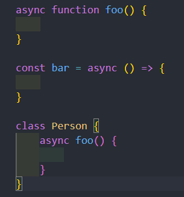
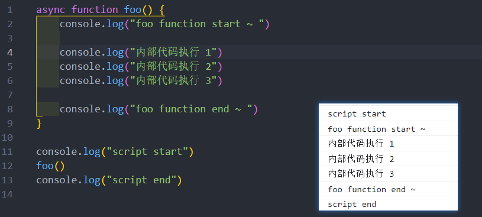
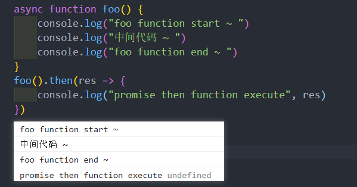
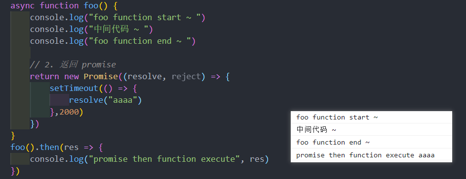
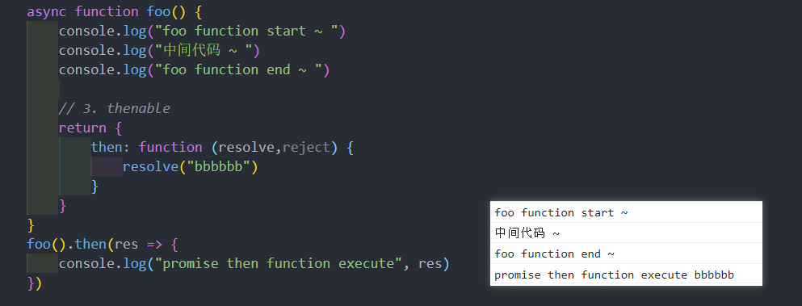
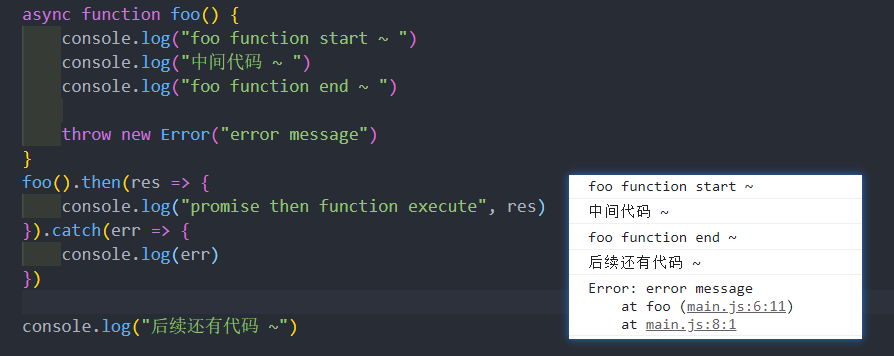
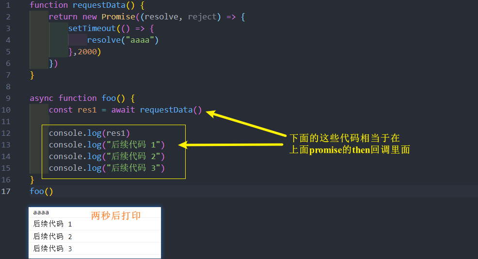
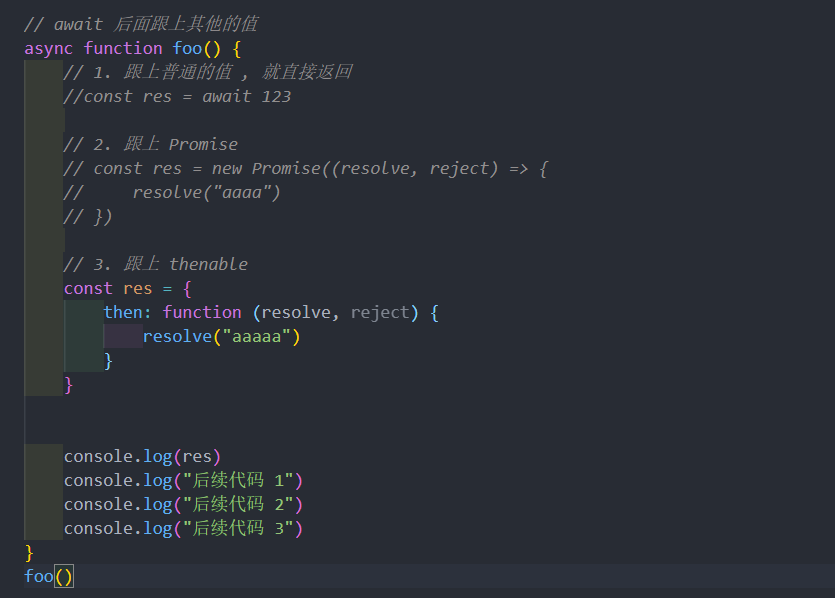
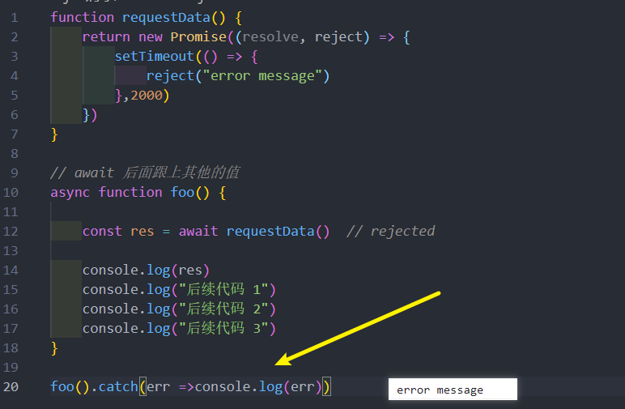

# async - await
## 异步函数 async function
async 关键字用于声明一个异步函数
* async 是 asynchronous 单词的缩写，异步、非同步；
* sync 是 synchronous 单词的缩写，同步、同时

async 异步函数可以有很多中写法 : 

## 异步函数的执行流程
*异步函数的内部代码执行过程和普通函数是一致的 , 默认情况下也是会被**同步执行***

## 异步函数与普通函数区别 - 返回值
*异步函数的返回值一定是 Promise*

**异步函数有返回值时，和普通函数会有区别：**
* **情况一：** 异步函数也可以有返回值，但是异步函数的返回值会被包裹到 Promise.resolve 中；
* **情况二：** 如果我们的异步函数的返回值是 Promise，Promise.resolve 的状态会由 Promise 决定；
* **情况三：** 如果我们的异步函数的返回值是一个对象并且实现了 thenable，那么会由对象的 then 方法来决定；

## 异步函数与普通函数区别 - 异常
* 如果在 async 中抛出了异常，那么程序它并不会像普通函数一样报错，而是会作为 Promise 的 reject 来传递

## await 关键字
*async 函数另外一个特殊之处就是可以在它内部使用 await 关键字，而普通函数中是不可以的*

**await 关键字有什么特点 ?**
* *通常使用 await 是后面会跟上一个表达式，这个表达式会返回一个 Promise*
* *那么 await 会等到Promise的状态变成 fulfilled 状态，之后继续执行异步函数*

await 后面跟上其他的值 : 
* 如果 await 后面是一个普通的值，那么会直接返回这个值；
* 如果 await 后面是一个 thenable 的对象，那么会根据对象的 then 方法调用来决定后续的值；
* 如果 await 后面的表达式，*返回的 Promise 是 **reject 的状态**，那么会**将这个 reject 结果直接作为异步函数的 Promise 的 reject 值***

