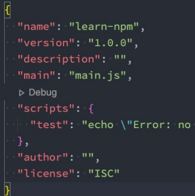
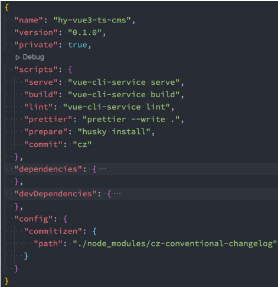
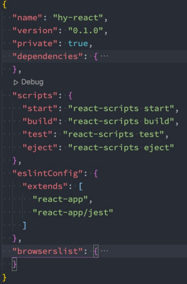
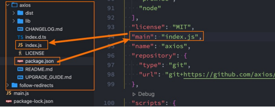
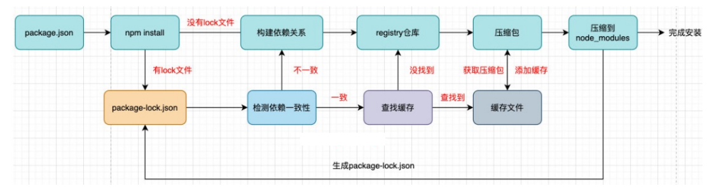
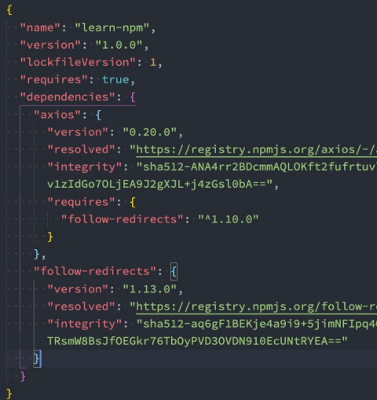
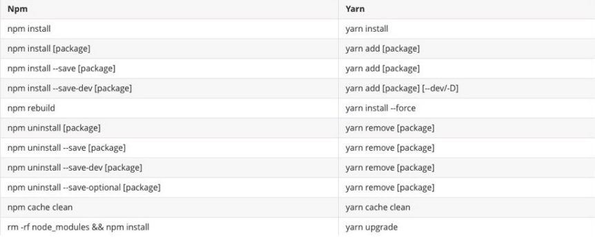
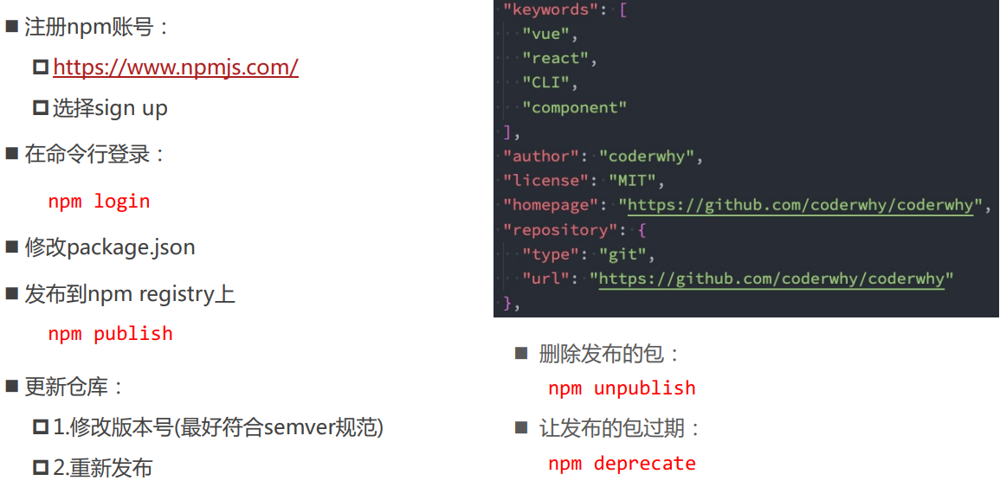

# 包管理工具
## 包管理工具 npm
**包管理工具npm：**
* Node Package Manager，也就是Node包管理器；
* 但是目前已经不仅仅是Node包管理器了，在前端项目中我们也在使用它来管理依赖的包；
* 比如vue、vue-router、vuex、express、koa、react、react-dom、axios、babel、webpack等等；

**如何下载 npm工具呢?**
* npm 属于 node的一个管理工具，所以我们需要先安装Node；
* node 管理工具：[https://nodejs.org/en/](https://nodejs.org/en/)

**npm 管理的包可以在哪里查看、搜索呢？**
* [https://www.npmjs.org/](https://www.npmjs.org/)
* 这是我们安装相关的npm包的官网；

**npm 管理的包存放在哪里呢？**
* 我们发布自己的包其实是发布到 registry 上面的；
* 当我们安装一个包时其实是从 registry 上面下载的包

## npm 的配置文件
那么对于一个项目来说，如何使用 npm 来管理这么多包呢？
* 事实上，每一个项目都会有一个对应的**配置文件**，无论是前端项目（Vue、React）还是后端项目
（Node）；
* 这个配置文件会记录着你**项目的名称、版本号、项目描述**等；
* 也会记录着你项目所依赖的**其他库的信息**和**依赖库的版本号**；

**这个配置文件就是 package.json**

那么这个配置文件如何得到呢？
* 方式一：手动从零创建项目，**npm init –y**
* 方式二：通过脚手架创建项目，脚手架会帮助我们生成 **package.json**，并且里面有相关的配置

## 常见的配置文件
* **npm init** #创建时填写信息
* **npm init** -y #所有信息使用默认的



Vue CLI4 创建的 Vue3 项目



create-react-app 创建的 react17 项目


## 常见的属性
**必须填写的属性：name、version**
* name 是项目的名称；
* version 是当前项目的版本号；
* description 是描述信息，很多时候是作为项目的基本描述；
* author 是作者相关信息（发布时用到）；
* license 是开源协议（发布时用到）；

**private 属性：**
* private 属性记录当前的项目是否是私有的；
* 当值为 true 时，npm 是不能发布它的，这是防止私有项目或模块发布出去的方式；

*** main 属性：**
* 设置程序的入口。
* 很多人会有疑惑，webpack 不是会自动找到程序的入口吗？
  * 这个入口和 webpack 打包的入口并不冲突；
  * 它是在你发布一个模块的时候会用到的；
  * 比如我们使用 axios 模块 const axios = require('axios');
  * 实际上是找到对应的 main 属性查找文件的



**scripts 属性:**
* scripts 属性用于配置一些脚本命令，以键值对的形式存在；
* 配置后我们可以通过 npm run 命的 key 来执行这个命令；
* npm start 和  npm run start 的区别是什么？
  * 对于常用的 start、 test、stop、restart 可以省略掉 run 直接通过 npm start等方式运行

**dependencies 属性**
* dependencies 属性是指定无论开发环境还是生成环境都需要依赖的包；
* 通常是我们项目实际开发用到的一些库模块 vue、vuex、vue-router、react、react-dom、axios 等等；
* 与之对应的是 devDependencies；

**devDependencies 属性**
* 一些包在生产环境是不需要的，比如 webpack、babel 等；
* 这个时候我们会通过 npm install webpack **--save-dev**，将它安装到 devDependencies 属性中

**peerDependencies 属性**
* 还有一种项目依赖关系是对等依赖，也就是你依赖的一个包，它必须是以另外一个宿主包为前提的；
* 比如 element-plus 是依赖于 vue3 的，ant design 是依赖于 react、react-dom

**engines 属性:**
* engines 属性用于指定 Node 和 NPM 的版本号；
* 在安装的过程中，会先检查对应的引擎版本，如果不符合就会报错；
* 事实上也可以指定所在的操作系统 "os" : [ "darwin", "linux" ]，只是很少用到；

**browserslist 属性:**
* 用于配置打包后的 JavaScript 浏览器的兼容情况，参考；
* 否则我们需要手动的添加 polyfills 来让支持某些语法
* 也就是说它是为 webpack 等打包工具服务的一个属性
## 依赖的版本管理
我们会发现安装的依赖版本出现：^2.0.3 或 ~2.0.3，这是什么意思呢？

npm的包通常需要遵从 semver 版本规范：
* semver：https://semver.org/lang/zh-CN/
* npm semver：https://docs.npmjs.com/misc/semver

semver版本规范是X.Y.Z：
* X主版本号（major）：当你做了不兼容的 API 修改（可能不兼容之前的版本）；
* Y次版本号（minor）：当你做了向下兼容的功能性新增（新功能增加，但是兼容之前的版本）；
* Z修订号（patch）：当你做了向下兼容的问题修正（没有新功能，修复了之前版本的bug）；

我们这里解释一下 ^ 和 ~ 的区别：
* ^x.y.z：表示 x 是保持不变的，y 和 z 永远安装最新的版本；
* ~x.y.z：表示 x 和 y 保持不变的，z 永远安装最新的版本

## npm install 命令
安装 npm 包分两种情况：
* 全局安装（global install）： npm install webpack -g;
* 项目（局部）安装（local install）： npm install webpack

全局安装
* 全局安装是直接将某个包安装到全局：
* 比如 yarn 的全局安装：

但是很多人对全局安装有一些误会：
* 通常使用npm全局安装的包都是一些工具包：yarn、webpack 等；
* 并不是类似于 axios、express、koa等库文件；
* 所以全局安装了之后**并不能**让我们在所有的项目中使用 axios 等库
## 局部安装
项目安装会在当前目录下生产一个 node_modules 文件夹

局部安装分为开发时依赖和生产时依赖：
* 安装开发和生产依赖
  * npm install axios
  * npm i axios

* 开发依赖
  * npm install webpack --save-dev
  * npm install webpack -D
  * npm i webpack –D

* 根据 package.jso 中的依赖包
  * npm install
## npm install 原理

npm install会检测是有package-lock.json文件：

没有lock文件
* 分析依赖关系，这是因为我们可能包会依赖其他的包，并且多个包之间会产生相同依赖的情况；
* 从 registry 仓库中下载压缩包（如果我们设置了镜像，那么会从镜像服务器下载压缩包）；
* 获取到压缩包后会对压缩包进行缓存（从 npm5 开始有的）；
* 将压缩包解压到项目的 node_modules 文件夹中（ require 的查找顺序会在该包下面查找）

有lock文件
* 检测lock中包的版本是否和 package.json 中一致（会按照semver版本规范检测）；
  * 不一致，那么会重新构建依赖关系，直接会走顶层的流程；
* 一致的情况下，会去优先查找缓存
  * 没有找到，会从 registry 仓库下载，直接走顶层流程；
* 查找到，会获取缓存中的压缩文件，并且将压缩文件解压到 node_modules 文件夹中；
## package-lock.json
* package-lock.json文件解析：
* name：项目的名称；
* version：项目的版本；
* lockfileVersion：lock文件的版本；
* requires：使用requires来跟踪模块的依赖关系；
* dependencies：项目的依赖
  * 当前项目依赖axios，但是 axios 依赖follow-redireacts；
  * axios中的属性如下：
      * version表示实际安装的axios的版本；
      * resolved用来记录下载的地址，registry仓库中的位置；
      * requires记录当前模块的依赖；
      * integrity用来从缓存中获取索引，再通过索引去获取压缩包文件


## npm 其他命令
* 卸载某个依赖包：
npm uninstall package
npm uninstall package --save-dev
npm uninstall package -D 

* 强制重新build :
npm rebuild

* 清除缓存:
npm cache clean

* npm的命令其实是非常多的：
[https://docs.npmjs.com/cli-documentation/cli](https://docs.npmjs.com/cli-documentation/cli)
## yarn工具
另一个 node 包管理工具 yarn：
* yarn 是由 Facebook、Google、Exponent 和 Tilde 联合推出了一个新的 JS 包管理工具；
* yarn 是为了弥补 npm 的一些缺陷而出现的；
* 早期的 npm 存在很多的缺陷，比如安装依赖速度很慢、版本依赖混乱等等一系列的问题；
* 虽然从 npm5 版本开始，进行了很多的升级和改进，但是依然很多人喜欢使用 yarn；

yarn 和 npm 不能同时一起公用

## cnpm 工具
由于一些特殊的原因，某些情况下我们没办法很好的从 https://registry.npmjs.org下载下来一些需要的包

* 查看 npm 镜像: npm config get registry
* 我们可以直接设置 npm 的镜像：  npm config set registry https://registry.npm.taobao.org

但是对于大多数人来说，并**不希望**将 npm 镜像修改了：
* 第一，不太希望随意修改 npm 原本从官方下来包的渠道；
* 第二，担心某天淘宝的镜像挂了或者不维护了，又要改来改去；

* 这个时候，我们可以使用 cnpm，并且将 cnpm 设置为淘宝的镜像：

npm install -g cnpm --registry=https://registry.npm.taobao.org
cnpm config get registry # https://r.npm.taobao.org/

## npx 工具
npx 是 npm5.2 之后自带的一个命令。
* npx 的作用非常多，但是比较常见的是使用它来调用项目中的某个模块的指令

npx 是npm5.2之后自带的一个命令。
* npx 的作用非常多，但是比较常见的是使用它来调用项目中的某个模块的指令。

以webpack为例：
* 全局安装的是 webpack5.1.3
* 项目安装的是 webpack3.6.0

如果我在终端执行 webpack --version使用的是哪一个命令呢？
* 显示结果会是 webpack 5.1.3，事实上使用的是全局的，为什么呢？
* 原因非常简单，在当前目录下找不到 webpack 时，就会去全局找，并且执行命令
## 局部命令的执行
那么如何使用项目（局部）的webpack，常见的是两种方式：
* 方式一：明确查找到node_module下面的webpack
* 方式二：在 scripts定义脚本，来执行webpack；

方式一：在终端中使用如下命令（在项目根目录下） : ./node_modules/.bin/webpack --version

方式二：修改package.json中的scripts:
```
"scripts": {
    "webpack": "webpack --version"
}
```
方式三：使用npx : **npx webpack --version**

* npx 的原理非常简单，它会到当前目录的 node_modules/.bin 目录下查找对应的命令
## npm 发布自己的包


