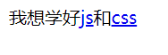

# 基础知识
## 类型检测
### typeof
`typeof`会返回以下类型
* 基本类型：number/string/boolean
* function
* object
* undefined
```js
let a = []
let b = {}
console.log(typeof a)   // object
console.log(typeof b)   // object

function x(){
}
console.log(typeof x)   // function

console.log(typeof f)   // undefined

console.log(typeof  null)  // object
```
### instanceof
`instanceof`会检测**实例对象的原型链上是否存在构造函数的`prototype`**,
也可以理解为是否为某个对象的实例，`typeof`不能区分数组，但`instanceof`则可以
```js
let arr = []
let obj = {}
console.log(arr instanceof Array)  // true
console.log(obj instanceof Array)  // false

function User(){
}
const user = new User()
console.log(user instanceof User)  // true
console.log(user instanceof Object) // true
console.log(user instanceof Array) // false
```
## String
### 转义符号
使用 `\`转义符号进行含义转换
```js
const str = 'www.bai\'du.com'
console.log(str)  
// www.bai'du.com
```
|  符号   | 说明  |
|  ---  | ---  |
| \t  | 四个字符 , 缩进 |
| \n  | 换行 |
| \\  | 斜杠 |
| \'  | 单引号 |
| \"  | 双引号 |

还有 , `HTML`里面空格是 `&nbsp`
### 模板字符串 
模板字符串 里面可以再套 模板字符串


```js
const arr = [
    {type: 'js课程'},
    {type: 'css课程'},
    {type: 'vue课程'}
]

function template() {
    return `<ul>${arr.map(item => {
        return `<li>${item.type}</li>`
    }).join('')
    }</ul>`
}

document.body.innerHTML = template()
```
### 获取长度
使用`length`属性可以获取字符串长度
```js
const str = 'Hello,my name is frank'
console.log(str.length)
```
### 大小写转换
```js
const str = 'Hello,my name is frank'

console.log(str.toUpperCase())
console.log(str.toLowerCase())
```
### 消除空格
使用`trim()`删除字符串左右的空白字符

输入密码是防止敲空格实例
```js
const input = document.querySelector(`[name='password']`)

input.addEventListener('keyup',(e)=>{
    e.target.value = e.target.value.trim()
    console.log(e.target.value.length)   //敲空格时长度始终为0
})
```
还有 , 使用`trimLeft`删除左边空白，使用`trimRight`删除右边空白
### 获取单个字符
使用`charAt()`
```js
const name = 'frank'
console.log(name.charAt(0))  // f
```
也可用数字索引
```js
const name = 'frank'
console.log(name[0])  // f
```
小例子:

```js
const str = 'Hello world'

for (let i=0;i<str.length;i++){
    console.log(i);
    let span = document.createElement('span')
    span.style.fontSize = (i+1) * 10 + 'px'
    span.innerHTML = str[i]
    document.body.append(span)
}
```
### 截取字符串
使用 `slice`、`substr`、`substring` 函数都可以截取字符串。

* `slice`、`substring` 第二个参数为截取的结束位置
* `substr` 第二个参数指定获取字符数量
```js
const str = '0123456789'
console.log(str.slice(0))        // 0123456789
console.log(str.substring(0))    // 0123456789
console.log(str.substr(0))  // 0123456789

console.log(str.slice(1,3))        // 12
console.log(str.substring(1,3))    // 12
console.log(str.substring(3, 1));   //12   较小的做为起始位置
console.log(str.substr(1,3))  // 123

console.log(str.slice(3, -1));      // 345678
console.log(str.slice(-2));         // 89 从末尾取
console.log(str.substring(3, -9));  // 012 负数转为0
console.log(str.substr(-3, 2)); // 78  从后面第三个开始取两个
```
### 查找字符串
#### indexOf()
**`.indexOf(searchString: string, position?: number):number`** 

第一个参数是要找的字符串 , 第二个参数是起始位置 , 找不到返回 -1
```js
const str = 'Hello world'
console.log(str.indexOf('o'))    // 4
console.log(str.indexOf('o', 5))  // 7
console.log(str.indexOf('x'))   // -1
```
#### lastIndexOf()
**`String.lastIndexOf(searchString: string, position?: number): number`**
从后面, **向前找**
```js
const str = 'Hello world'
console.log(str.lastIndexOf('o'));  // 7
console.log(str.lastIndexOf('o',6));  // 4
```
#### includes()
**`String.includes(searchString: string, position?: number): boolean`**

返回布尔值 true / false
```js
const str = 'Hello world'
console.log(str.includes('o')); // true
console.log(str.includes('o' , 5)); // true
console.log(str.includes('x')); // false
```
#### startsWith()
**`String.startsWith(searchString: string, position?: number): boolean`**
```js
const str = 'Hello world'

console.log(str.startsWith('Hello'));  // true
console.log(str.startsWith('o'));  // false
console.log(str.startsWith('o',4));  // true
```
#### endsWith()
跟上面一样

小例子: 检索字符串
```js
const word = ['js','css']
const string = '我学的课程有js和css'
const status = word.some(w=>{
    return string.includes(w)
})
if(status) {
    console.log('找到了关键词')
}
```
### 替换字符串
#### replace()
**`String.replace(searchValue: string | RegExp, replaceValue: string): string`**
```js
const str = 'Hello world'
const newStr = str.replace('world' , 'people')

console.log(str)
console.log(newStr);
```
小例子:
```js
const word = ['js' , 'css']
const string = '我想学好js和css'
// 试图要在js和css上加上a标签
const replacedString = word.reduce((pre,word)=>{
    return pre.replace(word , `<a href="?w=${word}">${word}</a>`)
},string)
console.log(replacedString);
document.body.innerHTML = replacedString
```
### 重复生成 
#### repeat()
**`String.repeat(count: number): string`**
```js
console.log('*'.repeat(3))  // *** 
```
#### 电话号码的模糊处理
```js
function phone(number , length){
    return String(number).slice(0,(-1)*length)+ '*'.repeat(length)   // 细品
}

console.log(phone(18844332822 , 5))  // 188443*****
```
### 类型转换
分割字符串(字符串转为数组)
```js
const name = 'frank'
console.log(name.split(''))  // ['f', 'r', 'a', 'n', 'k']
```
使用 `String` 构造函数可以显示转换字符串类型
```js
const age = 18
console.log( typeof String(age))  //string
```
js 中大部分类型都是对象，可以使用类方法 `toString` 转化为字符串
```js
let age = 99;
console.log(typeof age.toString()); //string

let arr = ['hdcms', '后盾人'];
console.log(typeof arr.toString()); //string
```
## Boolean
布尔类型包括 `true` 与 `false` 两个值
### 声明定义
用对象形式创建
```js
const bool = new Boolean(true)
console.log(typeof bool)   // object
console.log(bool.valueOf())  //true
if(bool.valueOf()) {
    console.log('是 true')
}
```
字面量创建
```js
const bool = true
console.log(typeof bool)  // boolean
console.log(bool.valueOf()) //true
if(bool){
    console.log('是 true')
}
```
### 隐式转换
|数据类型	|true|	false|
|---|---|---|
|String	|非空字符串|	空字符串|
|Number	|非 0 的数值	|0 、NaN|
|Array|	数组不参与比较时	|参与比较的空数组|
|Object	|所有对象	| 无|
|undefined	|无|	undefined|
|null|	无	|null|
|NaN	|无|	NaN|

如果使用 **布尔值** 与数值比较时，会进行隐式类型转换 `true` 转为 `1`，false` 转为 `0`
比如说:
```js
console.log(3 == true); // false
console.log(0 == false); // true
console.log([] == false)  // true

const emptyArr = []
if(emptyArr){
  console.log('这里的空数组是 真 ')
}
```
### 显示转换
可以用`!!`显示转换
```js
let x = '';
console.log(!!x); //false
x = 0;
console.log(!!x); //false
x = null;
console.log(!!x); //false
x = new Date("2022-3-22 10:33");
console.log(!!x); //true
```
也可使用 `Boolean` 函数可以显式转换为布尔类型
```js
let x = '';
console.log(Boolean(x)); //false
x = 0;
console.log(Boolean(x)); //false
x = null;
console.log(Boolean(x)); //false
x = new Date("2022-3-22 10:33");
console.log(Boolean(x)); //true
```
### 实例
```js
while(true) {
    const answer = window.prompt('今年是哪年?')
    if(!answer) continue  // 防止输入空字符串 或 点取消
    console.log( answer === '2022' ? '你回答正确' : '你回答错误' )
    break
}
```
## Number
### 声明定义
对象形式创建
```js
const number = new Number(99)
console.log(typeof number) // object
console.log(number.valueOf() + 1)  // 100
console.log(number+ 1)    // 100
```
字面量创建
```js
const number = 99
console.log(typeof number) // number
console.log(number+ 1)    // 100
```
### NaN
表示 not a number , 无效的数值
```js
console.log(Number('frank')) // NaN
console.log(2 / 'frank') // NaN
``` 
用`Number.isNaN()`判断熟知的合理
```js
let a  = 2 / 'frank'
if(Number.isNaN(a)){
  console.log('error)
}
```
### 类型转换
**Number**

使用 `Number` 函数基本上可以转换所有类型
```js
console.log(Number('frank')); //NaN
console.log(Number(true));	//1
console.log(Number(false));	//0
console.log(Number('9'));	//9
console.log(Number([]));	//0
console.log(Number([5]));	//5
console.log(Number([5, 2]));	//NaN
console.log(Number({}));	 //NaN
```
**parseInt**

转为整数 , 会忽略前面的空格
```js
console.log(parseInt('    98frank')) //98
console.log(parseInt('frank98frank')) // NaN
console.log(parseInt('18.88')) // 18
```
**parseFloat**

转为浮点数 , 会忽略前面空格
```js
console.log(parseFloat('  99.88frank'));	// 99.88
console.log(parseFloat('18.55'));	// 18.55
```
### 舍入操作
#### .toFixed()
**`Number.toFixed(fractionDigits?: number): string`**  , 参数为 小数位数 , 返回的是字符串
```js
const num = 99.15559
console.log(num.toFixed())  // 99
console.log(num.toFixed(2))  // 99.16
console.log(num.toFixed(0))  // 99
console.log(typeof num.toFixed())  // string
```
## Math
Math 的更多方法见[MDN官网](https://developer.mozilla.org/zh-CN/docs/Web/JavaScript/Reference/Global_Objects/Math)
### 取极值
使用 `min` 与 `max` 可以取得最小与最大值
```js
console.log(Math.min(1, 2, 3)); // 1
 
console.log(Math.max(1, 2, 3)); // 3
```
使用 `apply` 来从**数组**中取极值
```js
const arr = [1,2,3,4,5]
console.log(Math.max.apply(null, arr)); // 5
```
### 舍入操作
用`Math.ceil()`向上取整
```js
console.log(Math.ceil(5.00001)) // 6
```
用`Math.floor()`向下取整
```js
console.log(Math.floor(5.99999)) // 5
```
用`Math.round()`四舍五入处理
```js
console.log(Math.round(5.99999)) // 6
```
### random
`random` 方法用于返回 >=0 且 <1 的随机数（包括 0 但不包括 1）

返回 0~5 的随机数，不包括 5
```js
const number = Math.floor(Math.random() * 5);
console.log(number);
```
返回 0~5 的随机数，包括 5 
```js
const number = Math.floor(Math.random() * (5+1));
console.log(number);
```
下面取 2~5 的随机数（**不包括** 5）公式为：min + Math.floor( Math.random()*(Max-min))
```js
const number = Math.floor(Math.random() * (5 - 2)) + 2;
console.log(number);
```
下面取 2~5 的随机数（**包括** 5）公式为：min+Math.floor( Math.random()*(Max-min**+1**))
```js
const number = Math.floor(Math.random() * (5 - 2 + 1)) + 2;
console.log(number);
```

下面是随机点名的示例
```js
const students = ['John' , 'Frank', 'Jack', 'Mike','Alice', 'Eren']
// console.log(students.length);  // 6
//
//  随机点名 0 ~ 5
const index = Math.floor(Math.random() * students.length)
console.log(index);

// 特定区间点名 2 ~ 5
const index2 = 2 + Math.floor(Math.random() * (students.length - 2 ))
console.log(index2);
```

## Date
```js
const date = new Date()
console.log(date)  // Thu Jun 02 2022 13:49:12 GMT+0800 (GMT+08:00)
console.log(typeof date)  // object
console.log(date * 1)  // 1654149069578  时间戳

//直接使用函数获取当前时间
const date2 = Date()
console.log(date2)  // Thu Jun 02 2022 13:49:58 GMT+0800 (GMT+08:00)
console.log(typeof date2)  // string

//获取当前时间戳单位毫秒
console.log(Date.now()); // 1654149121010
```
计算脚本执行时间
```js
const start = Date.now()
for(let i=0;i<2000;i++) {
    console.log('')
}
const end = Date.now()
console.log(end - start)  // 88 毫秒
```
也可以使用控制台测试
```js
console.time("testFor");
for (let i = 0; i < 20000; i++) {}
console.timeEnd("testFor");  

// testFor: 1.4599609375 ms
```
根据指定的日期与时间定义日期对象
```js
let now = new Date('2028-02-22 03:25:02');
console.log(now);  // Tue Feb 22 2028 03:25:02 GMT+0800 (GMT+08:00)

now = new Date(2028, 4, 5, 1, 22, 16);
console.log(now);  // Tue Feb 22 2028 03:25:02 GMT+0800 (GMT+08:00)
```
使用展示运算符处理更方便
```js
const params = [1999,10,3,13,52,21]  // 数组
const date = new Date(...params)
console.log(date)  // Wed Nov 03 1999 13:52:21 GMT+0800 (GMT+08:00)
```
### ISO和TIMESTAMP(时间戳)格式转换
将日期转为数值类型即转为时间戳 , 单位是毫秒
```js
const date = new Date('1999-5-12 08:15:16')
console.log(date)  // Wed May 12 1999 08:15:16 GMT+0800 (GMT+08:00)

console.log(date * 1)  // 926468116000
console.log(Number(date)) // 926468116000
console.log(date.valueOf()) // 926468116000
console.log(date.getTime()) // 926468116000
```
时间戳转为标准日期
```js{6}
const param = [1990, 2, 22, 13, 22, 19];
const date = new Date(...param);
const timestamp = date.getTime();
console.log(timestamp);

console.log(new Date(timestamp));
```
### 封装日期函数
```js
// 封装日期函数
function formatDate(date, format = 'YYYY-MM-DD HH:mm:ss') {
    const config = {
        YYYY: date.getFullYear(),
        MM: date.getMonth()+ 1,  // month 是从0 开始 , 所以加 1
        DD: date.getDate(),
        HH: date.getHours(),
        mm: date.getMinutes(),
        ss: date.getSeconds()
    }
    for (let key in config) {
        format = format.replace(key, config[key])
    }
    return format
}

const  date = new Date()
console.log(formatDate(date));
```
更多关于Date的函数方法 , 见[MDN](https://developer.mozilla.org/zh-CN/docs/Web/JavaScript/Reference/Global_Objects/Date)
### moment.js
一个轻量级的 JavaScript 时间库 , [中文官网](http://momentjs.cn/docs/)
```html
<script src="https://cdn.bootcss.com/moment.js/2.24.0/moment.min.js"></script>
```
获取当前时间
```js
console.log(moment().format("YYYY-MM-DD HH:mm:ss"));
```
设置时间
```js
console.log(moment("2020-02-18 09:22:15").format("YYYY-MM-DD HH:mm:ss"));
```
十天后的日期
```js
console.log(moment().add(10, "days").format("YYYY-MM-DD hh:mm:ss"));
```

