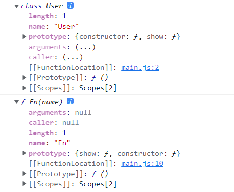
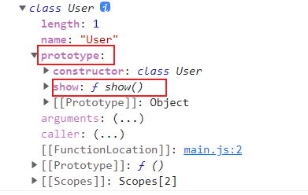
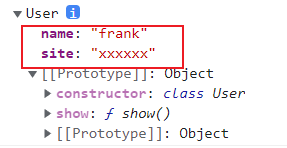

# 类
类的底层实现机制依然是**原型**。

class 只是语法糖为了让类的声明与继承更加简洁清晰。
## 基础知识
### 原理分析
类其实是**函数** ,  类的内部工作原理是**原型**操作
```js
class User {
    
}
console.log(typeof User);   // function
```
`constructor` 用于定义函数代码，与普通函数的对比，结构是一致的

```js{1-6,8-11}
class User {
    constructor(name) {
        this.name = name
    }
    show(){}
}
// 与下面使用函数的定义是一致的
function Fn(name){
    this.name = name
}
Fn.prototype.show = function () {}

console.dir(User)
console.dir(Fn)
```
在类中定义的方法也保存在函数原型 `prototype` 中

### 属性定义
在 `class` 中定义的属性为每个 `new` 出的对象独立创建，下面定义了 `site` 与 `name` 两个对象属性
```js
class User {
    site = 'xxxxxx'
    constructor(name) {
        this.name = name
    }
    show(){}
}

console.dir(User)

const user = new User('frank')
console.dir(user)
```

### 严格模式
`class` 默认使用 `strict` 严格模式执行
```js
class User {
    show(){
        function test(){
            console.log(this)
        }
        test()
    }
}

const  user = new User()
user.show()  //会打出 undefined
```
## 静态访问
### 静态属性
静态属性是**为类设置的属性** , 而**不是**为生成的对象设置的属性 , 下面是原理实现
```js
function User(){}
User.site = 'hello'

const user = new User()
console.log(user.site)  // undefined
console.log(User.site)  // 'hello'
```
在 `class` 中为属性添加 `static` 关键字即声明为静态属性, static 中文翻译为(静止的,不变的)
```js
class Request {
    static HOST = "https://www.houdunren.com";

    query(api) {
        return Request.HOST + "/" + api;
    }
}
let request = new Request();
console.log(request.HOST)  //undefined
```
### 静态方法
在 `class` 内声明的方法前使用 `static` 定义的方法即是静态方法
```js
class User {
  constructor(name , age) {
    this.name = name;
    this.age = age
  }
  static create(...argus) {
    return new User(...argus);
  }
}
const user = User.create("frank" , 18);  //用 类 调
console.log(user);
```

