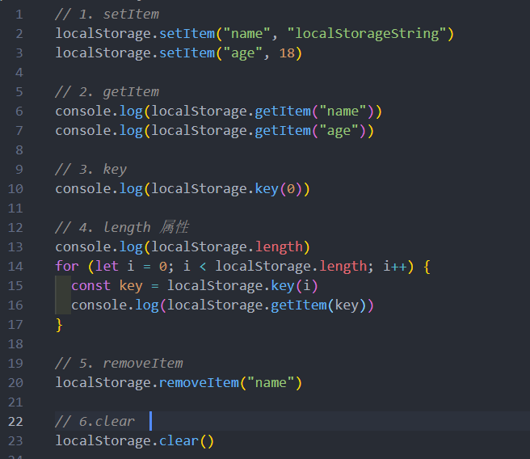
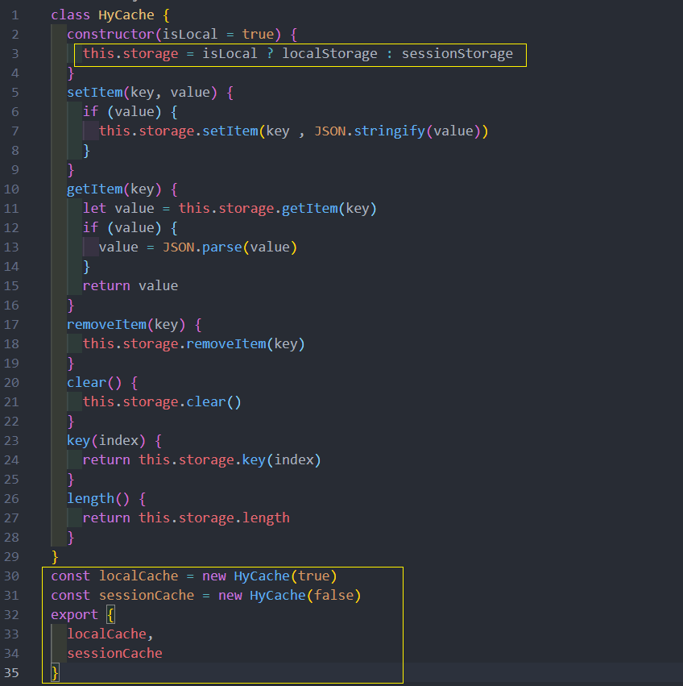

# 数据存储
## 认识 Storage
WebStorage主要提供了一种机制，可以让浏览器提供一种比 cookie 更直观的 key、value 存储方式：
* localStorage：本地存储，提供的是一种永久性的存储方法，在关闭掉网页重新打开时，存储的内容依然保留；
* sessionStorage：会话存储，提供的是本次会话的存储，在关闭掉会话时，存储的内容会被清除；

### localStorage 和 sessionStorage 的区别
* 验证一：关闭网页后重新打开，localStorage 会保留，而 sessionStorage 会被删除；
* 验证二：在页面内实现跳转，localStorage 会保留，sessionStorage 也会保留；
* 验证三：在页面外实现跳转（打开新的网页），localStorage 会保留，sessionStorage 不会被保留；
### Storage 常见的方法和属性
属性：
* Storage.length：只读属性
  * 返回一个整数，表示存储在 Storage 对象中的数据项数量；
方法：
* Storage.key()：该方法接受一个数值 n 作为参数，返回存储中的第n个key名称；
* Storage.getItem()：该方法接受一个 key 作为参数，并且返回 key 对应的 value；
* Storage.setItem()：该方法接受一个 key 和 value，并且将会把 key 和 value 添加到存储中。
  * 如果key存储，则更新其对应的值；
* Storage.removeItem()：该方法接受一个 key 作为参数，并把该 key 从存储中删除；
* Storage.clear()：该方法的作用是清空存储中的所有 key；

### 封装 Storage

<!-- ## 认识 indexdDB
### IndexedDB 的连接数据库
第一步：打开indexDB的某一个数据库；
* 通过indexDB.open(数据库名称, 数据库版本)方法；
* 如果数据库不存在，那么会创建这个数据；
* 如果数据库已经存在，那么会打开这个数据库；

第二步：通过监听回调得到数据库连接结果；
* 数据库的open方法会得到一个IDBOpenDBRequest类型
* 我们可以通过下面的三个回调来确定结果：
  * onerror：当数据库连接失败时；
  * onsuccess：当数据库连接成功时回调；
  * onupgradeneeded：当数据库的version发生变化并且高于之前版本时回调；
* 通常我们在这里会创建具体的存储对象：db.createObjectStore(存储对象名称, { keypath: 存储的主键 }) -->

## 认识 Cookie (了解)
Cookie（复数形态Cookies），又称为“小甜饼”。类型为“**小型文本文件**"，某些网站为了辨别用户身份而存储在用户本地终端
（Client Side）上的数据。
* **浏览器会在特定的情况下携带上 cookie 来发送请求**，可以通过 cookie 来获取一些信息；

Cookie 总是保存在客户端中，按在客户端中的存储位置，Cookie 可以分为内存 Cookie 和硬盘 Cookie。
* 内存 Cookie 由浏览器维护，保存在内存中，浏览器关闭时 Cookie 就会消失，其存在时间是短暂的；
* 硬盘 Cookie 保存在硬盘中，有一个过期时间，用户手动清理或者过期时间到时，才会被清理；

如果判断一个 cookie 是内存 cookie 还是硬盘 cookie 呢？
* 没有设置过期时间，默认情况下 cookie 是内存 cookie，在关闭浏览器时会自动删除；
* 有设置过期时间，并且过期时间不为0或者负数的 cookie，是硬盘 cookie，需要手动或者到期时，才会删除

Cookie 缺点 :
* cookie 会附加到每一个的 http 请求中 , 会消费用户额外的流量
* 明文传输 header , 有一定的安全风险
* 大小限制 : 4kb
* cookie 验证登录时 , 浏览器会自动携带 cookie 到服务器 , 但客户端不只是有浏览器, 比如ios , android , 小程序 等需要手动的添加cookie , 所以有一点点麻烦 。 现在都用 token ->  对称加密/非对称 , 放到 header 或 post请求等等
### cookie 常见的属性
**cookie的生命周期：**
* 默认情况下的cookie是内存cookie，也称之为会话cookie，也就是在浏览器关闭时会自动被删除；
* 我们可以通过设置expires或者max-age来设置过期的时间；
  * expires：设置的是Date.toUTCString()，设置格式是;expires=date-in-GMTString-format；
  * max-age：设置过期的秒钟，;max-age=max-age-in-seconds (例如一年为60*60*24*365)；
**cookie的作用域：（允许cookie发送给哪些URL）**
* Domain：指定哪些主机可以接受cookie
  * 如果不指定，那么默认是 origin，不包括子域名。
  * 如果指定 Domain，则包含子域名。例如，如果设置 Domain=mozilla.org，则 Cookie 也包含在子域名中（如developer.mozilla.org）。
* Path：指定主机下哪些路径可以接受cookie
  * 例如，设置 Path=/docs，则以下地址都会匹配：
    * /docs
    * /docs/Web/
    * /docs/Web/HTTP
### 客户端设置 cookie 
* 这个cookie会在会话关闭时被删除掉

* 删除 cookie 

