# Iterator - Generator
## 迭代器是什么 ?
迭代器（iterator），是确使用户可在容器对象（container，例如链表或数组）上遍访的**对象**，使用该接口无需关心对象的内部实现细节。
* 其行为像数据库中的光标，迭代器最早出现在1974年设计的CLU编程语言中；
* 在各种编程语言的实现中，迭代器的实现方式各不相同，但是基本都有迭代器，比如Java、Python等；
从迭代器的定义我们可以看出来，迭代器是帮助我们对某个数据结构进行遍历的对象。

在 JavaScript 中，迭代器也是一个具体的**对象**，这个对象需要符合**迭代器协议**（iterator protocol）：
* 迭代器协议定义了产生一系列值（无论是有限还是无限个）的标准方式；
* 那么在 js 中这个标准就是一个特定的 **next 方法**；

next方法有如下的要求：
* 一个无参数或者一个参数的函数，**返回**一个应当**包含以下两个属性的对象**：
* **done（boolean）**
  * 如果迭代器可以产生序列中的下一个值，则为 false。（这等价于没有指定 done 这个属性）
  * 如果迭代器已将序列迭代完毕，则为 true。这种情况下，value 是可选的，如果它依然存在，即为迭代结束之后的默认返回值。
* **value**
  * 迭代器返回的任何 JavaScript 值。done 为 true 时可省略

#### 迭代器代码练习
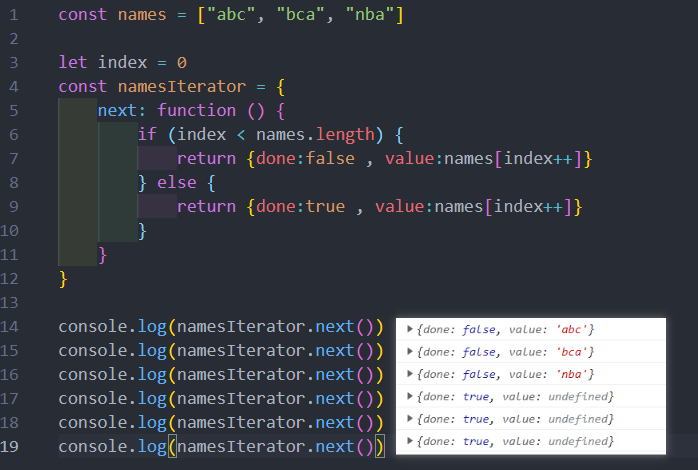
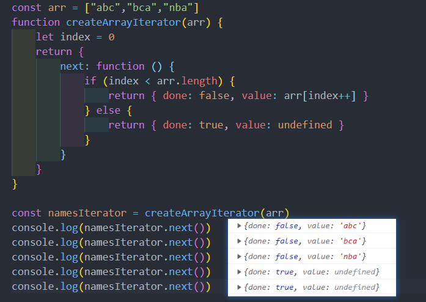
### 可迭代对象
但是上面的代码整体来说看起来是有点奇怪的：
* 想获取一个数组的时候，需要自己创建一个 index 变量，再创建一个所谓的迭代器对象；
* 事实上可以对上面的代码进行**进一步的封装**，让其变成一个**可迭代对象**

什么又是可迭代对象？
* 它和迭代器是不同的概念；
* 当一个对象实现了iterable protocol协议时，它就是一个可迭代对象；
* 这个对象的要求是必须实现 @@iterator 方法，在代码中要**使用 Symbol.iterator 属性** 函数需要返回一个迭代器

#### 可迭代对象的代码
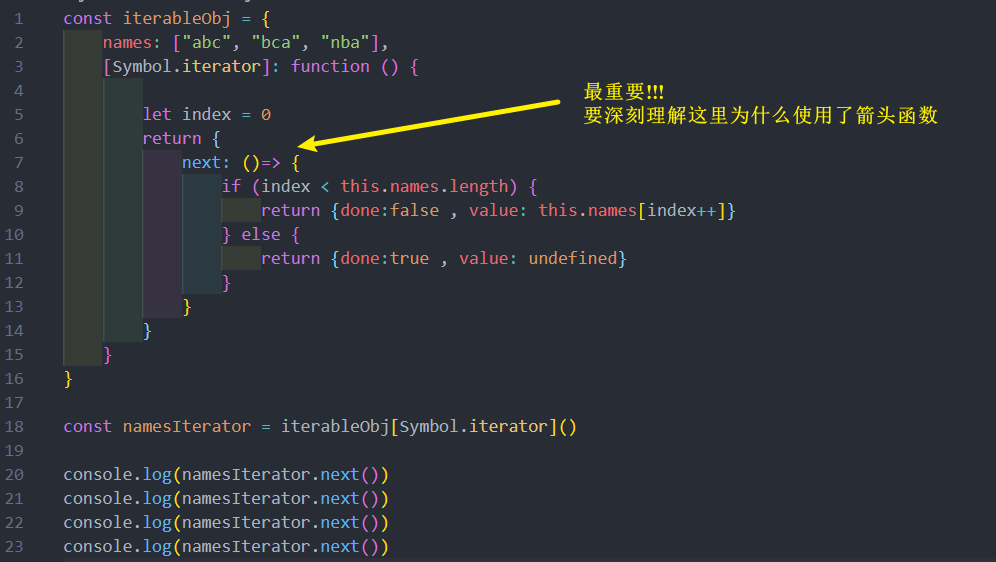

当要问一个问题，我们转成这样的一个东西有什么好处？
* 当一个对象变成一个可迭代对象的时候，进行某些迭代操作，比如 **for...of 操作**时，其实就会调用它的
@@iterator 方法

也就是说 for.. of 可以遍历的东西必须是一个可迭代对象

### 原生迭代器对象
事实上我们平时创建的很多原生对象已经实现了可迭代协议，会生成一个迭代器对象

* String、Array、Map、Set、arguments对象、NodeList集合

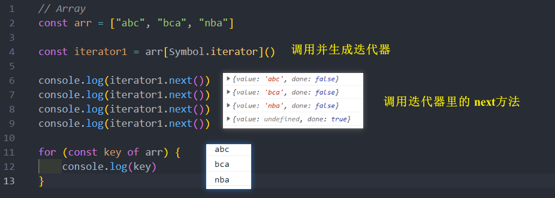
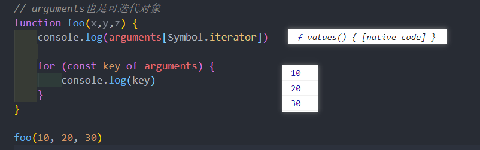
### 可迭代对象的应用
* JavaScript 中语法：**for ...of、展开语法（spread syntax）、yield*（后面总结）、解构赋值（Destructuring_assignment）**
* 创建一些对象时：**new Map([Iterable])、new WeakMap([iterable])、new Set([iterable])、new WeakSet([iterable])**
* 一些方法的调用：**Promise.all(iterable)、Promise.race(iterable)、Array.from(iterable)**;

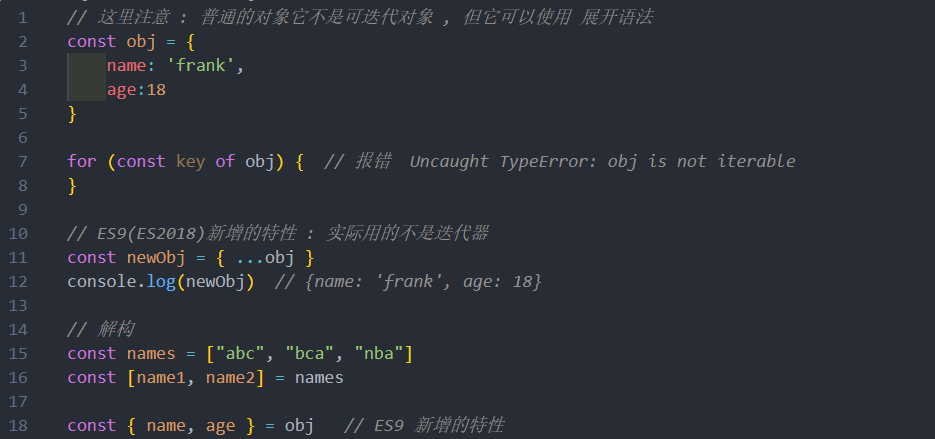
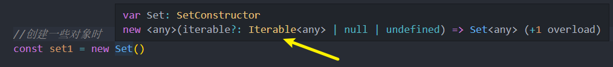
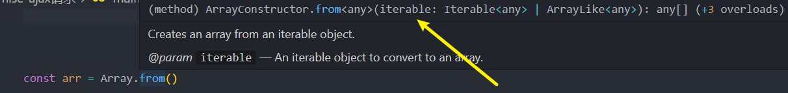

### 自定义类的迭代
在前面看到 Array、Set、String、Map 等类创建出来的对象都是**可迭代对象**
* 在面向对象开发中，可以通过 class 定义一个自己的类，这个类可以创建很多的对象：
* 如果也希望自己的类创建出来的对象默认是**可迭代**的，那么在设计类的时候我们就可以添加上 @@iterator 方法；

案例：创建一个 classroom 的类
* 教室中有自己的位置、名称、当前教室的学生；
* 这个教室可以进来新学生（push）；
* 创建的教室对象是可迭代对象

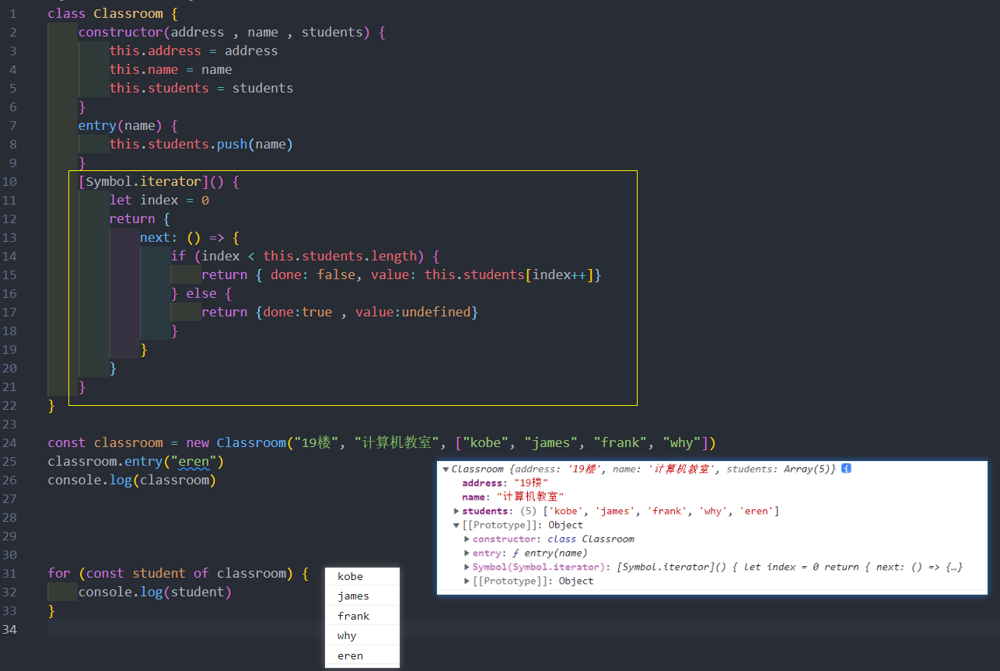
### 迭代器的中断(很少用)
迭代器在某些情况下会在没有完全迭代的情况下中断：
* 比如遍历的过程中通过 break、continue、return、throw 中断了循环操作
* 比如在解构的时候，没有解构所有的值；

那么这个时候想要监听中断的话，可以**添加 return 方法**：

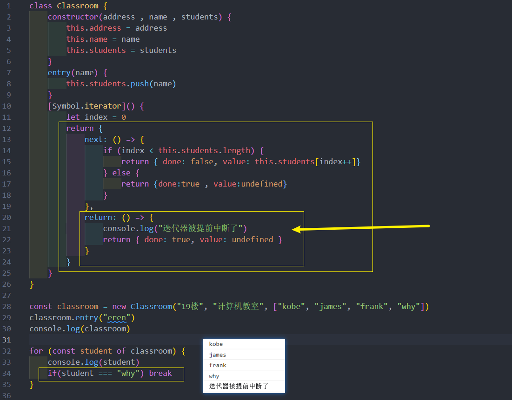

## 什么是生成器 ?   
生成器是 ES6 中新增的一种函数控制、使用的方案，它可以更加灵活的控制函数什么时候继续执行、暂停执行等

生成器函数也是一个函数，但是和普通的函数有一些区别：
* 首先，生成器函数需要在 function 的后面加一个符号：*
* 其次，生成器函数可以通过 **yield** 关键字来控制函数的执行流程：
* 最后，生成器函数的返回值是一个 Generator（生成器）：
  * 生成器事实上是一种特殊的**迭代器**
  * MDN：Instead, they return a special type of iterator, called a Generator

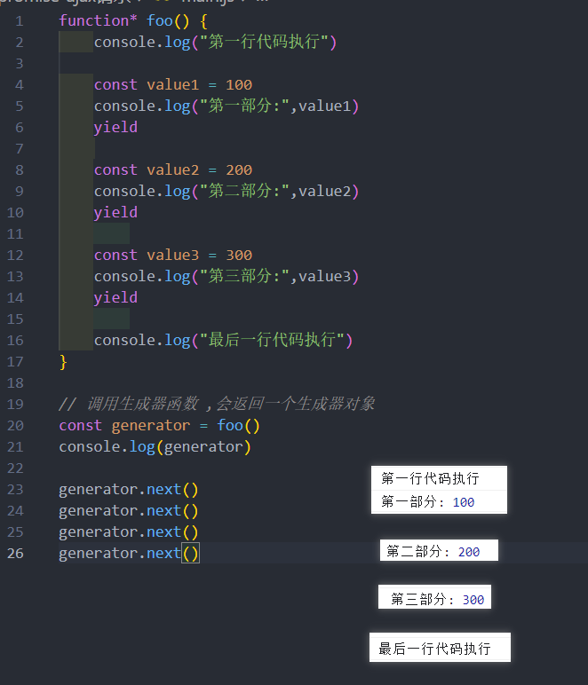
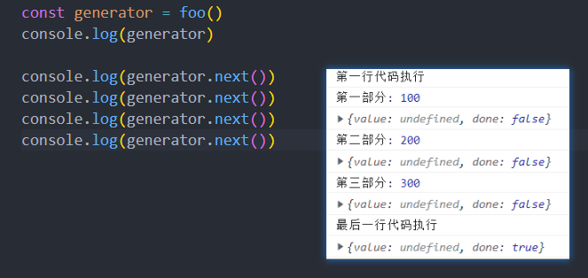
### 生成器函数的执行
我们发现上面的生成器函数 foo 的执行体压根没有执行，它只是返回了一个生成器对象
* 那么如何可以让它执行函数中的东西呢？调用 next 即可；
* 之前学习迭代器时，知道迭代器的 next 是会有返回值的 ,例如 { done:false ,value:"xxx" }
* 但是我们很多时候不希望next返回的是一个 undefined，这个时候我们可以通过 yield 来返回结果

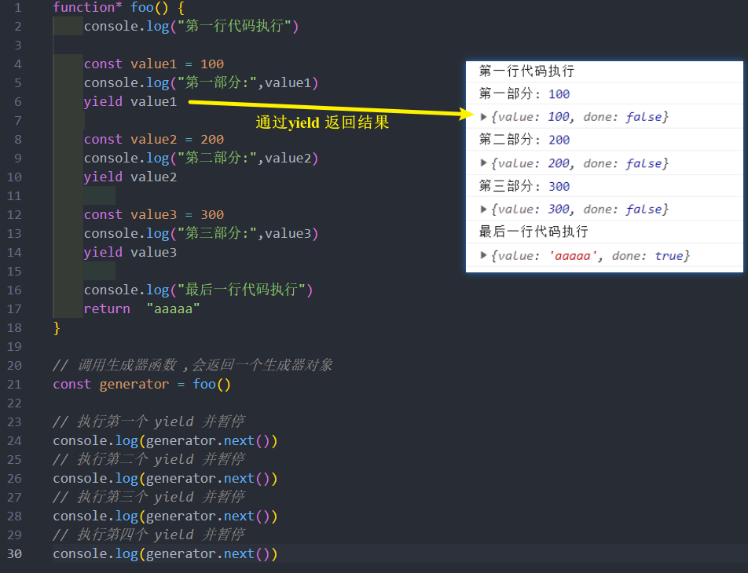
### 生成器传递参数 – next 函数
函数既然可以暂停来分段执行，那么函数应该是可以**传递参数**的，是否可以给每个分段来传递参数？
* 答案是可以的；
* 在调用 next 函数的时候，可以给它**传递参数**，**那数么这个参会作为上一个 yield 语句的返回值**
* 注意：也就是说我们是为本次的函数代码块执行提供了一个值；

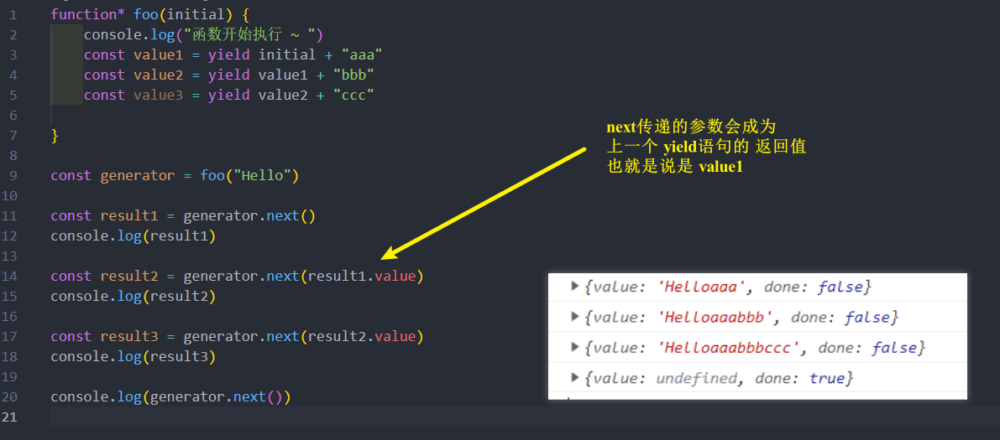

### 生成器提前结束 – return 函数 (很少用)
有一个可以给生成器函数传递参数的方法是通过 return 函数：
* return传值后这个生成器函数就会结束，之后调用 next 不会继续生成值了
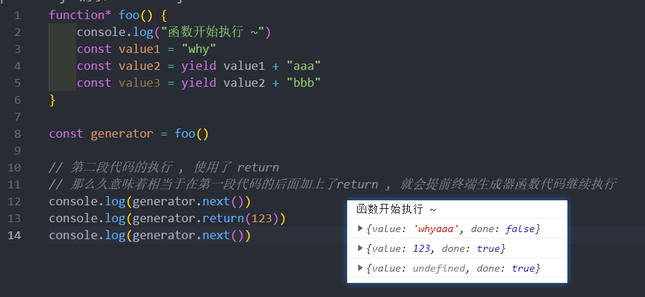
相当于 
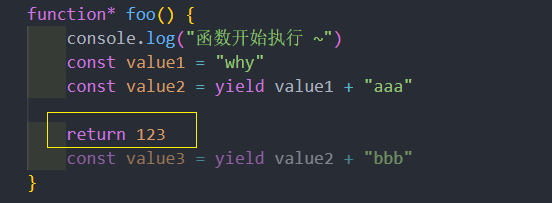
### 生成器抛出异常 – throw 函数(更少用)
除了给生成器函数内部传递参数之外，也可以给生成器函数内部抛出异常：
* 抛出异常后我们可以在生成器函数中捕获异常；
* 但是在 catch 语句中不能继续 yield 新的值了，但是可以在 catch 语句外使用 yield 继续中断函数的执行
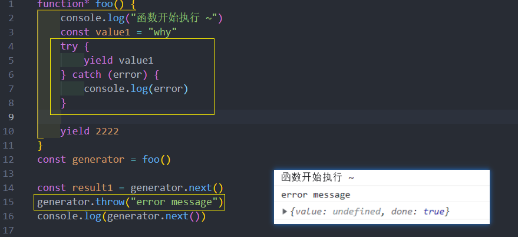

### 生成器替代迭代器 
我们发现**生成器**是一种**特殊的迭代器**，那么在某些情况下可以使用**生成器来替代迭代器**
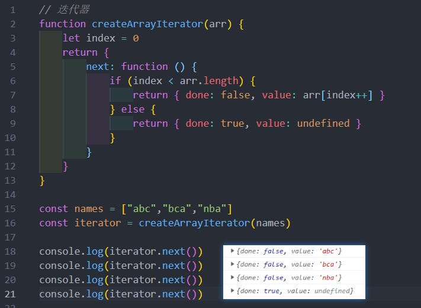

**用生成器来替代迭代器**

事实上还可以使用 yield* **来生产一个可迭代对象**
* 这个时候相当于是一种 **yield 的语法糖**，只不过会依次迭代这个可迭代对象，每次迭代其中的一个值
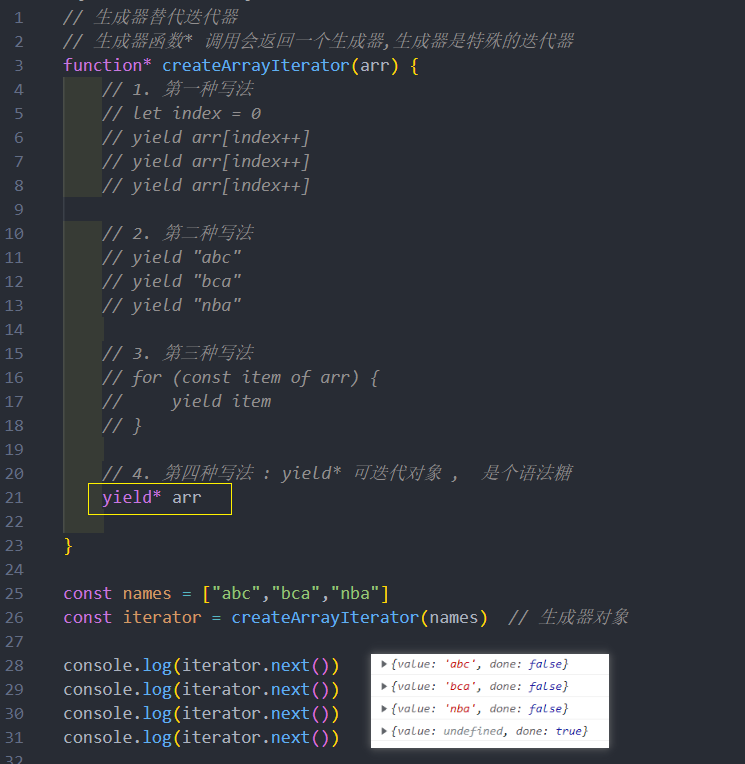
2. **再来一个案例 : 迭代一个范围内的数字**
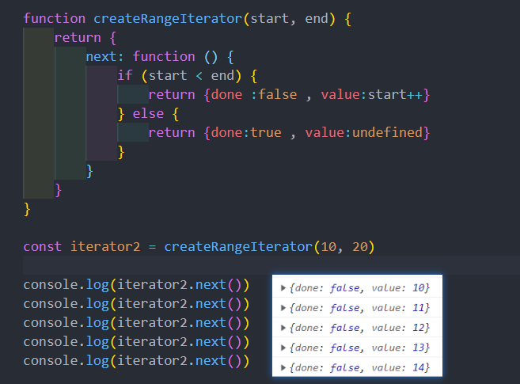
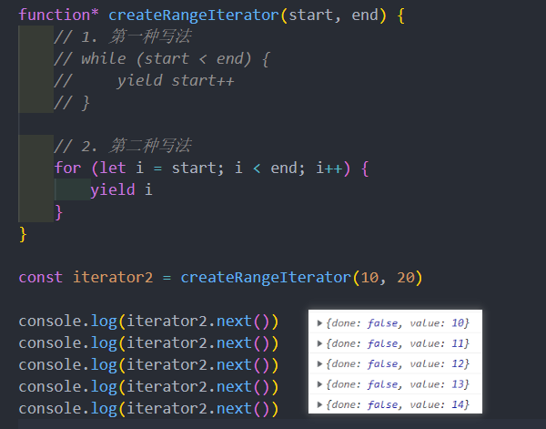
### 自定义类迭代 – 生成器实现
在之前的自定义**类**迭代中，我们也可以换成**生成器**
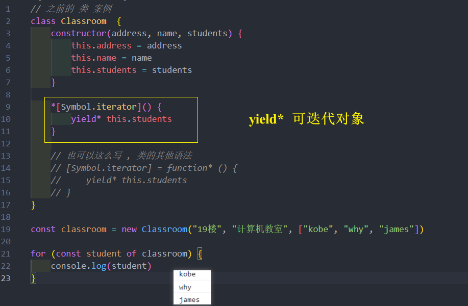
## 异步处理方案
总结完前面的 Promise、生成器 等，目前来总结下异步代码的最终处理方案

需求：
* 需要向服务器发送网络请求获取数据，一共需要发送三次请求；
* 第二次的请求url依赖于第一次的结果；
* 第三次的请求url依赖于第二次的结果；
* 依次类推；

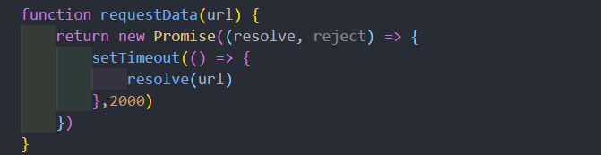
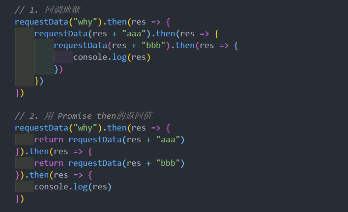
### generator 方案
但是上面的代码其实看起来也是阅读性比较差的，有没有办法可以继续来对上面的代码进行优化? 
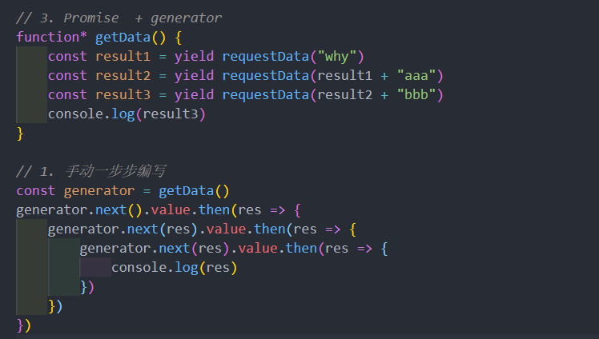
### 自动执行 generator 函数
目前写法有两个问题：
* 第一，不能确定到底需要调用几层的Promise关系
* 第二，如果还有其他需要这样执行的函数，应该如何操作呢？

所以，我们可以封装一个工具函数execGenerator自动执行生成器函数：
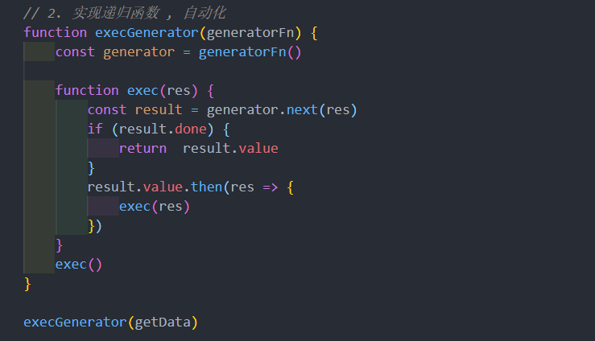
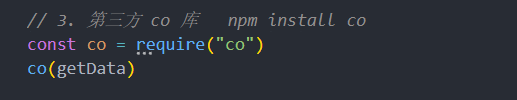
### async / await 
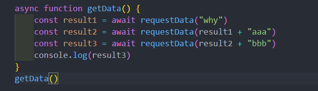

