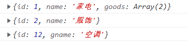

# 递归
递归函数 : 函数内部自己调用自己

```js
// 递归函数
let num = 0

function fn() {
  console.log(num)
  if (num === 6) return  // 递归里面必须加退出调价
  num++
  fn()
}

fn()
```

利用递归函数求 1~n的阶乘 1 * 2 * 3 * ... n 

```js
function fn(n) {
  if (n === 1) return 1
  return n * fn(n - 1)
}

console.log(fn(3)) // 6
```

* 利用递归函数求斐波那契数列(兔子数列) 1,1,2,3,5,8,13,21 ...
* 用户输入一个数字就可以求出这个数字对应的兔子数列值 , 比如 3 -> 2
* 只需要知道用户输入的n前面两个 (n-1,n-2) 就可以计算出 n 对应的数列值
```js
function fb(n) {
  if(n === 1 || n===2) return 1
  return fb(n-1)+ fb(n-2)
}
console.log(fb(3)) // 2
```

1 ~ n 的数字之和 利用递归
```js
function fn(n) {
  if(n === 1) return 1
  return n + fn(n-1)
}

console.log(fn(100))
```

### 利用递归遍历数据
1. 
```js
const data = [
  {
    id: 1,
    name: "家电",
    goods: [
      {
        id: 11,
        gname: "冰箱",
      },
      {
        id: 12,
        gname: "空调",
      },
    ],
  },
  {
    id: 2,
    name: "服饰",
  },
]
```
输入 id , 返回的对应的数据对象
```js
// 1. 利用forEach去遍历里面的对象
function getById(json, id) {
  json.forEach((item) => {
    if (item.id === id) {
      console.log(item);
      // 想要得到里层的数据 11 12 可以利用递归函数
      // 里面应该有 goods这个数组并且数组长度不为 0
    } else if (item.goods && item.goods.length > 0) {
      getById(item.goods, id)
    }
  });
}

getById(data, 1);
getById(data, 2);
getById(data, 12);
```


2. 在上面, 只打印元素是没用的, 要返回
```js
function getById(json, id) {
  let obj = {}
  json.forEach(item => {
    if (item.id === id) {
      obj = item
      return item  // 这里要 return
    } else if (item.goods && item.goods.length > 0) { 
      obj = getById(item.goods,id)  // 用上面 return 的值覆盖掉obj
    }
  })
  return obj
}

console.log(getById(data, 1))
console.log(getById(data, 2))
console.log(getById(data, 12))
```

## 浅拷贝和深拷贝
1. 浅拷贝只是拷贝了 一层, 更深层次对象级别的只开被引用
2. 深拷贝拷贝多层, 每一级别的数据都会拷贝

* **浅拷贝** 
```js

const data = {
  id: 1,
  name:'frank'
} 

const obj = {}
for (let k in data) {
  // k  属性名  data[k] 属性值
  obj[k] = data[k]
}
```
或者 使用 ES6 的 `Object.assign(target , ...sources`
```js
const data = {
  id: 1,
  name:'frank'
} 

const obj = {}
// for (let k in data) {值
//   obj[k] = data[k]
//   // k  属性名  data[k] 属性
// }

console.log(Object.assign(obj, data))
```

* **深拷贝**

