# DOM
浏览器是用来展示网页的，而网页中最重要的就是里面各种的标签元素，JavaScrip t很多时候是需要操作这些元素的
* JavaScript 如何操作元素呢？通过Document Object Model（DOM，文档对象模型）
* DOM 给我们提供了一系列的模型和对象，可以方便的来操作 Web 页面

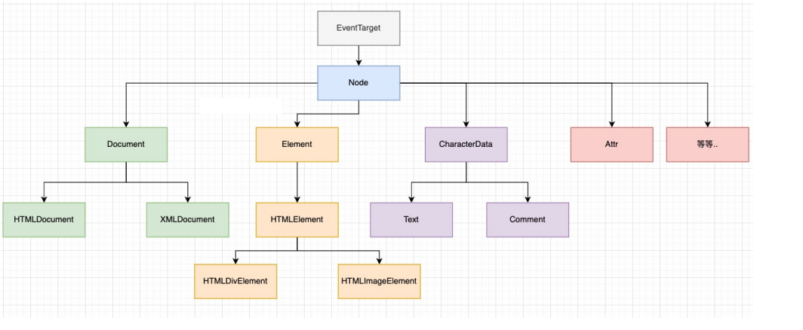
## 事件基础
事件有三部分组成 : **1. 事件源, 2. 事件类型, 3. 处理程序**
```js
// 事件源
let btn = document.getElementById('btn)
// 事件类型, 处理程序
btn.onclick = function(){
  alert('你好')
}
```
## 操作 DOM
### 改变元素内容
```
element.innerText
```
从起始位置到终止位置的内容, 但去除 HTML 标签, 同时空格和换行也会去掉 (不识别 HTML)
```
element.innerHTML
```
从起始位置到终止位置的内容, 包括 HTML 标签, 同时保留空格和换行

### innerHTML 和 innerText 区别
* `innerText` *不识别* HTML,  还会*去除*空格和换行
* `innerHTML` 识别 html 标签 , 能识别空格和换行(所以 innerHTML 使用得最多)

```js
let div = document.querySelector('div')
div.innerText = '<strong>不能加粗</strong>'
div.innerHTML = '<strong>不能加粗</strong>'
```
这两个属性都**可读可写**的
### 常见元素的属性操作
* **innerText, innerText** 改变元素的内容
* **src, href**
* **id, alt, title**

```html
<button id="p1">图片1</button>
<button id="p2">图片2</button>

```
```js
// 1. 获取元素
let btn1 = document.getElementById('p1')
let btn2 = document.getElementById('p2')
let img = document.querySelector('img')

btn1.onclick =()=>{
  img.src = 'images/1.jpg'
  img.title = '图片1'
}
btn2.onclick =()=>{
  img.src = 'images/2.jpg'
  img.title = '图片2'
}
```
### 表单元素的属性操作
利用 dom 可以操作如下表单元素的属性

**type , value, checked, selected, disabled**
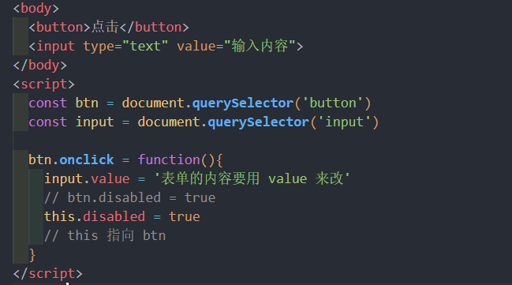
### 样式属性操作
```
element.style  // 行内样式操作

element.className // 类名样式操作
```
**注意 :**
* 样式要采取**驼峰命名法**
* JS 修改 style 样式操作, 产生的是**行内样式**, **CSS 权重比较高**

#### 关闭二维码案例
样式的显示和隐藏完成, `display:none`隐藏元素, `display:block` 显示元素

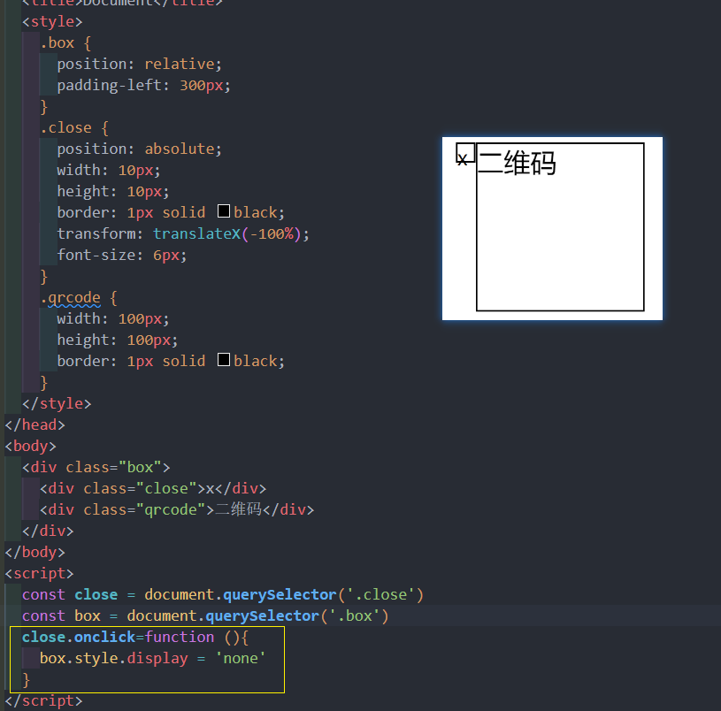
#### 显示隐藏文本框内容
表单需要两个事件,  获得焦点 onfocus , 失去焦点 onblur
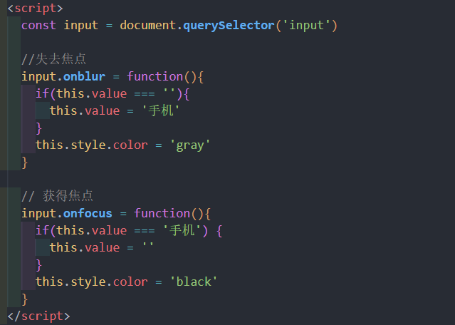
#### 通过 className 修改样式
样式较多, 功能复杂的情况
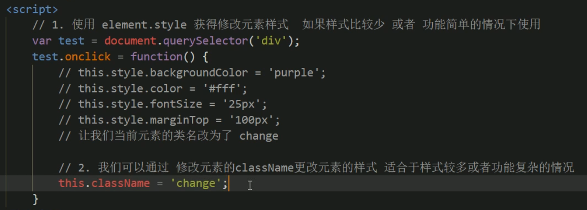

## 注册事件(绑定事件)
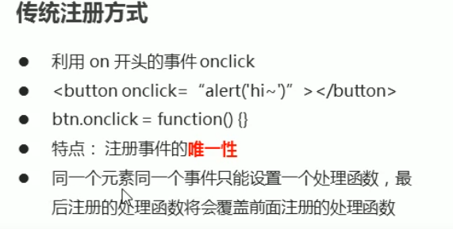
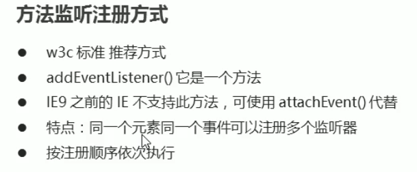
### 删除事件(解绑事件)
1. 传统方式
```js
eventTarget.onclick = null
```

2. removeEventListener
```js
eventTarget.removeEventListener(type, listener, ..)
```
使用实例:
```js
const div = document.querySelector('div')

div.addEventListener(click , fn)

function fn(){
  div.removeEventListener('click', fn)
}
```
## DOM 事件流
事件发生时, 会在元素节点之间按照特定的**顺序**传播, 这个传播过程叫做**DOM 事件流**

分为3各阶段:
1. 捕获阶段
2. 当前目标阶段
3. 冒泡阶段

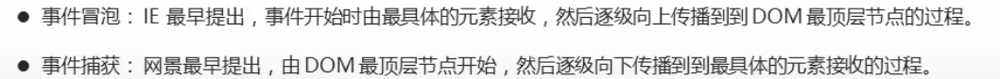

注意: 
* JS 代码只能执行捕获或者冒泡其中的一个阶段
* onclick 和 attachEvent 只能得到冒泡阶段
* **addEventListener** 第三个参数如果是 `true` , 表示事件**捕获**阶段调用事件处理程序; 如果是 `false`(不写默认 false), 表示在事件冒泡阶段处理程序
* **实际开发中, 很少使用事件捕获, 更关注的是事件冒泡**
* **有些事件没有冒泡, 比如 onblur, onfocus, onmouseenter, onmouseleave** 
### 事件对象
跟事件相关的一系列信息数据的集合就是事件对象 event 
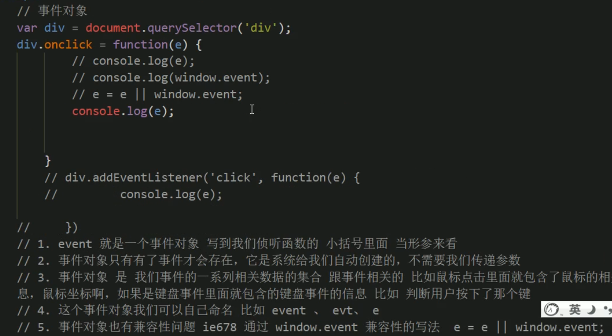
### 事件对象的常见属性
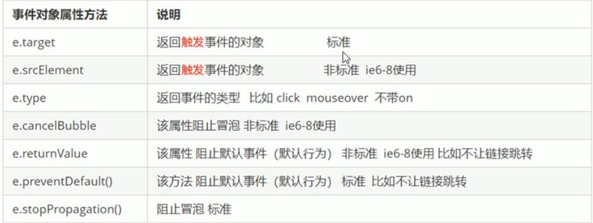
## 事件委托
**不是每个子节点单独设置事件监听器, 而是事件监听器设置在其父节点上, 然后利用冒泡原理影响设置每个子节点**

比如 : 给 ul 注册点击事件, 然后利用事件对象的 target 来找到当前点击的 li, 因为点击 li, 事件会冒泡到 ul 上, 
ul 注册事件, 就会触发事件监听器

作用: 
1. 只操作一次 DOM, 提高了程序的性能
## 常用的鼠标事件
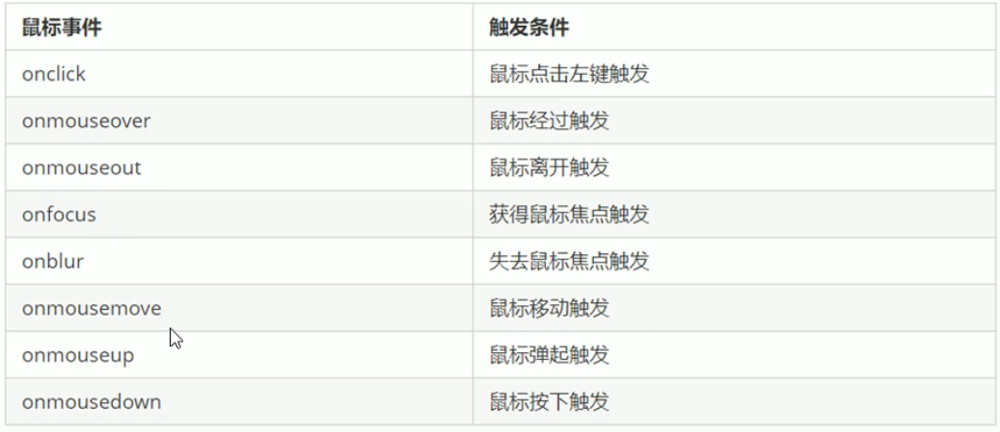
### 禁用鼠标右键菜单
contextmenu
```js
document.addEventListener('contextmenu', function(e){
  e.preventDefault();
})
```
### 禁用鼠标选中
禁止鼠标选中 (selectstart)
```js
document.addEventListener('selectstart', function(e){
  e.preventDefault();
})
```
### 鼠标事件对象
鼠标事件对象  MouseEvent
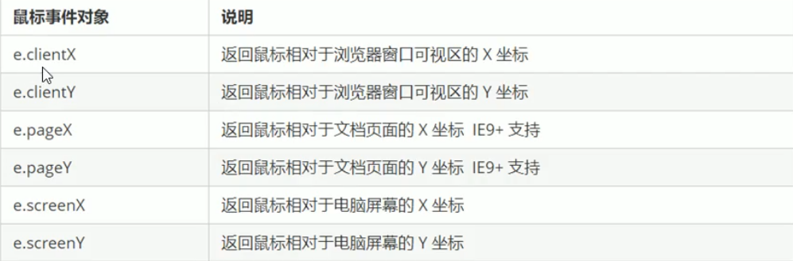
#### 小天使案例
让一个图片始终跟着鼠标移动

分析: 
1. 鼠标不断移动, 使用鼠标移动事件 : **mousemove**
2. 在页面中移动, 给 `document` 注册事件
3. 图片要移动距离, 而且不占位置, 使用**绝对定位**
4. 核心原理: 每次鼠标移动获取最新的鼠标位置, 把这个 x 和 y 坐标作为图片的 top 和 left 就可以了

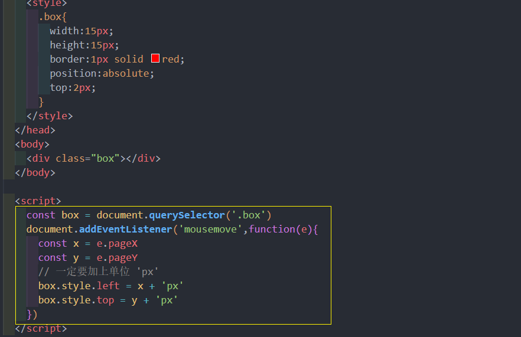


## EventTarget
因为继承自 EventTarget，所以也可以使用 EventTarget 的方法
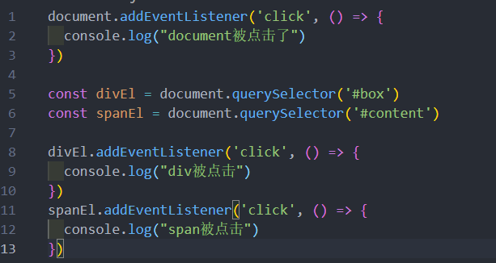

## Node 节点
所有的DOM节点类型都继承自Node接口。

[https://developer.mozilla.org/zh-CN/docs/Web/API/Node](https://developer.mozilla.org/zh-CN/docs/Web/API/Node)

**Node 有几个非常重要的属性：**
* nodeName：node 节点的名称。
* nodeType：可以区分节点的类型。
* nodeValue：node 节点的值；
* childNodes：所有的子节点

**nodeType:**
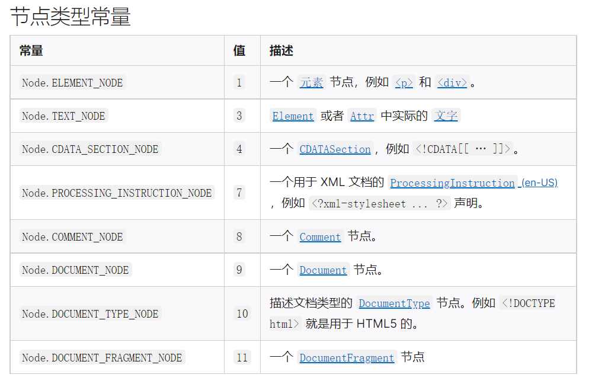

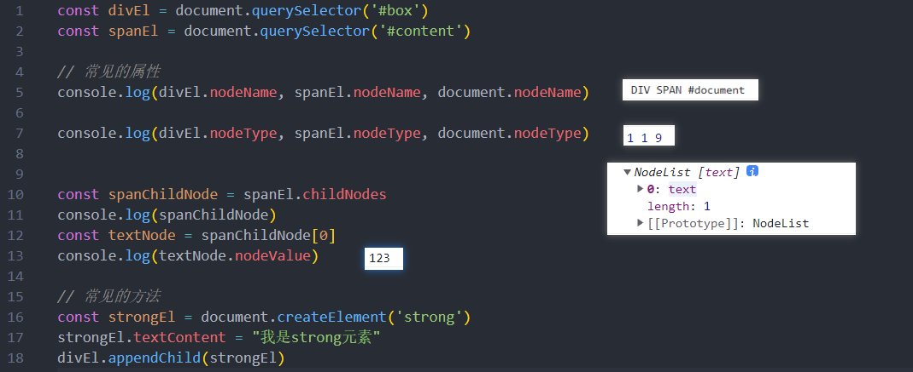

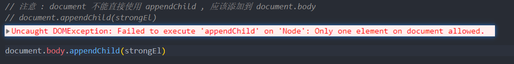
## Document
常见的属性和方法：
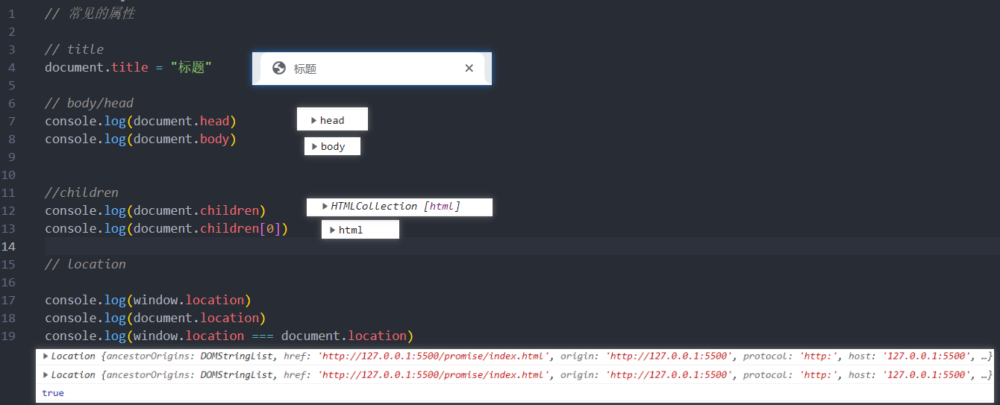
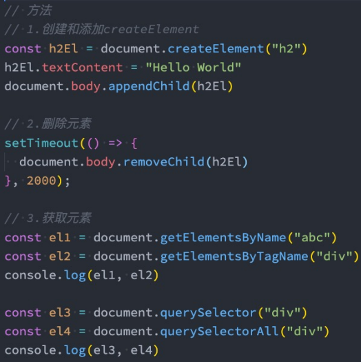

## Element 
平时创建的div、p、span 等元素在 DOM 中表示为 Element 元素，常见的属性和方法:
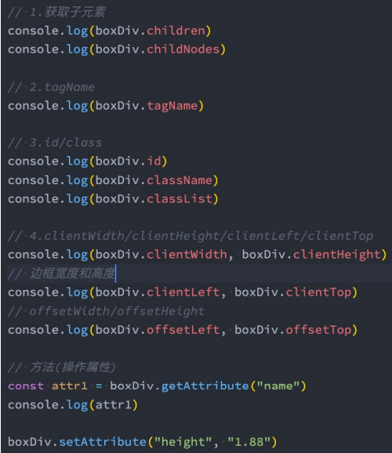

## 事件冒泡和事件捕获
我们会发现默认情况下事件是从最内层的 span 向外依次传递的顺序，这个顺序我们称之为事件冒泡（Event 
Bubble）。
* 事实上，还有另外一种监听事件流的方式就是从外层到内层（body -> span），这种称之为事件捕获（Event 
Capture）；
* 为什么会产生两种不同的处理流呢？
  * 这是因为早期浏览器开发时，不管是IE还是Netscape公司都发现了这个问题，但是他们采用了完全相反的事
件流来对事件进行了传递；
  * IE采用了事件冒泡的方式，Netscape采用了事件捕获的方式；

那么如何去监听事件捕获的过程呢 ?


同时有事件冒泡和时间捕获的监听，那么会**优先监听到事件捕获**的
## 事件对象 event 
当一个事件发生时，就会有和这个事件相关的很多信息：
* 比如事件的类型是什么，你点击的是哪一个元素，点击的位置是哪里等等相关的信息；
* 那么这些信息会被封装到一个Event对象中；
* 该对象给我们提供了想要的一些属性，以及可以通过该对象进行某些操作；

常见的属性：
* type：事件的类型；
* target：当前事件发生的元素；
* currentTarget：当前处理事件的元素；
* offsetX、offsetY：点击元素的位置；

常见的方法：
* preventDefault：取消事件的默认行为；
* stopPropagation：阻止事件的进一步传递

事件类型 : [https://developer.mozilla.org/zh-CN/docs/Web/Events](https://developer.mozilla.org/zh-CN/docs/Web/Events)