<!-- # DOM
浏览器是用来展示网页的，而网页中最重要的就是里面各种的标签元素，JavaScrip t很多时候是需要操作这些元素的
* JavaScript 如何操作元素呢？通过Document Object Model（DOM，文档对象模型）
* DOM 给我们提供了一系列的模型和对象，可以方便的来操作 Web 页面


## 事件基础
事件有三部分组成 : **1. 事件源, 2. 事件类型, 3. 处理程序**
```js
// 事件源
let btn = document.getElementById('btn)
// 事件类型, 处理程序
btn.onclick = function(){
  alert('你好')
}
```
## 操作 DOM
### 改变元素内容
```
element.innerText
```
从起始位置到终止位置的内容, 但去除 HTML 标签, 同时空格和换行也会去掉 (不识别 HTML)
```
element.innerHTML
```
从起始位置到终止位置的内容, 包括 HTML 标签, 同时保留空格和换行

### innerHTML 和 innerText 区别
* `innerText` *不识别* HTML,  还会*去除*空格和换行
* `innerHTML` 识别 html 标签 , 能识别空格和换行(所以 innerHTML 使用得最多)

```js
let div = document.querySelector('div')
div.innerText = '<strong>不能加粗</strong>'
div.innerHTML = '<strong>不能加粗</strong>'
```
这两个属性都**可读可写**的
### 常见元素的属性操作
* **innerText, innerText** 改变元素的内容
* **src, href**
* **id, alt, title**

```html
<button id="p1">图片1</button>
<button id="p2">图片2</button>

```
```js
// 1. 获取元素
let btn1 = document.getElementById('p1')
let btn2 = document.getElementById('p2')
let img = document.querySelector('img')

btn1.onclick =()=>{
  img.src = 'images/1.jpg'
  img.title = '图片1'
}
btn2.onclick =()=>{
  img.src = 'images/2.jpg'
  img.title = '图片2'
}
```
### 表单元素的属性操作
利用 dom 可以操作如下表单元素的属性

**type , value, checked, selected, disabled**

### 样式属性操作
```
element.style  // 行内样式操作

element.className // 类名样式操作
```
**注意 :**
* 样式要采取**驼峰命名法**
* JS 修改 style 样式操作, 产生的是**行内样式**, **CSS 权重比较高**

#### 关闭二维码案例
样式的显示和隐藏完成, `display:none`隐藏元素, `display:block` 显示元素


#### 显示隐藏文本框内容
表单需要两个事件,  获得焦点 onfocus , 失去焦点 onblur

#### 通过 className 修改样式
样式较多, 功能复杂的情况


## 注册事件(绑定事件)


### 删除事件(解绑事件)
1. 传统方式
```js
eventTarget.onclick = null
```

2. removeEventListener
```js
eventTarget.removeEventListener(type, listener, ..)
```
使用实例:
```js
const div = document.querySelector('div')

div.addEventListener(click , fn)

function fn(){
  div.removeEventListener('click', fn)
}
```
## DOM 事件流
事件发生时, 会在元素节点之间按照特定的**顺序**传播, 这个传播过程叫做**DOM 事件流**

分为3各阶段:
1. 捕获阶段
2. 当前目标阶段
3. 冒泡阶段


注意: 
* JS 代码只能执行捕获或者冒泡其中的一个阶段
* onclick 和 attachEvent 只能得到冒泡阶段
* **addEventListener** 第三个参数如果是 `true` , 表示事件**捕获**阶段调用事件处理程序; 如果是 `false`(不写默认 false), 表示在事件冒泡阶段处理程序
* **实际开发中, 很少使用事件捕获, 更关注的是事件冒泡**
* **有些事件没有冒泡, 比如 onblur, onfocus, onmouseenter, onmouseleave** 
### 事件对象
跟事件相关的一系列信息数据的集合就是事件对象 event 

### 事件对象的常见属性

## 事件委托
**不是每个子节点单独设置事件监听器, 而是事件监听器设置在其父节点上, 然后利用冒泡原理影响设置每个子节点**

比如 : 给 ul 注册点击事件, 然后利用事件对象的 target 来找到当前点击的 li, 因为点击 li, 事件会冒泡到 ul 上, 
ul 注册事件, 就会触发事件监听器

作用: 
1. 只操作一次 DOM, 提高了程序的性能
## 常用的鼠标事件

### 禁用鼠标右键菜单
contextmenu
```js
document.addEventListener('contextmenu', function(e){
  e.preventDefault();
})
```
### 禁用鼠标选中
禁止鼠标选中 (selectstart)
```js
document.addEventListener('selectstart', function(e){
  e.preventDefault();
})
```
### 鼠标事件对象
鼠标事件对象  MouseEvent

#### 小天使案例
让一个图片始终跟着鼠标移动

分析: 
1. 鼠标不断移动, 使用鼠标移动事件 : **mousemove**
2. 在页面中移动, 给 `document` 注册事件
3. 图片要移动距离, 而且不占位置, 使用**绝对定位**
4. 核心原理: 每次鼠标移动获取最新的鼠标位置, 把这个 x 和 y 坐标作为图片的 top 和 left 就可以了


 -->


<!-- 
## EventTarget
因为继承自 EventTarget，所以也可以使用 EventTarget 的方法


## Node 节点
所有的DOM节点类型都继承自Node接口。

[https://developer.mozilla.org/zh-CN/docs/Web/API/Node](https://developer.mozilla.org/zh-CN/docs/Web/API/Node)

**Node 有几个非常重要的属性：**
* nodeName：node 节点的名称。
* nodeType：可以区分节点的类型。
* nodeValue：node 节点的值；
* childNodes：所有的子节点

**nodeType:**


## Document
常见的属性和方法：


## Element 
平时创建的div、p、span 等元素在 DOM 中表示为 Element 元素，常见的属性和方法:


## 事件冒泡和事件捕获
我们会发现默认情况下事件是从最内层的 span 向外依次传递的顺序，这个顺序我们称之为事件冒泡（Event 
Bubble）。
* 事实上，还有另外一种监听事件流的方式就是从外层到内层（body -> span），这种称之为事件捕获（Event 
Capture）；
* 为什么会产生两种不同的处理流呢？
  * 这是因为早期浏览器开发时，不管是IE还是Netscape公司都发现了这个问题，但是他们采用了完全相反的事
件流来对事件进行了传递；
  * IE采用了事件冒泡的方式，Netscape采用了事件捕获的方式；

那么如何去监听事件捕获的过程呢 ?


同时有事件冒泡和时间捕获的监听，那么会**优先监听到事件捕获**的
## 事件对象 event 
当一个事件发生时，就会有和这个事件相关的很多信息：
* 比如事件的类型是什么，你点击的是哪一个元素，点击的位置是哪里等等相关的信息；
* 那么这些信息会被封装到一个Event对象中；
* 该对象给我们提供了想要的一些属性，以及可以通过该对象进行某些操作；

常见的属性：
* type：事件的类型；
* target：当前事件发生的元素；
* currentTarget：当前处理事件的元素；
* offsetX、offsetY：点击元素的位置；

常见的方法：
* preventDefault：取消事件的默认行为；
* stopPropagation：阻止事件的进一步传递

事件类型 : [https://developer.mozilla.org/zh-CN/docs/Web/Events](https://developer.mozilla.org/zh-CN/docs/Web/Events) -->

# DOM
DOM相当于是JavaScript和HTML、CSS之间的桥梁
* 通过浏览器提供给我们的 **DOM API**，可以**对元素以及其中的内容**做任何事情；

类型之间有如下的继承关系：
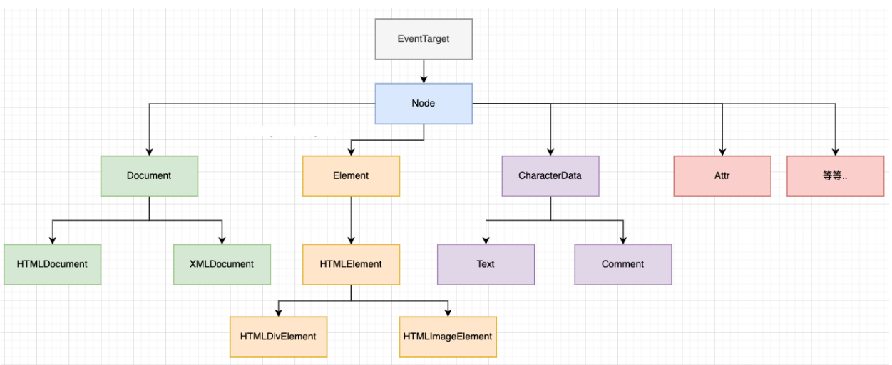

## document对象
Document节点表示的整个载入的网页，它的实例是全局的document对象：
* 对DOM的所有操作都是**从 document 对象开始**的；
* 它是**DOM的 入口点**，可以从document开始去访问任何节点元素；

对于最顶层的html、head、body元素，我们可以直接在document对象中获取到：
* **html元素**：`<html>` = document.documentElement
* **body元素**：`<body>` = document.body
* **head元素**：`<head>` = document.head
* **文档声明**：`<!DOCTYPE html>` = document.doctype

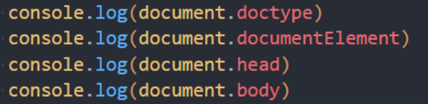

## 节点（Node）之间的导航（navigator）
如果我们获取到**一个节点（Node）**后，可以根据这个节点去获取其他的节点，称之为**节点之间的导航**

节点之间存在如下的关系：
* 父节点：**parentNode**
* 前兄弟节点：**previousSibling**
* 后兄弟节点：**nextSibling**
* 子节点：**childNodes**
* 第一个子节点：**firstChild**
* 第二个子节点：**lastChild**

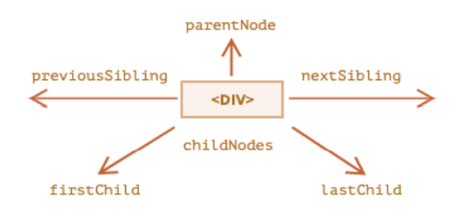


## 元素（Element）之间的导航（navigator）
如果获取到**一个元素（Element）**后 ，可以根据**这个元素去获取其他的元素**，称之为元素之间的导航

节点之间存在如下的关系：
* 父元素：**parentElement**
* 前兄弟节点：**previousElementSibling**
* 后兄弟节点：**nextElementSibling**
* 子节点：**children**
* 第一个子节点：**firstElementChild**
* 第二个子节点：**lastElementChild**

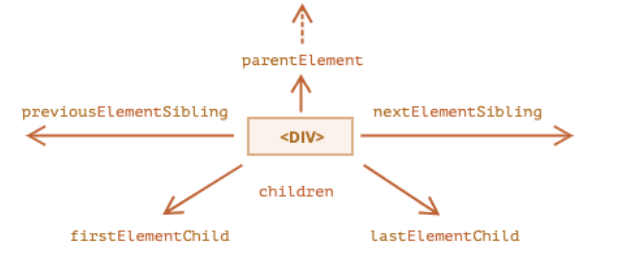
## 获取元素的方法
DOM 提供了获取元素的方法：

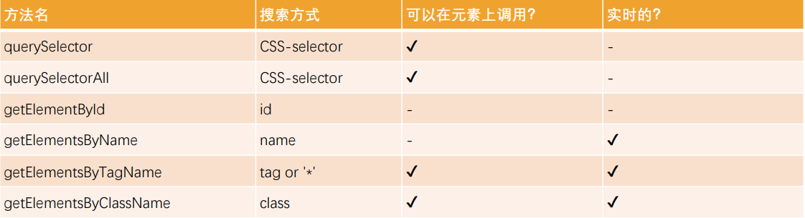

开发中如何选择呢？
* 目前最常用的是**querySelector和querySelectAll**；
* **getElementById**偶尔也会使用或者在适配一些低版本浏览器时；
## 节点的属性
### nodeType
nodeType属性：
* nodeType 属性提供了一种获取节点类型的方法；
* 它有一个数值型值（numeric value）；

常见的节点类型有如下：
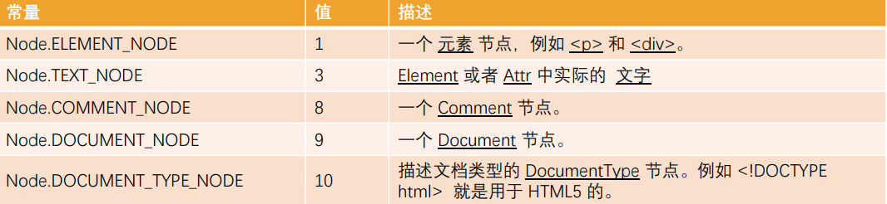
[https://developer.mozilla.org/zh-CN/docs/Web/API/Node/nodeType](https://developer.mozilla.org/zh-CN/docs/Web/API/Node/nodeType)
### nodeName、tagName
* nodeName：获取node节点的名字；
* tagName：获取元素的标签名词；
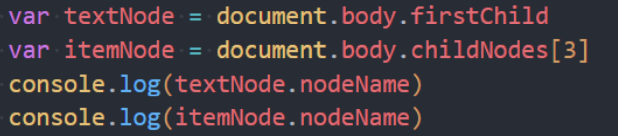

**tagName 和 nodeName 之间有什么不同呢？**
* tagName 属性仅适用于 Element 节点
* nodeName 是为任意 Node 定义的
   * 对于元素，它的意义与 tagName 相同，所以使用哪一个都是可以的
   * 对于其他节点类型（text，comment 等），它拥有一个对应节点类型的字符串

### innerHTML、textContent
**innerHTML 属性**
* 将元素中的 HTML 获取为字符串形式；
* 设置元素中的内容；

**outerHTML 属性**
* 包含了元素的完整 HTML
* innerHTML**加上元素本身一样**；

**textContent 属性**
* 仅仅获取元素中的文本内容；

**innerHTML和textContent的区别：**
* 使用 innerHTML，我们将其 **“作为 HTML”插入**，带有所有 HTML 标签
* 使用 textContent，我们将其 **“作为文本”插入**，所有符号（symbol）均按字面意义处理


### 其他属性
**hidden属性：也是一个全局属性，可以用于设置元素隐藏。**
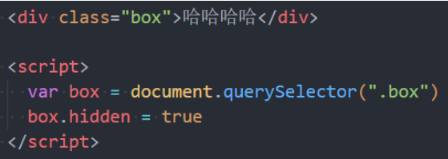
**DOM 元素还有其他属性：**

* value
   * `<input>，<select> 和 <textarea>`（HTMLInputElement，HTMLSelectElement……）的 value
* href
   * `<a href="...">`（HTMLAnchorElement）的 href
* id
   * 所有元素（HTMLElement）的 “id” 特性（attribute）的值
## 元素的 attribute
### attribute的分类
* **标准的attribute**：某些attribute属性是标准的，比如id、class、href、type、value等
* **非标准的attribute**：某些attribute属性是自定义的，比如abc、age、height等

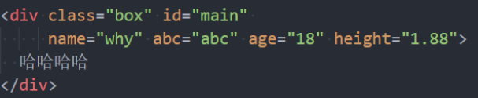

### attribute的操作
* **elem.hasAttribute(name)** — 检查特性是否存在。
* **elem.getAttribute(name)** — 获取这个特性值。
* **elem.setAttribute(name, value)** — 设置这个特性值。
* **elem.removeAttribute(name)** — 移除这个特性。
* **attributes** - attr对象的集合，具有name、value属性；


attribute具备以下特征：
* 它们的**名字是大小写不敏感的（id 与 ID 相同）**
* 它们的值总是**字符串类型**的

## 元素的属性（property）
对于**标准的attribute**，会在DOM对象上创建**与其对应的property属性**：

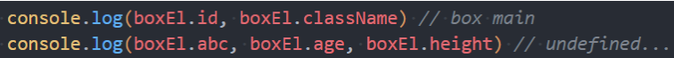

在大多数情况下，它们是相互作用的
* 改变property，通过attribute获取的值，会随着改变；
* 通过attribute操作修改，property的值会随着改变；

**除非特别情况，大多数情况下，设置、获取attribute，推荐使用property的方式：**
* 这是因为它**默认情况下是有类型**的

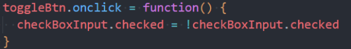

### HTML5的data-*自定义属性
它们也是可以在dataset属性中获取到的：

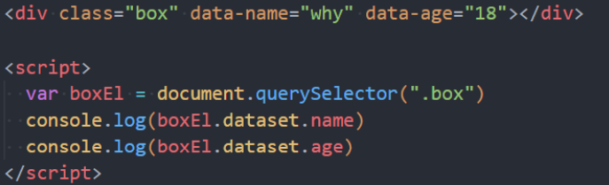

### 元素的className和classList
元素的class attribute，对应的property并非叫class，**而是 className**
* 这是因为JavaScript早期是不允许使用class这种关键字来作为对象的属性，所以DOM规范使用了className；
* 虽然现在JavaScript已经没有这样的限制，但是并不推荐，并且依然在使用className这个名称；

可以对className进行赋值，它会替换整个类中的字符串。
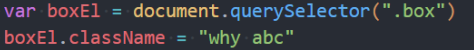

如果我们需要添加或者移除单个的 class，那么**可以使用classList属性**

elem.classList 是一个特殊的对象：
* **elem.classList.add (class)** ：添加一个类
* **elem.classList.remove(class)**：添加/移除类。
* **elem.classList.toggle(class)** ：如果类不存在就添加类，存在就移除它。
* **elem.classList.contains(class)**：检查给定类，返回 true/false。

**classList是可迭代对象，可以通过for of进行遍历**
### 元素的 style 属性
如果需要单独修改某一个CSS属性，那么可以通过style来操作：
* **对于多词（multi-word）属性，使用驼峰式 camelCase**

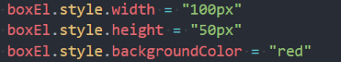

如果我们将值设置为**空字符串**，那么会使用**CSS的默认样式**：

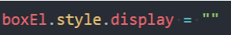

多个样式的写法，我们需要使用cssText属性：
* 不推荐这种用法，因为它会替换整个字符串；
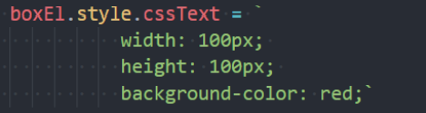

### 元素style的读取 - getComputedStyle

如果我们需要读取样式：
* 对于内联样式，是可以通过style.*的方式读取到的;
* 对于style、css文件中的样式，是读取不到的；

可以通过**getComputedStyle的全局函数**来实现

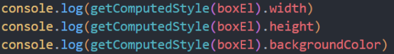
## 元素常见操作
### 创建元素
* 步骤一：创建一个元素
* 步骤二：插入元素到 DOM 的某一个位置

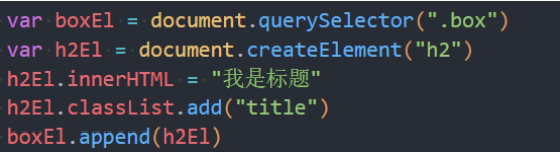

### 插入元素
* node.append(...nodes or strings) —— 在 node 末尾 插入节点或字符串，
* node.prepend(...nodes or strings) —— 在 node 开头 插入节点或字符串，
* node.before(...nodes or strings) —— 在 node 前面 插入节点或字符串，
* node.after(...nodes or strings) —— 在 node 后面 插入节点或字符串，
* node.replaceWith(...nodes or strings) —— 将 node 替换为给定的节点或字符串。

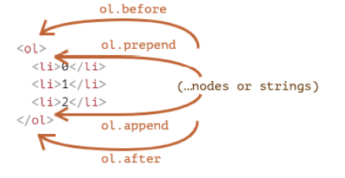
### 移除和克隆元素
**移除元素我们可以调用元素本身的remove方法：**

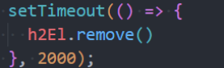

**如果我们想要复制一个现有的元素，可以通过cloneNode方法：**
* 可以传入一个Boolean类型的值，来决定是否是深度克隆；
* 深度克隆会克隆对应元素的子元素，否则不会；

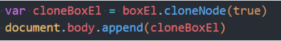

### 旧的元素操作方法
在很多地方也会看到一些旧的操作方法：
* parentElem.appendChild(node)：
   * 在parentElem的父元素最后位置添加一个子元素
* parentElem.insertBefore(node, nextSibling)：
   * 在parentElem的nextSibling前面插入一个子元素；
* parentElem.replaceChild(node, oldChild)：
   * 在parentElem中，新元素替换之前的oldChild元素；
* parentElem.removeChild(node)：
   * 在parentElem中，移除某一个元素；
## 元素的大小, 滚动
* clientWidth：contentWith+padding（不包含滚动条）
* clientHeight：contentHeight+padding
* clientTop：border-top的宽度
* clientLeft：border-left的宽度
* offsetWidth：元素完整的宽度
* offsetHeight：元素完整的高度
* offsetLeft：距离父元素的x
* offsetHeight：距离父元素的y
* scrollHeight：整个可滚动的区域高度
* scrollTop：滚动部分的高度

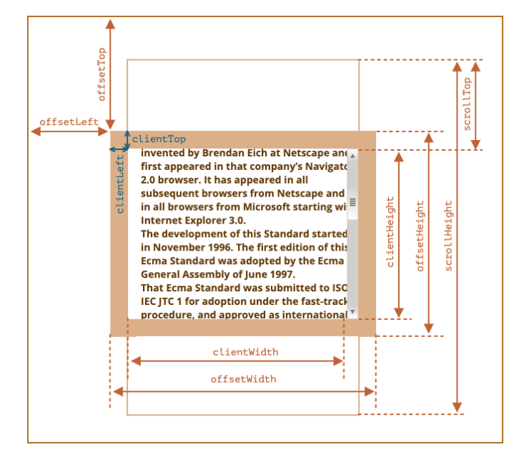

## window的大小、滚动
**window的width和height**
* innerWidth、innerHeight：获取window窗口的宽度和高度（包含滚动条）
* outerWidth、outerHeight：获取window窗口的整个宽度和高度（包括调试工具、工具栏）
* documentElement.clientHeight、documentElement.clientWidth：获取html的宽度和高度（不包含滚动条）

**window的滚动位置：**
* scrollX：X轴滚动的位置（别名pageXOffset）
* scrollY：Y轴滚动的位置（别名pageYOffset）

**也有提供对应的滚动方法：**
* 方法 scrollBy(x,y) ：将页面滚动至 相对于当前位置的 (x, y) 位置；
* 方法 scrollTo(pageX,pageY) 将页面滚动至 绝对坐标；