# BOM
JavaScript有一个非常重要的运行环境就是浏览器，而且浏览器本身又作为一个应用程序需要对其本身进行操作，所以通常浏览器会有对
应的对象模型（BOM，Browser Object Model）。

可以将 BOM 看成是**连接JavaScript脚本与浏览器窗口的桥梁**

BOM 主要包括以下的对象模型 :
* window：包括全局属性、方法，控制浏览器窗口相关的属性、方法；
* location：浏览器连接到的对象的位置（URL）；
* history：操作浏览器的历史；
* document：当前窗口操作文档的对象

window 对象在浏览器中有两个身份：
* 身份一：全局对象
  * ECMAScript 其实是有一个全局对象的，这个全局对象在 Node 中是 global；
  * 在浏览器中就是window对象；
* 身份二：浏览器窗口对象
  * 作为浏览器窗口时，提供了对浏览器操作的相关的 API

## Window 全局对象
在浏览器中，window 对象就是之前经常提到的全局对象，也就是 GO 对象：
* 比如在全局通过 var 声明的变量，会被添加到 GO 中，也就是会被添加到 window 上；
* 比如 window 默认给我们提供了全局的函数和类：setTimeout、Math、Date、Object 等；

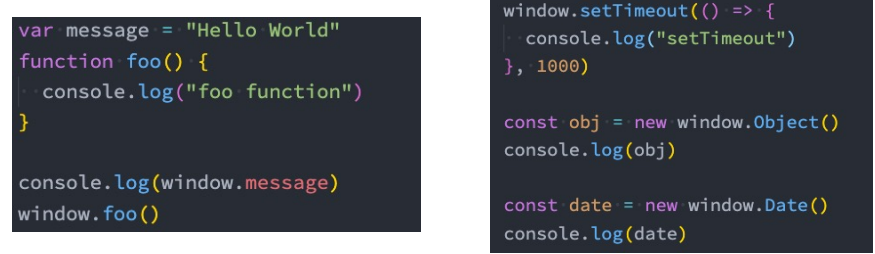

## Window 窗口对象
事实上 window 对象上肩负的重担是非常大的：
* 第一：包含大量的属性，localStorage、console、location、history、screenX、scrollX 等等（大概60+个属性）；
* 第二：包含大量的方法，alert、close、scrollTo、open等等（大概40+个方法）；
* 第三：包含大量的事件，focus、blur、load、hashchange等等（大概30+个事件）；
* 第四：**包含从 EventTarget 继承过来的方法**，addEventListener、removeEventListener、dispatchEvent 方法；

那么这些大量的属性、方法、事件在哪里查看呢？
* MDN文档：[https://developer.mozilla.org/zh-CN/docs/Web/API/Window](https://developer.mozilla.org/zh-CN/docs/Web/API/Window)

查看 MDN文 档时，会发现有很多不同的符号，解释一下是什么意思：
* 删除符号：表示这个 API 已经废弃，不推荐继续使用了
* 点踩符号：表示这个 API 不属于 W3C 规范，某些浏览器有实现（所以兼容性的问题）
* 实验符号：该 AP I是实验性特性，以后可能会修改，并且存在兼容性问题

### window 常见的属性
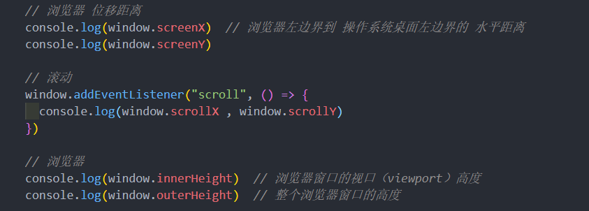
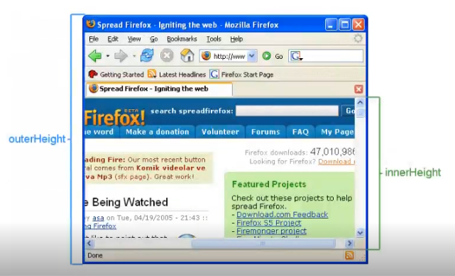
### window 常见的方法
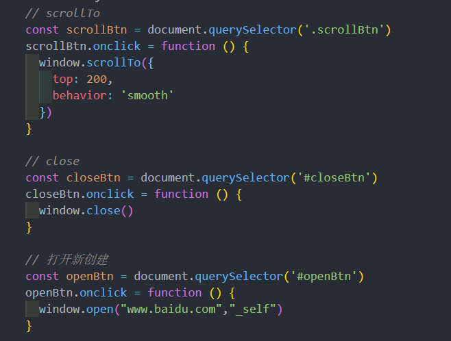
### window 常见的事件
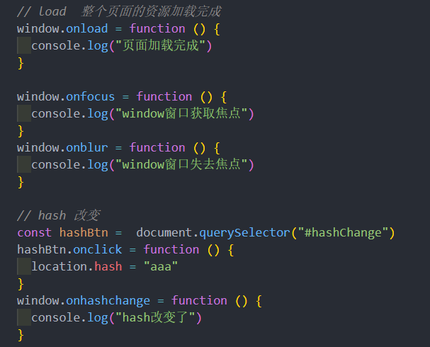
## EventTarget
**Window 继承自 EventTarget，所以会继承其中的属性和方法：**
* addEventListener：注册某个事件类型以及事件处理函数；
* removeEventListener：移除某个事件类型以及事件处理函数；
* dispatchEvent：派发某个事件类型到 EventTarget 上；

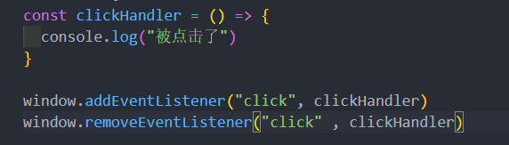
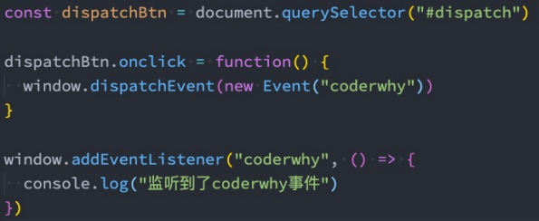
## Location 对象
Location 对象用于表示 window 上当前链接到的 URL 信息
### Location 对象常见的属性
* href: 当前 window 对应的超链接 URL, 整个 URL；
* protocol: 当前的协议；
* host: 主机地址；
* hostname: 主机地址(不带端口)；
* port: 端口；
* pathname: 路径；
* search: 查询字符串；
* hash: 哈希值；
* username：URL 中的 username（很多浏览器已经禁用）；
* password：URL 中的 password（很多浏览器已经禁用）；

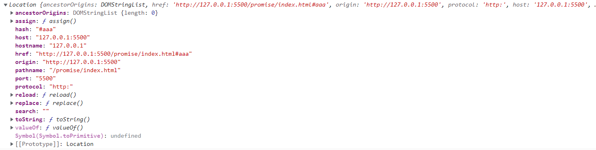
### Location 对象常见的方法
location其实是URL的一个抽象实现
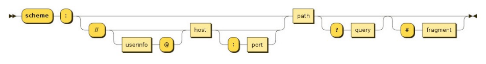
location 有如下常用的方法：
* assign：赋值一个新的 URL，并且跳转到该 URL 中；
* replace：打开一个新的 URL，并且跳转到该 URL 中（不同的是不会在浏览记录中留下之前的记录）；
* reload：重新加载页面，可以传入一个 Boolean 类型

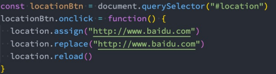
### history对象常见属性和方法
history 对象允许我们访问浏览器曾经的会话历史记录。

有两个属性：
* length：会话中的记录条数；
* state：当前保留的状态值；

有五个方法：
* back()：返回上一页，等价于 history.go(-1)；
* forward()：前进下一页，等价于 history.go(1)；
* go()：加载历史中的某一页；
* pushState()：打开一个指定的地址；
* replaceState()：打开一个新的地址，并且使用 replace；
 
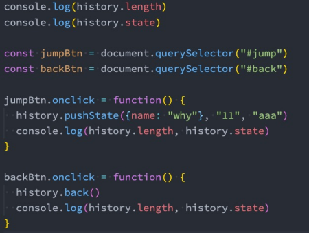

