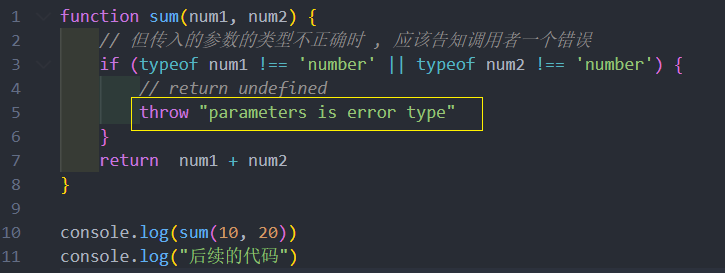
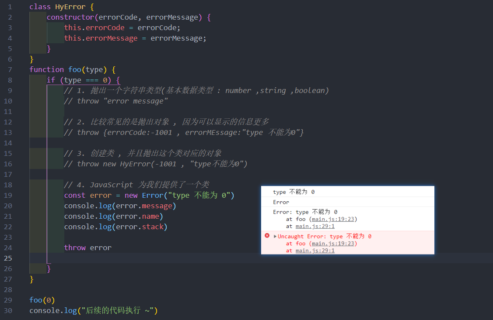
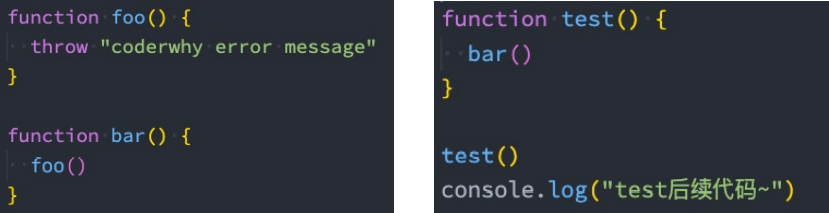
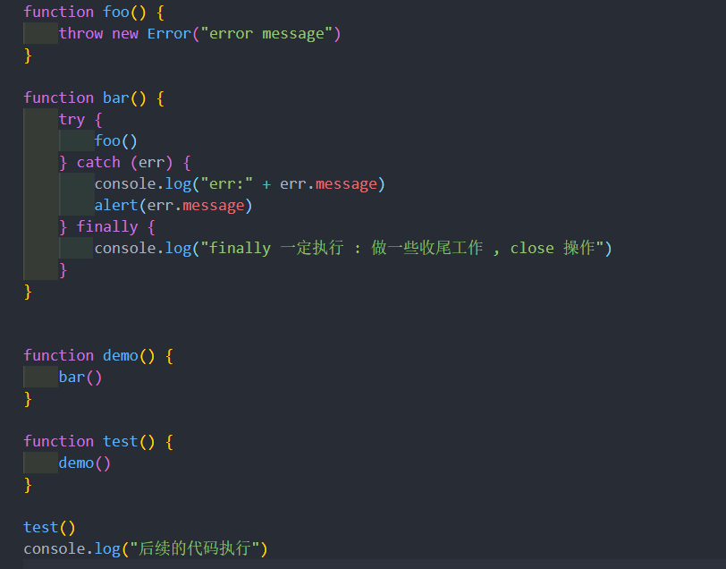

# 错误处理
开发中我们会封装一些工具函数，封装之后给别人使用：
* 在其他人使用的过程中，可能会传递一些参数；
* 对于函数来说，**需要对这些参数进行验证**，否则可能得到的是我们不想要的结果；

很多时候我们可能验证到不是希望得到的参数时，就会直接return：
* 但是return存在很大的弊端：调用者不知道是因为函数内部没有正常执行，还是执行结果就是一个undefined；
* 事实上，正确的做法应该是如果没有通过某些验证，那么应该**让外界知道函数内部报错**了；

**如何可以让一个函数告知外界自己内部出现了错误呢？**
* 通过throw关键字，抛出一个异常；

**throw语句：**
* throw语句用于抛出一个用户自定义的异常；
* 当遇到throw语句时，当前的函数执行会被停止（throw后面的语句不会执行）；

如果我们执行代码，就会报错，拿到错误信息的时候我们可以及时的去修正代码

## throw 关键字
throw 表达式就是在 throw 后面可以跟上一个表达式来表示具体的异常信息：

throw关键字可以跟上哪些类型呢？
* 基本数据类型：比如number、string、Boolean
* 对象类型：对象类型可以包含更多的信息

但是每次写这么长的对象又有点麻烦，所以自己可以创建一个类 , 比如 

## Error 类型
事实上，JavaScript 已经给我们提供了一个 Error 类，我们可以直接创建这个类的对象：(上面的图)

Error包含三个属性：
* messsage：创建 Error 对象时传入的 message；
* name：Error 的名称，通常和类的名称一致；
* stack：整个 Error 的错误信息，包括函数的调用栈，当我们直接打印 Error 对象时，打印的就是stack；

Error 有一些自己的子类：
* RangeError：下标值越界时使用的错误类型；
* SyntaxError：解析语法错误时使用的错误类型；
* TypeError：出现类型错误时，使用的错误类型；

**强调** :***如果函数内抛出了异常 , 那么函数内代码不会继续执行***
## 异常的处理
会发现在之前的代码中，一个函数抛出了异常，调用它的时候程序会被强制终止：
* 这是因为如果我们在调用一个函数时，这个函数抛出了异常，但是我们并没有对这个异常进行处理，那么这个异常会继续传
递到上一个函数调用中；
* 而如果到了最顶层（全局）的代码中依然没有对这个异常的处理代码，这个时候就会报错并且终止程序的运行；

先来看一下这段代码的异常传递过程：
* foo 函数在被执行时会抛出异常，也就是我们的bar函数会拿到这个异常；
* 但是 bar 函数并没有对这个异常进行处理，那么这个异常就会被继续传递到调用 bar 函数的函数，也就是 test 函数；
* 但是 test 函数依然没有处理，就会继续传递到我们的全局代码逻辑中；
* 依然没有被处理，这个时候程序会终止执行，后续代码都不会再执行了

## 异常的捕获
但是很多情况下当出现异常时，我们并不希望程序直接推出，而是希望可以正确的处理异常：

这个时候就可以使用 try catch
* 在ES10（ES2019）中，catch 后面绑定的 error 可以省略。
* 当然，如果有一些必须要执行的代码，我们可以使用 finally 来执行：

finally 表示最终一定会被执行的代码结构；
* 注意：如果 try 和 finally 中都有返回值，那么会使用finally当中的返回值；

