# ES6 (一)
## 对象字面量的增强
ES6 中对 **对象字面量** 进行了增强，称之为 Enhanced object literals（增强对象字面量）

字面量的增强主要包括下面几部分：
* 属性的简写：Property Shorthand
* 方法的简写：Method Shorthand
* 计算属性名：Computed Property Names

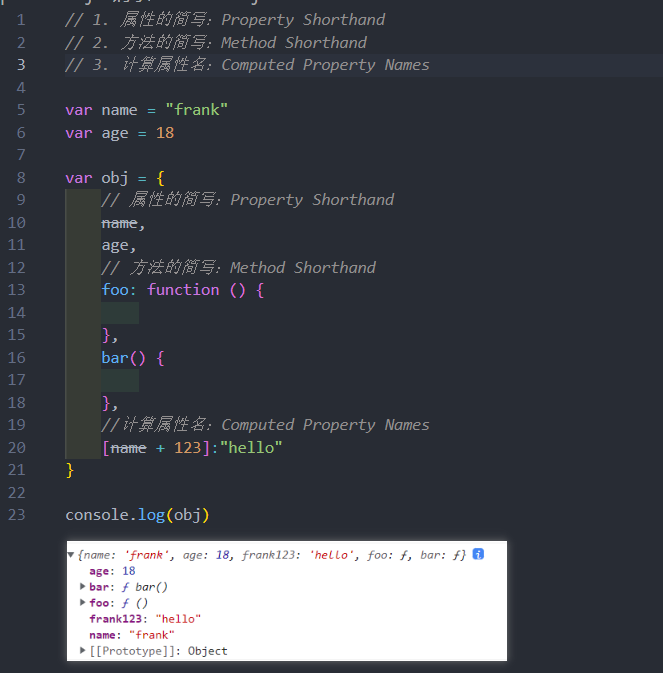
## 解构
ES6 中新增了一个从数组或对象中方便获取数据的方法，称之为**解构** Destructuring
* 可以划分为：**数组**的解构和**对象**的解构。
### 数组的解构
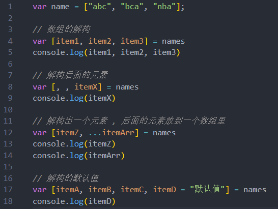
### 对象的解构
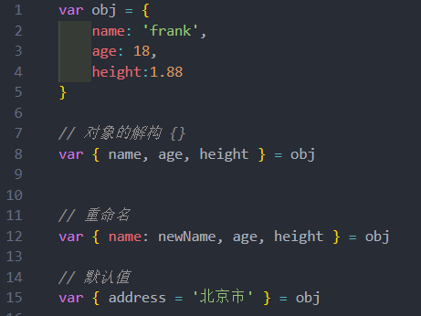
### 解构的应用场景
* 比如在开发中拿到一个变量时，自动对其进行解构使用；
* 比如对函数的参数进行解构

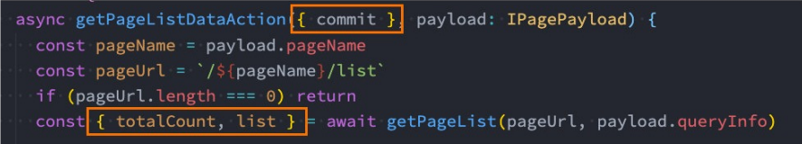

## 块级作用域
### var的块级作用域
ES5之前 JavaScript 只会形成两个作用域：全局作用域 和 函数作用域
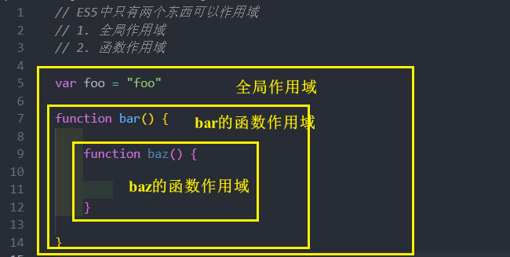

var 没有块级作用域

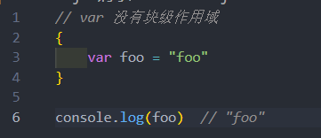
### let/const 的块级作用域
在ES6中新增了块级作用域，并且通过let、const、function、class声明的标识符是具备块级作用域的限制的：
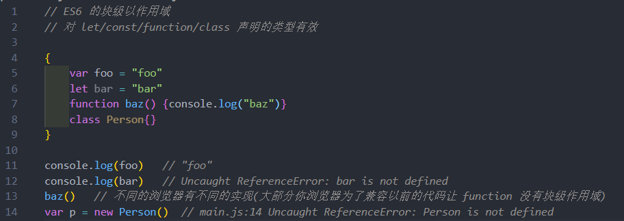
### if-switch-for 块级作用域
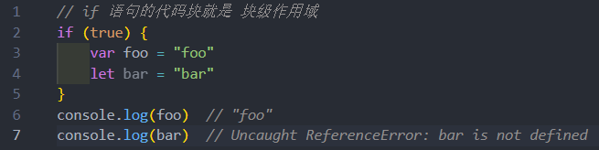

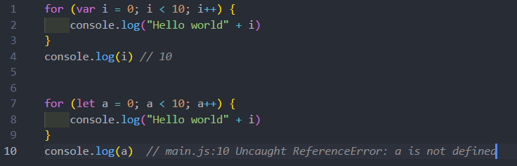
### 块级作用域应用
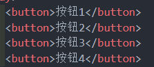
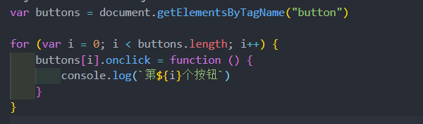

点击要执行回调时 , 函数里没有 i , 就去上层作用域上找 , 那么它的上层作用域是全局作用域 , 但这时全局作用域里的 i 已经变成了 4

在以前的时候解决这个问题 , 用立即执行函数形成函数作用域
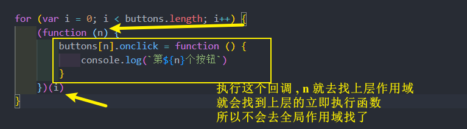

但ES6以后, 现在的话 , 可以直接
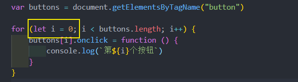

因为这个回调找上层作用域时就**找到了块级作用域** , let 是有块级作用域 , 每次绑定函数的时候绑定的 i 分别是0 ,1, 2, 3, 不会去找全局

### 块级作用域补充
#### for 循环里 
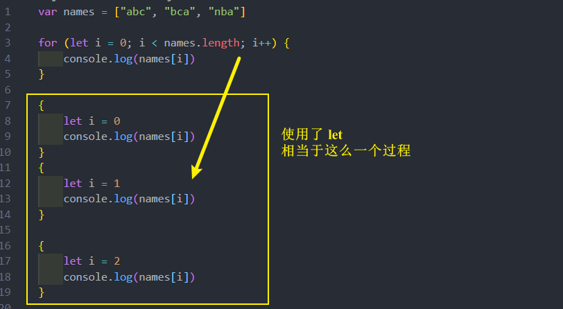
那么能不能使用 const ?

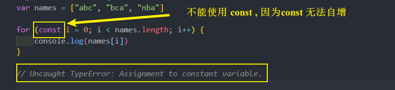

答案 : 不能
#### for..of 里 
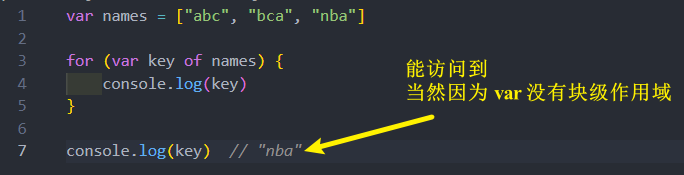

使用了 let

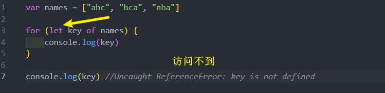

使用 const 可以吗 ? 

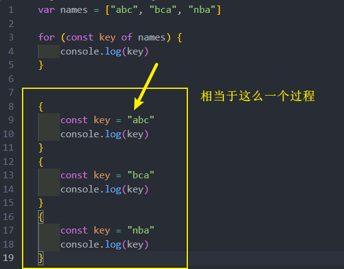

答案 : 这个时候可以
### 暂时性死区
在 ES6 中，还有一个概念称之为暂时性死区
* 它表达的意思是在一个代码中，使用let、const声明的变量，在声明之前，变量都是不可以访问的
* 我们将这种现象称之为 temporal dead zone（暂时性死区，TDZ）

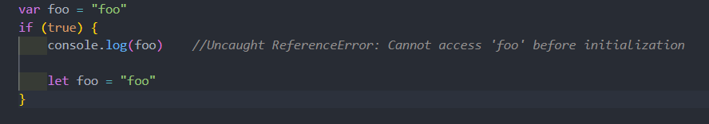
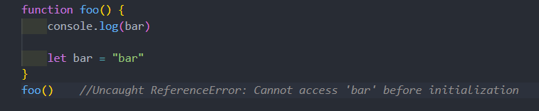
### var、let、const的选择
对于var的使用：
* 需要明白一个事实，var所表现出来的特殊性：比如作用域提升、window全局对象、没有块级作用域等都是一些历史遗留问题
* 其实是JavaScript在设计之初的一种语言缺陷
* 但是在实际工作中，我们可以使用最新的规范来编写，也就是不再使用var来定义变量了

对于let、const
* 对于let和const来说，是目前开发中推荐使用的
* 我们会优先推荐使用const，这样可以保证数据的安全性不会被随意的篡改
* 只有当我们明确知道一个变量后续会需要被重新赋值时，这个时候再使用let
* 这种在很多其他语言里面也都是一种约定俗成的规范，尽量我们也遵守这种规范
## 字符串模板
### 字符串模板基本使用
ES6 允许我们使用字符串模板来嵌入JS的变量或者表达式来进行拼接：
* 首先，会使用 `` 符号来编写字符串，称之为模板字符串；
* 其次，在模板字符串中，我们可以通过 **${expression}** 来嵌入动态的内容；

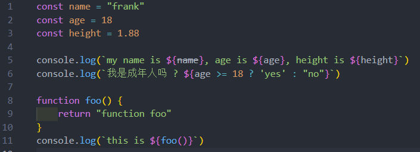
### 标签模板字符串使用
模板字符串还有另外一种用法：标签模板字符串（Tagged Template Literals）

如果我们使用标签模板字符串，并且在调用的时候插入其他的变量：
* 模板字符串被拆分了
* 第一个元素是数组，是被模块字符串拆分的字符串组合
* 后面的元素是一个个模块字符串传入的内容

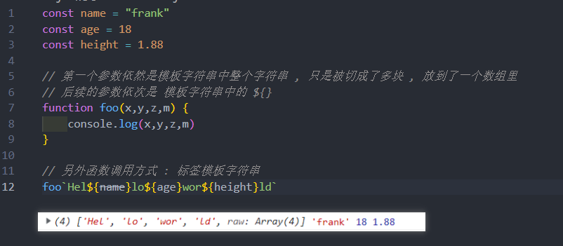

React 的 styled-components 库 用到了这个标签模板字符串 

## 函数的补充
### 函数的默认参数
在ES6中，我们允许给函数一个默认值
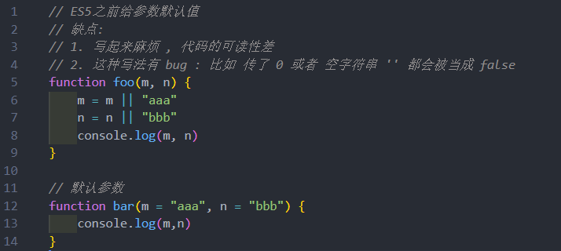
 
源代码 :
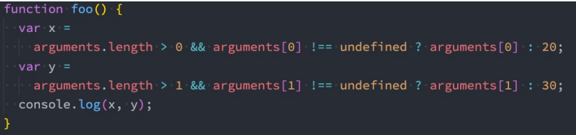

* 对象默认参数 以及 解构
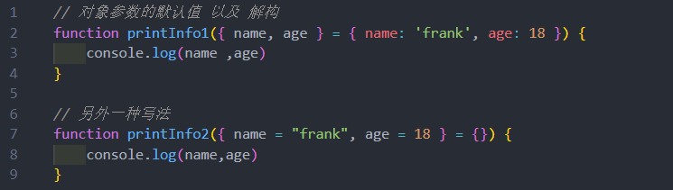

另外参数的默认值通常会将其放到最后（在很多语言中，如果不放到最后其实会报错的）

但是JavaScript允许不将其放到最后，但是意味着还是会按照顺序来匹配；
* 另外默认值会改变函数的length的个数，默认值以及后面的参数都不计算在length之内
### 函数的剩余参数
ES6中引用了 rest parameter ，可以将不定数量的参数放入到一个数组中：
* 如果最后一个参数是 ... 为前缀的，那么它会将剩余的参数放到该参数中，并且作为一个数组

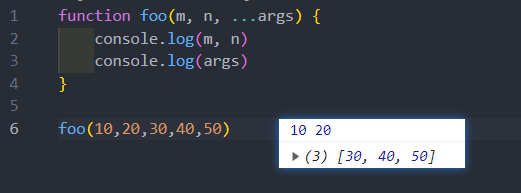

那么剩余参数和 arguments 有什么区别呢？
* 剩余参数只包含那些**没有对应形参的实参**，而 **arguments 对象包含了传给函数的所有实参**
* **arguments对象不是一个真正的数组**，而**rest参数是一个真正的数组**，可以进行数组的所有操作
* arguments 是**早期的ECMAScript**中为了方便去获取所有的参数提供的一个数据结构，而 rest参数是ES6中提供并且希望以此来替代 arguments 的；

剩余参数**必须放到最后一个位置**，否则会报错
### 函数的箭头函数补充
* 箭头函数是没有显式原型 prototype 的，所以不能作为构造函数，使用 new 来创建对象

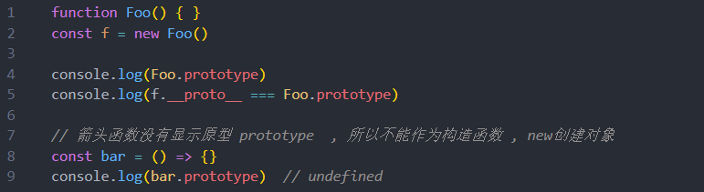
## 展开语法
展开语法(Spread syntax)：
* 可以在函数调用/数组构造时，将数组表达式或者string在语法层面展开；
* 还可以在构造字面量对象时, 将对象表达式按key-value的方式展开；

展开语法的场景：
* 在函数调用时使用；
* 在数组构造时使用；
* 在构建对象字面量时，也可以使用展开运算符，这个是在ES2018（ES9）中添加的新特性；

注意：展开运算符其实是一种**浅拷贝**
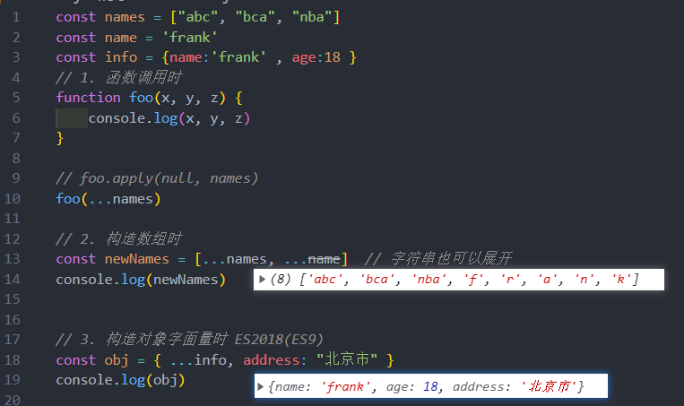

