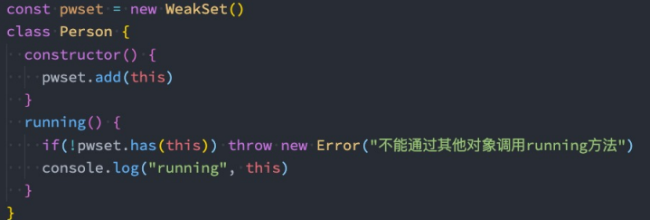

# ES6 (二)
## Symbol 
Symbol是什么呢？Symbol 是 ES6 中新增的一个基本数据类型，翻译为符号

那么为什么需要Symbol ？
* 在ES6之前，对象的属性名都是字符串形式，那么很容易造成**属性名的冲突**
* 比如原来有一个对象，我们希望在其中**添加一个新的属性和值**，但是我们在不确定它原来内部有什么内容的情况下，
**很容易造成冲突，从而覆盖掉它内部的某个属性**

Symbol就是为了解决上面的问题，用来生成一个独一无二的值。
* Symbol值是通过 **Symbol函数** 来生成的，生成后可以作为**属性名**；
* 也就是在ES6中，对象的属性名可以使用**字符串**，也可以使用 **Symbol值**

**Symbol即使多次创建值，它们也是不同的**：Symbol函数执行后每次创建出来的值都是独一无二的；

**也可以在创建 Symbol 值的时候传入一个描述description**：这个是 ES2019（ES10）新增的特性；

### Symbol 作为属性名
通常会使用 Symbol 在对象中表示唯一的属性名

### 相同值的Symbol
Symbol 的目的是为了创建一个独一无二的值，那么如果我们现在就是想创建相同的Symbol应该怎么来做？
* 可以使用 Symbol.for 方法来做到这一点；
* 并且我们可以通过 Symbol.keyFor 方法来获取对应的 key

## Set 
在 ES6 之前，我们存储数据的结构主要有两种：数组、对象。
* 在 ES6 中新增了另外两种数据结构：Set、Map，以及它们的另外形式WeakSet、WeakMap。
Set 是一个新增的数据结构，可以用来保存数据，类似于数组，但是和数组的区别是**元素不能重复**
* 创建 Set 我们需要通过Set构造函数（暂时没有字面量创建的方式）

Set中存放的元素是不会重复的，那么Set有一个非常常用的功能就是给**数组去重**
### Set的基本使用 

### Set的常见方法
Set 常见的属性：
* size：返回Set中元素的个数；
Set 常用的方法：
* add(value)：添加某个元素，返回Set对象本身；
* delete(value)：从set中删除和这个值相等的元素，返回boolean类型；
* has(value)：判断set中是否存在某个元素，返回boolean类型；
* clear()：清空set中所有的元素，没有返回值；
* forEach(callback, [, thisArg])：通过forEach遍历set；
另外Set是支持 for of 的遍历的

### WeakSet 使用
那么和 Set 有什么区别？
* 区别一：WeakSet 中只能存放**对象类型**，不能存放基本数据类型；
* 区别二：WeakSet 对元素的引用是弱引用，如果没有其他引用对某个对象进行引用，那么GC可以对该对象进行回收；
WeakSet常见的方法：
* add(value)：添加某个元素，返回 WeakSet 对象本身
* delete(value)：从WeakSet中删除和这个值相等的元素，返回 boolean 类型
* has(value)：判断WeakSet中是否存在某个元素，返回 boolean 类型
### WeakSet的应用
注意：WeakSet 不能遍历
* 因为WeakSet只是对对象的弱引用，如果我们遍历获取到其中的元素，那么有可能造成对象不能正常的销毁。
* 所以存储到 WeakSet 中的对象是没办法获取的；

那么这个东西有什么用

## Map 
### Map 的基本使用
另外一个新增的数据结构是 Map，用于存储映射关系。

跟普通对象有什么区别？
* 事实上我们对象存储映射关系只能用字符串（ES6新增了Symbol）作为属性名（key）
* 某些情况下我们可能希望通过其他类型作为 key，比如对象，这个时候会自动将对象转成字符串来作为key

### Map 的常见方法
Map常见的属性：
* size：返回Map中元素的个数；
Map常见的方法：
* set(key, value)：在Map中添加key、value，并且返回整个Map对象；
* get(key)：根据key获取Map中的value；
* has(key)：判断是否包括某一个key，返回Boolean类型；
* delete(key)：根据key删除一个键值对，返回Boolean类型；
* clear()：清空所有的元素；

forEach(callback, [, thisArg])：通过 forEach遍历Map；
* Map也可以通过for of进行遍历

### WeakMap的使用
那么和Map有什么区别呢？
区别一：WeakMap的key只能使用对象，不接受其他的类型作为key；
* 区别二：WeakMap的key对对象想的引用是弱引用，如果没有其他引用引用这个对象，那么GC可以回收该对象；

WeakMap常见的方法有四个：
* set(key, value)：在Map中添加key、value，并且返回整个Map对象；
* get(key)：根据key获取Map中的value；
* has(key)：判断是否包括某一个key，返回Boolean类型；
* delete(key)：根据key删除一个键值对，返回Boolean类型；

注意：WeakMap也是不能遍历的
* 因为没有 forEach 方法，也不支持通过for of的方式进行遍历
