# ES6 +
## ES7 - Array Includes
* 在ES7之前，如果想判断一个数组中是否包含某个元素，需要通过 **indexOf** 获取结果，并且判断是否为 -1。
* 在ES7中，可以通过 **includes** 来判断一个数组中是否包含一个指定的元素，根据情况，如果包含则返回 true，
否则返回false

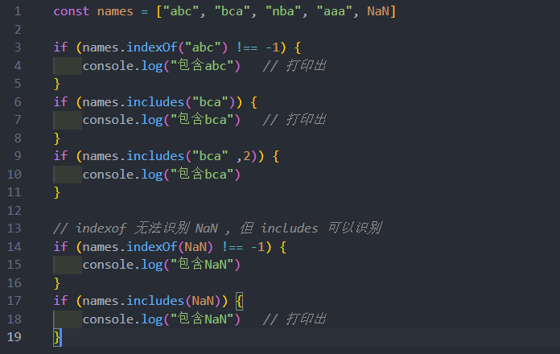

## ES7 –指数(乘方) exponentiation 运算符
* 在ES7之前，计算数字的乘方需要通过 **Math.pow** 方法来完成。
* 在ES7中，增加了 ** 运算符，可以对数字来计算乘方

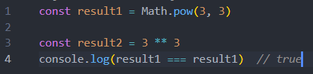

## ES8 - Object values
可以通过 Object.keys 获取一个对象所有的key，在ES8中提供了 Object.values 来获取所有的value值

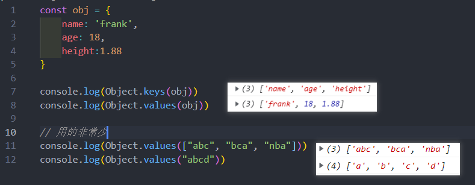
## ES8 - Object entries
通过Object.entries 可以获取到一个数组，数组中会存放可枚举属性的键值对数组。
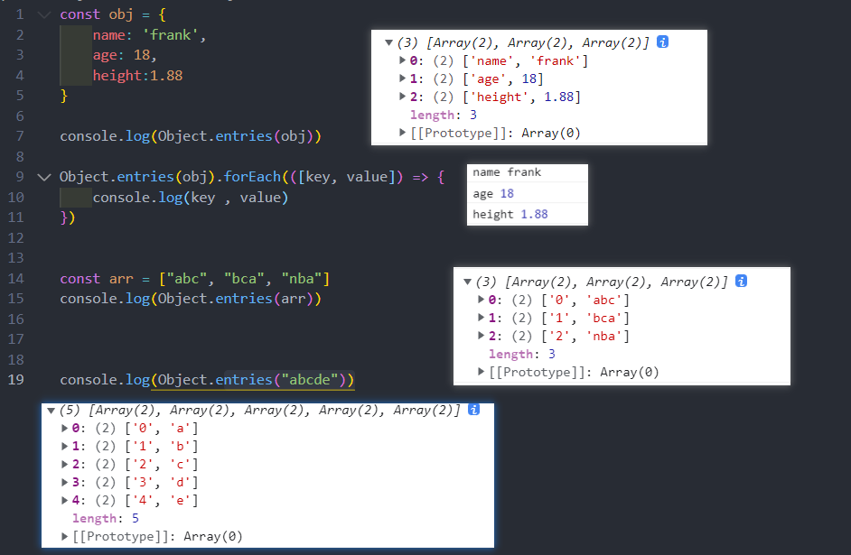
## ES8 - String Padding
某些字符串我们需要对其进行前后的填充，来实现某种格式化效果，ES8中增加了 padStart 和 padEnd 方法，分
别是对字符串的首尾进行填充的
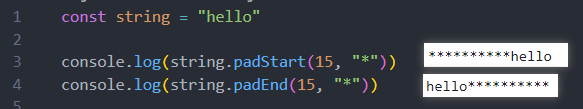
简单的一个应用场景：比如需要对身份证、银行卡的前面位数进行隐藏
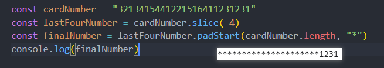
## ES8 - Object Descriptors
在面向对象里总结过
## ES9 新增
* Async iterators：后续迭代器总结
* Object spread operators：前面总结过
* Promise finally：后续 Promise总结
## ES10 - flat flatMap
flat() 方法会按照一个可指定的深度递归遍历数组，并将所有元素与遍历到的子数组中的元素合并为一个新数组返回

flatMap() 方法首先使用映射函数映射每个元素，然后将结果压缩成一个新数组
* 注意一：flatMap 是先进行 map 操作，再做 flat的操作；
* 注意二：flatMap 中的 flat 相当于深度为 1
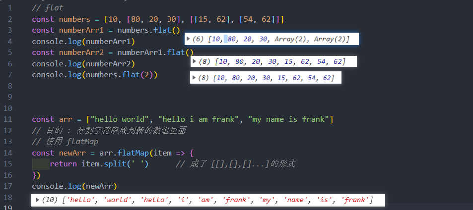

## ES10 - Object fromEntries
在前面，可以通过 Object.entries 将一个对象转换成 entries，那么如果我们有一个entries了，如何将其转换
成对象？
* ES10 提供了 Object.formEntries 来完成转换

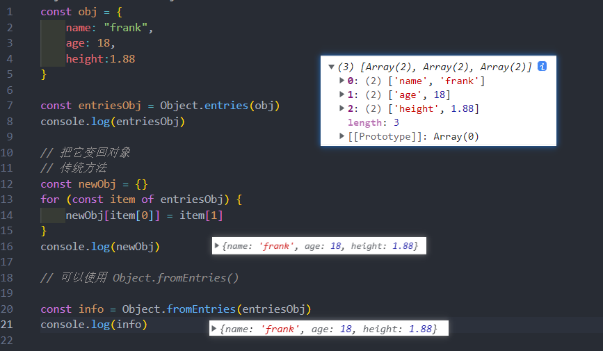

应用场景 : 

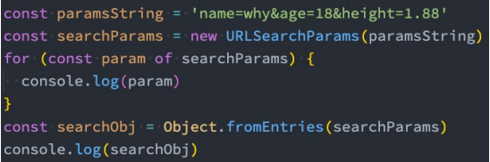
## ES10 - trimStart trimEnd
去除一个字符串首尾的空格，我们可以通过 trim 方法，如果单独去除前面或者后面？
* ES10 中提供了trimStart 和 trimEnd

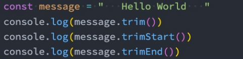
## ES10 其他补充
* Symbol description：前面总结过
* Optional catch binding：后面 try catch 总结
## ES11 - BigInt
在早期的JavaScript中，我们不能正确的表示过大的数字：
* 大于MAX_SAFE_INTEGER的数值，表示的可能是不正确的。
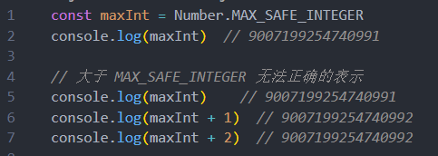

那么ES11中，引入了新的数据类型BigInt，用于表示大的整数：
* BitInt 的表示方法是在数值的后面加上 n
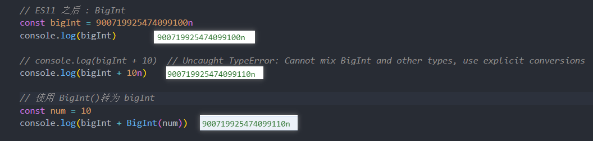
## ES11 - Nullish Coalescing Operator
ES11，Nullish Coalescing Operator 增加了空值合并操作符：
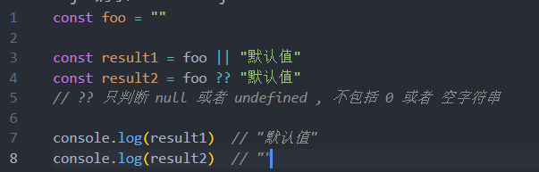
## ES11 - Optional Chaining
可选链 也是ES11中新增一个特性，主要作用是让代码在进行null和undefined判断时更加清晰和简洁：
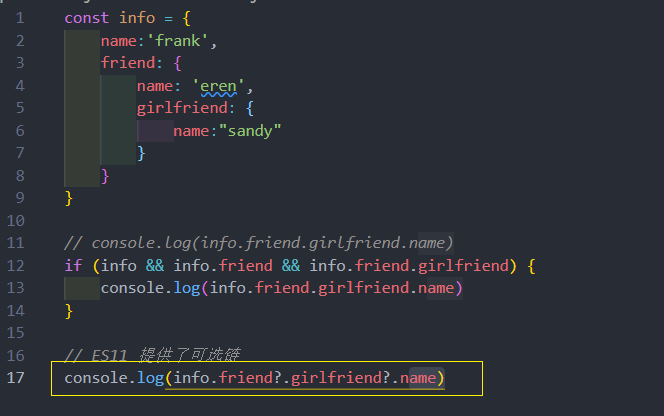

## ES11 - GlobalThis 
在之前希望获取JavaScript环境的全局对象，不同的环境获取的方式是不一样的
* 比如在浏览器中可以通过this、window来获取；
* 比如在 Node 中需要通过 global 来获取；

那么在 ES11 中对获取全局对象进行了统一的规范：globalThis

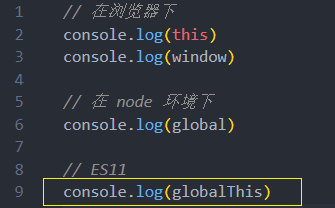
## ES11 其他补充 
* Dynamic Import：后续 ES Module模块化中总结
* Promise.allSettled：后续 Promise 总结
* import meta：后续 ES Module模块化中总结
## ES12 - FinalizationRegistry
FinalizationRegistry 对象可以让在对象被垃圾回收时请求一个回调
* FinalizationRegistry 提供了这样的一种方法：当一个在注册表中注册的对象被回收时，请求在某个时间点上调
用一个清理回调。（清理回调有时被称为 finalizer ）
* 可以通过调用 register 方法，注册任何你想要清理回调的对象，传入该对象和所含的值
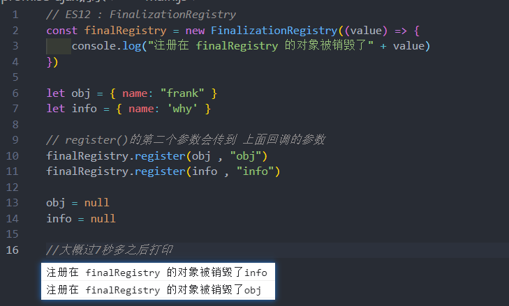
## ES12 - WeakRefs
如果默认将一个对象赋值给另外一个引用，那么这个引用是一个强引用：
* 如果我们希望是一个弱引用的话，可以使用 WeakRef
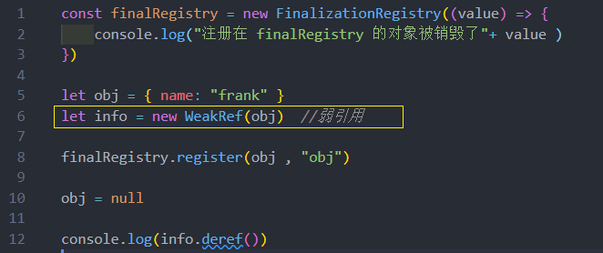
## ES12 - logical assignment operators
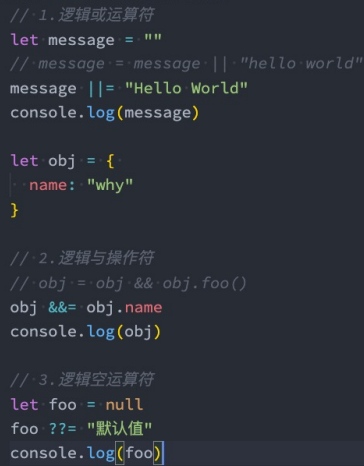
## ES12 其他知识点
* String.replaceAll：字符串替换
