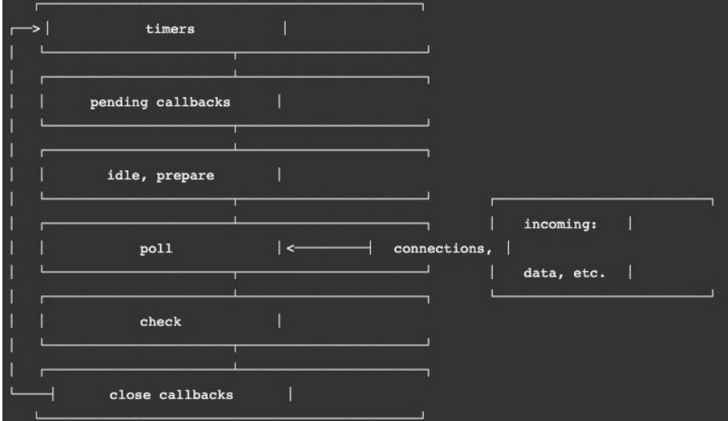

# 事件循环
## 浏览器中的 JavaScript 线程
* 我们经常会说 **JavaScript 是单线程**的，但是 JavaScript 的线程应该有自己的容器进程：**浏览器或者Node**。

* 浏览器是一个进程吗，它里面只有一个线程吗？
  * 目前多数的浏览器其实都是多进程的，当我们打开一个tab页面时就会开启一个新的进程，这是为了防止一个页
面卡死而造成所有页面无法响应，整个浏览器需要强制退出；
  * 每个进程中又有很多的线程，其中包括执行 JavaScript 代码的线程；

JavaScript的代码执行是在一个单独的线程中执行的：
* 这就意味着 JavaScript 的代码，在**同一个时刻只能做一件事**；
* 如果**这件事是非常耗时**的，就意味着当前的线程就会被**阻塞**；

所以真正耗时的操作，实际上并不是由 JavaScript 线程在执行的：
* 浏览器的每个进程是多线程的，那么**其他线程可以来完成这个耗时的操作**
* 比如**网络请求**、**定时器**，我们只需要在特性的时候执行应该有的回调即可；

## 浏览器的事件循环
*有JS线程、浏览器其他线程 、事件队列*

浏览器线程可处理很多操作比如 DOM 监听, 网络请求 , 定时器 或者其他一些东西。当我们到了某一时间
需要执行回调的话就会加入到事件队列里面, 然后JS引擎在从这个事件队列里面获取对应的函数 , 放到调用栈执行。
这个一个闭环就叫做 事件循环

## 宏任务和微任务
**但是在事件循环中并非只维护着一个队列 , 事实上有两个队列 :**

* 宏任务队列 *macrotask queue*: ajax , setInterval, setTimeout , DOM 监听 , UI Rendering 等
* 微任务队列 *micotask queue* : Promise的then回调 , Mutation Observer API , queueMicrotask() 等 

**那么事件循环对于两个队列的优先级是怎么样呢？**
* 1. main script 中的代码优先执行(编写的顶层 script 代码)
* 2. **在任何一个宏任务之前 (不是队列 , 是一个宏任务) , 都会先查看微任务队列中是否有任务需要执行**
  * 也就是说宏任务执行之前 , 必须要保证微任务队列是空的
  *  如果不为空 , 那么久优先执行微任务队列中的任务(回调)
## Promise 面试题
画一下 main script  , 微 , 宏   然后再分析
* 注意点 : (1) 执行宏任务之前微任务要清空 , 否则不能执行宏任务

热身 :
* 注意点: async 在前面总结过 , 异步函数的内部代码执行过程和普通函数是一致的 , 默认情况下也是会被**同步执行**

答案: 1111 2222 4444 333 

## Node的事件循环
浏览器中的 EventLoop 是根据HTML5定义的规范来实现的，不同的浏览器可能会有不同的实现，而 Node 中是由 libuv 实现的。
* 下面是一个Node的架构图:
* 我们会发现 libuv 中主要维护了一个 EventLoop 和 worker threads（线程池）；
* ventLoop负责调用系统的一些其他操作：文件的IO、Network、child-processes等

libuv是一个多平台的专注于异步IO的库，它最初是为Node开发的，但是现在也被使用到Luvit、Julia、pyuv等其
他地方

## Node事件循环的阶段
**事件循环像是一个桥梁**，是连接着应用程序的 **JavaScript 和系统调用**之间的通道：
* 无论是我们的文件IO、数据库、网络IO、定时器、子进程，在完成对应的操作后，都会将**对应的结果和回调函数**放到事件循环（任务队列）中；
* 事件循环会不断的从**任务队列中取出对应的事件（回调函数）**来执行；

*但是一次完整的事件循环Tick分成很多个阶段：*
* *定时器（Timers）*：本阶段执行已经被 setTimeout() 和 setInterval() 的调度回调函数。
* *待定回调（Pending Callback）*：对某些系统操作（如TCP错误类型）执行回调，比如 TCP 连接时接收到 ECONNREFUSED。
* *idle, prepare*：仅系统内部使用。
* *轮询（Poll）*：检索新的 I/O 事件；执行与 I/O 相关的回调；
* *检测（check）*：setImmediate() 回调函数在这里执行。
* *关闭的回调函数*：一些关闭的回调函数，如：socket.on('close', ...)。

## Node 的宏任务和微任务
我们会发现从一次事件循环的 Tick 来说，Node 的事件循环更复杂，它也分为微任务和宏任务：
* 宏任务 (macrotask) :setTimeout , setInterval , IO事件 , setImmediate , close 事件
* 微任务 (microtask) : Promise的then回调 , process.nextTick , queueMicro

但是 , Node 的事件循环不只是微任务和宏任务队列 : 
* **微任务队列：**
  * next tick queue：process.nextTick；
  * other queue：Promise的then回调、queueMicrotask；
* **宏任务队列：**
  * timer queue：setTimeout、setInterval；
  * poll queue：IO事件；
  * check queue：*setImmediate；*
  * close queue：close事件；

## Node事件循环的顺序
所以，在每一次事件循环的 tick 中，会按照如下顺序来执行代码：
* next tick microtask queue；
* other microtask queue；
* timer queue；
* poll queue；
* check queue；
* close queue
## Node 执行面试题

