# 手写防抖和节流
## 认识防抖 debounce 函数
* 当事件触发时，相应的函数**并不会立即触发**，而是**会等待一定的时间**；
* 当事件密集触发时，函数的触发会被频繁的**推迟**；
* *只有等待了一段时间也没有事件触发，才会真正的执行响应函数；*

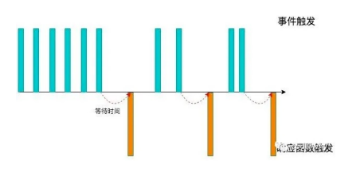

**防抖的应用场景很多：**
* 输入框中频繁的输入内容，搜索或者提交信息；
* 频繁的点击按钮，触发某个事件；
* 监听浏览器滚动事件，完成某些特定操作；
* 用户缩放浏览器的 resize 事件

#### 防抖的案例
遇到过这样的场景，在某个**搜索框中输入自己想要搜索的内容**：

比如想要搜索一个MacBook：
* 当我输入m时，为了更好的用户体验，通常会出现对应的联想内容，这些联想内容通常是保存在服务器的，所以需要
一次网络请求；
* 当继续输入ma时，再次发送网络请求；
* 那么macbook一共需要发送7次网络请求；
* 这大大损耗我们整个系统的性能，无论是前端的事件处理，还是对于服务器的压力;

但是我们需要这么多次的网络请求吗？
* 不需要，正确的做法应该是在合适的情况下再发送网络请求；
* 比如如果用户快速的输入一个macbook，那么只是发送一次网络请求；
* 比如如果用户是输入一个m想了一会儿，这个时候m确实应该发送一次网络请求；
* 也就是我们应该监听用户在某个时间，比如500ms内，没有再次触发时间时，再发送网络请求；

这就是防抖的操作：只有在某个时间内，没有再次触发某个函数时，才真正的调用这个函数
## 认识节流 throttle 函数
* 当事件触发时，**会执行**这个事件的响应函数；
* 如果这个事件会被频繁触发，那么节流函数会按照**一定的频率来执行函数**；
* 不管在这个中间有多少次触发这个事件，执行函数的频繁总是固定的；

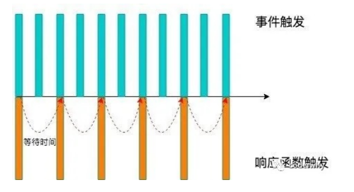

节流的应用场景：
* 监听页面的滚动事件；
* 鼠标移动事件；
* 用户频繁点击按钮操作；
* 游戏中的一些设计；
## Underscore 库
事实上可以通过一些第三方库来实现防抖操作：
* lodash
* underscore

**这里使用 underscore**
* 可以理解成 lodash 是 underscore 的升级版，它更重量级，功能也更多；
* 但是目前看到 underscore 还在维护，lodash 已经很久没有更新了；

Underscore 的官网： [https://underscorejs.org/](https://underscorejs.org/)

Underscore 的安装有很多种方式：
* 下载 Underscore ，本地引入；
* 通过 CDN 直接引入；
* 通过包管理工具（npm）管理安装；

这里直接通过 CDN：
``

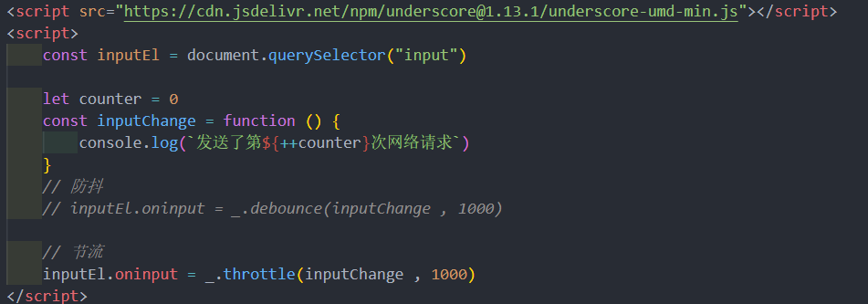
## 手写防抖和节流
### 防抖 debounce
按照如下思路来实现**防抖**：
* 防抖基本功能实现：可以实现防抖效果
* 优化一：优化参数和 this 指向
* 优化二：优化取消操作（增加取消功能）
* 优化三：优化立即执行效果（第一次立即执行）
* 优化四：优化返回值

**基本实现 v1** :
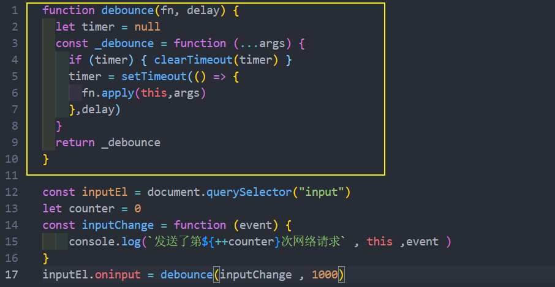
v1 的详解: 
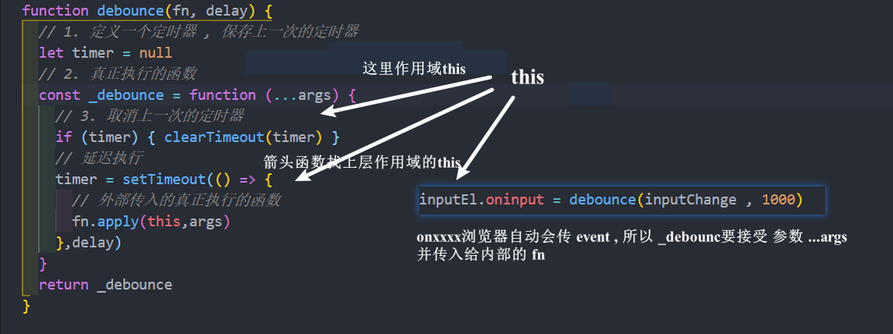
**立即执行 v2** : inInvoke 表示是否执行过
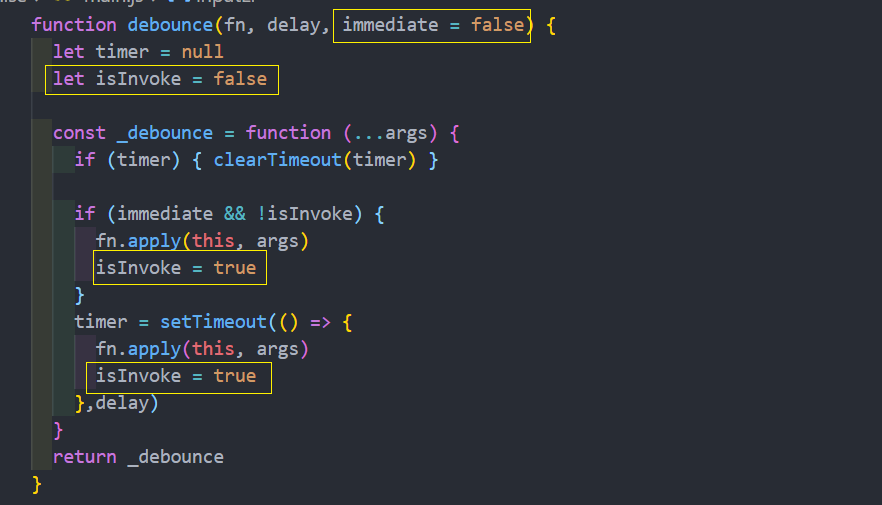
**取消功能 v3 :**
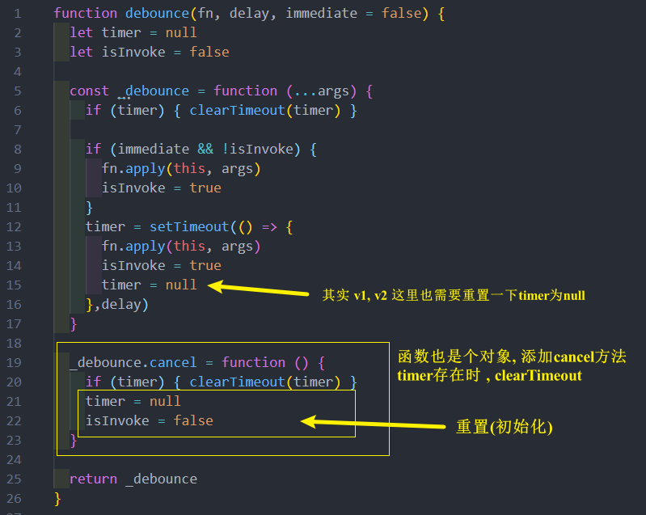
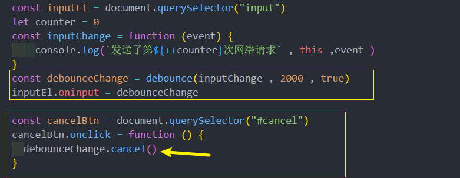
**函数的返回值** : 两种思路 回调函数 / Promise
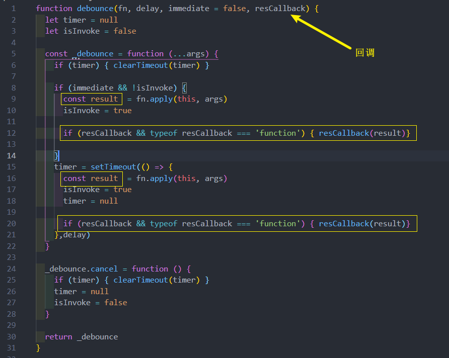
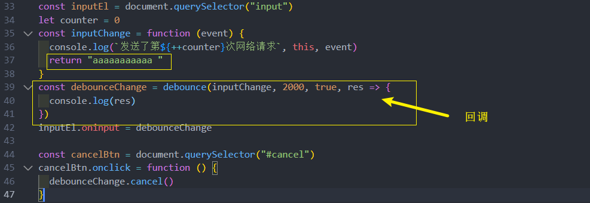

**或者**

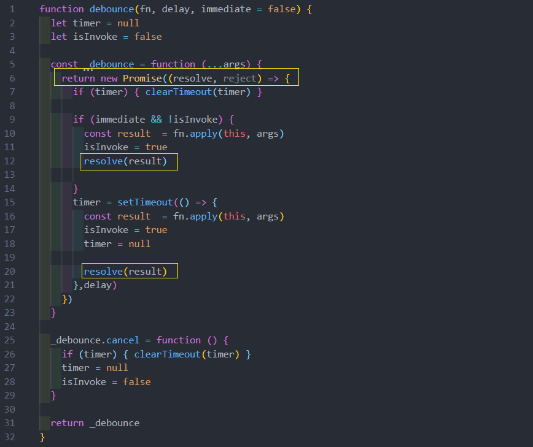
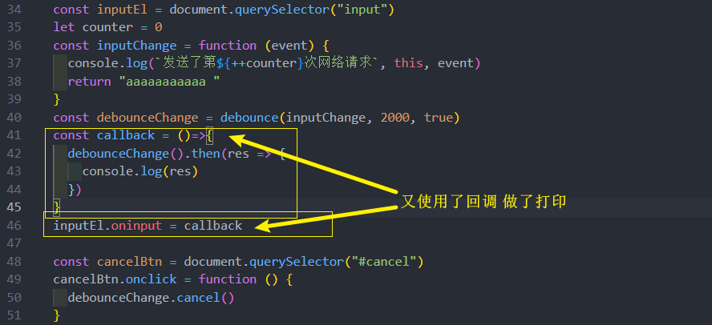
### 节流 throttle
我们按照如下思路来实现**节流**：
* 节流函数的基本实现：可以实现节流效果
* 优化一：节流最后一次也可以执行
* 优化二：优化添加取消功能
* 优化三：优化返回值问题

基本实现 v1: 
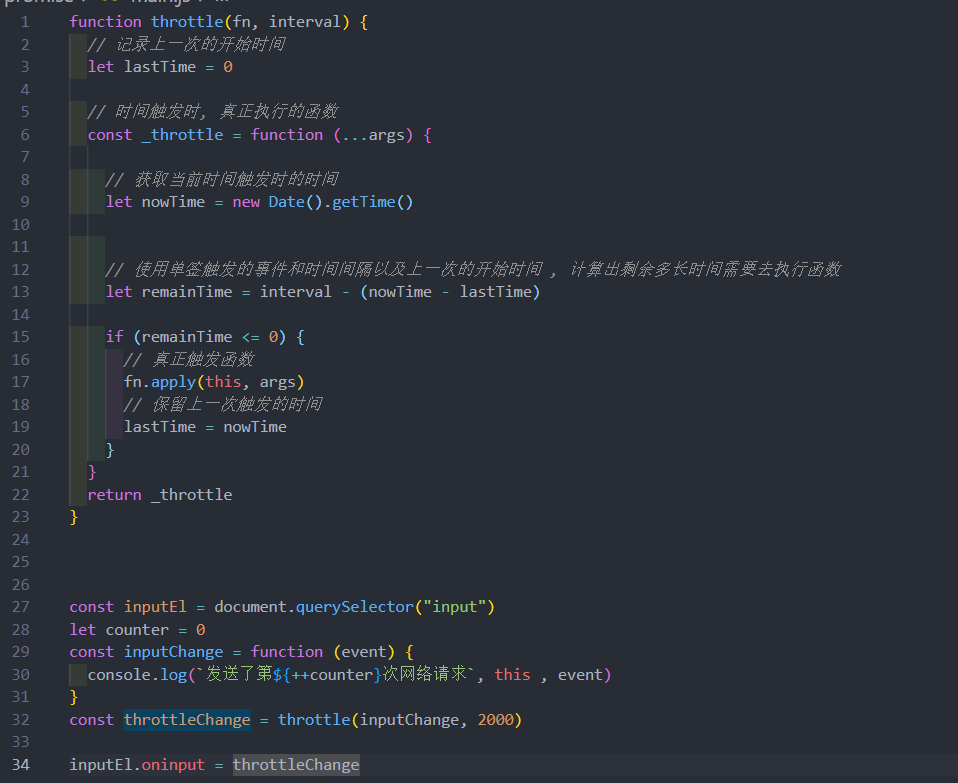
最开始不触发 (leading实现) v2 :
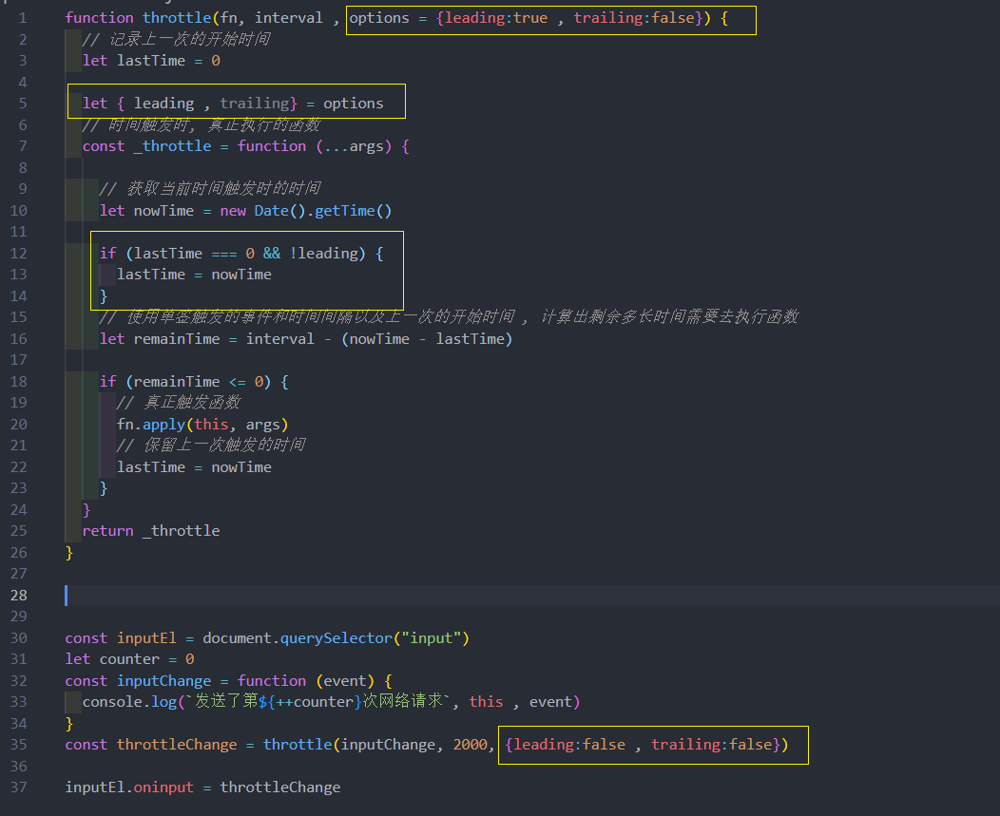

