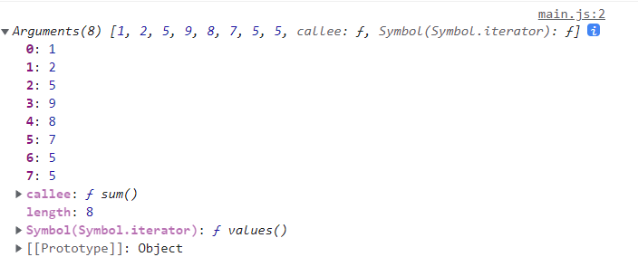

# 函数
## 声明定义
函数也是个对象 , 是`Function`类创建出来的实例, 所以可以用 `new Function`定义函数
```js
const fn = new Function('title' , 'console.log(title)')
fn('frank') 
```
标准语法声明函数
```js
const fn = function(title){
    console.log(title)
}
fn('frank')
```
对象字面量属性函数简写
```js
const user = {
    name: 'frank',
    setName: function (name) {
        this.name = name
    },
    //简写形式
    getName(){
        return this.name
    }
}
user.setName('xxx')
```
## 全局函数
全局函数会声明在`window`对象上 , 但不建议使用全局函数 , 尽量使用模块或者类的处理
```js
console.log(window.screenX)  // 2000
```
当我们定义`screenX`函数, 会覆盖 window.screenX 方法
```js
function screenX(){
  return 'frank'
}
console.log(window.screenX) // 'frank'
```
当使用 `let/const`不会压入到 window
```js
let fn = function() {
  console.log("后盾人");
};
window.fn(); //window.fn is not a function
```
## 匿名函数
函数是对象所以可以通过赋值来指向到函数对象的指针 , 当然指针也可以传递给其他变量，注意后面要以`;`结束。
```js
let fn = function(){
  return 'xxx'
}
const x = fn;
x()
```
标准声明的函数优先级更高，解析器会优先提取函数并放在代码树顶端(函数提升)，所以标准声明函数位置不限制，所以下面的代码可以正常执行
```js
fn()

function fn(){
    console.log('hi')
}
```
## 立即执行函数
声明一个匿名函数, 然后立即执行它 . 这种做法就是立即执行函数
作用:
* ES6之前 , 可以用来定义私有作用域防止污染全局作用域
```js
( function (){console.log('hi')}())    //用括号把整个表达式抱起来
( function (){console.log('hi')}) ()   //用括号把函数包起来
! function (){console.log('hi')} ()    //求反,我们不在意值是多少,只想通过语法检查
// +
// ~
// new
```
使用 `let/const` 有块级作用域特性，所以下面方式也可以产生私有作用域
```js
{
    let xxx = 'frank'
    console.log(xxx)  //能读取到
}
console.log(xxx) // 读取不到 ,  xxx is not defined
```
## 形参和实参
`形参`指的是声明函数是设置的参数 , `实参`指的是调用函数是传递的值
* 形参数量大于实参是 , 没有传递值得形参的值为`undefined`
* 实参数量大于形参时 , 会被忽略并不会报错
```js
function sum(a, b, c) {
    console.log(c)       // undefined
    console.log(a + b)     // 3
    console.log(a + b + c)  //NaN
}
sum(1, 2)
```
实参多于形参:
```js
function sum(a, b) {
    return a + b
}
sum(1, 2, 3, 4)
```
## 默认参数
排序
```js
function sortArray(array, type = 'asc') {   // 定了默认参数
    //其实默认参数等价于
    // type = type || 'asc' 
    return array.sort((a, b) => {
        return type === 'asc'
            ? a - b
            : b - a
    })
}
const arr = [5,6,9,2,4,5,3]
console.log(sortArray(arr));         // [2, 3, 4, 5, 5, 6, 9]
console.log(sortArray(arr , 'desc'));  // [9, 6, 5, 5, 4, 3, 2]
```
## arguments
`arguments` 是函数获得到所有实参的集合 , 下面写一个求和函数

先把 `arguments` 打出来看看
```js
function  sum() {
    console.log(arguments)  
}
sum(1,2,5,9,8,7,5,5,)
```

使用`for`循环写个求和函数
```js
function sum() {
    // console.log(arguments)
    let total = 0
    for (let i = 0; i < arguments.length; i++) {
        total += arguments[i]
    }
    return total
}
```
使用`reduce`在写一下
```js
function sum() {
    return [...arguments].reduce((pre , cur)=>{
        return pre + cur
    })
}

console.log(sum(1, 2, 5, 9, 8, 7, 5, 5,));
```
但这时候更建议使用`...`展开语法
```js
function sum(...args) {
    return args.reduce((pre , cur)=>{
        return pre + cur
    })
}

console.log(sum(1, 2, 5, 9, 8, 7, 5, 5,));
```
## 箭头函数
与普通函数的区别 : 
*  箭头函数是匿名函数，不能作为构造函数，不能使用 `new`：
*  没有 `arguments`
*  箭头函数不支持 `this`
*  箭头函数的 `this` 永远指向其上下文的 `this` ，任何方法都改变不了(因为就压根不支持 this )，如 `call()` , `bind()` , `apply()`
## 回调函数
在某个时刻被 其他函数调用的函数 称为回调函数，比如处理键盘、鼠标事件的函数。
如果我写一个函数 A，传给另一个函数 B 调用，那么函数 A 就是回调
```js
document.querySelector('button').addEventListener('click',(e)=>{
  console.log(e.target)
})
```
## this
### 函数调用
全局环境下`this`就是`window`对象的引用
```js
function get(){
    console.log(this)
}
get()   // Window

console.log(this === window) // true
```
在严格模式下 , `this`是`undefined`
```js
"use strict"
var x = 'frank'
function get(){
    console.log(this.x)  //  Cannot read properties of undefined (reading 'x')
}
get() 
```
### 方法调用
函数为对象的方法时`this`指向该对象

**对象字面量**
* 下面的`render`函数不属于对象方法 , 所以指向`window
* `show`函数属于对象 , 所以`this`是obj
```js
const obj = {
    site:'frank',
    show(){
        console.log(this.site)
        function render(){
            console.log(this)
        }
        render()
    }
}

obj.show()
// 'frank'
//  window
```
在方法中使用函数时有些函数可以改变`this`如`forEach`，当然也可以使用后面介绍的`apply/call/bind`
```js
const obj = {
    site: 'frank',
    list: ['js', 'css', 'vue'],
    show() {
        this.list.forEach(function (title) {
            console.log(this)       //这里的 this 是 window
            console.log(`${this.site}+${title}`)  // this.site 是 undefined
        })
    }
}
obj.show()
```
解决上面现象 , 可以在`forEach`的第二个参数传入`this`
```js{8}
const obj = {
    site: 'frank',
    list: ['js', 'css', 'vue'],
    show() {
        this.list.forEach(function (title) {
            console.log(this)       
            console.log(`${this.site}+${title}`) 
        } , this)  // forEach 第二个参数传入 this  
    }
}
obj.show()
```
也可以在父作用域中定义引用`this`的变量
```js{5,7,8}
const obj = {
    site: 'frank',
    list: ['js', 'css', 'vue'],
    show() {
        let self = this
        this.list.forEach(function (title) {
            console.log(self)
            console.log(`${self.site}+${title}`)
        })
    }
}
obj.show()
```
### 箭头函数
箭头函数就压根没有`this` , 可以理解为`this`是个变量指向定义函数时的上下文, 可以理解为和外层的函数指向同一个`this`

这里的 `this` 是 `window`对象
```js
var site = 'frank';
var obj = {
    site: 'eren',
    getSite: function () {
        return function () {
            return this.site;
        }
    }
}
console.log(obj.getSite()()); //返回 window.site的值 frank
```
使用**箭头函数** , 可以不用关心`this`的指向 , 这个时候`this`是个变量指向定义函数时的上下文
```js
var site = 'frank';
var obj = {
    site: 'eren',
    getSite: function () {
        return  ()=> {
            return this.site;
        }
    }
}
console.log(obj.getSite()()); //返回window.site的值 frank
```
事件中使用箭头函数结果不是我们想要的结果

* **事件**函数可理解为对象 `onclick` 设置值，所以函数声明时`this`为当前对象
* 但使用箭头函数时`this`为声明函数上下文

使用普通函数时`this`为当前DOM对象
```html
<button>Hello</button>
```
```js{8,12}
let  dom = {
    site:'frank',
    bind(){
        const button = document.querySelector('button')
        button.addEventListener('click' , function (){
            console.log(this)
        })
        // addEventListener 可以用理解为
        // button.onclick = function (){
        //     console.log(this)
        // }
        // 因为是属于button对象的属性 , 所以 this 是 button 本身
    }
}
dom.bind()   // 打印出 <button>Hello</button>
```
`addEventListener`里的函数用了箭头函数 , `this`指向上下文
```js
let  dom = {
    site:'frank',
    bind(){
        const button = document.querySelector('button')
        button.addEventListener('click' , ()=>{
            console.log(this)      // {site: 'frank', bind: ƒ}   this 指向了 上下文
            console.log(this.site) // 'frank
        })
    }
}
dom.bind()   
```
若想同时访问DOM对象 和 上下文 , 可以使用 箭头函数 +  `event.target`
```js{5-8}
let  dom = {
    site:'frank',
    bind(){
        const button = document.querySelector('button')
        button.addEventListener('click' , (event)=>{
           console.log(event.target)  // <button>Hello</button>
           console.log(this)          // {site: 'frank', bind: ƒ}
        })
    }
}
dom.bind()
```
再看一下稍微复杂的情况 , 有多个`<button>` , 遍历时使用了`forEach` , 注意多层函数的关系
```html
<button>Hello</button>
<button>World</button>  
```
```js
let dom = {
    site:'frank',
    bind(){
        const buttons = document.querySelectorAll('button')
        buttons.forEach(function (elem){
            elem.addEventListener('click',()=>{
                console.log(this)    // 看这里
                //使用了箭头函数 , this 指向了上下文 , 这时上下文的 this 是 window
            })
        })
    }
}
dom.bind()

//打印出了 window
```
所以这时想要访问到对象的`site`属性 , 里面可以全部使用箭头函数
```js
let dom = {
    site:'frank',
    bind(){
        const buttons = document.querySelectorAll('button')
        buttons.forEach(elem=>{   //使用了箭头函数 , this是上下文的this , 因为是对象的方法, this也就是这个对象
            console.log(this)    // 看这里
            elem.addEventListener('click',()=>{
                console.log(this)
            })
        })
    }
}
dom.bind()
```
想要访问到DOM对象, 当然此时可以使用`event.target`
```js{7,9}
let dom = {
    site:'frank',
    bind(){
        const buttons = document.querySelectorAll('button')
        buttons.forEach(elem=>{   
            console.log(this)    
            elem.addEventListener('click',(event)=>{
                console.log(this)
                console.log(event.target)
            })
        })
    }
}
dom.bind()
```
当然其他方法也有使用`self`等...

## apply/call/bind
### apply/call
`call`和`bind`可以显示地绑定`this`, 这俩在传递参数上有所区别
* `apply`用数组传参
* `call`需要分别传参
* 也 `bind` 不同的是他来会立即执行函数

简单语法示例
```js
function show(title){
    console.log(`${title}-${this.name}`)
}
const user1 = {
    name:'frank'
}
const user2 = {
    name:'eren'
}

show.apply(user1 , ['xxxx'])  // xxxx-frank
show.call(user2 , 'yyyy')     // yyyy-eren
```
使用了`call`设置了`this`
```html
<button message="frank">Hello</button>
<button message="eren">World</button>
```
```js
function show(){
    console.log(this.getAttribute('message'))
}
const buttons = document.querySelectorAll('button')
buttons.forEach((button)=>{
    button.addEventListener('click',()=>{
        show.call(button)
    })
})
//打出 
// 'frank'
// 'eren'
```
找数组中的最大值
```js
const arr = [5,6,2,1,7,9,8,9]
console.log(Math.max(arr))  //NaN
console.log(Math.max.apply(Math , arr)) // 9
console.log(Math.max(...arr))    // 9 
```
### 实现构造函数的继承
```js{14}
function Request(params) {
    this.get = function () {
        //id=1&cat=js
        let str = Object.keys(params)
            .map((key,index)=> `${key}=${params[key]}`)
            .join('&')
        let url = `http://xxx.com/${this.url}/?${str}`
        console.log(url)
    }
}

function Article(params) {
    this.url = 'article/lists'
    Request.call(this , params)
}

const a = new Article({id: 1, cat: 'js'})
a.get()
```
### bind
`bind()`是将函数绑定到某个对象，比如 `a.bind(obj))` 可以理解为将a函数绑定到`obj`对象上即 `obj.a()`
* 与 `call/apply` 不同`bind`不会立即执行
* `bind` 会**返回新函数**
```js
function a (){}
let b = a
console.log(a === b) // true
let c = a.bind()
console.log(a === c) // false
```
事件上使用`bind`
```js
const button = document.querySelector('button')
button.addEventListener('click',function(event){
    console.log(this.url + event.target.textContent)
}.bind({url:'xxxx.com'}))
```


