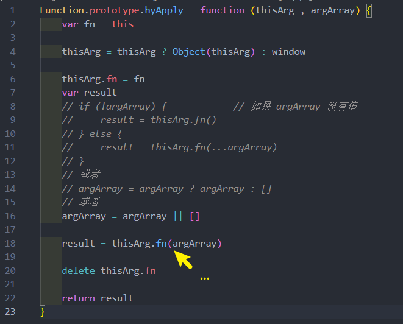

# 函数式编程
## call 函数的实现

详解: 

## apply函数的实现 

需要处理没有传参数的边界情况
## bind 函数的实现
bind函数的用法 

**自己实现 bind**

## 认识 arguments 
arguments 是一个 对应于 **传递给函数的参数** 的 **类数组(array-like)对象**

* array-like 意味着它不是一个数组类型，而是一个对象类型
  * 但是它却拥有数组的一些特性，比如说 length，比如可以通过 index 索引来访问
  * 但是它却没有数组的一些方法，比如 forEach、map 等；

### arguments 转成 数组

### 箭头函数的 arguments
箭头函数是**不绑定** arguments 的，所以我们在箭头函数中使用arguments会去**上层作用域查找**

**那箭头函数怎么获取参数 ? 使用 ...args**

## 纯函数 、 副作用
什么是**纯函数** ? 

维基百科定义：
* 在程序设计中，若一个函数符合以下条件，那么这个函数被称为纯函数：
* 此函数**在相同的输入值**时，需**产生相同的输出**
* 函数的**输出和输入值以外的其他隐藏信息或状态无关**，也和**由I/O设备产生的外部输出无关**
* 该函数**不能有语义上可观察的函数副作用**，诸如 **“触发事件”，使输出设备输出，或更改输出值以外物件的内容**等

简单两句话总结**纯函数**: 
* **确定的输入，一定会产生确定的输出**
* **函数在执行过程中，不能产生副作用**

什么是**副作用** ? 
* 副作用（side effect）其实本身是医学的一个概念，比如我们经常说吃什么药本来是为了治病，可能会产生一
些其他的副作用
* 在计算机科学中，也引用了副作用的概念，表示**在执行一个函数**时，除了**返回函数值之外**，还对 **调用函数产生了附加的影响** ，比如**修改了全局变量，修改参数或者改变外部的存储**

**纯函数在执行的过程中就是不能产生这样的副作用：**
* 副作用往往是产生 bug 的 **“温床”**

### 纯函数的案例 
看一个对 数组 操作的两个函数：
* slice：slice截取数组时不会对原数组进行任何操作,而是生成一个新的数组
* splice：splice截取数组, 会返回一个新的数组, 也会对原数组进行修改
* **slice 就是一个纯函数，不会修改传入的参数**

### 编写几个案例, 看看是不是纯函数

### 纯函数的优势
为什么纯函数在函数式编程中非常重要呢？
* 因为可以**安心的编写**和**安心的使用**
* 在写的时候保证了函数的**纯度**，只是单纯实现自己的**业务逻辑即可**，**不需要关心传入的内容**是如何获得的或
者**依赖其他的外部变量**是否已经发生了修改；
* 在用的时候，确定你的**输入内容不会被任意篡改**，并且**自己确定的输入**，**一定会有确定的输出**

React中就要求我们无论是函数还是 class 声明一个组件，**这个组件都必须像纯函数一样**，保护它们的 props 不被修改

## JavaScript 柯里化
柯里化也是属于**函数式编程**里面一个非常重要的概念

看一下**维基百科**的解释:
* 在计算机科学中，柯里化（英语：Currying），又译为卡瑞化或加里化
* 是把接收多个参数的函数，变成接受一个单一参数（最初函数的第一个参数）的函数，并且返回接受余下的参
数，而且返回结果的新函数的技术；
* 柯里化声称 “如果你固定某些参数，你将得到接受余下参数的一个函数”；

非常的抽象，这里做一个总结：
* **只传递给函数一部分参数来调用它，让它返回一个函数去处理剩余的参数；**
* **这个过程就称之为柯里化**
### 柯里化的结构

### 让函数的职责单一
* 在函数式编程中，其实往往**希望一个函数处理的问题尽可能的单一**，**而不是将一大堆的处理过程交给一个函数来处理**
* 那么**我们是否就可以将每次传入的参数在单一的函数中进行处理**，处理完后在**下一个函数中再使用处理后的结果**

传入的函数需要分别被进行如下处理 : 

### 柯里化的复用
另外一个使用柯里化的场景是可以帮助可以**复用参数逻辑** 

* makeAdder 函数要求我们传入一个 num
* 在之后使用返回的函数时，不需要再继续传入num了

#### 打印日志的柯里化函数
这里再写一个案例，需求是打印一些日志：
* 日志包括时间、类型、信息

普通函数的实现方案如下 : 

利用柯里化 复用 : 

### 实现自动柯里化函
*  实现一个能把普通的函数，转成柯里化函数的函数

## 函数额外知识点
### with 语句
with语句 : 扩展一个语句的作用域链

**不建议使用with语句**, 因为它可能是混淆错误和兼容性问题的根源 

在严格模式下压根都不支持 witch 语句
### eval 函数
eval是一个特殊的函数，它可以将传入的字符串当做 JavaScript 代码来运行

**不建议**在开发中使用 eval：
* eval代码的可读性非常的差（代码的可读性是高质量代码的重要原则
* eval是一个字符串，那么有可能在执行的过程中被刻意篡改，那么可能会造成被攻击的风险
* eval的执行必须经过 JS 解释器，不能被J S 引擎优化
### 严格模式
在ECMAScript5标准中，JavaScript提出了**严格模式的概念（Strict Mode）**
* 严格模式很好理解，是**一种具有限制性的JavaScript模式**，从而使**代码隐式的脱离了 ”懒散（sloppy）模式“**
* **支持严格模式的浏览器**在检测到代码中有严格模式时，会以更加严格的方式对代码进行检测和执行；

严格模式对正常的JavaScript语义进行了一些限制：
* 严格模式通过 **抛出错误** 来消除一些原有的 **静默（silent）错误**
* 严格模式让**JS引擎在执行代码时可以进行更多的优化**（不需要对一些特殊的语法进行处理）；
* 严格模式禁用了在**ECMAScript未来版本中可能会定义的一些语法**

### 开启严格模式
* 可以支持在 js 文件中开启严格模式
* 也支持对某一个函数开启严格模式

严格模式通过在文件或者函数开头使用 use strict 来开启

### 严格模式限制
* 1. 无法意外的创建全局变量
* 2. 严格模式会使引起静默失败(silently fail,注:不报错也没有任何效果)的赋值操作抛出异常
* 3. 严格模式下试图删除不可删除的属性
* 4. 严格模式不允许函数参数有相同的参数名
* 5. 不允许0的八进制语法
* 6. 在严格模式下，不允许使用 with
* 7. 在严格模式下，eval 不再为上层引用变量
* 8. 严格模式下，this 绑定不会默认转成window , 会是undefined 但setTimeout()的this依然是window (fn.apply(this= window))

