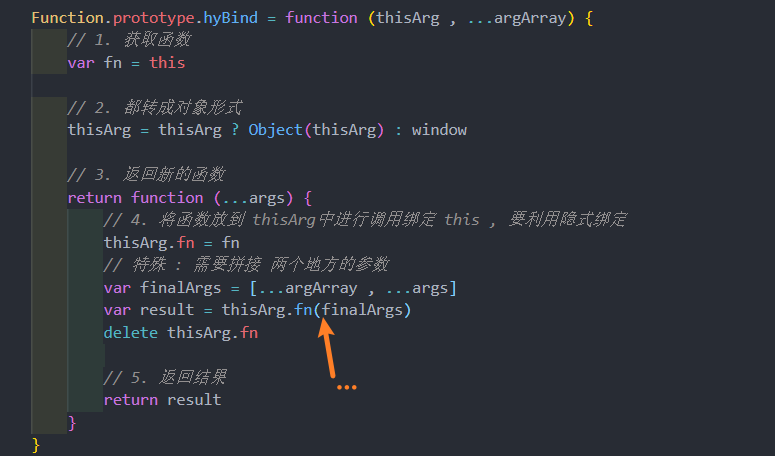

# 函数式编程
## call 函数的实现

详解: 

## apply函数的实现 

需要处理没有传参数的边界情况
## bind 函数的实现
bind函数的用法 

**自己实现 bind**

## 认识 arguments 
arguments 是一个 对应于 **传递给函数的参数** 的 **类数组(array-like)对象**

* array-like 意味着它不是一个数组类型，而是一个对象类型
  * 但是它却拥有数组的一些特性，比如说 length，比如可以通过 index 索引来访问
  * 但是它却没有数组的一些方法，比如 forEach、map 等；

