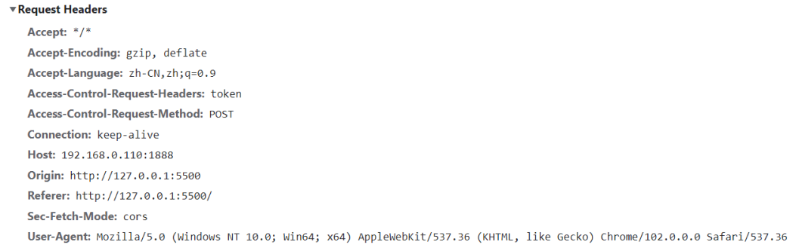
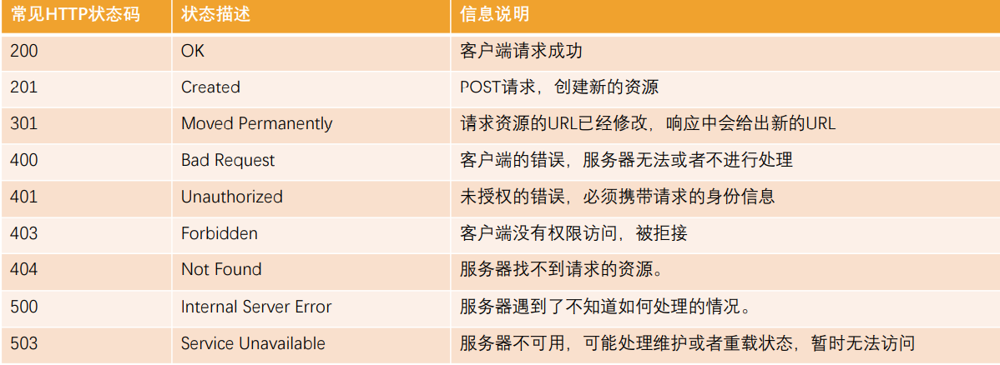
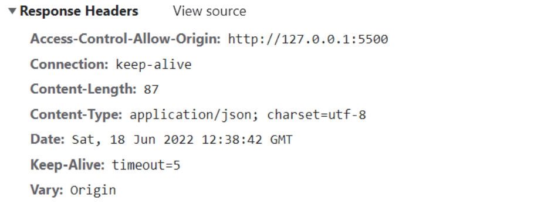
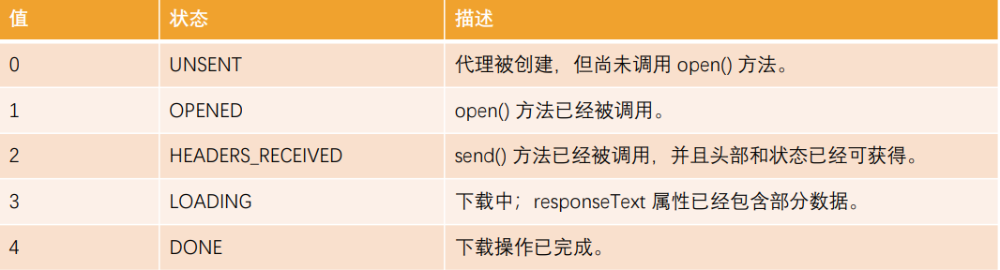
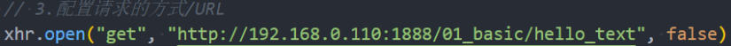
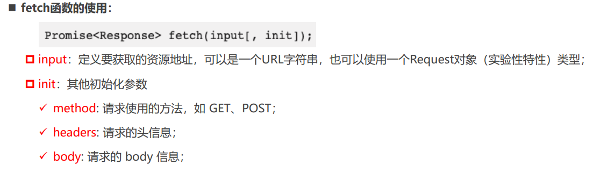

# HTTP
## 前后端分离的优势
早期的网页都是通过后端渲染来完成的：服务器端渲染（`SSR`，server side render）：
* 客户端发出请求 -> 服务端接收请求并返回相应HTML文档 -> 页面刷新，客户端加载新的HTML文档；

服务器端渲染的缺点：
* 当用户点击页面中的某个按钮向服务器发送请求时，页面本质上只是一些数据发生了变化，而此时服务器却要将重绘的整个页面再返

回给浏览器加载，这显然有悖于程序员的`“ DRY（ Don‘t repeat yourself ）”`原则；
* 而且明明只是一些数据的变化却迫使服务器要返回整个HTML文档，这本身也会给网络带宽带来不必要的开销。

有没有办法在页面数据变动时，只向服务器请求新的数据，并且在阻止页面刷新的情况下，动态的替换页面中展示的数据呢？
* 答案正是 “`AJAX`”。

`AJAX`是“Asynchronous JavaScript And XML”的缩写(异步的JavaScript 和 XML)，是一种实现 无页面刷新 获取服务器数据的技术。
* `AJAX`最吸引人的就是它的“异步”特性，也就是说它可以在不重新刷新页面的情况下与服务器通信，交换数据，或更新页面。

你可以使用 AJAX 最主要的两个特性做下列事：
* 在不重新加载页面的情况下发送请求给服务器
* 接受并使用从服务器发来的数据
## HTTP 的组成


## HTTP 版本
HTTP/0.9 
* 发布于1991年；
* 只支持GET请求方法获取文本数据，当时主要是为了获取HTML页面内容；
HTTP/1.0 
* 发布于1996年；
* 支持POST、HEAD等请求方法，支持请求头、响应头等，支持更多种数据类型(不再局限于文本数据) ；
* 但是浏览器的每次请求都需要与服务器建立一个TCP连接，请求处理完成后立即断开TCP连接，每次建立连接增加了性能损耗；
HTTP/1.1(目前使用最广泛的版本) 
* 发布于1997年；
* 增加了PUT、DELETE等请求方法；
* 采用持久连接(Connection: keep-alive)，多个请求可以共用同一个TCP连接；

2015年，HTTP/2.0

2018年，HTTP/3.0
## HTTP 的请求方式
* `GET`：GET 方法请求一个指定资源的表示形式，使用 GET 的请求应该只被用于获取数据。
* `HEAD`：HEAD 方法请求一个与 GET 请求的响应相同的响应，但没有响应体。
  * 比如在准备下载一个文件前，先获取文件的大小，再决定是否进行下载；
* `POST`：POST 方法用于将实体提交到指定的资源。
* `PUT`：PUT 方法用请求有效载荷（payload）替换目标资源的所有当前表示；
* `DELETE`：DELETE 方法删除指定的资源；
* `PATCH`：PATCH 方法用于对资源应部分修改；
* `CONNECT`：CONNECT 方法建立一个到目标资源标识的服务器的隧道，通常用在代理服务器，网页开发很少用到。
* `TRACE`：TRACE 方法沿着到目标资源的路径执行一个消息环回测试。

在开发中使用最多的是 `GET、POST`请求
## HTTP 请求头
在 `request` 对象的 `header` 中也包含很多有用的信息，客户端会默认传递过来一些信息


`content-type` 这次请求携带的数据的类型
* `application/x-www-form-urlencoded`：表示数据被编码成以 '&' 分隔的键 - 值对，同时以 '=' 分隔键和值
* `application/json`：表示是一个json类型
* `text/plain`：表示是文本类型
* `application/xml`：表示是xml类型
* `multipart/form-data`：表示是上传文件

`content-length`：文件的大小长度

`keep-alive`：
* http是基于TCP协议的，但是通常在进行一次请求和响应结束后会立刻中断；
* 在http1.0中，如果想要继续保持连接：
  * 浏览器需要在请求头中添加 connection: keep-alive；
  * 服务器需要在响应头中添加 connection:keep-alive；
  * 当客户端再次放请求时，就会使用同一个连接，直接一方中断连接；
* 在http1.1中，所有连接默认是 connection: keep-alive的；
  * 不同的Web服务器会有不同的保持 keep-alive的时间；
  * Node中默认是5s中；

`accept-encoding`：告知服务器，客户端支持的文件压缩格式，比如js文件可以使用 gzip 编码，对应 .gz文件；

`accept`：告知服务器，客户端可接受文件的格式类型；

`user-agent`：客户端相关的信息

## HTTP Response 响应状态码
MDN响应码解析地址：[https://developer.mozilla.org/zh-CN/docs/web/http/status](https://developer.mozilla.org/zh-CN/docs/web/http/status)


## HTTP 响应头


## Ajax 发送请求
测接口地址: `http://123.207.32.32:8000/home/multidata`

`AJAX` 是异步的 `JavaScript` 和 `XML`（Asynchronous JavaScript And XML）
* 它可以使用 `JSON，XML，HTML 和 text 文本`等格式发送和接收数据

如何来完成 `AJAX` 请求呢？
1. 创建网络请求的 `AJAX 对象`（使用 XMLHttpRequest）
2. 监听 `XMLHttpRequest` 对象状态的变化，或者监听 `onload` 事件（请求完成时触发）；
3. 配置网络请求（通过 `open` 方法）；
4. 发送 `send` 网络请求

```js
// 1. 创建 xhrHttpRequest 对象
const xhr = new XMLHttpRequest()
// 2. 监听状态的改变
xhr.onreadystatechange = function(){
  // XMLHttpRequest.DONE 是 4
  if(xhr.readyState === XMLHttpRequest.DONE) return
  // 字符串转成 JSON 对象
  const resJSON = JSON.parse(xhr.response)
  console.log(resJSON)
}
// 3. 配置请求 open
xhr.open('get','http://123.207.32.32:8000/home/multidata')
// 4. 发送请求 (浏览器帮助发送对应请求)
xhr.send()
```
### XMLHttpRequest 的 state（状态）

注意：这个状态并非是HTTP的相应状态，而是记录的 `XMLHttpRequest` 对象的状态变化

发送同步请求：
* 将 `open` 的第三个参数设置为 `false`


### XMLHttpRequest 其他事件监听
除了 `onreadystatechange` 还有其他的事件可以监听
* `loadstart`：请求开始。
* `progress`： 一个响应数据包到达，此时整个 response body 都在 response 中。
* `abort`：调用 xhr.abort() 取消了请求。
* `error`：发生连接错误，例如，域错误。不会发生诸如 404 这类的 HTTP 错误。
* `load`：请求成功完成。
* `timeout`：由于请求超时而取消了该请求（仅发生在设置了 timeout 的情况下）。
* `loadend`：在 load，error，timeout 或 abort 之后触发。

也可以使用 `load` 来获取数据
```js
const xhr = new XMLHttpRequest()

xhr.onload = function(){
  console.log(xhr.response)
}
xhr.open('get','http://123.207.32.32:8000/home/multidata')
xhr.send()
```
### 响应数据和响应类型
发送了请求之后我们需要获取到对应的姐结果, `response`属性
* XMLHttpRequest `response` 属性返回响应的正文内容
* 返回的类型取决于 `responseType` 的属性设置

通过 `responseType` 可以设置获取数据的类型
* 如果将 `responseType` 的值设置为`空字符串`，则会使用 `text` 作为**默认**值
```js
const xhr = new XMLHttpRequest()

xhr.onload = function() {
  // 下面把 responseType 设置成了 `json`, 所以不需要 JSON.parse(xhr.response)
  console.log(xhr.response)
}

// 告知 xhr 获取到的数据的类型 , 默认是 'text'
xhr.responseType = 'json' 

xhr.open('get', 'http://123.207.32.32:8000/home/multidata')
xhr.send()
```
和 `responseText、responseXML` 的区别：
* 早期通常服务器返回的数据是`普通的文本和XML`，所以我们通常会通过`responseText、 responseXML`来获取响应结果
* 之后将它们转化成 JavaScript 对象形式
* 目前服务器基本返回的都是 `json` 数据，`responseType` 直接设置为 `json` 即可

### HTTP 响应的状态 status
XMLHttpRequest 的 `state` 是用于记录 xhr 以通过 XMLHttpRequest 对象本身的状态变化，并非针对于 HTTP 的网络请求状态。
* 如果我们**希望获取 HTTP 响应的网络状态(状态码, 状态信息)**，可 **`status`** 和 `statusText` 来获取
```js
console.log(xhr.status) // 200
console.log(xhr.statusText) // OK
```


一般要做判断
```js
const xhr = new XMLHttpRequest()

xhr.onload = function(){
  if(xhr.status >= 200 && xhr.status < 300) {
    console.log(xhr.response)
  } else {
    console.log(xhr.status, xhr.statusText)
  }
}

xhr.responseType = 'json'

xhr.open('get','http://xxx.com.xxx/xxx')
xhr.send()
```
### GET/POST 请求传递参数
常见的**传递给服务器数据**的方式有如下几种：
1. GET 请求的 `query` 参数
2. POST 请求 `x-www-form-urlencoded` 格式
3. POST 请求 `FormData` 格式
4. POST 请求 `JSON` 格式

-----
1. `GET` 请求的 `query` 参数传递
```js
const xhr = XMLHttpRequest()
xhr.onload = function(){
  if(xhr.status >= 200 && xhr.status < 300 ) {
    console.log(xhr.response)
  }
}
xhr.responseText = 'json'

// 通过 query 传递
xhr.open('get', 'http://192.168.0.110:1888/01_params/get?name=whuy&age=18')
xhr.send()
```
2. `POST` 请求 `x-www-form-urlencoded` 格式

**GET 请求传递参数的缺点: `GET` 请求以明文的形式直接放到 `url` 里面, 参数属于 url 的一部分,  所以比较不安全**
```js
const xhr = XMLHttpRequest()
xhr.onload = function(){
  if(xhr.status >= 200 && xhr.status < 300 ) {
    console.log(xhr.response)
  }
}
xhr.responseText = 'json'

// post 请求 urlencoded 的形式传递
xhr.open('post', 'http://192.168.0.110:1888/01_params/posturl')
const urlParam = 'name=why&age=18'
xhr.setRequestHeader('Content-type','application/x-www-form-urlencoded') // 告诉服务器编码形式
xhr.send(urlParam)
```
3. `POST` 请求 `FormData` 格式
```html
<form class="info">
  <input type="text" name="username">
  <input type="password" name="password">
</form>
```
```js
const xhr = XMLHttpRequest()
xhr.onload = function(){
  if(xhr.status >= 200 && xhr.status < 300 ) {
    console.log(xhr.response)
  }
}
xhr.responseText = 'json'

// post 请求 formData 的形式传递
xhr.open('post', 'http://192.168.0.110:1888/01_params/postform')
const infoEl = document.querySelector('.info')
// formElement 转成 FormData 对象 , 并且不用设施 requestHeader
const form = new FormData(infoEl)
xhr.send(form)
```

4. `POST` 请求 `JSON` 格式
```js
const xhr = XMLHttpRequest()
xhr.onload = function(){
  if(xhr.status >= 200 && xhr.status < 300 ) {
    console.log(xhr.response)
  }
}
xhr.responseText = 'json'

// post 请求 urlencoded 的形式传递
xhr.open('post', 'http://192.168.0.110:1888/01_params/postjson')
// 服务器不认识js对象, 所以转换成字符串 
const jsonParams = JSON.stringify({name:'why',age:21})
xhr.setRequestHeader('Content-type','application/json; charset=utf-8') // 告诉服务器编码形式 JSON 形式
xhr.send(jsonParams)
```


### Ajax 网络请求封装
```js
function myAjax({
  method='get',  // 请求方式 get/ post
  url,            // 地址
  data={},         // 请求体 
  headers={},     // 请求头
  timeout=10000,    // 超时时间
  success,        // 成功回调
  failure,        // 失败回调
}={}){
  // 1. 创建 xhr 对象
  const xhr = new XMLHttpRequest()
  // 2. 监听数据
  xhr.onload = function(){
    if(xhr.readyState !== XMLHttpRequest.DONE) return 
    if(xhr.status >= 200 && xhr.status < 300) {
      success && success(xhr.response)
    } else {
      failure && failure({status: xhr.status, message: xhr.responseText})
    }
  }
  // 3. 设置类型
  xhr.responseType = 'json'

  // 分情况 : get / post 请求
  if (method.toLowerCase() === 'get') {  // get 请求
    const paramsArr = Object.keys(data).map(key => `${key}=${data[key]}`) 
    const paramsString = paramsArr.join('&')
    xhr.open(method, url + '?' + paramsString)
    Object.keys(headers).forEach((headerKey)=> xhr.setRequestHeader(headerKey , headers[headerKey]))
    xhr.send()
  } else { // post 请求
    xhr.open(method, url)
    xhr.setRequestHeader('Content-type','application/json; charset=utf-8')
    Object.keys(headers).forEach((headerKey)=> xhr.setRequestHeader(headerKey , headers[headerKey]))
    xhr.send(JSON.stringify(data))
  }
  return xhr 
}

// get 请求
myAjax({  // 传入对象 -> method, url , success 回调, failure 回调, headers对象, timeout, data 对象
  method:'get',
  url:'http://192.168.0.110:1888/01_params/get',
  data:{  // 虽然是 get 请求, 但这里没有用 query 的形式传递, 而是传递了 data 对象
    name:'frank',
    age:18
  },
  success:function(res){
    console.log(res)
  },
  failure:function(err){
    console.log(err.status , err.statusText)
  }
})

// post 请求
myAjax({  
  method:'post',
  url:'http://192.168.0.110:1888/01_params/postjson',
  data:{  
    name:'frank',
    age:18
  },
  success:function(res){
    console.log(res)
  },
  failure:function(err){
    console.log(err.status , err.statusText)
  }
})
```
### 再用 promise 优化封装的 ajax 函数
不需要再传入 `success` 成功的回调和 `failure` 失败的回调, 可以在内部使用 `promise` 封装
```js
function myAjax({
  method='get',  // 请求方式 get/ post
  url,            // 地址
  data={},         // 请求体 
  headers={},     // 请求头
  timeout=10000,    // 超时时间
} = {}) {
  // 1. 创建 xhr 对象
  const xhr = new XMLHttpRequest()  // 这里 xhr 对象放在了外边, 因为最下面要通过 promise.xhr = xhr 把xhr 对象添加到 promise 对象里面, 让外部通过 promise.xhr.abort() 手动取消请求 
  const promise = new Promise((resolve , reject) => {
    // 2. 监听数据
    xhr.onload = function(){
      if(xhr.readyState !== XMLHttpRequest.DONE) return 
      if(xhr.status >= 200 && xhr.status < 300) {
        resolve(xhr.response)
      } else {
        reject({status: xhr.status, message: xhr.responseText})
      }
    }
    // 3. 设置类型
    xhr.responseType = 'json'
    xhr.timeout = 5000
    // 分情况 : get / post 请求
    if (method.toLowerCase() === 'get') {  // get 请求
      const paramsArr = Object.keys(data).map(key => `${key}=${data[key]}`) 
      const paramsString = paramsArr.join('&')
      xhr.open(method, url + '?' + paramsString)
      Object.keys(headers).forEach((headerKey)=> xhr.setRequestHeader(headerKey , headers[headerKey]))
      xhr.send()
    } else { // post 请求
      xhr.open(method, url)
      xhr.setRequestHeader('Content-type','application/json; charset=utf-8')
      Object.keys(headers).forEach((headerKey)=> xhr.setRequestHeader(headerKey , headers[headerKey]))
      xhr.send(JSON.stringify(data))
    }
  })

  promise.xhr = xhr   // 为什么这么做? 在外部为了使用 xhr 对象, 因为可以在使用时通过 promise.xhr.abort() 手动取消请求
  return promise
}

// get 请求
const promise = myAjax({ 
  method:'get',
  url:'http://192.168.0.110:1888/01_params/get',
  data:{  // 虽然是 get 请求, 但这里没有用 query 的形式传递, 而是传递了 data 对象
    name:'frank',
    age:18
  }
}).then((res) => {
  console.log(res)
}).catch((err) => {
  console.log(err.status , err.statusText)
})

console.log(promise.xhr)
const cancelBtn = document.querySelector('button')

cancelBtn.onclick = function(){
  promise.xhr.abort() // 手动取消请求
}
```

### 过期时间 timeout 和取消请求
#### 过期时间
在网络请求的过程中，为了避免过长的时间服务器无法返回数据，通常会为请求设置一个超时时间：`timeout`
* 当达到**超时时间后依然没有获取到数据**，那么这个请求会**自动被取消掉**
* 默认值为 `0` ，表示没有设置超时时间
```js
const xhr = XMLHttpRequest()

xhr.onload = function(){
  console.log(xhr.response)
}
xhr.ontimeout = function(){  // 过了过期时间会触发
  console.log('过期时间')
}
// 过了 timeoot 会自动取消请求
xhr.timeout = 5000

xhr.open('get', 'http://192.168.0.110:1888/01_basic/timeout')
xhr.send()
```
#### 取消请求
也可以通过 `abort` 方法强制取消请求

```js
const xhr = XMLHttpRequest()

xhr.onload = function(){
  console.log(xhr.response)
}
xhr.ontimeout = function(){ 
  console.log('过期时间')
}
// 请求被取消掉了
xhr.onabort = function(){
  console.log('请求被取消掉')
}
xhr.timeout = 5000

xhr.open('get', 'http://192.168.0.110:1888/01_basic/timeout')
xhr.send()

// 手动取消请求
const cancelBtn = document.querySelector('button')
cancelBtn.onclick = function(){
  xhr.abort()
}
```
## 认识 Fetch 和 Fetch API
返回值是 `Promise`, **不像** `XMLHttpRequest` 一样，所有的操作都在一个  `xhr` 对象上



Fetch的数据响应主要分为两个阶段：

阶段一：当服务器返回了响应（response）
* fetch 返回的 promise 就使用内建的 Response class 对象来对响应头进行解析；
* 在这个阶段，可以通过检查响应头，来检查 HTTP 状态以确定请求是否成功；
* 如果 fetch 无法建立一个 HTTP 请求，例如网络问题，亦或是请求的网址不存在，那么 promise 就会 reject；
* 异常的 HTTP 状态，例如 404 或 500，不会导致出现 error；

可以在 `response` 的属性中看到 HTTP 状态：
* `status``：HTTP` 状态码，例如 `200`；
* `ok`：布尔值，如果 `HTTP` 状态码为 `200-299`，则为 `true`；

第二阶段，为了获取 response body，需要使用一个其他的方法调用。
* `response.text() `—— 读取 response，并以文本形式返回 response；
* **`response.json()` —— 将 response 解析为 JSON；**

### `fetch` 最基本演练
```js
fetch('http://123.207.32.32:8000/home/multidata').then(res => {
  // res.json() 有会返回一个 promise
  res.json().then(res => {
    console.log(res)
  })
})

// 优化 1 : then 返回 res.json()
fetch('http://123.207.32.32:8000/home/multidata').then(res => {
  return res.json()
}).then(res => {
  console.log(res)
}).catch(err => {
  console.log(err)
})

// 优化 2 : 使用 async, await
async function getData() {
  const response = await fetch('http://123.207.32.32:8000/home/multidata')

  console.log(response.ok) // true
  console.log(response.status, response.statusText) // 200, OK

  const res = await response.json()
  console.log(res)
}
```
### Fetch POST 请求
创建一个 `POST` 请求，或者其他方法的请求，需要使用 `fetch` 选项
* `method`：HTTP 方法，例如 POST
* **`body`**：request body，其中之一
  *  字符串（例如 JSON 编码的）
  * `FormData` 对象，以 multipart/form-data 形式发送数据

比如: 发起 `post` 请求, 传递 `JSON` 格式数据
```js
async function getData() {
  const response = await fetch('http://192.168.0.110:1888/01_params/postjson', { // 第二个参数 : 对象
    method: 'post', // post 方法
    headers: {
      "Content-type":"application/json"  // 设置 json 类型
    },
    body: JSON.stringify({  // 字符串
      name: 'frank',
      age:18
    })
  })
  const res = await response.json()
  console.log(res)
}
```


