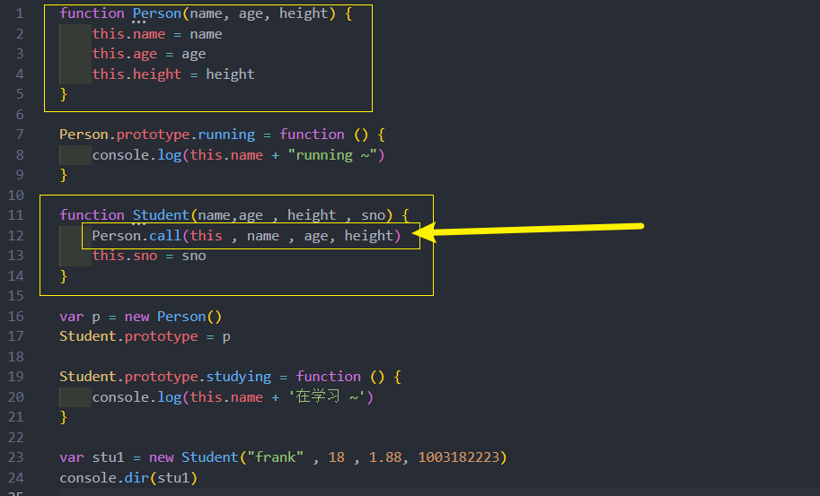

# 面向对象 - 继承
## 面向对象的特性 – 继承
面向对象有三大特性：封装、继承、多态
* 封装：我们前面将属性和方法封装到一个类中，可以称之为封装的过程；
* 继承：继承是面向对象中非常重要的，不仅仅可以减少重复代码的数量，也是多态前提（纯面向对象中）；
* 多态：不同的对象在执行时表现出不同的形态

那么**继承**是做什么? 

* 继承可以帮助我们将重复的代码和逻辑抽取到父类中，子类只需要直接继承过来使用即可

先了解一下**原型链** , 再利用原型链的机制实现一下继承
## JavaScript 原型链 
从一个对象上获取属性，如果在当前对象中没有获取到就会去它的原型上面获取

## Object 的原型

* 一 ：该对象有原型属性，但是它的原型属性已经指向的是null，也就是已经是顶层原型了；
* 二 ：该对象上有很多默认的属性和方法(都不可枚举)；

## Object 是所有类的父类
原型链最顶层的原型对象就是 Object 的原型对象

## 通过原型链实现继承
其黄色圈位置不可以调整顺序 , 否则会有问题

但是目前有一个很大的弊端：某些属性其实是保存在 p 对象上的
* 第一，我们通过直接打印对象是看不到这个属性的
* 第二，这个属性会被多个对象共享，如果这个对象是一个引用类型，那么就会造成问题
* 第三，不能给 Person 传递参数，因为这个对象是一次性创建的（没办法定制化）

## 借用构造函数继承
借用继承的做法非常简单：在子类型构造函数的内部调用父类型构造函数
* 因为函数可以在任意的时刻被调用；
* 因此通过 apply() 和 call() 方法也可以在新创建的对象上执行构造函数

new Student()时的this 显示绑定 Person 调用 , 这属于很普通的函数调用

这个方法也有弊端:
* 第一个弊端: Person函数至少被调用了两次 
* 第二个弊端: stu的原型对象上多来没必要的属性(因为在上面 new Person() 没传递参数调用了一次)

## 原型式继承函数
原型式继承的渊源
* 这种模式要从道格拉斯·克罗克福德（Douglas Crockford，著名的前端大师，JSON的创立者）在2006年写的
一篇文章说起: Prototypal Inheritance in JavaScript(在JS中使用原型式继承)
* 在这篇文章中，它介绍了一种继承方法，而且这种继承方法不是通过构造函数来实现的

实现函数 : 把一个对象作为新创建出来的对象的原型(隐式原型)

## 寄生式继承函数
寄生式(Parasitic)继承
* 寄生式(Parasitic)继承是与原型式继承紧密相关的一种思想, 并且同样由道格拉斯·克罗克福德(Douglas 
Crockford)提出和推广的
* 寄生式继承的思路是结合原型类继承和工厂模式的一种方式
* 即创建一个封装继承过程的函数, 该函数在内部以某种方式来增强对象，最后再将这个对象返回

## 寄生组合式继承 (最终版)
现在回顾一下之前提出的比较理想的组合继承
* 组合继承是比较理想的继承方式, 但是存在两个问题:
* 问题一: 构造函数会被调用两次: 一次在创建子类型原型对象的时候, 一次在创建子类型实例的时候.
* 问题二: 父类型中的属性会有两份: 一份在原型对象中, 一份在子类型实例中.

事实上, 我们现在可以利用寄生式继承将这两个问题给解决掉.
* 你需要先明确一点: 当我们在子类型的构造函数中调用父类型.call(this, 参数)这个函数的时候, 就会将父类型中
的属性和方法复制一份到了子类型中. 所以父类型本身里面的内容, 我们不再需要.
* 这个时候, 我们还需要获取到一份父类型的原型对象中的属性和方法

进行封装

但 **Object.create()** 太新 , 利用最早的寄生式

### 最终版

