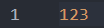
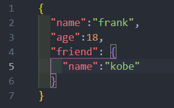
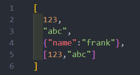
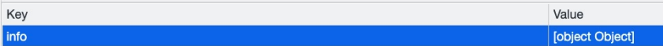
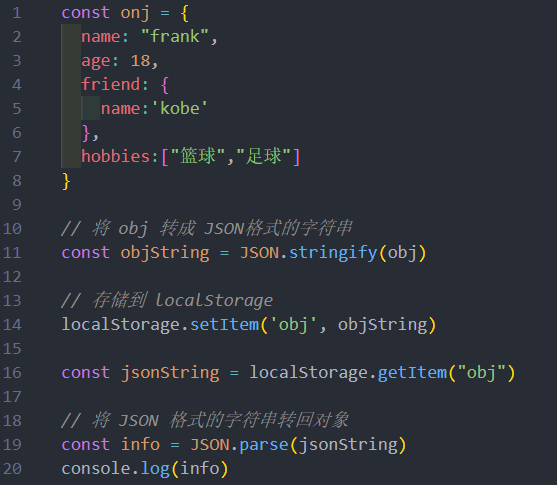
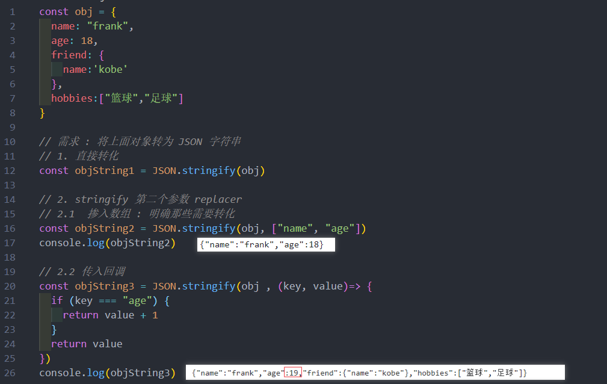
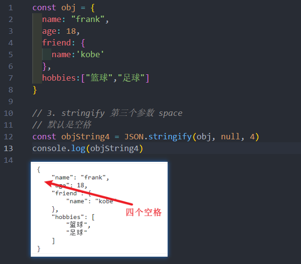
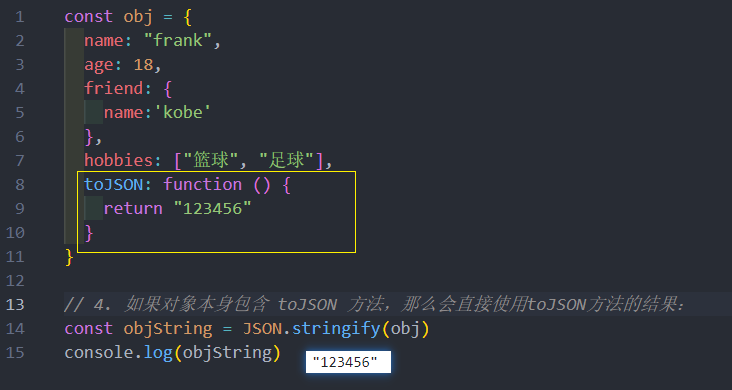
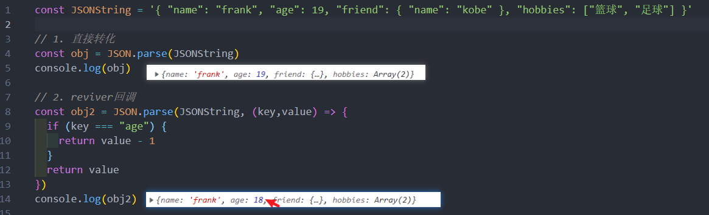
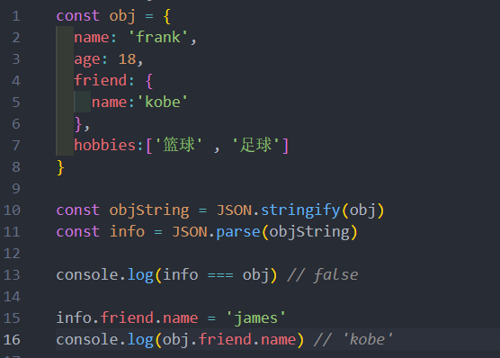

# JSON
在目前的开发中，JSON 是一种非常重要的**数据格式**，它并**不是编程语言**，而是一种可以在服务器和客户端之间传输的数据格式。

JSON 的全称是 JavaScript Object Notation（JavaScript对象符号）
* JSON 是由 Douglas Crockford 构想和设计的一种轻量级资料交换格式，算是 JavaScript 的一个子集
* 但是虽然 JSON 被提出来的时候是主要应用 JavaScript 中，但是目前已经独立于编程语言，可以在各个编程语言中使用
* 很多编程语言都实现了将 JSON 转成对应模型的方式

其他的传输格式：
* XML：在早期的网络传输中主要是使用XML来进行数据交换的，但是这种格式在解析、传输等各方面都弱于JSON，所以目前已经很
少在被使用了；
* Protobuf：另外一个在网络传输中目前已经越来越多使用的传输格式是protobuf，但是直到2021年的3.x版本才支持JavaScript，所
以目前在前端使用的较少

目前 JSON 被使用的场景也越来越多：
* **网络数据的传输 JSON 数据**
* **项目的某些配置文件**
* 非关系型数据库（NoSQL）将 json 作为存储格式
## JSON 基本语法
JSON 的顶层支持三种类型的值：
* 简单值：数字（Number）、字符串（String，不支持单引号）、布尔类型（Boolean）、null 类型；
* 对象值：由 key、value 组成，key 是字符串类型，并且必须添加双引号，值可以是简单值、对象值、数组值；
* 数组值：数组的值可以是简单值、对象值、数组值；

## JSON 序列化 
某些情况下我们希望将 JavaScript 中的复杂类型转化成 JSON 格式的字符串，这样方便对其进行处理：
* 比如希望将一个对象保存到 localStorage 中；
* 但是如果直接存放一个对象，这个对象会被转化成 [object Object] 格式的字符串，并不是我们想要的结果；

### JSON 序列化方法
在 ES5 中引用了 JSON 全局对象，该对象有两个常用的方法：
* **stringify 方法**：将 JavaScript 类型转成对应的 JSON 字符串；
* **parse 方法**：解析 JSON 字符串，转回对应的 JavaScript 类型；

### Stringify 的参数 - replace
JSON.stringify() 方法将一个 JavaScript 对象或值转换为 JSON 字符串：
* 如果指定了一个 replacer 函数，则可以选择性地替换值；
* 如果指定的 replacer 是数组，则可选择性地仅包含数组指定的属性；

### Stringify 的参数 - space
它还可以跟上第三个参数 space：

如果对象本身包含 toJSON 方法，那么会直接使用 toJSON 方法的结果：

### parse 方法 
JSON.parse() 方法用来解析 JSON 字符串，构造由字符串描述的 JavaScript 值或对象。
* 提供可选的 reviver 函数用以在返回之前对所得到的对象执行变换(操作)

## 使用 JSON序列化 深拷贝

注意：这种方法它对函数是无能为力的
* 创建出来的 info 中是没有 foo 函数的，这是因为 stringify 并不会对函数进行处理
* 后面再自己编写一个深拷贝函数总结一下

