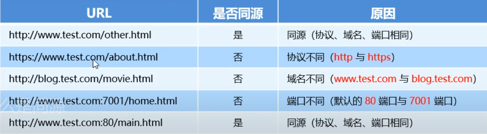
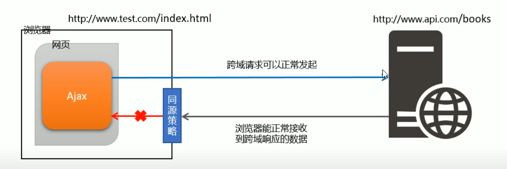

# 跨域
## 同源策略
1. 什么是同源? 

如果两个页面的**协议**, **域名**, **端口**都相同, 则两个页面具有相同的源

比如, 相对于 http://www.test/com/index.html 页面的同源检测

2. 什么是**同源策略**? 

*同源策略是**浏览器**提供的一个**安全功能***

*浏览器规定, A 网站的 JavaScript, 不允许和**非同源**的网站 C 之间, 进行资源的交互* 例如:
* 无法读取非同源网页的 Cookie, LocalStorage, indexDB
* 无法接触非同源网页的 DOM
* 无法向非同源底子发送 Ajax 请求

## 跨域
什么是**跨域** ? 

**同源**指的是两个URL的协议, 玉米螟, 端口一致, 反之, 则是**跨域**

出现跨域的根本原因: **浏览器的同源策略**不允许非同源的 URL 之间进行资源的交互

### 浏览器对跨域请求的拦截

注意: 浏览器是允许发起跨域请求, 但是, 跨域请求回来的数据, 会被浏览器拦截, 无法被页面获取到 ! 

### 如何实现跨域数据请求

主要的两种解决方案 JSONP 和 CORS

* JSONP: 出现的早, 兼容性好(兼容低版本IE) 是前端程序员被迫想出来的一种临时解决方案. 缺点是只支持 GET 请求, 不支持 POST 请求

* CORS: 出现的较晚, 属于跨域 Ajax 请求的根本解决方案, 支持 GET 和 POST 请求, 缺点是不兼容低版本浏览器
## JSONP

