# 面向对象 - 类
按照前面的构造函数形式创建 类，不仅仅和编写普通的函数过于相似，而且代码并不容易理解。
* 在 ES6（ECMAScript2015）新的标准中使用了 class 关键字来直接定义类
* 但是类本质上依然是前面所讲的构造函数、原型链的**语法糖**而已
* 所以学好了前面的构造函数、原型链更有利于我们理解类的概念和继承关系

如何使用 class 来定义一个类呢？
* 可以使用两种方式来声明类：类声明和类表达式

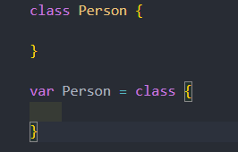
## 类和构造函数的异同
类和我们的构造函数的特性其实是一致的
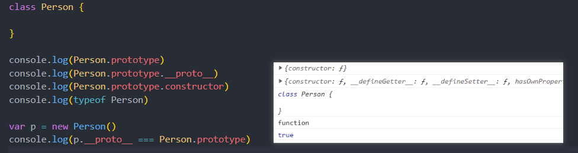

## 类的构造函数
* 每个类都可以有一个自己的构造函数（方法），这个方法的名称是固定的constructor；
* 当我们通过new操作符，操作一个类的时候会调用这个类的构造函数constructor；
* 每个类只能有一个构造函数，如果包含多个构造函数，那么会抛出异常；

当我们通过new关键字操作类的时候，会调用这个 constructor 函数，并且执行如下操作：
* 1.在内存中创建一个新的对象（空对象）；
* 2.这个对象内部的 [[prototype]] 属性会被赋值为该类的 prototype 属性；
* 3.构造函数内部的 this，会指向创建出来的新对象；
* 4.执行构造函数的内部代码（函数体代码）；
* 5.如果构造函数没有返回非空对象，则返回创建出来的新对象；

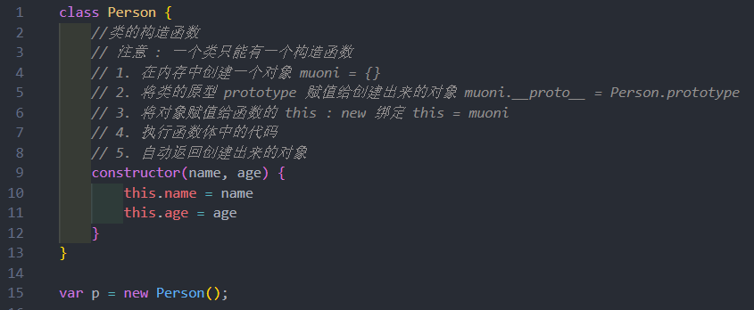
## 类的实例方法
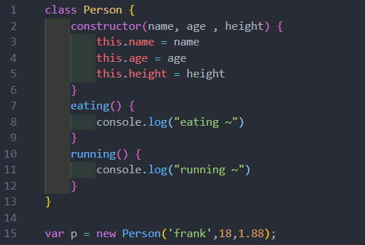
## 累的访问器方法
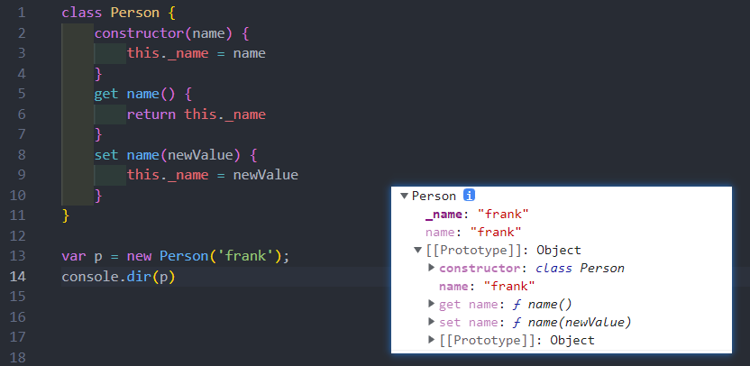
## 类的静态方法
静态方法通常用于定义**直接使用类来执行的方法**，**不需要**有类的实例，使用 **static 关键字**来定义
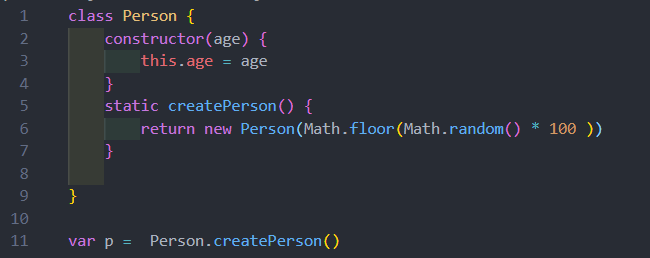
## ES6类的继承 
### extends
在ES6中新增了使用 **extends 关键字**，可以方便的帮助我们实现继承
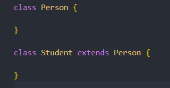
### super 关键字 
这个 super 关键字有不同的使用方式：
* 注意：在子（派生）类的构造函数中使用 this 或者返回默认对象之前，必须**先通过super调用父类的构造函数**
* super 的使用位置有三个：子类的构造函数、实例方法、静态方法
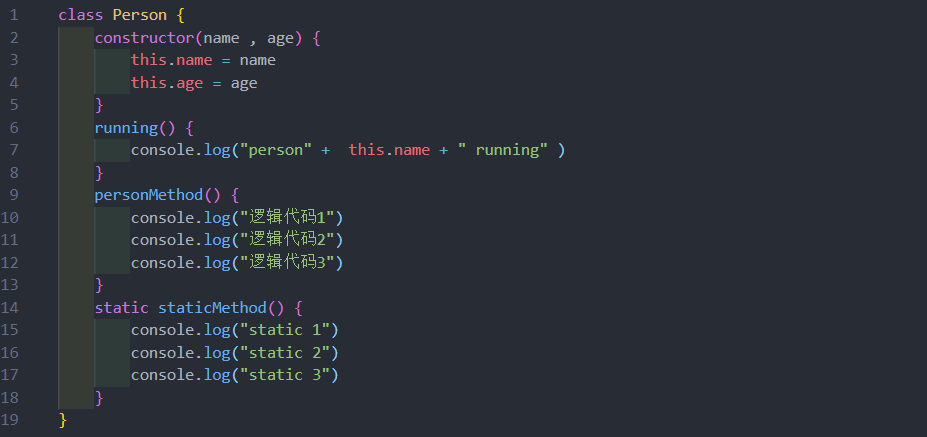
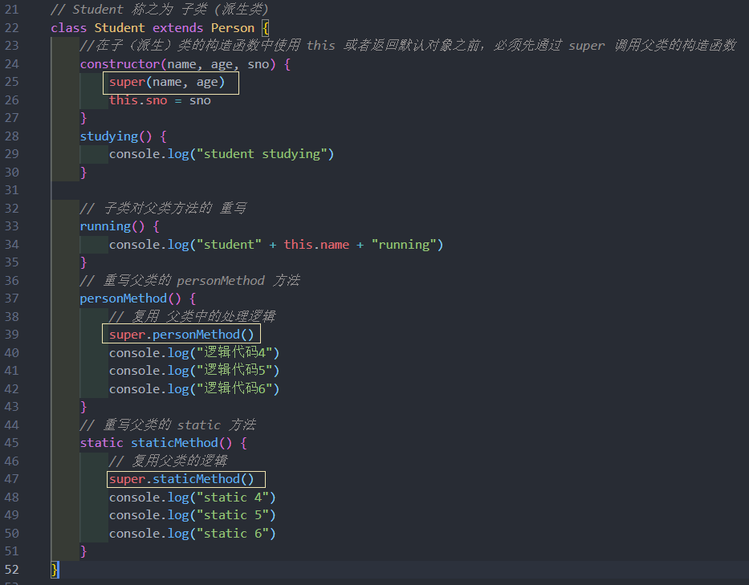
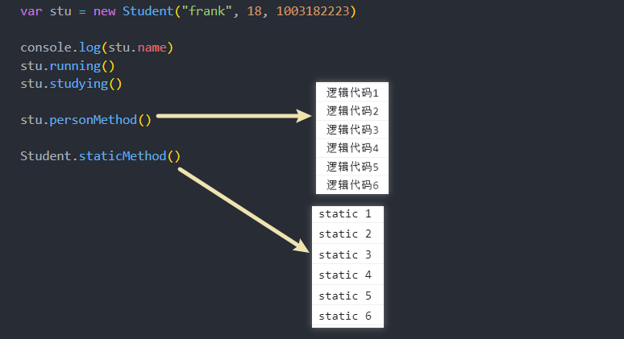
## 继承内置类
可以让我们的类继承自内置类，比如 Array
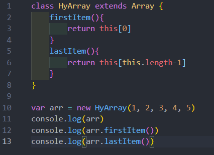
## 类的混入mixin
javaScript的类只支持单继承：也就是只能有一个父类
* 那么在开发中需要在一个类中添加更多相似的功能时，应该如何来做呢？
* 这个时候我们可以使用混入（mixin）

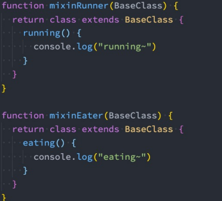
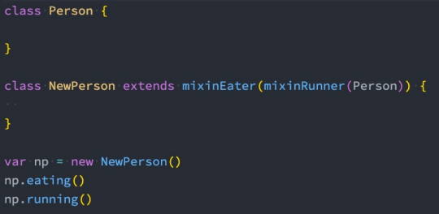

