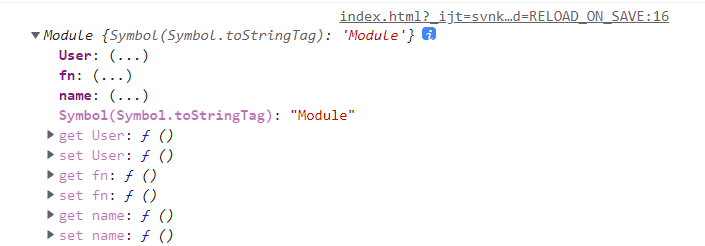
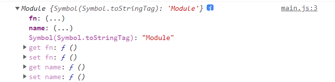

# 模块
## 导入导出
ES6使用基于文件的模块，即一个文件一个模块。

* 使用 `export` 将开发的接口导出
* 使用 `import` 导入模块接口
* 使用 `*` 可以导入全部模块接口

导出是以引用方式导出，无论是标量还是对象，即模块内部变量发生变化将影响已经导入的变量
### 导出模块
下面定义模块 `modules/module.js` ，使用 `export` 导出模块接口，没有导出的变量都是模块私有的
```js
export const name = "frank";
export const fn = function() {
  return "is a module function";
};
export class User {
  show() {
    console.log("user.show");
  }
}
```
也可以这么导出
```js{11}
const name = "frank";
const fn = function() {
    return "is a module function";
};
class User {
    show() {
        console.log("user.show");
    }
}

export {name, fn , User}
```
### 具名导入
导入上面定义的`module.js` , 分别导入内容
```js
import {name , fn , User} from './module.js';
console.log(name)
fn()
const user = new User()
```
像下面这样在 `{}` 中导入是错误的，模块默认是在顶层静态导入，这是为了分析使用的模块方便打包
```js
if (true) {
  import { name ,  fn } from "./hd.js";     // Error
}
```
### 批量导入
尽量不用这种方法 , 建议用上面的具名导入

如果要导入的内容比较多，可以使用 `*` 来批量导入
```js
import * as api from "./module.js";
console.log(api)
console.log(api.name)
```

## 别名使用 as
可以为导入的模块重新命名

* 有些导出的模块命名过长，起别名可以理简洁
* 本模块与导入模块重名时，可以通过起别名防止错误
### 导出别名
模块导入使用 `as` 对接口重命名 
```js
  import { User as user, fn as action, site as name } from "./module.js";
  let fn = "函数";
  console.log(name);
  console.log(user);
  console.log(action);
```
### 导出别名
同样可以使用 `as` 别名导出
```js
const name = "frank";
const fn = function() {
    return "is a module function";
};
class User {
    show() {
        console.log("user.show");
    }
}

export {name as xxx, fn as yyy , User as zzz}
```
## 默认导出
很多时候模块知识一个类 , 也就是要导出的内容只有一个的时候 , 可以使用默认导出

使用 `default` 定义默认导出的接口 , 不需要用 `{}`

* 可以为默认导出自定义别名
* 只能有一个默认导出
* 默认导出可以没有命名

### 单一导出
```js
export default class {
  static show() {
    console.log("User.method");
  }
}
```
也可以
```js
class  User {
  static show() {
    console.log("User.method");
  }
}

export  {User as default}
```
导入时 , 解题使用任何名字定义 , 而且不需要 `{}`
```js
import User from './module.js'
```
### 混合导出
模块可以存在默认导出与命名导出
```js
export const name = 'frank'
export default class User {
    static render(){
        console.log("User.render");
    }
}
```
也可以
```js
const name = 'frank'
class User {
    static render(){
        console.log("User.render");
    }
}

export {User as default , name}
```

导入时 , 可以使用一条语句导入默认接口与常规接口
```js
import User , { name } from './module.js
```
如果是批量导入时，记得使用 `default` 获得默认导出
```js
import * as api from './module.js'
console.log(api.name)
api.default.render()
```
### 使用建议
* 不建议使用默认导出，会让开发者导入时随意命名
* 如果使用默认导入最好以模块的文件名有关联，会使用代码更易阅读
```js
import user from "./user.js";
```
## 合并导出
项目的模块比较多，这时可以将所有模块合并到**一个入口文件**中
```
|--user.js
|--admin.js
...
...
|--index.js
```
比如 admin.js 文件: 
```js
const name = 'frank'
const fn = function() {
  console.log("a module function");
};
export { name ,fn }
```
user.js文件:
```js
class User {
  static get(){
      console.log('get user info')
  }
}
export default User  
```
index.js **入口文件**:
```js
export  * as admin from './admin.js'
export  * as user from './user.js'
```
最终使用时 , 
```js
import * as api from './index.js'
console.log(api.admin.name)
console.log(api.user.default)  // 这时候要注意default , 因为user.js是默认导出 
```
## 动态加载模块
使用 `import` 必须在顶层静态导入模块，而使用 `import()` 函数可以动态导入模块，它返回一个 `promise` 对象

module.js
```js
const name = 'frank'
const fn = function(){
  console.log('hello')
}
export { name , fn }
```
使用 `import()` 函数可以动态导入，实现按需加载
```js
if(true) {
  import('./module.js').then(module=>{   // 这里可以使用解构  ( {name , fn} )=>{ }
    console.log(module)
  }))
}
```

点击事件发生后按需要加载模块
```js
const button  = document.querySelector('button')
button.addEventListener('click' , ()=>{
    let hd = import("./module.js").then(({ name, fn }) => {  //解构
        console.log(name);
    });
})
```

