# 模块化
## 模块化的历史
在网页开发的早期，Brendan Eich 开发 JavaScript 仅仅作为一种**脚本语言**，做一些简单的表单验证或动画实现等，那个时
候代码还是很少的：
* 这个时候我们只需要讲JavaScript代码写到 **`<script>`标签**中即可；
* 并没有必要放到多个文件中来编写；甚至流行：通常来说 JavaScript 程序的长度只有一行。

但是随着前端和 JavaScript 的快速发展，JavaScript 代码变得越来越复杂了：
* ajax 的出现，**前后端开发分离**，意味着后端返回数据后，我们需要通过**JavaScript进行前端页面的渲染**；
* SPA 的出现，前端页面变得更加复杂：包括**前端路由、状态管理**等等一系列复杂的需求需要通过JavaScript来实现；
* 包括Node的实现，JavaScript 编写**复杂的后端程序**，没有模块化是致命的硬伤；

所以，模块化已经是 JavaScript 一个非常迫切的需求：
* 但是 JavaScript 本身，直到**ES6（2015**）才推出了自己的模块化方案；
* 在此之前，为了让 JavaScript 支持模块化，涌现出了很多不同的模块化规范：**AMD、CMD、CommonJS**等；
## 没有模块化带来的问题
早期没有模块化带来了很多的问题：比如命名冲突的问题

当然，有办法可以解决上面的问题：**立即函数调用表达式（IIFE）**
* IIFE (Immediately Invoked Function Expression)

但是，我们其实带来了新的问题：
* 第一，我必须记得**每一个模块中返回对象的命名**，才能在其他模块使用过程中正确的使用；
* 第二，代码写起来**混乱不堪**，每个文件中的代码都需要**包裹在一个匿名函数中来编写**；
* 第三，在**没有合适的规范情况**下，每个人、每个公司都可能会任意命名、甚至出现模块名称相同的情况；

所以，我们会发现，虽然实现了模块化，但是我们的实现过于简单，并且是没有规范的。
* 我们需要制定一定的规范来约束每个人都**按照这个规范去编写模块化的代码**；
* 这个规范中应该包括核心功能：**模块本身可以导出暴露的属性，模块又可以导入自己需要的属性；**
* JavaScript 社区为了解决上面的问题，涌现出**一系列好用的规范**，接下来我们就学习具有代表性的一些规范。
## CommonJS 规范和 Node 关系
我们需要知道 CommonJS 是一个**规范**，最初提出来是在浏览器以外的地方使用，并且当时被命名为 **ServerJS**，后来为了
体现它的广泛性，修改为 **CommonJS**，平时我们也会**简称为CJS**
* Node 是 CommonJS 在服务器端一个具有代表性的实现；
* Browserify 是 CommonJS 在浏览器中的一种实现；
* webpack 打包工具具备对 CommonJS 的支持和转换；

所以，Node 中对 **CommonJS 进行了支持和实现**，让我们在开发 node 的过程中可以方便的进行模块化开发：
* **在Node中*每一个js文件都是一个单独的模块；***
* 这个模块中包括 **CommonJS 规范的核心变量**：exports、module.exports、require；
* 我们可以使用这些变量来方便的进行**模块化开发**；

前面我们提到过模块化的核心是导出和导入，Node 中对其进行了实现：
*  exports 和 module.exports 可以负责**对模块中的内容进行导出**；
*  require 函数可以帮助我们**导入其他模块（自定义模块、系统模块、第三方库模块）**中的内容；
## 模块化案例
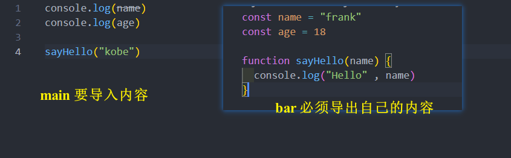
## exports 导出
**注意：exports 是一个对象，我们可以在这个对象中添加很多个属性，添加的属性会导出**

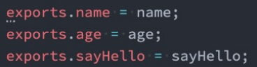

**另外一个文件中可以导入：**

理解下面这句话，Node 中的模块化一目了然 :
* **意味着 main 中的 bar 变量等于 exports 对象**
* 也就是 require 通过各种查找方式，最终找到了 exports 这个对象；
* 并且将这个 exports 对象赋值给了 bar 变量；
* bar 变量就是 exports 对象了

## module.exports 导出
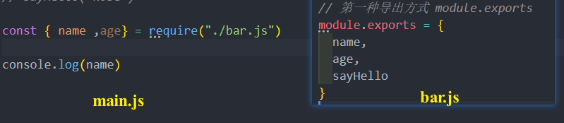

**module.exports 和 exports 有什么关系或者区别 ??**
* CommonJS 中是没有 module.exports 的概念的；
* 为了实现模块的导出，Node 中使用的是 Module 的类，每一个模块都是Module的一个实例，也就是
module；
* 所以在 Node 中真正用于导出的其实根本不是 exports ，而是 module.exports
* 因为 module 才是导出的真正实现者；

但是，为什么 exports 也可以导出呢？
* 这是因为 module 对象的 exports 属性是 exports 对象的一个引用；
* 也就是说 module.exports = exports = main 中的 bar；

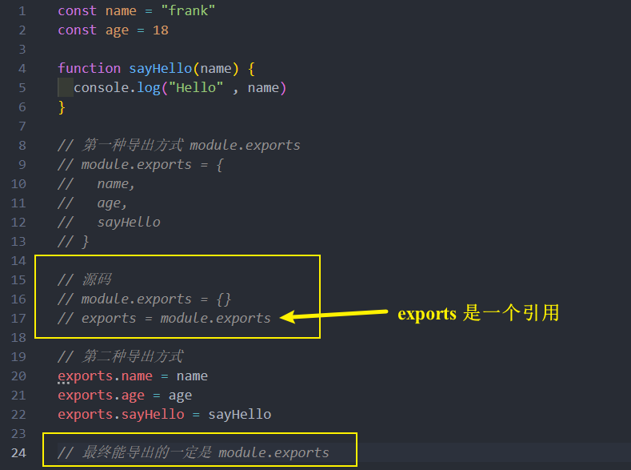
####  改下代码思考一下
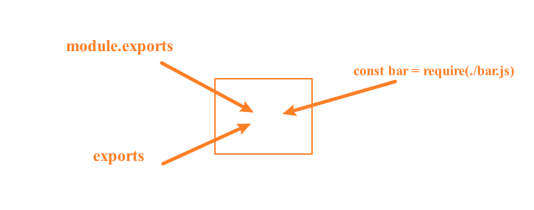
这里从几个方面来研究修改代码发生了什么？
* 1.在三者项目引用的情况下，修改 exports 中的 name 属性到底发生了什么？
* 2.在三者引用的情况下，修改了 main 中的 bar 的 name 属性，在bar 模块中会发生什么？
* 3.如果 module.exports 不再引用 exports 对象了，那么修改 export 还有意义吗？
## require 细节
**require 是一个函数**，可以帮助我们引入一个文件（模块）中导出的对象

**总结比较常见的查找规则**：导入格式如下：require(X)

**情况一**：X是一个Node核心模块，比如path、http
* 直接返回核心模块，并且停止查找

**情况二**：X 是以 ./ 或 ../ 或 /（根目录）开头的
* 第一步：将 X 当做一个文件在对应的目录下查找；
  * 1.如果有后缀名，按照后缀名的格式查找对应的文件
* 2.如果没有后缀名，会按照如下顺序：
  * 1> 直接查找文件 X
  * 2> 查找 X.js 文件
  * 3> 查找 X.json 文件
  * 4> 查找 X.node 文件

第二步：没有找到对应的文件，将 X 作为一个目录
 * 查找目录下面的 index 文件
  * 1> 查找 X/index.js 文件
  * 2> 查找 X/index.json 文件
  * 3> 查找 X/index.node 文件

如果没有找到，那么报错：not found

**情况三**：直接是一个X（没有路径），并且X不是一个核心模块
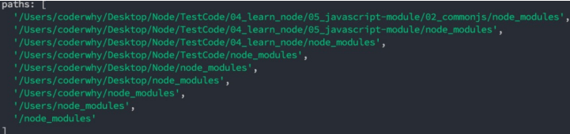

如果上面的路径中都没有找到，那么报错：not found
## 模块加载过程
* **结论一 ：模块在被第一次引入时，模块中的 js 代码会被运行一次**

* **结论二：模块被多次引入时，会缓存，最终只加载（运行）一次**
  * 为什么只会加载运行一次呢？
  * 这是因为每个模块对象 module 都有一个属性：loaded。
  * 为 false 表示还没有加载，为 true 表示已经加载；

* 结论三：如果有循环引入，那么加载顺序是什么？

如果出现图模块的引用关系，那么加载顺序是什么呢？

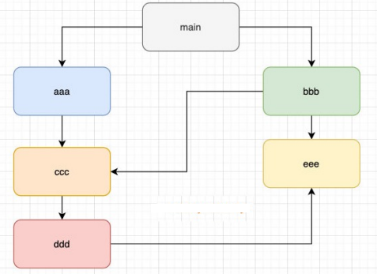
* 这个其实是一种数据结构：图结构；
* 图结构在遍历的过程中，有深度优先搜索（DFS, depth first search）和广度优先搜索（BFS, breadth first search）；
* Node采用的是深度优先算法：main -> aaa -> ccc -> ddd -> eee ->bbb
## CommonJS 规范缺点
*CommonJS 加载模块是同步的：*
* 同步的意味着只有**等到对应的模块加载完毕**，**当前模块中的内容才能被运行**；
* 这个在服务器不会有什么问题，因为**服务器加载的js文件都是本地文件**，加载速度非常快；

*如果将它应用于浏览器呢？*
* 浏览器**加载js文件需要先从服务器将文件下载下来**，之后**再加载运行**；
* 那么采用**同步的就意味着后续的js代码都无法正常运行**，即使是**一些简单的 DOM  操作**；

*所以在浏览器中，我们通常不使用CommonJS规范：*
* 当然在 webpack 中使用 CommonJS 是另外一回事；
* 因为它会将我们的代码转成浏览器可以直接执行的代码；

*在早期为了可以在浏览器中使用模块化，通常会采用AMD或CMD：*
* 但是目前一方面现代的浏览器**已经支持ES Modules**，另一方面借助于 webpack 等工具可以**实现对CommonJS或者ES Module代码的转换**；
* **AMD 和 CMD 已经使用非常少了**，所以这里我们进行简单的演练

## AMD 规范
AMD主要是应用于浏览器的一种模块化规范：
* AMD 是 Asynchronous Module Definition（异步模块定义）的缩写；
* 它采用的是**异步加载模块**；
* 事实上 AMD 的规范还要早于 CommonJS，但是 CommonJS 目前依然在被使用，而 AMD 使用的较少了；

规范只是定义代码的应该如何去编写，只有有了具体的实现才能被应用：
* AMD 实现的比较常用的库是 require.js 和 curl.js；
## CMD 规范
CMD规范也是应用于浏览器的一种模块化规范：
* CMD 是Common Module Definition（通用模块定义）的缩写；
* 它也采用了异步加载模块，但是它将CommonJS的优点吸收了过来；
* 但是目前CMD使用也非常少了；

CMD也有自己比较优秀的实现方案：
* SeaJS

## ES Module 
ES Module 和 CommonJS 的模块化有一些不同之处：
* 一方面它使用了 import 和 export 关键字；
* 另一方面它采用编译期的静态分析，并且也加入了动态引用的方式；

ES Module 模块采用 export 和 import 关键字来实现模块化：
* export 负责将模块内的内容导出；
* import 负责从其他模块导入内容；

了解：采用 ES Module 将自动采用严格模式：**use strict**
### export 关键字
export 关键字将一个模块中的变量、函数、类等导出

* 方式一：在语句声明的前面直接加上 export 关键字
* 方式二：将所有需要导出的标识符，放到 export 后面的 {}中
  * 注意：这里的 {} 里面不是ES6的对象字面量的增强写法，{}也不是表示一个对象的；
  * 所以： export {name: name}，是错误的写法；
* 方式三：导出时给标识符起一个别名

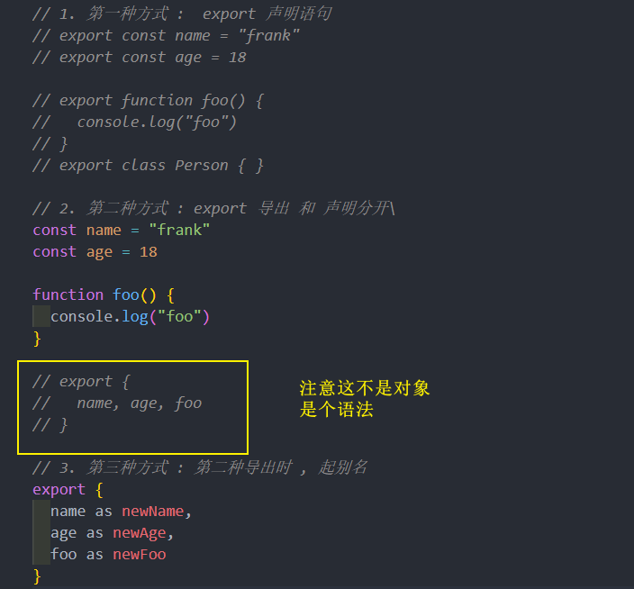
### import 关键字 
导入内容的方式也有多种：
* 方式一：import { 标识符列表 } from '模块'；
  * 注意：这里的 {} 也不是一个对象，里面只是存放导入的标识符列表内容；
* 方式二：导入时给标识符起别名
* 方式三：通过 * 将模块功能放到一个模块功能对象（a module object）上

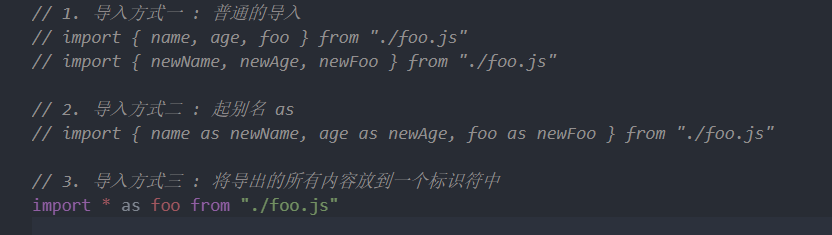
### export 和 import 结合使用
补充：export 和 import 可以结合使用

为什么要这样做呢？
* 在开发和封装一个功能库时，通常我们希望将暴露的所有接口放到一个文件中；
* 这样方便指定统一的接口规范，也方便阅读；
* 这个时候，我们就可以使用 export 和 import 结合使用

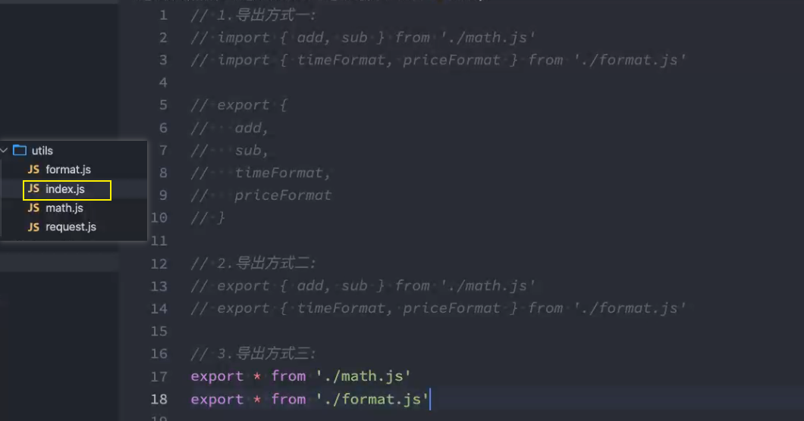
### default 用法
前面的导出功能都是有名字的导出（named exports）：
* 在导出 export 时指定了名字；
* 在导入 import 时需要知道具体的名字；

还有一种导出叫做默认导出（default export）
* 默认导出 export 时可以不需要指定名字；
* 在导入时不需要使用 {}，并且可以自己来指定名字；
* 它也方便我们和现有的 CommonJS 等规范相互操作；

注意：在一个模块中，**只能有一个**默认导出（default export）；
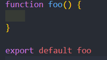
### import 函数
通过 import 加载一个模块，是不可以在其放到逻辑代码中的，比如：

为什么会出现这个情况呢？
* 这是因为ES Module在被JS引擎解析时，就必须知道它的依赖关系；
* 由于这个时候js代码没有任何的运行，所以无法在进行类似于if判断中根据代码的执行情况；
* 甚至下面的这种写法也是错误的：因为我们必须到运行时能确定path的值；

但是某些情况下，我们确确实实希望动态的来加载某一个模块：
* 如果根据不同的条件，动态来选择加载模块的路径；
* 这个时候我们需要使用 import() 函数来动态加载；

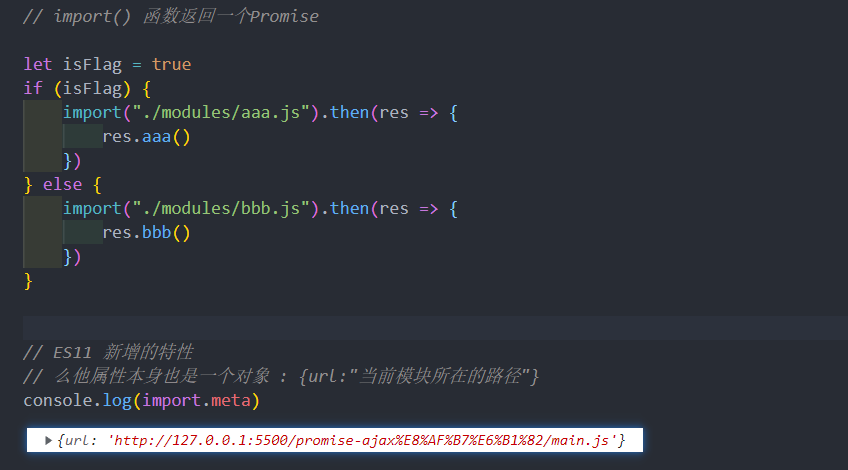
### import.meta 
import.meta ( 上面的图中 )是一个给 JavaScript 模块暴露特定上下文的元数据属性的对象。
* 它包含了这个模块的信息，比如说这个模块的URL；
* 在ES11（ES2020）中新增的特性；
### ESM 和 CJS 对比
CommonJS 导出的是值得拷贝 , ESM 导出的是值得引用

CommonJS 能导出一个对象 , ESM 可以到处多个值

CommonJS 是同步加载 , ESM 是异步加载

