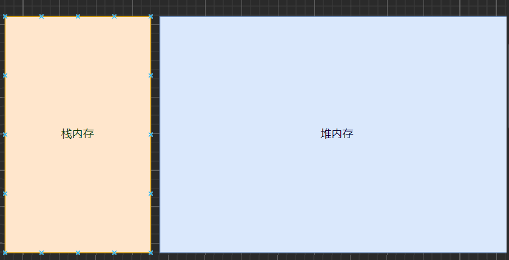
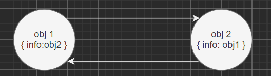
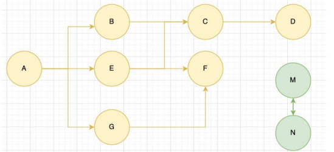

# JS 的内存管理
## JS 的内存管理
Javascript会在定义变量时为我们分配内存 
* JS 对**基本数据类型内存的分配**会在执行时, 直接在**栈空间**进行分配
* JS 对于**复杂数据类型内存的分配**会在**堆内存**中开辟一块空间，并且将这块空间的指针返回值变量引用

## JS 的垃圾回收
因为**内存的大小是有限**的，所以当**内存不再需要的时候**，我们需要**对其进行释放**，以便腾出**更多的内存空间**

* 垃圾回收的英文是 `Garbage Collection`，简称 **GC**
* 对于那些不再使用的对象，都称之为是垃圾，它需要被回收，以释放更多的内存空间

### 常见的 GC 算法 - 引用计数
引用计数：
* 当一个对象有一个引用指向它时，那么这个对象的引用就 **+1**

  当一个对象的引用为 0 时，这个对象就可以被销毁掉
* 这个算法有一个很大的**弊端**就是会产生**循环引用**

### 常见的 GC 算法 – 标记清除
标记清除：
* 这个算法是设置一个根对象（root object），垃圾回收器会定期从这个根开始，找所有从根开始有引用到的对象，对
于哪些没有引用到的对象，就认为是不可用的对象
* 这个算法可以很好的解决循环引用的问题

