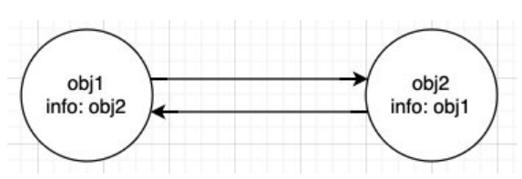
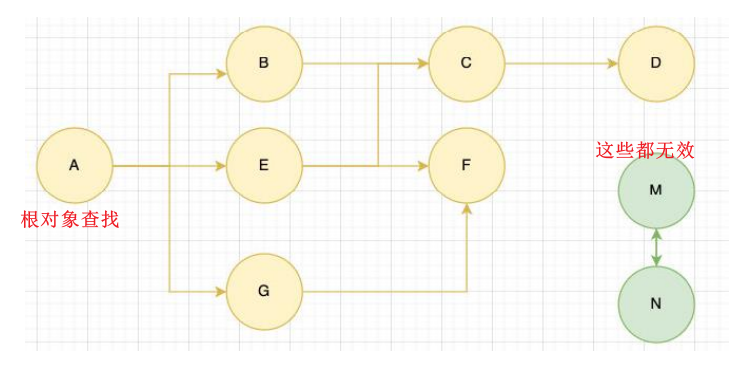

# JS 的内存管理 , 闭包
对于开发者来说，`JavaScript` 的内存管理是自动的、无形的。
* 我们创建的**原始值、对象、函数……这一切都会占用内存**；
* 但是我们**并不需要手动来对它们进行管理，JavaScript引擎**会帮助我们处理好它

垃圾回收的英文是Garbage Collection，简称 `GC`；

是这里又出现了另外一个很关键的问题：**GC 怎么知道哪些对象是不再使用的呢**？
* 这里就要用到GC的实现以及对应的算法

## 常见的 GC 算法 – 引用计数（Reference counting）了解
引用计数：
* 当一个对象有一个引用指向它时，那么这个对象的引用就+1；
* 当一个对象的引用为0时，这个对象就可以被销毁掉；

这个算法有一个很大的弊端就是会产生循环引用；

## 常见的GC算法 – 标记清除（mark-Sweep）
标记清除的核心思路是**可达性**（Reachability）
* 这个算法是设置一个**根对象**（root object），垃圾回收器会定期从这个根开始，找所有从根开始有引用到的对象，对于哪些
没有引用到的对象，就认为是不可用的对象；
* 这个算法可以很好的解决循环引用的问题；

在 js 引擎找这个根对象就是 `window 对象`, 也可认为是`GO(Global object)`

## 闭包的定义
来看一下MDN对JavaScript闭包的解释：
* 一个函数和对其周围状态（lexical environment，词法环境）的引用捆绑在一起（或者说函数被引用包围），这样的组合就是闭包（closure）；
* 也就是说，闭包让你可以在一个内层函数中访问到其外层函数的作用域；
* 在 JavaScript 中，每当创建一个函数，闭包就会在函数创建的同时被创建出来；

那么我的理解和总结：
* 一个普通的函数function，如果它可以访问外层作用域的自由变量，那么这个函数和周围环境就是一个闭包；
* **从广义的角度来说：JavaScrip t中的函数都是闭包；**
* **从狭义的角度来说：JavaScript 中一个函数，如果访问了外层作用域的变量，那么它是一个闭包**

