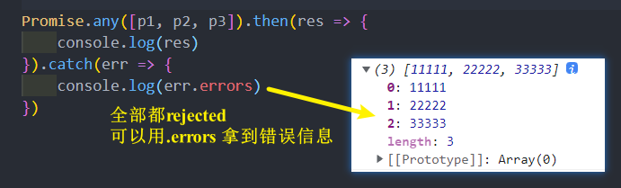

# Promise
看一下Promise的API是怎么样的：

Promise 是一个类，可以翻译成 承诺、许诺
* 当我们需要给予调用者一个承诺：待会儿我会给你回调数据时，就可以创建一个 Promise 的对象；
* 在通过 new 创建 Promise 对象时，我们需要传入一个回调函数，我们称之为 executor
  * 这个回调函数会被立即执行，并且给传入另外两个回调函数resolve、reject
  * 当我们调用 resolve 回调函数时，会执行 Promise 对象的 then 方法传入的回调函数
  * 当我们调用 reject 回调函数时，会执行 Promise 对象的 catch 方法传入的回调函数

## Promise 的代码结构
Promise使用过程，可以将它划分成**三个状态**：
* **待定（pending）**: 初始状态，既没有被兑现，也没有被拒绝；
  * 当执行 executor 中的代码时，处于该状态；
* **已兑现（fulfilled）**: 意味着操作成功完成；
  * 执行了 resolve 时，处于该状态；
* **已拒绝（rejected）**: 意味着操作失败；
  * 执行了 reject 时，处于该状态

## Executor
Executor 是在创建 Promise 时需要传入的一个**回调函数**，这个回调函数**会被立即执行**，并且传入两个参数：

* 通常会在 Executor 中确定我们的 Promise 状态：
  * 通过 resolve，可以兑现（fulfilled）Promise的状态，我们也可以称之为已决议（resolved）；
  * 通过reject，可以拒绝（reject）Promise的状态；
* 这里需要注意：一旦状态被确定下来，Promise 的状态会被 **锁死**，该 **Promise 的状态是不可更改的**
  * 在我们调用 resolve 的时候，如果 resolve传入的值本身不是一个Promise，那么会将该Promise的状态变成 兑
现（fulfilled）；
  * 在之后我们去调用 reject 时 ，已经不会有任何的响应了（并不是这行代码不会执行，**而是无法改变Promise状态**）

## resolve 不同值的区别
* 情况一：如果 resolve **传入一个普通的值或者对象**，那么这个值会作为then回调的参数；
* 情况二：如果 resolve 中**传入的是另外一个  Promise**，那么这个新Promise会决定原Promise的状态：
* 情况三：如果 resolve 中**传入的是一个对象，并且这个对象有实现 then 方法**，那么会执行该then方法，并且根据
then方法的结果来决定 Promise 的状态：

## then方法 – 接受两个参数
then 方法是 **Promise对象**上的一个方法：它其实是放在 Promise 的原型上的 **Promise.prototype.then**

then 方法接受两个参数：
* fulfilled 的回调函数：当状态变成 fulfilled 时会回调的函数；
* reject 的回调函数：当状态变成 reject 时会回调的函数

## then 方法 - 多次调用
一个 Promise 的 then 方法是可以**被多次调用**的
* 每次调用我们都可以传入对应的 fulfilled 回调；
* 当 Promise 的状态变成 fulfilled 的时候，这些回调函数都会被执行

## then方法 - 返回值 , 链式调用
then 方法本身是有返回值的，它的**返回值是一个新的Promise**，所以可以进行如下的**链式调用**：
* 但是 then 方法返回的 Promise 到底处于什么样的状态？

Promise 有三种状态，那么这个 Promise 处于什么状态呢？
* 当 then 方法中的回调函数本身在执行的时候，那么它处于 pending 状态；
* 当 then 方法中的回调函数返回一个结果时，那么它处于 fulfilled 状态，并且会将结果作为 resolve 的参数；
  * 情况一：**返回一个普通的值**
  * 情况二：**返回一个 Promise**
  * 情况三：**返回一个 thenable 值**

当 then 方法抛出一个异常时，那么它处于reject状态；

## catch 方法 - 基本使用

## catch方法 – 多次调用
catch 方法也是 Promise 对象上的一个方法：它也是放在 Promise 的原型上的 Promise.prototype.catch

一个 Promise 的 catch 方法是可以被多次调用的：
* 每次调用我们都可以传入对应的 reject 回调；
* 当Promise 的状态变成 reject 的时候，这些回调函数都会被执行；

## catch方法 - 返回值
事实上 catch 方法也是会返回一个 Promise对象的，所以 catch 方法后面可以继续调用 then 方法或者 catch 方法：
* catch 传入的回调在执行完后，**默认状态依然会是fulfilled**的； 

## finally 方法
finally 是在ES9（ES2018）中新增的一个特性：表示无论Promise对象无论变成fulfilled还是reject状态，**最终都会被执行的代码**

finally 方法是不接收参数的，因为无论前面是 fulfilled 状态，还是reject状态，它都会执行

## resolve 方法 
前面总结的 then、catch、finally 方法都属于 Promise 的**实例方法**，都是存放在Promise的prototype上的。
* 现在总结一下 Promise 的**类方法**

有时候我们已经有一个现成的内容了，希望将其转成 Promise 来使用，这个时候可以使用 Promise.resolve 方法来完成

Promise.resolve的用法相当于 new Promise，并且执行 resolve 操作

resolve参数的形态：
* 情况一：参数是一个普通的值或者对象
* 情况二：参数本身是 Promise
* 情况三：参数是一个 thenable
## reject 方法
* reject方法类似于resolve方法，只是会将Promise对象的状态设置为reject状态
* Promise.reject 的用法相当于 new Promise，只是会调用 reject
* **注意**: Promise.reject 传入的参数**无论是什么形态**，都会直接作为 reject 状态的参数传递到 catch 的
## all 方法 
另外一个类方法是 Promise.all：
* 它的作用是将多个 Promise 包裹在一起形成一个新的Promise；
* 新的Promise状态由包裹的所有Promise共同决定：
  * 当所有的 Promise 状态变成 fulfilled 状态时，新的 Promise 状态为 fulfilled，并且会将所有 Promise 的返回值组成一个数组；
  * 当有一个 Promise 状态为 reject时，新的 Promise 状态为 reject，并且会将第一个 reject 的返回值作为参数

## allSettled 方法
all方法有一个缺陷：当有其中一个 Promise 变成 reject 状态时，新Promise就会立即变成对应的reject状态。
* 那么对于 resolved 的，以及依然处于 pending 状态的 Promise，我们是获取不到对应的结果的；
在ES11（ES2020）中，添加了新的 API Promise.allSettled：
* 该方法会在所有的 Promise 都有结果（settled），无论是 fulfilled，还是reject时，才会有最终的状态；
* 并且这个 Promise 的结果一定是 fulfilled 的；

我们来看一下打印的结果：
* allSettled的结果是一个数组，数组中存放着每一个 Promise 的结果，并且是对应一个对象的；
* 这个对象中包含 status 状态，以及对应的 value 值；

## race 方法
如果有一个 Promise 有了结果，我们就希望决定最终新 Promise 的状态，那么可以使用race方法：
* race 是竞技、竞赛的意思，**表示多个 Promise 相互竞争，谁先有结果(不管是 fulfilled 或 rejected)，那么就使用谁的结果**

## any 方法 
any方法是ES12中新增的方法，和race方法是类似的：
* any 方法**会等到一个 fulfilled 状态，才会决定新 Promise 的状态**；
* **如果所有的 Promise 都是 reject 的，那么也会等到所有的 Promise 都变成 rejected 状态**

如果所有的Promise都是reject的，那么会报一个 AggregateError 的错误

