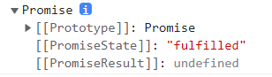

# Promise
## 为什么使用 Promise?
Promise 是 JS 进行异步编程的新的解决方案
为什么用 Promise?

- 指定回调函数的方式更加灵活. 返回`promise`对象,可以给`promise`对象绑定回调函数.
- 支持链式调用,可以解决回调地狱的问题

## 回调地狱和复杂嵌套
### 异步加载图片
```js
function loadImage(src, success, fail) {
  let image = new Image();
  image.src = src;
  image.onload = success(image);
  image.onerror = fail;
}
loadImage(
  "/images/logo.png",
  (image) => {
    console.log("成功了");
    document.body.appendChild(image);
  },
  () => {
    console.log("失败了");
  }
);

console.log("hello");
```
先把主任务完成了之后 , 再来轮询的形式不断遍历任务队列
这里通过**回调**完成了异步操作
#### 用Promise改写
```js
function loadImage(src) {
    return new Promise((resolve, reject) => {
        const image = new Image()
        image.src = src
        image.onload = () => {
            resolve(image)
        }
        image.onerror = () => {
            reject('失败')
        }
    })
}
loadImage('./img.png').then(image => {
    document.body.appendChild(image)
    image.style.border = "10px solid red"
}, reason => {
    console.log(reason)
})
```
### 定时器嵌套

用`setInterval`制作一个可以移动有变化的 div

```css{6}
.box {
    width: 100px;
    height: 100px;
    background: red;
    display: inline-block;
    position: absolute;
}
```

```js
function interval(callback, delay) {
  //声明一个定时器函数
  let id = setInterval(() => {
    callback(id);
  }, delay);
}
interval(function (id) {
  const div = document.querySelector(".box");
  let left = div.getBoundingClientRect().left;
  div.style.left = left + 10 + "px";
  if (left > 200) {
    //当left大于200时clearInterval
    clearInterval(id);
    interval(function (id) {
      //再让宽度减少
      let { width } = div.getBoundingClientRect();
      div.style.width = width - 5 + "px";
      if (width < 50) {
        //当宽度小于50时clearInterval
        clearInterval(id);
      }
    }, 100);
  }
}, 100);
```
#### 用Promise改写
```js{16,26}
function interval(delay=100 , callback) {  //封装
    return new Promise((resolve,reject)=>{
        let id = setInterval(()=>{
            callback(id , resolve)   //把resolve传进去
        }, delay)
    })
}

interval(100 , (id ,resolve)=>{
    const div = document.querySelector(".box");
    let left = div.getBoundingClientRect().left;
    div.style.left = left + 10 + "px";
    if (left > 200) {
        //当left大于200时clearInterval
        clearInterval(id);
        resolve(div)
    }
})
    .then(div =>{
        return interval(100 , (id,resolve)=>{
            let { width } = div.getBoundingClientRect();
            div.style.width = width - 5 + "px";
            if (width < 50) {
                //当宽度小于50时clearInterval
                clearInterval(id);
                resolve(div)
            }
        })
    })
    .then(div => {
      div.style.background = 'green'
    })

```
## 微任务机制
无论是宏任务还是微任务，首先它们都是异步任务。`setTimeout` 和 `Promise` 并不在同一个异步队列中，前者属于宏任务，而后者属于微任务。**先**执行微任务, **后**执行宏任务

```js
setTimeout(() => {
  console.log("setTimeout");
}, 0);
console.log("同步");
// `同步`
// `setTimeout`
```

系统走到这儿当看到`setTimeout`, 就会把它放到**宏任务**队列里面 , **准备**执行。同步任务执行完了之后,才会执行`setTimeout`。也就是同步的优先级最高

```js
new Promise((resolve, reject) => {
  console.log("promise");
});
console.log("同步");
// 'promise'
// '同步'
```

注意: `promise`构造函数里面的代码也是**同步**进行的,先输入'promise', 再输出'同步'。

```js
new Promise((resolve, reject) => {
  resolve();
}).then((value) => console.log("then"));

console.log("同步");
// '同步'
// 'then'
```

只要发了`resolve()`成功通知, 就会把`then`里的任务加到微任务队列里面。微任务队列也是要延迟的,同步的代码先执行后,在循环微任务。所以先输出'同步' , 后打出'then'

```js
new Promise((resolve, reject) => {
  resolve();
  console.log("promise");
}).then((value) => console.log("then"));

console.log("同步");
// 'promise'
// '同步'
// 'then'
```

先执行同步的, `promise`构造函数里面的代码是同步执行的,`then`里的任务加到微任务队列里面。所以先打出'promise'又打出'同步', 后打出'then'

```js
setTimeout(() => {
  console.log("setTimeout");
}, 0);

new Promise((resolve, reject) => {
  resolve();
  console.log("promise");
}).then((value) => console.log("then"));

console.log("同步");
```

那么想一下 , 上面代码会依次打出什么?
(提示: 同步 -> 微任务 -> 宏任务)

会依次打出: 'promise' , '同步' , 'then' , 'setTimeout'

* 宏任务的提升原来是个误解
```js
let promise = new Promise((resolve, reject) => {
  setTimeout(() => {
    resolve();
    console.log('setTimeout')
  }, 0);
  console.log("promise");
}).then((value) => console.log("then"));

console.log("同步");
```
在想一想这种情况改怎么思考....`promise`构造函数里面居然有`setTimeout`.....

`promise`构造函数里面的代码是同步执行的, 但遇到了`setTimeout`不会马上执行,会把他放到**宏任务**里面。所以先是打印'promise', '同步'。注意`setTimeout`被丢到宏任务里面,所以他里面的`resolve()`还没执行, **微任务还没有创建**。等它执行的时候会创建微任务。打印顺序是: 'promise','同步' , 'setTimeout' , 'then'
问题所在是, 在这种情况,**宏任务没执行,微任务就没办法生成**, 因为微任务是宏任务执行过程当中生成出来的 

## 异步状态
`Promise` 可以理解为承诺，就像我们去KFC点餐服务员给我们一引取餐票，这就是承诺。如果餐做好了叫我们这就是成功，如果没有办法给我们做出食物这就是拒绝。

* 一个 `promise` 必须有一个 `then` 方法用于处理状态改变
### 状态说明
`Promise` 包含 `pending`、`fulfilled`、`rejected`三种状态
* `pending` 指初始等待状态，初始化 `promise` 时的状态
* `resolve` 指已经解决，将 `promise` 状态设置为 `fulfilled`
* `reject` 指拒绝处理，将 `promise` 状态设置为 `rejected`

`promise` 没有使用 `resolve` 或 `reject` 更改状态时，状态为 `pending`
```js
console.log(
  new Promise((resolve, reject) => {
  });
); //Promise {<pending>}
```
当改变状态后
```js
console.log(
  new Promise((resolve, reject) => {
    resolve("fulfilled");
  })
); //Promise {<resolved>: "fulfilled"}

console.log(
  new Promise((resolve, reject) => {
    reject("rejected");
  })
); //Promise {<rejected>: "rejected"}
```
`promise` 创建时即立即执行即同步任务，`then` 会放在异步微任务中执行，需要等同步任务执行后才执行。

### 动态改变
如果 `resolve` 参数是一个 `promise` ，将会改变 `promise`状态。
```js
let p1 = new Promise((resolve,reject)=>{
    // resolve('成功')
    reject('拒绝')
})
new Promise((resolve, reject) => {
    resolve(p1)      // 传递了一个Promise -  p1
}).then(msg => {     //如果p1是成功状态 , 走这条路 , 打出 '成功'
    console.log(msg)    
}, (error) => {      //如果p1是拒绝状态 , 会走这条路 , 打出 '失败'   
    console.log(error)  
})
```
Promise只要状态改变了之后是不可逆的,不可撤销的
```js
new Promise((resolve, reject) => {
    resolve('fulfilled')
    reject('失败')  //这行代码无效 ,只要上面状态一改变, 就丢到微任务里, 然后就没戏了      
}).then(msg => {     
    console.log(msg)    
}, (error) => {      '   
    console.log(error)  
})
```
```js
let p1 = Promise.resolve('hello')
let p2 = p1
    .then(value => {
        console.log('then')
        return new Promise((resolve,reject)=>{
            //这里没写 , 是pending状态
        })
    })
    .then(value => {          //这时候的then是 上面return new Promise的处理 , 目前是pending状态
        console.log('then')
    })
```
当 `promise` 做为参数传递时，需要等待 `promise` 执行完才可以继承，下面的 `p2`需要等待`p1`执行完成。
```js
const p1 = new Promise((resolve, reject) => {
  setTimeout(() => {
    resolve("操作成功");
  }, 2000);
});
const p2 = new Promise((resolve, reject) => {
  resolve(p1);
}).then(
  msg => {
    console.log(msg);
  },
  error => {
    console.log(error);
  }
);
```
## Promise.then
### 链式调用
每次的 `then` 都是一个全新的 `promise`，默认 `then` 返回的 `promise` 状态是 `fulfilled`。
**每个`then`最终返回的也是一个`promise`对象, 如果后面在写一个`then` , 那么它是对上一个`promise`的处理**,默认传递 `fulfilled` 状态
```js
let p1 = new Promise((resolve, reject) => {
    resolve('成功')
})
let p2 = p1.then((value) => {
    console.log(value)  // '成功'
    return 1  
}, (reason) => {
    console.log(reason)
}).then((value) => {
    console.log(value)  // 1
}, (reason) => {
    console.log(reason)
})
```
```js 
let p1 = new Promise((resolve, reject) => {
    reject('失败')  
})
let p2 = p1.then((value) => {
    console.log(value)
}, (reason) => {
    console.log(reason)    // '失败'
}).then((value) => {
    console.log('成功')    // '成功'
}, (reason) => {
    console.log(reason)
})
```
### then返回值的处理技巧
`then`return了一个值
```js
let p1 = new Promise((resolve, reject) => {
    resolve('成功')
})
let p2 = p1
    .then(value => {
        return 'hello'   //return的值下一个 then 就能接到 , 默认走成功
    }, reason => {
        console.log(reason)
    })
    .then(value => {
        console.log(value)  // 'hello'
    }, reason => {
        console.log(reason)
    })
```
`then`return了`promise`
```js
let p1 = new Promise((resolve, reject) => {
    resolve('成功')
})
let p2 = p1
    .then(value => {
        return new Promise((resolve , reject)=>{
            resolve('hello')
        }).then((value)=>{
            console.log(value)  // 'hello'
            return 123   
        })
    }, reason => {
        console.log(reason)
    })
    .then(value => {
        console.log(value)  // 123
    }, reason => {
        console.log(reason)
    })
```
就一句话 , **后面的`then`就是对前面返回的`promise`的处理**
## 多种错误监测与catch
常见的抛出错误方法
```js{2-4}
new Promise((resolve, reject) => {
    reject('fail')
    //reject(new Error('fail'))  //或者
    //throw new Error('fail')    // 或者直接抛出错误
}).then(value => {
    console.log(value)
}, reason => {
    console.log(reason.message)
})
```
`.catch`其实是`then(null, () => {})`的语法糖。`.catch`推荐**放到最后面** , 对上面所有的`promise`统一做处理
```js
new Promise((resolve, reject) => {
    reject('fail')
}).then(value => {      //上面是reject , 所以并不会走到这条路
    console.log(value)
    return new Promise((resolve,reject)=>{
        reject('123')
    })
}).catch((reason => console.log(reason)))   //会打出 '123'
```
**细节**:`catch`返回的`promise`对象是解决状态
## finally

`.finally`基本使用:`finally`无论promise成功或者失败**始终会执行**
```js
new Promise((resolve, reject) => {
    // resolve('成功')
    reject('失败')
})
    .then(value => {
        console.log(value)
    })
    .catch(reason => console.log(reason))
    .finally(()=>{
        console.log('永远会执行')
    })
```
实现异步加载动画
```html
<div id="loading"></div> 
```
```js
ajax('http://....').then(value=>{  
  console.log(value)
}).finally(()=>{
  loading.style.display = none
})
```

## 用Promise封装setTimeout定时器
```js
function timeout(delay) {
    return new Promise((resolve,reject)=>{
        setTimeout(resolve , delay)
    })
}
timeout(2000)
    .then(value=>{
        console.log('过2秒打印')
        return timeout(3000)
})
    .then(value => {
        console.log('又过3秒打印')
    })
```
## Promise.resolve()
`Promise.resolve(value)`方法返回一个以给定值解析后的`Promise`对象。
## Promise.reject()
`Promise.reject()`方法返回一个带有拒绝原因的`Promise`对象。
示例:
```js
new Promise((resolve, reject) => {
    resolve('hello')
})
    .then(value => {
        if (value !== '成功') {
            throw new Error('参数错误')
            // return Promise.reject('参数错误')
        }
    }).catch(reason => {
    console.log(reason)
})
```
## Promise.all()
1. `Promise.all` 的返回值是一个新的 `Promise`实例。
2. `Promise.all` 接受一个可遍历的数据容器，容器中每个元素都应是 `Promise` 实例。就是说，假设这个容器就是数组。
3. 数组中每个 `Promise` 实例都成功时（由`pendding`状态转化为`fulfilled`状态），`Promise.all` 才成功。这些 Promise 实例所有的 resolve 结果会按照原来的顺序集合在一个数组中作为 `Promise.all` 的 `resolve` 的结果。
4. 数组中只要有一个 Promise 实例失败（由`pendding`状态转化为rejected状态），`Promise.all` 就失败。

### 批量获取用户数据
```js
function getUsers(names) {
    let promises = names.map(name=>{
        return ajax(`http://..../user/?name=${name}`)
    })
    return Promise.all(promises)
}
getUsers(['用户1' , '用户2','用户3']).then(users =>{
    console.log(users)
})
```
### 手写Promise.all
```js
Promise.all2 = function (promiseList){
     return new Promise((resolve,reject)=>{
         let result = []
         let count = 0
         promiseList.forEach((promise) =>{
             promise.then((data)=>{         // 进入then已经说明 promise 成功
                 result.push(data) 
                 count += 1
                 if(count === promiseList.length) {
                     resolve(result)
                 }
             },(reason)=>{
                 reject(reason)
             })
         })
     })
}
```
## Promise.allSettled()
该`Promise.allSettled()`方法返回一个在所有给定的`promise`都已经`fulfilled`或`rejected`后的promise，并带有一个对象数组，每个对象表示对应的`promise`结果。
### 手写 Promise.allSettled()
```js
Promise.MyAllSettled = (promiseList) => {
    return new Promise((resolve, reject) => {
        let result = []
        let count = 0
        promiseList.forEach((promise, index) => {
            promise.then((value) => {
                result[index] = {status: 'fulfilled', value: value}
                count += 1
                if (count === promiseList.length) {
                    resolve(result)
                }
            }, reason => {
                result[index] = {status: 'rejected', reason: reason}
                count += 1
                if (count === promiseList.length) {
                    resolve(result)
                }
            })
        })
    })
}
```
优化代码
```js
Promise.MyAllSettled2 = (promiseList) => {
    return new Promise((resolve, reject) => {
        let result = []
        let count = 0
        const processResult = (res,index , status)=>{
            result[index] =status === 'fulfilled' ? {status: 'fulfilled', value: res} : {status: 'rejected', reason: res}
            count += 1
            if (count === promiseList.length) {
                resolve(result)
            }
        }
        promiseList.forEach((promise, index) => {
            promise.then((value) => {
                processResult(value , index , 'fulfilled')
            }, reason => {
                processResult(reason , index , 'rejected')
            })
        })
    })
}
```
## Promise.race()
`Promise.race` 从字面意思理解就是赛跑，以状态变化最快的那个 `Promise` 实例为准，最快的 `Promise` 成功 `Promise.race` 就成功，最快的 `Promise` 失败 `Promise.race` 就失败。
### 手写
```js
Promise.race2 = function(promiseList){
    return new Promise(function(resolve, reject){
        let resolved = false
        promiseList.forEach((p)=>{
            p.then((data)=>{
                if(!resolved){
                    resolve(data)
                }
            }).catch((err)=>{
                reject(err)
            })
        })
    }
}
```

## async/await
### async
**`async` 函数返回一个 `Promise` 对象**
`async` 函数内部 `return` 返回的值。会成为 `then` 方法回调函数的参数。
```js
async function fn(){
  //return undefined
}
console.log(fn())
```
打出来看看

注意看,返回的是`promise`对象, 是`resolved`状态 ,值是`undefined` 

上面代码等同于
```js
function fn(){
    return new Promise((resolve,reject) =>
        resolve()
    )
}
console.log(fn())
```
所以按这个逻辑, 可以写出
```js
async function fn(){
    return 'hello'
}
fn().then(value => console.log(value))   //打出 'hello'
```
如果要return一个`promise` , 也同样一个逻辑
```js
async function fn(){
   return new Promise((resolve,reject)=>{
        resolve('hello')
    })
}
fn().then(value => console.log(value))  //打出 'hello'
```
### await
使用 await 关键词后会等待promise 完

* await 后面一般是promise，如果不是直接返回
* await 必须放在 async 定义的函数中使用
* await 用于替代 then 使编码更优雅

`await`是`.then`的语法糖
```js
new Promise((resolve, reject) => {
    resolve()
}).then(value => {
    return new Promise((resolve,reject)=>{
      resolve('hello')
    })
}).then(value=>{
    console.log(value)  // 'hello'
})
```
用`async/await`改写
```js
async function fn(){
    let name = await new Promise((resolve,reject)=>{
      resolve('hello')
    })
    console.log(name);
    // let site =  await new Promise((resolve,reject)=>{  // 等上一个await处理后,再处理下面的
    //   setTimeout(()=>{
    //       resolve('baidu.com')
    //   } ,2000)
    // })
}
fn()
```
**`async` 函数返回的 `Promise` 对象，必须等到内部所有的 `await` 命令的 `Promise` 对象执行完，才会发生状态改变**
```js
const delay = timeout => new Promise(resolve=> setTimeout(resolve, timeout));
async function f(){
    await delay(1000);
    await delay(2000);
    await delay(3000);
    return 'done';
}
f().then(v => console.log(v)); // 等待6s后才输出 'done'
```
**正常情况下，`await` 命令后面跟着的是 `Promise` ，如果不是的话，也会被转换成一个 立即 `resolve` 的 `Promise`**
```js
async function  f() {
    return await 1
};
f().then( (v) => console.log(v)) // 1
```
### async 实现做一个延时的函数
```js
function sleep(delay){
    return new Promise((resolve , reject)=>{
        setTimeout(()=>{
            resolve()
         }, delay)
    })
}
async function fn(){
    for (let user of ['name1' , 'name2', 'name3']) {
        await sleep(2000)
        console.log(user)
    }
}
fn()  //每隔2秒会打出名字
```
## await错误处理
**当 `async` 函数中只要一个 `await` 出现 `reject` 状态，则后面的 `await` 都不会被执行。**

**解决办法：可以添加 `try/catch`**
```js
async function getUsers(name) {
    try {
        let user = await ajax(`http://.../?name=${name}`)
        let lessons = await ajax(`http://....${user.id}`)
        return lessons
    } catch (error) {
        window.alert(error.message)
    }
}
getUsers('用户').then(value => {
    console.log(value)
}).catch(reason => {
    console.log(reason)
})
```
## await并行处理技巧
`await`后面跟的`promise`要等到这个`promise`的状态改变之后才会执行后续代码
```js
function p1() {
    return new Promise((resolve, reject) => {
        setTimeout(() => {
            resolve('hello')
        }, 1000)   //1秒
    })
}

function p2() {
    return new Promise((resolve, reject) => {
        setTimeout(() => {
            resolve('hi')
        }, 2000) //2秒
    })
}

async function h() {
    let h1 = await p1()
    console.log(h1)   //1秒后
    let h2 = await p2()
    console.log(h2)     //再过2秒后, 总共花了3秒
}
h()
```
想要并行处理

(1)可以利用promise立即执行的特性
```js
async function h() {
    let h1 = p1()
    let h2 = p2()
    let x = await h1
    let y = await h2
    console.log(x , y)
}
h()
```
(2)用`Promise.all`
```js
async function h() {
    let res = await Promise.all([p1(), p2()])
    console.log(res)
}
h()
```
