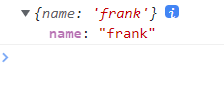
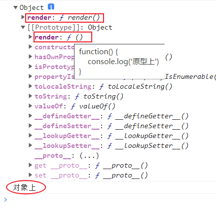
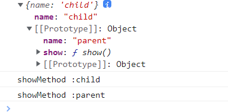
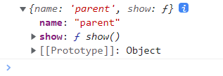
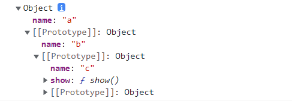

# 原型
## 原型基础
### 原型对象
* 可以将原型理解为对象的父亲，对象从原型对象继承来属性
* 所有函数的原型默认是 `Object` 的实例，所以这是可以使用`toString/toValues/isPrototypeOf` 等方法的原因
* 使用原型对象为多个对象共享属性或方法
* 如果对象本身不存在属性或方法将到原型上查找
* 使用原型可以解决，通过构建函数创建对象时复制多个函数造成的内存占用问题
* 原型包含 `constructor` 属性，指向构造函数
* 对象包含 `__proto__` 指向他的原型对象
### 没有原型的对象
`Object.create`可以会在创建对象时指定原型


```js
 const a = Object.create(null , {  //第一个参数是原型
     name:{
         value:'frank'
     }
 } )
console.log(a)
```
### 对象方法和原型方法优先级
对象上存在方法的话会先调用对象上的方法 , 如果对象本身不存在属性或方法将到原型上查找
```js
let obj = {
    render(){                 //对象上的方法
        console.log('对象上')  
    }
}
obj.__proto__.render = function() {  //原型上的方法
    console.log('原型上')
}
console.dir(obj)
obj.render()  // 会执行对象上的方法
```


### 函数的原型
函数拥有多个原型，`prototype` 用于 new 创建出来的**实例对象**使用，`__proto__` 用于**函数对象**使用
```js
function User() {}                     
User.__proto__.view = function() {
    console.log("User function view method");
};
User.view();

User.prototype.show = function() {
    console.log("后盾人");
};
let hd = new User();
hd.show();
console.log(User.prototype == hd.__proto__);
```
### 构造函数
构造函数在被` new` 时把构造函数的原型（prototype）赋值给新对象。如果该对象中存在属性将使用该对象属性，不再原型上查找方法

使用构造函数创建对象的原型体现
* 构造函数拥有原型
* 创建对象时构造函数**把原型赋予对象**
```js
function User(){}
const user = new User()
console.log(user.__proto__ === User.prototype)  // true
```
### 自定义设置对象的原型
使用 `setPrototypeOf` 与 `getPrototypeOf` 自定义设置与获取原型
```js
let child = {
    name: 'child'
}
let parent = {
    name: 'parent',
    show() {
        console.log(`showMethod :` + this.name)
    }
}
Object.setPrototypeOf(child , parent)  //设置
// child.__proto__ = parent
console.log(child)
child.show()   //这里还考验了this的指向
parent.show()  

console.log(Object.getPrototypeOf(child))  //获取
```



### constructor
`constructor` 存在于 `prototype` 原型中，用于指向构建函数的引用。
```js{6}
function User(name) {
    this.name = name
}

console.log(User.__proto__ === Function.prototype)
console.log(User.prototype.constructor === User)

const user = new User('frank')
const user2 = new User.prototype.constructor('frank') //当然也可以这么写
```
这里有个细节 , 想在User.prototype 上追加一些方法 , 如下可以这么写
```js{5}
function User(name) {
    this.name = name
}
User.prototype = {
    constructor:User,    //注意要加上 constructor , 如果不加构造函数的原型将造成 constructor 丢失
    show(){
        console.log('show')
    }
    //...
}
//或者 也可以一个个加 , 这样就不会丢失 constructor了
// User.prototype.show = function show(){
//   console.log('show')
// }
//...
```
* 使用对象的 `constructor` 创建新的对象
```js{7}
function User(name){
    this.name = name
}
const  user = new User('frank')

function createByConstructor(obj, ...args){
    const constructor = Object.getPrototypeOf(obj).constructor  //获取 prototype 里的 constructor
    return new constructor(...args)
}

const newObj = createByConstructor(user, 'eren')
console.dir(newObj)
```
### 原型链
使用 `Object.setPrototypeOf` 可设置对象的原型，下面的示例中继承关系为 a -> b -> c。
```js
let a = {
    name:'a'
}
let b = {
    name:'b'
}
let c = {
    name:'c',
    show(){
        console.log('show')
    }
}
//让a继承b , 让b继承c
Object.setPrototypeOf(a,b)
Object.setPrototypeOf(b,c)

console.dir(a)

a.show()  // 打出 'show'
b.show()  // 打出 'show'
```


### instance of 原型检测
`instanceof` 检测构造函数的 `prototype` 属性是否出现在某个实例对象的原型链上
也就是说实例对象的**原型链**上, 检测是否有**构造函数.prototype**
```js
function A() {}
function B() {}
function C() {}

const c = new C();
B.prototype = c;
const b = new B();
A.prototype = b;
const a = new A();

console.dir(a instanceof A); //true
console.dir(a instanceof B); //true
console.dir(a instanceof C); //true
console.dir(b instanceof C); //true
console.dir(c instanceof B); //false
```
使用 `isPrototypeOf` 检测一个对象是否是另一个对象的原型链中
```js
const a = {};
const b = {};
const c = {};

Object.setPrototypeOf(a, b);
Object.setPrototypeOf(b, c);

console.log(b.isPrototypeOf(a)); //true
console.log(c.isPrototypeOf(a)); //true
console.log(c.isPrototypeOf(b)); //true
```
### 属性遍历
使用 `in` **检测原型链**上是否存在属性，使用 `hasOwnProperty` **只检测当前对象**
```js{7}
let a = { url: 'baidu.com' };
let b = { name: 'frank' };

Object.setPrototypeOf(a , b)   
console.log(a.__proto__ === b)  //true

console.log('name' in a)  //in 不只检测当前对象 , 还会检测原型链上是否存在该属性

console.log(a.hasOwnProperty('url')) //true   hasOwnProperty 只检测当前对象的属性是否存在
console.log(a.hasOwnProperty('name')) //false
```

使用 `for/in` 遍历时同时会遍历原型链上的属性如下
```js
let a = { url: 'baidu.com' };
let b = { name: 'frank' };

Object.setPrototypeOf(a , b)

for ( const key in a) {
    console.log(key)  // 'name' 'url'
}
```
`hasOwnProperty` 方法判断对象是否存在属性，而不会查找原型。所以如果只想遍历对象属性使用以下代码
```js
for ( const key in a) {
    if (a.hasOwnProperty(key)){
        console.log(key)    // 'url'
    }
}
```
### 借用原型
使用 `call` 或 `apply` 可以借用其他原型方法完成功能。

例子: DOM节点借用 Array 的方法
```html
<button class="red">button1</button>
<button >button2</button>
<button class="blue">button2</button>
```
从这里想选取带有 class 属性的元素
```js{6}
const buttons = document.querySelectorAll('button')

console.log(buttons)  //伪数组
console.dir(Array.prototype.filter)

Array.prototype.filter.call(buttons, (item)=>{    //要知道通常使用的api背后 , arr.filter.call(arr , ...)
//其实也可以这么写 , 
// [].filter.call(buttons,()=>{})
    if(item.hasAttribute('class')) {
        console.log(item)
    }
})
```
###  `__proto__`
在实例化对象上存在 `__proto__` 记录了原型，所以可以通过对象访问到原型的属性或方法。
* `__proto__` 内部使用 `getter/setter` 控制值，所以只允许对象或`null`
* 推荐用 `Object.setPrototypeOf` 与 Object.getPrototypeOf 替代 __proto__

下面修改对象的 __proto__ 是不会成功的，因为_proto__ 内部使用getter/setter 控制值，所以只允许对象或null
```js
let obj = {};
obj.__proto__ = "hello";
console.log(obj);
```
但是 , 下面定义的 `__proto__` 就会成功，因为这是一个极简对象，没有原型对象所以不会影响 `__proto__` 赋值。
```js
let obj = Object.create(null);
hd.__proto__ = "向军";
console.log(hd); //{__proto__: "向军"}
```
