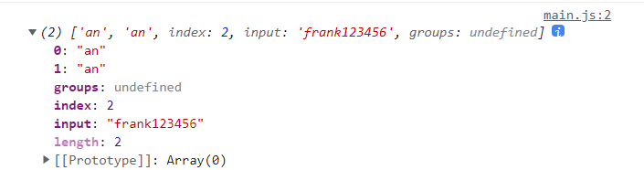
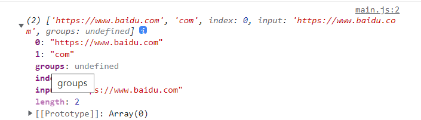
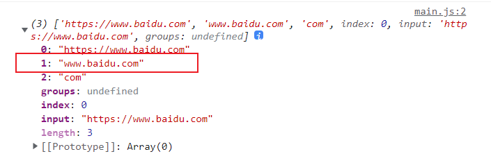
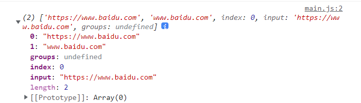

# 正则表达式

## 基础知识
正则表达式是用于匹配字符串中字符组合的模式，在 JavaScript中，正则表达式也是对象。
### 对比分析
举个例子 , `let a = "cuizhixian2200hello9988";`在变量a中获取全部数字 , 下面比较函数与正则的差异
```js
let str = 'cuizhixian2200hello9988'
const nums = [...str].filter(s =>!Number.isNaN(parseInt(s)))
console.log(nums.join(''))
```
用正则表达式
```js
let str = 'cuizhixian2200hello9988'
console.log(str.match(/\d/g).join(''))
```
### 创建正则
#### 字面量创建
```js
let str = 'cuizhixian2200hello9988'

console.log((/c/.test(str)))    //true
```
#### 对象创建
最基本使用:
```js
let str = 'cuizhixian2200hello9988'

let  a = 'c'
let  reg = new RegExp(a)
console.log(typeof reg)  // object
console.log(reg.test(str))   //true
```
### 选择符 |
`| `这个符号带表选择修释符，也就是` | `左右两侧有一个匹配到就可以。
注意: 检测的是`|`的两侧的整体, 而不是一个字符。比如 `12|34 `, 不是`2或3` , 而是`12或者34`
```js
let tel = '010-55665565'

console.log(/010\-\d{7,8}|020\-\d{7,8}/.test(tel))  //true
//或更简洁点 用()放在原子组里面使用, 如下
console.log(/(010|020)\-\d{7,8}/)   //true 
```
### 字符转义 \
转义用于改变字符的含义，用来对某个字符有多种语义时的处理,使用`\`转义。

想通过正则查找/符号，但是 `/`在正则中有特殊的意义。如果写成`///`这会造成解析错误，所以要使用转义语法` /\//`来匹配。
```js
let url = 'https://www.baidu.com'

console.log(/https:\/\/\w+\.\w+\.+\w+/.test(url));  //true
```
### 字符边界约束 ^ $
|     边界符     |   解释        |
| ------------- |:-------------:| 
|        ^      | 匹配字符串的开始|
| $            | 匹配字符串的结束，忽略换行符    | 
```js
let str = 'abc'

console.log(/^\d/.test(str))  //false
console.log(/^\w/.test(str))  //true
```
简单的表单验证
```html
 <input type="text" name="user"></input>
 <span></span>
```
```js
const input = document.querySelector("[name='user']")
input.addEventListener('keyup',(e)=>{
    let flag = document.querySelector('span')
    flag.innerHTML =  e.target.value.match(/^[a-z|\d]{3,6}$/) ? '成功' :'失败'
})
```
## 元子字符 \d \w \s .
元字符是正则表达式中的最小元素，只代表单一（一个）字符
### 字符列表
| 元字符        |解释          | 实例  |
| ------------- |:-------------:| -----:|
| \d      | 一个数字 | [0-9] |
| \D      | 除了数字      |   |
| \w | 一个英文字母,数字或下划线     |   |
| \W | 除了英文字母,数字或下划线     |    |
| \s |任意一个空白字符匹配，如空格，制表符`\t`，换行符`\n`     |    |
| \S | 除了空白符外任意一个字符匹配    |    |
| . | 匹配除换行符以外的任意字符     |   |

(1)//匹配数字
```js
let str = 'cuizhixian 1999'
console.log(str.match(/\d/))    // ['1', index: 11, input: 'cuizhixian 1999', groups: undefined]
console.log(str.match(/\d+/))    //['1999']
console.log(str.match(/\d/g))    //['1','9','9','9']
```
(2)匹配所有电话号码
```js
let str = `
    张三:010-88888888,
    李四:020-99999999
`

console.log(str.match(/\d{3}-\d{7,8}/g))  //  ['010-88888888', '020-99999999']
```
(3)获取所有用户名
```js
let str = `
    张三:010-88888888,
    李四:020-99999999
`

console.log(str.match(/[^\d:\-\s,] // ['张三', '李四']
```
(4) 匹配邮箱
```js
let email = '18844332822@163.com'

console.log(email.match(/^\w+@\w+\.\w+$/))  //注意要有 ^ 和 $
```
(5)限制用户名 5-10位,以字母开头
```js
let username = prompt('请输入用户名')

console.log((/^[a-z]\w{4,9}$/).test(username))  //注意要有 ^ 和 $
```
(6)点元字符: 匹配**换行符**以外的任意字符 , 当然包含**空格**
```js
const url = `
  https://www.baidu.com
  www.google.com
`;
console.log(url.match(/.+/))   //匹配不到 www.google.com , 只匹配到 https://www.baidu.com, 因为有换行符
```
使用`/s`视为单行模式（忽略换行）时，. 可以匹配所有
```js
console.log(url.match(/.+/s))
```
### 所有字符
可以使用 `[\s\S]` 或 `[\d\D]` 来匹配所有字符

## 模式修饰  //igmsyu
| 修饰符        | 说明           |
| ------------- |:-------------:| 
| i     | 不区分大小写字母的匹配 | 
| g      | 全局搜索所有匹配内容     |  
| m | 视为多行      | 
| s | 视为单行忽略换行符，使用`.` 可以匹配所有字符      | 
| y | 从 `regexp.lastIndex` 开始匹配     | 
| u | 正确处理四个字符的 UTF-16 编码     | 
### i
匹配的时候不区分大小写
```js
let str = 'BaIDu.COM'

console.log(str.match(/o/))  //null
console.log(str.match(/o/i))  //匹配到
```
### g
使用 `g`修饰符可以全局操作内容
```js
let str = 'aaaaaaa'
str = str.replace(/a/ , 'x')
console.log(str)  // 'xaaaaa'

str = str.replace(/a/g , 'x')   //全部替换
console.log(str)  // 'xxxxxxx'   
```
### m
用于将内容视为多行匹配，主要是对 `^` 和 `$` 的修饰
```js
let hd = `
  #1 js,200元 #
  #2 vue,300元 #
  #9 baidu.com # 后盾人
  #3 react,180元 #
`;
// [{name:'js',price:'200元'}]
let lessons = hd.match(/^\s*#\d+\s+.+\s+#$/gm).map(v => {
  v = v.replace(/\s*#\d+\s*/, "").replace(/\s+#/, "");
  [name, price] = v.split(",");
  return { name, price };
});
console.log(JSON.stringify(lessons, null, 2));
```
### u
每个字符都有属性，如`L`属性表示是字母，`P` 表示标点符号，需要结合` u` 模式才有效。
```js
//使用 \p{L} 属性匹配字母
let str = "cuizhixian2010.每天不断进步，加油";
console.log(str.match(/\p{L}+/u));

//使用 \p{P} 属性匹配标点
console.log(str.match(/\p{P}+/gu));
```
字符也有`unicode`文字系统属性 `Script=`文字系统，使用 `\p{sc=Han}` 获取中文字符 `han`为中文系统，
```js
let str = `
张三:010-99999999,李四:020-88888888`;
let res = str.match(/\p{sc=Han}+/gu);
console.log(res);
```
### lastIndex
RegExp对象 `lastIndex` 属性可以返回或者设置正则表达式开始匹配的位置

* 必须结合 `g` 修饰符使用
* 对 `exec` 方法有效
* 匹配完成时，`lastIndex` 会被重置为`0`
```js
let str = `智贤每天不断在进步，智贤每天都非常努力`;
let reg = /智贤(.{2})/g;
reg.lastIndex = 10;        //从索引10后开始搜索
console.log(reg.exec(str));    //智贤每天 , 每天
console.log(reg.lastIndex);   // 14

reg = /\p{sc=Han}/gu;
while ((res = reg.exec(hd))) {
  console.log(res[0]);
}
```
### y 


## 原子表 [ ]
一组字符中匹配某个元字符, 放到方括号`[]`中 , 
原子表中只代表一个字母
| 原子表       | 说明         |
| ------------- |:-------------:| 
| []     | 只匹配其中的一个原子 |
| [0-9]      | 匹配0-9任何一个数字    |  
| [a-z] | 匹配小写a-z任何一个字母     | 
| [A-Z] | 匹配大写A-Z任何一个字母     | 

**注意**的是 , 在原子表[ ]中`.`就是小数点
(1)匹配2022-10-03 或 2022/10-03 这两种格式的日期
```js
let str = '2022-10-03  , 2022/10/03'
reg = /\d{4}[-\/]\d{2}[-\/]\d{2}/g
console.log(str.match(reg))    // ['2022-10-03', '2022/10/03']
```
### 区间匹配 [ ]
(1)表单验证:用户名以字母为开头 , 4到7位
```html
<input type="text" name="user">
<span></span>  
```
```js
let input = document.querySelector(`[name="user"]`);
input.addEventListener('keyup',(event)=>{
   let flag = event.target.value.match(/^[a-z]+\w{3,6}$/)
   let  span =  document.querySelector('span')
   span.innerHTML = flag ? '成功' : '失败'
})
```
### 排除匹配 [^ ]
(1)只匹配中文
```js
let str = `张三:010-5665155 , 李四:020-1223115`

console.log(str.match(/[^\d:\s\-,]+/g))
```
### 匹配所有内容 [\s\S] [\d\D] [\w\W]
(1)匹配所有内容
```js
let str = `张三:010-5665155 , 李四:020-1223115`

console.log(str.match(/[\d\D]+/g))
console.log(str.match(/[\s\S]+/g))
console.log(str.match(/[\w\W]+/g))
```
(2) DOM元素去掉h1~6标签
```html
<body>
    <p>Frank</p>
    <h1>baidu.com</h1>
    <h2>学习</h2>
    <h3></h3>
</body>
```
```js
let  body = document.body
let reg = /<h[1-6]>[\s\S]*<\/h[1-6]>/gi   
//使用原子组 , 还可以写出
 let reg = /<(h[1-6])>[\s\S]*<\/\1>/gi   
body.innerHTML = body.innerHTML.replace(reg , '')
```
## 原子组 ( )
* 如果一次要匹配多个元子，可以通过元子组完成
* 元字符组用 () 包裹
### 基本使用
| 原子组       | 说明         |
| ------------- |:-------------:| 
| 0   | 匹配到的内容 |
| 1,2,3,...      | 匹配到的原子组   |  
| index | 原字符串中的位置     | 
| input | 原字符串     | 
| group | 命名分组     | 

```js
let str = 'frank123456'
console.log(str.match(/an/));
```

### 嵌套分组和不记录分组 (()) (?: )
(1)
```js
let str = 'https://www.baidu.com'
console.log(str.match(/https:\/\/\w+\.\w+\.(com|org|cn|cc)/));
```


(2)要把 www.baidu.com 这种格式单独弄出来, 用`()`包起来 , 
注意要从左到右 , 从外到里数
```js
let str = 'https://www.baidu.com'
console.log(str.match(/https:\/\/(\w+\.\w+\.(com|org|cn|cc))/));
```


(3) 不希望.com 这种格式返回到结果 , 使用 `(?:)`处理
```js
let str = 'https://www.baidu.com'
console.log(str.match(/https:\/\/(\w+\.\w+\.(?:com|org|cn|cc))/));
```


(4) 再优化
```js
let str = `
   https://www.baidu.com
   http://google.com
`
console.log(str.match(/https?:\/\/((?:\w+\.)?\w+\.(?:com|org|cn|cc))/));
// 字符串 s 可有可无 , 用 ? 处理 ,  www. 可有可无 同理
```
### 邮箱匹配
```js
let mail = 'sad935151551@sina.com.cn'

console.log(mail.match(/^[\w-]+@([\w-]+\.)+(com|org|cc|cn|net)$/i))  //满满都是细节
```
## 重复匹配
| 符号       | 说明         |
| ------------- |:-------------:| 
| *   |  0个或更多个 |
| +      | 1个或更多个   |  
| ? | 0个或一个     | 
| {n} | 重复n遍     | 
| {n,} | 重复n遍或更多次    |
| {n,m} | 重复n到m次    | 

### 电话号码
```js
let  tel = '010-20415122'
telReg = /^0\d{1,2}-\d{7,8}/

console.log(tel.match(telReg))
```
###  用户名验证 
* (首字母必须是小写字母 , 数字字符串下划线,中划线 , 4-8位)
```js
userName = /^[a-z][\w-]{3-7}$/
```
### 密码
* 5-10位 , 必须要有个大写字母 , 必须要有数字
```js
const input = document.querySelector('input')
input.addEventListener('keyup', (e) => {
    let value = e.target.value
    let reg = [
        /^[a-z0-9]{5-10}$/ ,
        /[A-Z]/ ,
        /[0-9]/
    ]
    let state = reg.every(e => e.test(value))   
    console.log(state ? '正确' : '失败')
})
```
## 字符串方法
### match
## 正则方法
### test
返回 `true` 或 `false`

正则.test(变量)
### exec
不使用 `g` 修饰符时与 `match` 方法使用相似，使用 `g` 修饰符后可以循环调用直到全部匹配完。

* 使用 `g` 修饰符多次操作时使用同一个正则，即把正则定义为变量使用
* 使用 `g`修饰符最后匹配不到时返回 `null`
计算内容中后盾人出现的次数
```js
  let content = document.querySelector(".content");
  let reg = /xxx/g;
  let num = 0;
  while ((result = reg.exec(content.innerHTML))) {
    num++;
  }
  console.log(`后盾人共出现${num}次`);
```
