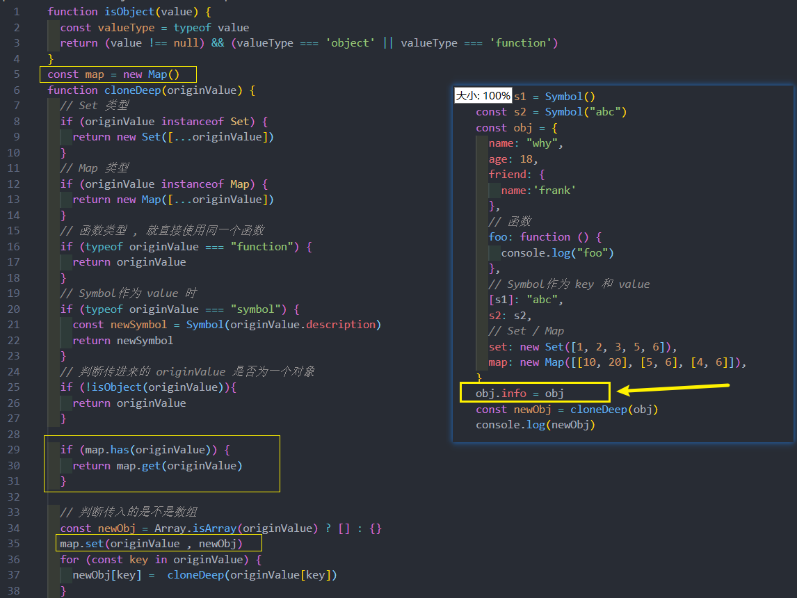

# 深拷贝 - 事件总线
## 深拷贝
* 引入的赋值：指向同一个对象，相互之间会影响；
* 对象的浅拷贝：只是浅层的拷贝，内部引入对象时，依然会相互影响；
* 对象的深拷贝：两个对象不再有任何关系，不会相互影响；

已经可以通过一种方法来实现深拷贝了：JSON.parse
* 这种深拷贝的方式其实对于函数、Symbol等是无法处理的；
* 并且如果存在对象的循环引用，也会报错的；

**自定义深拷贝函数：**
* 1.自定义深拷贝的基本功能；
* 2.对 Symbol 的 key 进行处理；
* 3.其他数据类型的值进程处理：数组、函数、Symbol、Set、Map；
* 4.对循环引用的处理

基本实现 v1 :

其他类型 v2 :

循环引用 v3 :

但是 map = new Map() 放在全局并不好  , 优化一下

## 事件总线 
自定义事件总线属于一种观察者模式，其中包括三个角色：
* 发布者（Publisher）：发出事件（Event）；
* 订阅者（Subscriber）：订阅事件（Event），并且会进行响应（Handler）；
* 事件总线（EventBus）：无论是发布者还是订阅者都是通过事件总线作为中台的；

当然可以选择一些第三方的库：
* Vue2 默认是带有事件总线的功能；
* Vue3 中推荐一些第三方库，比如 mitt；

也可以实现自己的事件总线：
* 事件的监听方法 on；
* 事件的发射方法 emit；
* 事件的取消监听 off

