# this

为什么需要 this ? 

JavaScript中的this更加灵活，无论是它出现的位置还是它代表的含义 

下面编写一个obj的对象，有this和没有this的区别
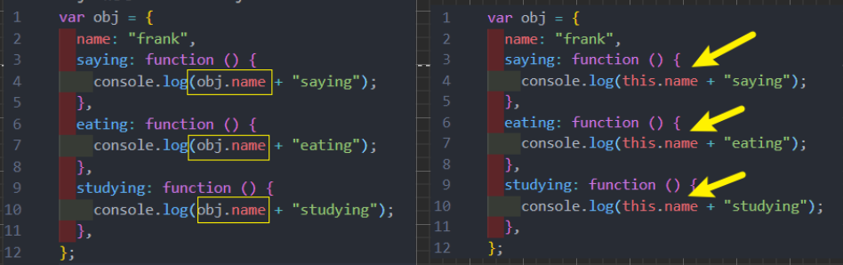

this 在**全局作用域**下指向什么 ? 
* 在**浏览器下会指向 window**

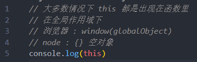

* 开发中很少直接在全局作用于下去使用 this ，通常都是在**函数中使用**

## this的指向 
定义一个函数，采用三种不同的方式对它进行调用，产生三种不同的结果

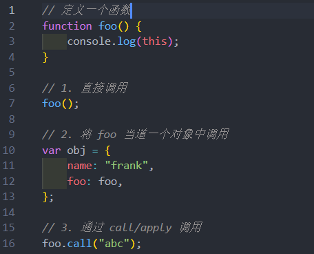

* 1. 函数在调用时，JavaScript 会默认给 this 绑定一个值
* 2. this 的绑定和**定义的位置（编写的位置）没有关系**
* 3. this 的绑定和**调用方式以及调用的位置有关系**
* 4. this 是在**运行时被动态绑定的**

this的绑定规则 : 

* 绑定一：**默认绑定**
* 绑定二：**隐式绑定**
* 绑定三：**显示绑定**
* 绑定四：**new 绑定**

## 规则一 : 默认绑定

**独立函数调用**
* 独立的函数调用可以理解成函数没有被绑定到某个对象上进行调用

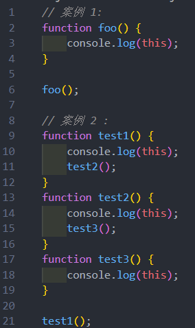  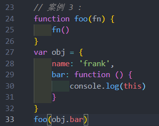
打出的 this 全都是 window 对象 

## 规则二 : 隐式绑定 
**通过某个对象**进行调用的
* 也就是它的调用位置中，是通过某个对象发起的函数调用

object.fn() : object 对象会被js引擎绑定到 fn 函数的 this 里面

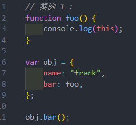  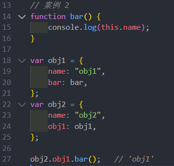
## 规则三 : 显示绑定
**call , apply , bind**

* **通过 call 或者 apply 绑定 this 对象**

  * 显示绑定后 , this 就会明确的指向绑定的对象

  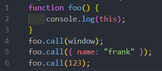 
  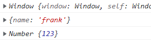
* 如果**希望一个函数总是显示的绑定到一个对象上**，**可以使用 bind**
  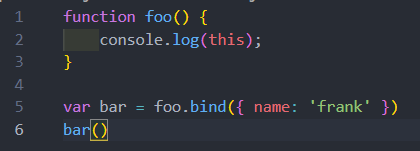 
  

## 规则四 : new 绑定
* 1. 创建一个全新的对象；
* 2. 这个新对象会被执行 prototype 连接；
* 3. 这个**新对象会绑定到函数调用的this上**（this的绑定在这个步骤完成）
* 4. 如果函数没有返回其他对象，表达式会返回这个新对象；

**通过 new 关键字调用一个函数(构造函数)**时 , 这个时候 **this 是调用这个构造器创建出来的对象**
也就是说 , **this = 创建出来的对象** , 这个绑定过程就是 new 绑定

## 内置函数的 this 绑定 
一些 JavaScript 的内置函数 

* setTimeout、数组的forEach 、div的点击
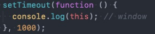  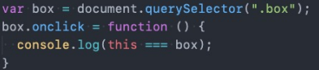
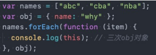
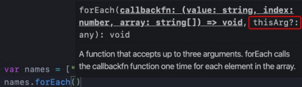
## 规则优先级
1. **默认规则优先级最低**
2. **显示绑定优先级高于隐式绑定**

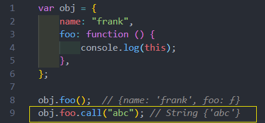

3. **new绑定优先级高于隐式绑定**

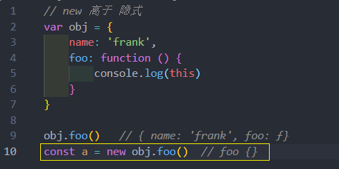

4. **new绑定优先级高于bind**
* new绑定和call、apply是不允许同时使用的，所以不存在谁的优先级更高
* new绑定可以和bind一起使用，new绑定优先级更高

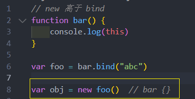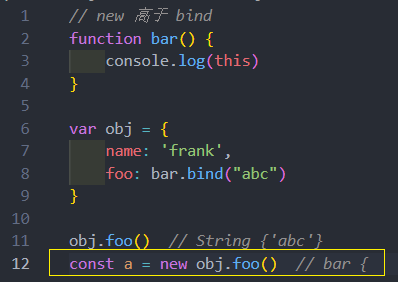 

**总结 : new 绑定 > 显示绑定(call/apply/bind) > 隐式绑定 (obj.foo()) > 默认绑定(独立函数调用)**

## this规则之外 – 忽略显示绑定
如果在显示绑定中，如果**传入一个 null 或者 undefined**，那么这个显示绑定会被忽略，使用默认规则

控制台打出的全是 window 对象
## this规则之外 - 间接函数引用
另外一种情况，创建一个函数的 间接引用，这种情况使用默认绑定规则
* 赋值 (obj2.foo = obj1.foo) 的结果是foo函数
* foo 函数被直接调用，那么是默认绑定

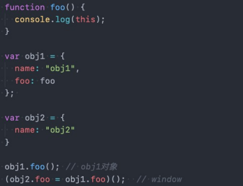

## this规则之外 – ES6箭头函数
箭头函数**不使用** this的四种标准规则（也就是**不绑定this**），而是**根据外层(上层)作用域来决定this**
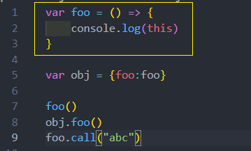
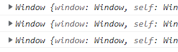

一个模拟网络请求的案例：
* 这里使用了 setTimeout 来模拟网络请求，请求到数据后如何可以存放到 data ?

  * 需要拿到obj对象，设置data；
  * 但是直接拿到的this是 window，我们需要在外层定义：var _this = this
  * 在setTimeout的回调函数中使用_this就代表了obj对象

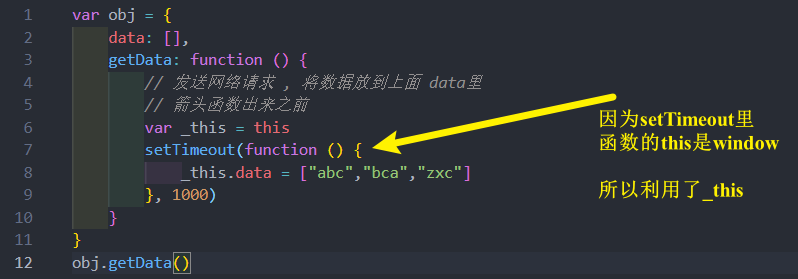

上面的代码在 ES6之前最常用的方式，从ES6开始，都会使用**箭头函数**
* 为什么在 setTimeout 的回调函数中可以直接使用 this 呢？
* 因为**箭头函数并不绑定this对象**，那么**this引用就会从上层作用于中找到对应的this**

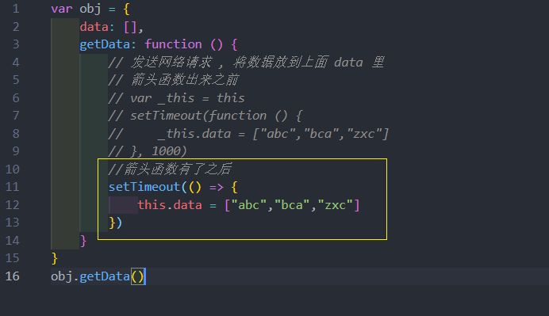

如果 getData 也是一个箭头函数，那么setTimeout中的回调函数中的this指向谁 ??? 
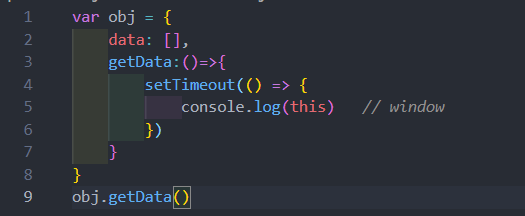
## this 面试题

* 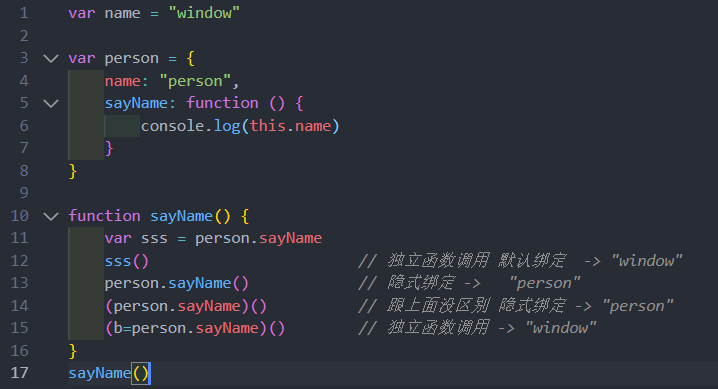

* 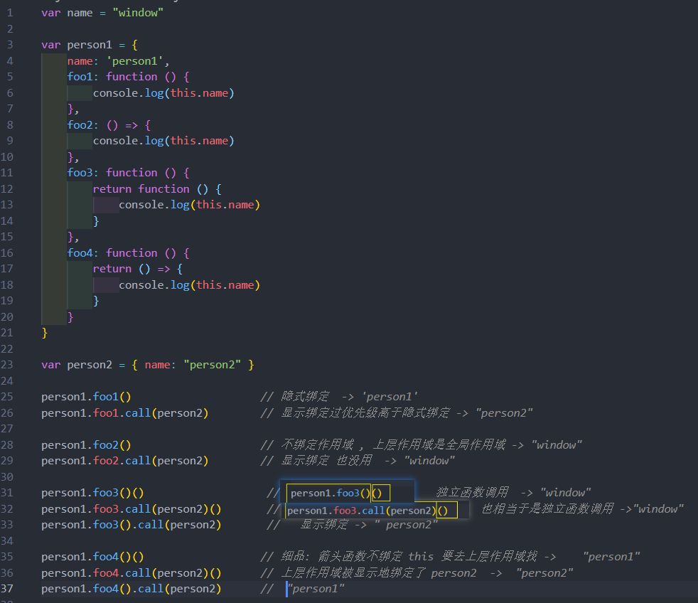

* 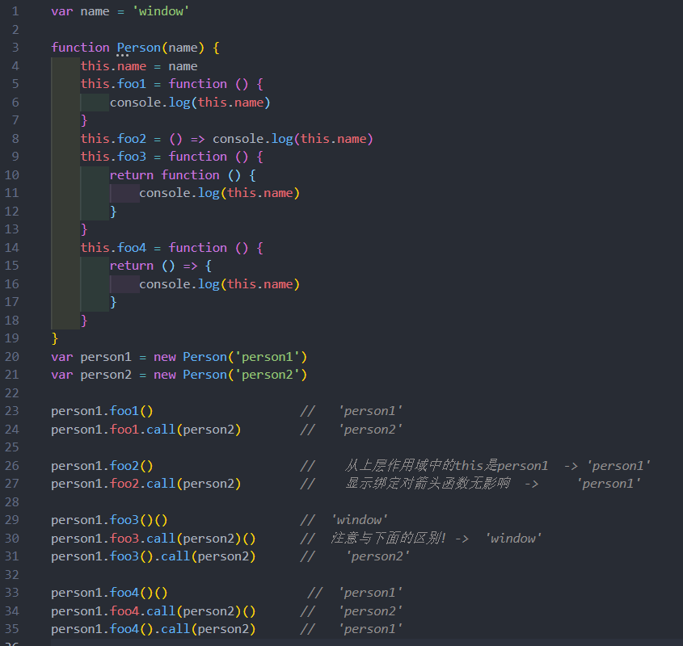

* 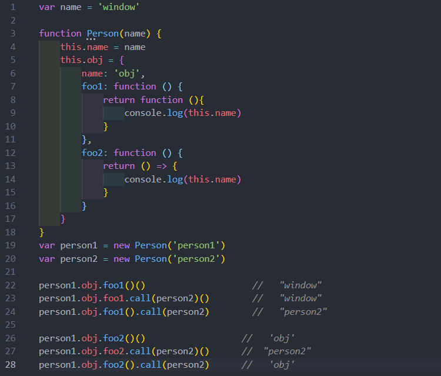

