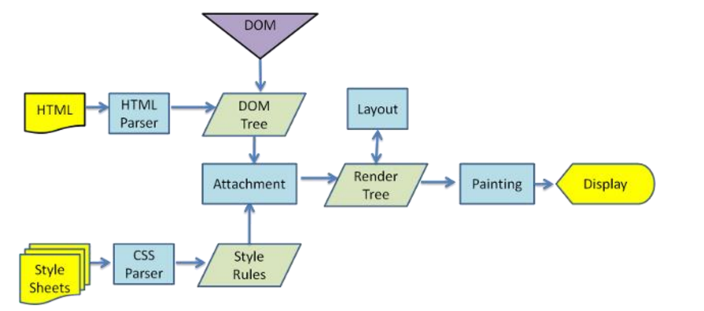
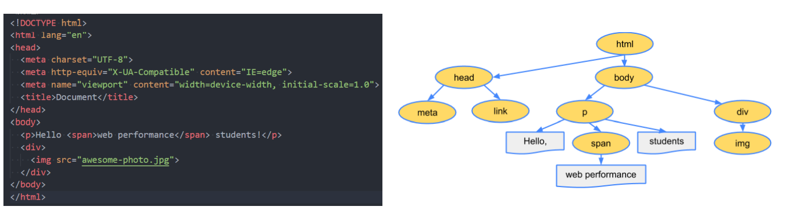
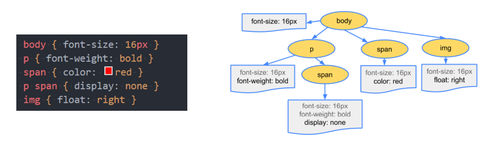
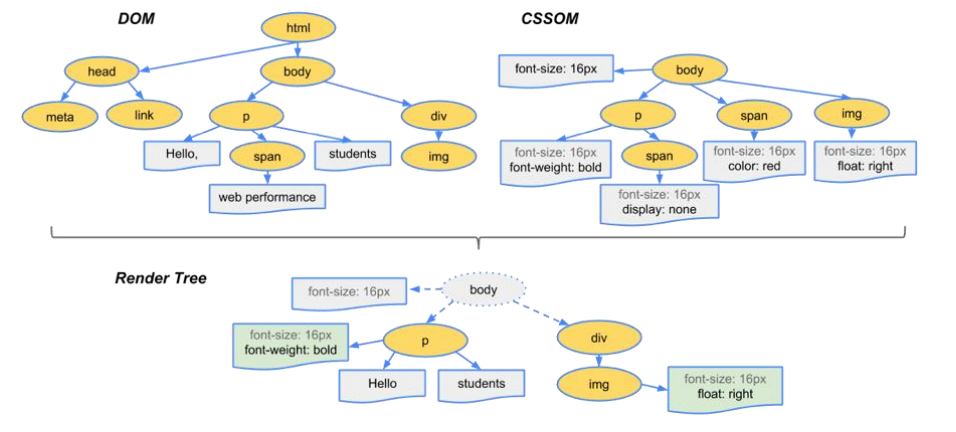
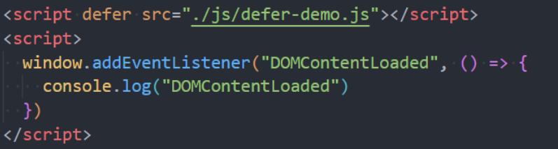

# 浏览器的渲染原理
## 渲染页面的详细流程
 

### 解析一 - HTML解析过程
因为默认情况服务器会给浏览器返回 `index.html` 文件, 所以解析 `HTML` 是所有步骤的开始

解析 `HTML` 会构建 `DOM tree`

### 解析二 – 生成CSS规则
在解析过程中, 如果会遇到 `CSS` 的 `link`元素, 那么会由浏览器下载对应的CSS文件
* 注意: 下载 `CSS` 文件是不会影响 `DOM` 的解析

浏览器下载完 `CSS` 文件之后 , 会对 `CSS` 进行解析, **解析出对应的规则树**
* 我们可以称之为 `CSSOM(CSS Object Model , CSS 对象模型)` 

### 解析三 - 构建 render  tree
**当有了  `DOM tree`  和 `CSSOM tree` 之后, 就可以两个结合来构建 `Render tree`**

注意1 : **`link` 元素不会阻塞 `DOM tree` 的构建过程, 但是会阻塞 `Render tree` 的构建过程**
* 因为 `Render tree` 在构建时, 需要对应的  `CSSOM tree`

注意2 : **`Render tree` 和 `DOM tree` 并不是一一对应的关系**, 比如 `display:none` 的元素, 压根不存在在 `Render tree` 里
### 解析四 – 布局（layout）和绘制（Paint）
**第四步是在渲染树`（Render Tree）`上运行布局`（Layout）`以计算每个节点的几何体**
* 渲染树会表示显示哪些节点以及其他样式，但是不表示每个节点的尺寸、位置等信息；
* 布局是确定呈现树中所有节点的宽度、高度和位置信息；

**第五步是将每个节点绘制（Paint）到屏幕上**
* 在绘制阶段，浏览器将布局阶段计算的每个frame转为屏幕上实际的像素点；
* 包括将元素的可见部分进行绘制，比如文本、颜色、边框、阴影、替换元素（比如img）

## 回流和重绘

1. **理解回流 reflow, (也可以称之为重排)**
* 第一次确定节点的大小和位置, 称之为布局(layout)
* 之后布局发生了改变, 对节点的大小和位置重新进行计算称之为回流

**什么情况下引起回流?**
* 比如 `DOM` 结构发生了变化 (添加新的节点, 移除节点)
* 比如改变了布局 (修改了 `width, height , padding , font-size` 等等)
* 窗口 `resize` 事件
* 调用了 `getComputedStyle` 方法获取尺寸,位置信息 

2. **理解重绘(repaint)**
* 第一次渲染内容称之为绘制(paint)
* 之后重新渲染称之为重绘

**什么情况下引起重绘**
* 比如修改了背景色, 文字颜色, 边框颜色, 样式等

::: warning
*回流一定会引起重绘，所以回流是一件很消耗性能的事情。*
:::

所以在开发中应该避免发生回流
1. 修改样式时尽量一次性修改
* 比如通过添加 class 修改
2. 尽量避免频繁的操作 `DOM`
*  我们可以在一个 `DocumentFragment` 或者父元素中将要操作的DOM操作完成，再一次性的操作；
3. 尽量避免通过 `getComputedStyle` 获取尺寸、位置等信息；
4. 对某些元素使用 `position` 的 **absolute或者fixed**
* 并不是不会引起回流，而是开销相对较小，不会对其他元素造成影响
## script 元素和页面解析的关系
* 事实上, 浏览器在解析 `HTML` 的过程中, 如果遇到了 `script` 标签是不能继续构建 `DOM` 树的
* 他会停止继续构建, 首先下载 `javascript` 的代码, 并且执行 javascript 脚本
* 只有等到 `javascript` 脚本执行完成后, 才会继续解析 `HTML` , 构建 `DOM tree`

为什么要这样做呢？
* 这是因为 `javascript` 的作用之一就是操作DOM, 并且可以修改 `DOM`
* 如果等到DOM树构建完成并渲染再执行 `javascript` , 会造成严重的回流和重绘, 影响页面的性能
* 所以遇到 `script` 标签, 会优先下载和执行 `javascript` 代码, 再构建 `DOM` 树

但是这个也往往会带来新的问题，特别是现代页面开发中：
* 在目前的开发模式中 (Vue, React), 脚本往往比 HTML 页面更"重", 处理时间还比较长
* 所以会造成页面的解析阻塞, 在脚本下载并执行之前, 用户在界面什么都看不到

为了解决这个问题，script元素给我们提供了两个属性（attribute）：`defer 和 async`

### defer 属性
`defer` 属性告诉浏览器, **不要等待脚本的下载, 而继续解析 `HTML`, 构建 `DOM tree`**
* 脚本会由浏览器进行下载, 但是不会阻塞 `DOM tree` 的构建
* 如果脚本提前下载好了, 他会等待 `DOM Tree` 的构建完成, 在 `DOMContentLoaded` 事件之前再执行 `defer` 中的代码

所以 `DOMContentLoaded` 总是会等待 `defer` 中的代码先执行完成

另外多个带 defer 的脚本可以保证顺序来执行的

从某种角度来说, defer 可以提高页面的性能, 并且推荐放到 head 元素中

注意：defer 仅适用于外部脚本，对于script默认内容会被忽略。

### async 属性
`async` 特性与 `defer` 有些类似，它也能够让脚本不阻塞页面。

**async 让一个脚本完全独立**
* 浏览器不会因 `async` 脚本而阻塞(与 `defer` 类似)
* `async` 脚本不能保证顺序, 它是独立下载, 独立运行, 不会等待其他脚本
* `async` 不会能保证在 `DOMContentLoaded` 之前或者之后执行

`defer` 通常用于需要在文档解析后操作 `DOM` 的 `JavaScrip` t代码，并且对多个 `script` 文件有顺序要求的；

`async` 通常用于独立的脚本，对其他脚本，甚至 `DOM` 没有依赖的
