# 面向对象
JavaScript其实支持多种编程范式的，包括函数式编程和面向对象编程：
* JavaScript中的对象被设计成一组**属性的无序集合**，像是一个**哈希表**，有 key 和 value 组成；
* **key是一个标识符名称，value可以是任意类型**，也可以是**其他对象或者函数类型**
* 如果值是一个**函数**，那么我们可以称之为是**对象的方法**

如何创建一个对象？
* 早期使用创建对象的方式最多的是使用**Object类**，并且使用 **new 关键字**来创建一个对象：
  * 这是因为早期很多 JavaScript 开发者是从Java过来的，它们也更习惯于Java中通过new的方式创建一个对象；
* 后来很多开发者为了方便起见，都是直接通过**字面量的形式来创建对象**
  * 这种形式看起来更加的简洁，并且对象和属性之间的内聚性也更强，所以这种方式后来就流行了起来

## 创建对象的两种方式 
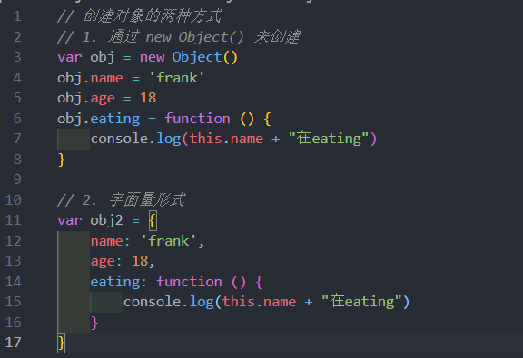
## 对属性操作的控制 
通常对象的属性都是**直接定义在对象内部**，或者**直接添加到对象内部的**
* 但是这样来做的时候我们就**不能对这个属性进行一些限制**：比如这个属性**是否是可以通过delete删除的？**这个
属性**是否在 for-in 遍历的时候被遍历出来呢**

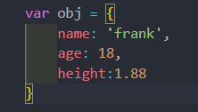

如果我们想要对一个属性进行**比较精准的操作控制**，那么我们就可以使用**属性描述符**
* 通过属性描述符**可以精准的添加或修改对象的属性**
* 属性描述符需要使用 **Object.defineProperty** 来对属性进行添加或者修改

### Object.defineProperty
Object.defineProperty() 方法会直接在一个对象上定义一个新属性，或者修改一个对象的现有属性，并返回此对象

可接收三个参数：
* obj 要定义属性的对象
* prop 要定义或修改的属性的名称或 Symbol
* descriptor 要定义或修改的属性描述符

返回值：
* 被传递给函数的对象

### 属性描述符分类
属性描述符的类型有两种：
* 数据属性（Data Properties）描述符（Descriptor）；
* 存取属性（Accessor访问器 Properties）描述符（Descriptor）；

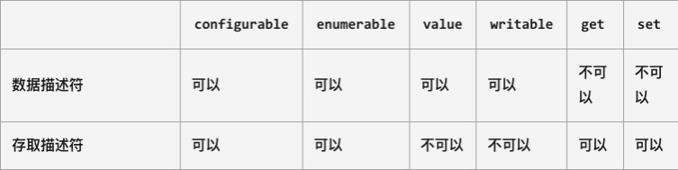

### 数据属性描述符
*  **[[Configurable]]**：表示属性是否可以通过delete删除属性，是否可以修改它的特性，或者是否可以将它修改为存取属性
描述符；
  *  当我们直接在一个对象上定义某个属性时，这个属性的[[Configurable]]为true；
  *  当我们通过属性描述符定义一个属性时，这个属性的[[Configurable]]默认为false；
* **[[Enumerable]]**：表示属性是否可以通过for-in或者Object.keys()返回该属性；
  *  当我们直接在一个对象上定义某个属性时，这个属性的[[Enumerable]]为true；
  *  当我们通过属性描述符定义一个属性时，这个属性的[[Enumerable]]默认为false；
* **[[Writable]]**：表示是否可以修改属性的值；
  *  当我们直接在一个对象上定义某个属性时，这个属性的[[Writable]]为true；
  *  当我们通过属性描述符定义一个属性时，这个属性的[[Writable]]默认为false；
* **[[value]]**：属性的value值，读取属性时会返回该值，修改属性时，会对其进行修改；
  *  默认情况下这个值是undefined；

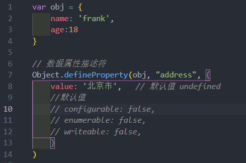
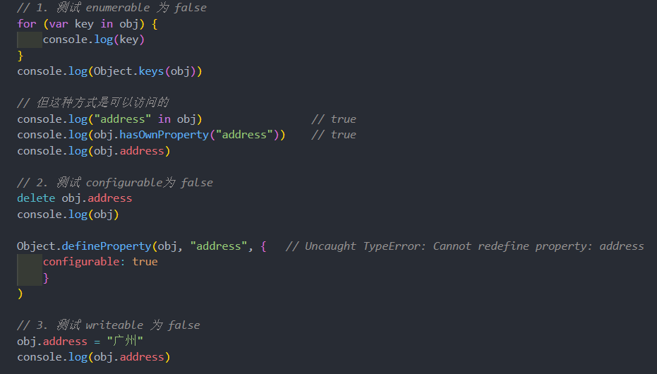
### 存取属性描述符
数据数据描述符有如下四个特性：
* **[[Configurable]]**：表示属性是否可以通过delete删除属性，是否可以修改它的特性，或者是否可以将它修改为存取属性
描述符；
  * 和数据属性描述符是一致的；
  * 当我们直接在一个对象上定义某个属性时，这个属性的[[Configurable]]为true；
  * 当我们通过属性描述符定义一个属性时，这个属性的[[Configurable]]默认为false；
* **[[Enumerable]]**：表示属性是否可以通过for-in或者Object.keys()返回该属性；
  * 和数据属性描述符是一致的；
  * 当我们直接在一个对象上定义某个属性时，这个属性的[[Enumerable]]为true；
  * 当我们通过属性描述符定义一个属性时，这个属性的[[Enumerable]]默认为false；
* **[[get]]**：获取属性时会执行的函数。默认为undefined
* **[[set]]**：设置属性时会执行的函数。默认为undefined

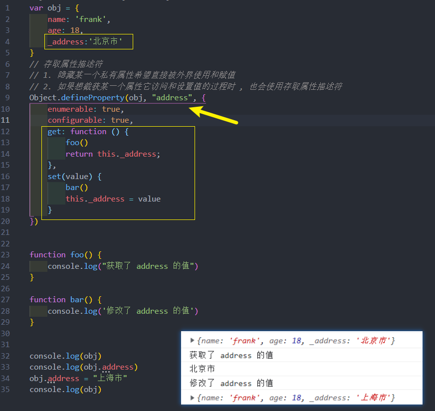

### 同时定义多个属性
**Object.defineProperties()** 方法直接在一个对象上定义 **多个** 新的属性或修改现有属性，并且返回该对象。

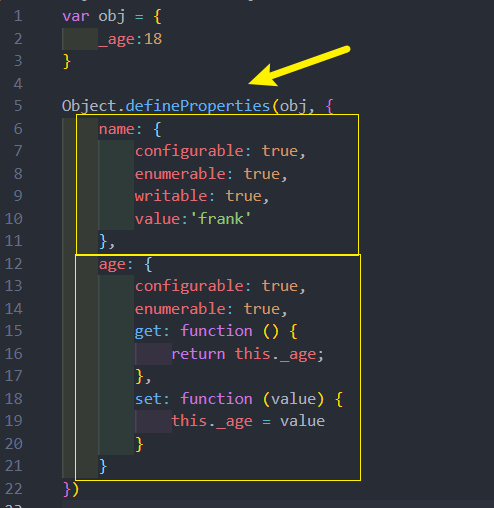

**get/set 还可以这么写**

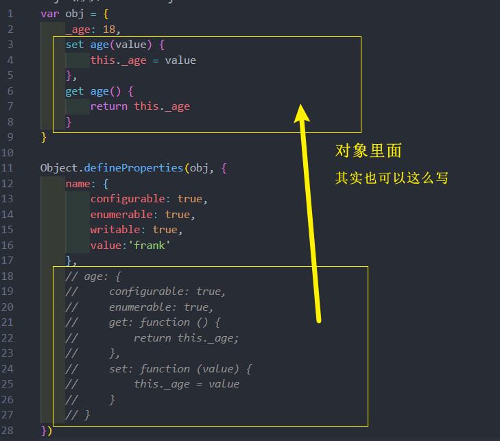
### 对象的其他方法 
* 获取对象的属性描述符：
  * getOwnPropertyDescriptor
  * getOwnPropertyDescriptors

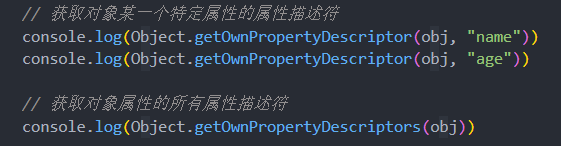

* 禁止对象扩展新属性：preventExtensions
  * 给一个对象添加新的属性会失败（在严格模式下会报错）；

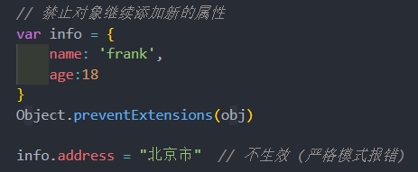

* 密封对象，不允许配置和删除属性：seal
  * 实际是调用preventExtensions
  * 并且将现有属性的configurable:false

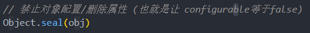
* 冻结对象，不允许修改现有属性： freeze
  * 实际上是调用seal
  * 并且将现有属性的writable: false

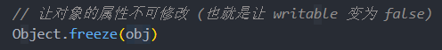

## 构造函数
JavaScript 中的构造函数是怎么样的？
* 构造函数也是一个普通的函数，从表现形式来说，和千千万万个普通的函数没有任何区别
* 那么如果这么一个普通的函数被使用 new 操作符来调用了，那么这个函数就称之为是一个构造函数
### new操作符调用的作用
如果一个函数被使用new操作符调用了，那么它会执行如下操作：
* 1. 在内存中创建一个新的对象（空对象）；
* 2. 这个对象内部的 [[prototype]] 属性会被赋值为该构造函数的 prototype 属性
* 3. 构造函数内部的this，会指向创建出来的新对象；
* 4. 执行函数的内部代码（函数体代码）；
* 5. 如果构造函数没有返回非空对象，则返回创建出来的新对象

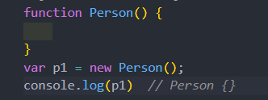

### 创建对象的方案 – 构造函数
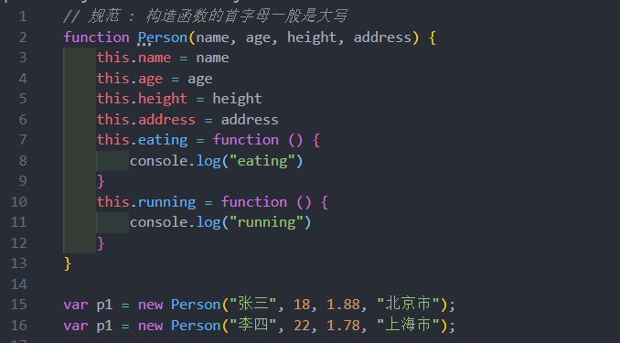

但是构造函数就没有缺点了吗？
* 构造函数也是有缺点的，它在于我们需要为每个对象的函数**去创建一个函数对象实例**
### 对象的原型
JavaScript当中每个对象都有一个特殊的内置属性 [[prototype]]，这个特殊的对象可以指向另外一个对象

那么这个对象有什么用？
* 当我们通过引用对象的属性 key 来获取一个value时，它会触发 [[Get]]的操作
* 这个操作会首先检查该属性是否有对应的属性，如果有的话就使用它
* 如果对象中没有改属性，那么会访问对象[[prototype]]内置属性指向的对象上的属性

那么如果通过字面量直接创建一个对象，这个对象也会有这样的属性吗？如果有，应该如何获取这个属性呢？
* 答案是有的，只要是对象都会有这样的一个内置属性；

获取的方式有两种：
* 方式一：通过对象的 __proto__ 属性可以获取到（但是这个是早期浏览器自己添加的，存在一定的兼容性问
题）；
* 方式二：通过 Object.getPrototypeOf 方法可以获取到；

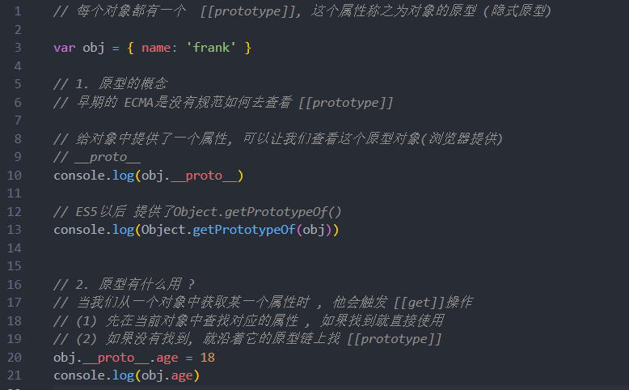

### 函数的原型 prototype/ 再看 new 操作符
所有的函数都有一个 prototype 的属性
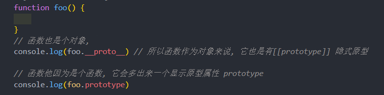
#### 再看 new 操作符 
之前说过 new 关键字的步骤如下：
* 1. 在内存中创建一个新的对象（空对象）；
* 2. **这个对象内部的[[prototype]]属性(隐式原型)会被赋值为该构造函数的 prototype 属性**

那么也就意味着通过 Person 构造函数创建出来的所有对象的[[prototype]]属性都指向 Person.prototype

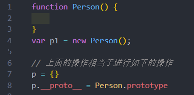
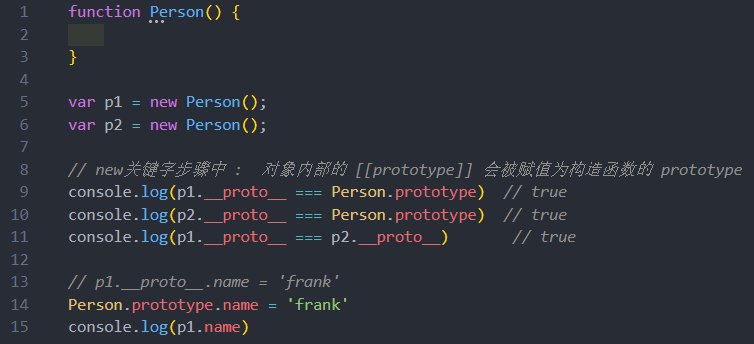
内存图 : 
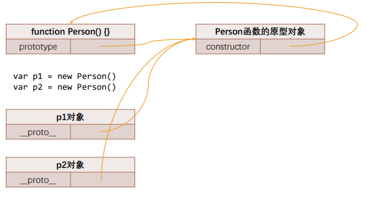

### constructor 属性
事实上原型对象上面是有一个属性的：**constructor**
* 默认情况下原型上都会添加一个属性叫做 constructor，这个**constructor 指向当前的函数本身**

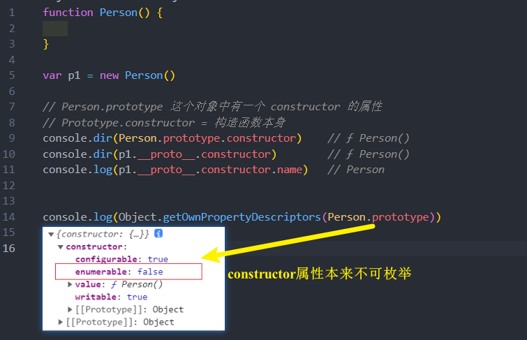

### 重写 prototype 原型对象
如果需要在原型上添加过多的属性，通常会重新整个原型对象
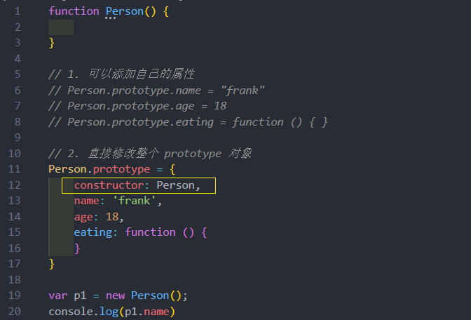

如果希望 constructor 指向 Person，那么可以(像上面的图)手动添加：
* 上面的方式虽然可以, 但是也会造成constructor的[[Enumerable]]特性被设置了true.
* 默认情况下, 原生的 constructor 属性是不可枚举的.

如果希望解决这个问题, 就可以使用前面介绍的 Object.defineProperty() 函数了
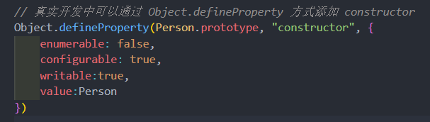
### 创建对象 – 构造函数和原型组合
在上一个构造函数的方式创建对象时，有一个弊端：会创建出重复的函数，比如 running、eating 这些函数
* 那么有没有办法让所有的对象去共享这些函数?
* 可以，将这些函数放到 Person.prototype 的对象上即可

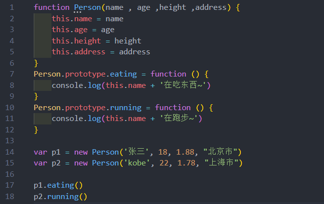

