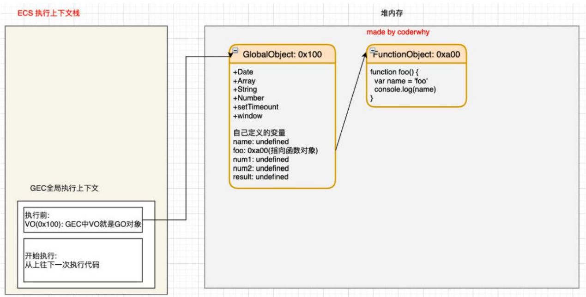

# js的运行原理
## 初始化全局对象 GO
js引擎在**执行代码之前**, **会在堆内存里面创建一个全局对象 `(Global Object - GO)`**

* 该对象在所有作用域(scope)都能访问
* 里面包含 `Date, Array , String, Number, setTimeout, setInterval` 等等
* 其中还有 window 属性指向自己

## 执行上下文（ Execution Contexts - EC）
js引擎内部有一个**执行上下文栈**`（Execution Context Stack，简称ECS）`，它是用于**执行代码的调用栈**

那么一开始会执行谁呢? 执行的是 **全局的代码块**
* 全局代码块为了执行会创建一个 **全局执行上下文**`(Global Execution Context)`
* 全局执行上下文(GEC) 会放入到  执行上下文(ECS)里面

`GEC` 被放入到 `ECS` 里面包含两个内容:
1. 第一部分 : 在代码执行前, 在 parser 转成 AST 的过程中,  会将全局定义的变量.函数等加入到 `Global Object(GO)` 里, **但是并不会赋值**

这个过程也称之为 **变量提升**
2. 第二部分 ：在代码执行中，对变量赋值，或者执行其他的函数；

## 认识 VO 对象（Variable Object）
**每一个执行上下文都会关联一个 `VO (Variable Object)`**, **变量和函数声明**都会添加到这个VO对象上 

**当全局代码被执行的时候，`VO` 就是 `GO`对象了**

### 全局代码执行前

### 全局代码执行后

## 函数如何被执行呢？
在执行的过程中执行到一个**函数**时，就会根据函数体创建一个**函数执行上下文**`（Functional Execution Context，简称FEC）`，
并且压入到 `EC Stack` 执行上下文栈中

因为每个执行上下文都会关联一个`VO`，那么函数执行上下文关联的`VO`是什么呢？
* 当进入一个函数执行上下文时，会创建一个 `AO` 对象`（Activation Object）`；
* 这个 AO 对象会使用 **arguments 作为初始化**，并且初始值是传入的参数；
* **这个 AO 对象会作为执行上下文的 VO 来存放变量的初始化**；

### 函数执行前

## 作用域提升面试题

