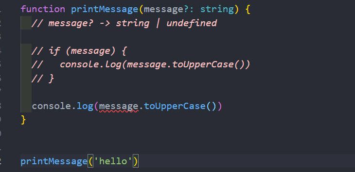
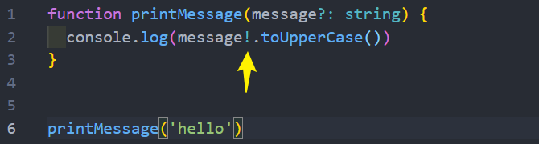
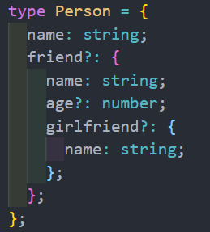
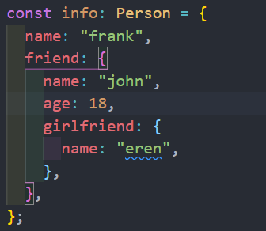
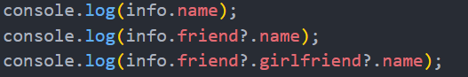
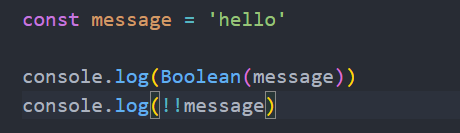
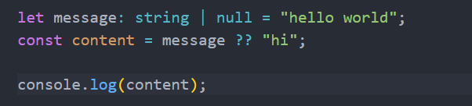
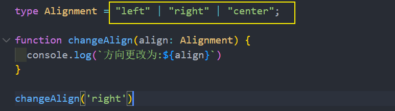

# 断言
<!-- ## enum枚举
* 不设置值时，值以0开始递增
```ts
enum SexType {
  BOY,   //0
  GIRL   //1
}
const user = {
  name:'frank',
  sex:SexType.GIRL
}
console.log(user) //{ name: 'frank', sex: 1 }
```
当某个字段设置数值类型的值后，后面的在它基础上递增
```ts
enum SexType {
  BOY=5,  
  GIRL
}

const user = {
  name:'frank',
  sex:SexType.GIRL
}
console.log(user) //{ name: 'frank', sex: 6 }
```
可以将值设置为其他类型
```ts
enum SexType {
  BOY='男',
  GIRL='女'
}

const user = {
  name:'frank',
  sex:SexType.GIRL
}
console.log(user) //{ name: 'frank', sex: '女' }
``` -->

<!--
## null / undefined
默认情况下 null 与 undefined 可以赋值给其他类型
```ts
let a  = 'hello'
a = null
a = undefined  
```
当我们需要严格模式 , 修改 tsconfig.json 配置文件的 strictNullChecks 字段为 true 时，则不能将 null、undefined 赋值给其他类型
```
"strictNullChecks": true     
```
除非向下面一样明确指定类型
```ts
let a: string | null | undefined = 'hello'
a = null
a = undefined
``` -->
## as断言
TypeScript只知道该函数会返回 Element ，但并不知道它具体的类型



## 非空断言!
先要开启 tsconfig.json 的配置项strictNullChecks 字段为 true。

通过 querySelector获取元素, 可能存在,也有可能为null
```ts
let el  = document.querySelector('xxx')   //let el: Element | null
console.log(el.id)  //报错 Object is possibly 'null'.
```
可以使用 as 断言类型
```ts
let el  = document.querySelector('xxx')  as HTMLDivElement
console.log(el.id) 
```
或者 在值后面使用 `!`来声明值非null
```ts
const el: HTMLDivElement = document.querySelector('.hd')!
console.log(el.id);
```


这是因为传入的message有可能是为undefined的，这个时候是不能执行方法的；

非空断言使用的是 `!` ，表示可以确定某个标识符是有值的，**跳过ts在编译阶段对它的检测**
## 可选链的使用
可选链事实上并不是TypeScript独有的特性，它是ES11（ES2020）中增加的特性：
* 可选链使用可选链操作符 ?.；
* 它的作用是当对象的属性不存在时，会短路，直接返回 undefined，如果存在，那么才会继续执行；
* 虽然可选链操作是ECMAScript提出的特性，但是和 TypeScript 一起使用更版本
   

## ?? 和 !! 的作用
!!操作符：
* 将一个其他类型转换成boolean类型；
* 类似于Boolean(变量)的方式；

??操作符：
* 它是ES11增加的新特性；
* 空值合并操作符（??）是一个逻辑操作符，当**操作符的左侧是 null 或者 undefined 时**，返回其右侧操作数，否则返回左侧操作数




## 字面量类型
可以将多个类型联合在一起

## const 断言
### let & const
* const 保证该字面量的严格类型
* let 为通用类型比如字符串类型
const hd = 'houdunren' //const h
```ts
const str = 'hello' //const str: "hello"
let x = 'hello'  //let x: string
```
### as const
const断言会根据具体的值推断出它能推断出的最窄或最特定的类型 , 而不是宽泛的类型
* 字符串、布尔类型转换为具体值
* 对象转换为只读属性
* 数组转换成为只读元组

值
```ts
let str = 'hello' as const  //let str: "hello"
str = 'hi' //报错

//类似于
let str:'hello = 'hello
```
对象转换为只读属性
```ts
let  user = {name:'frank' , age:18} as const
//let user: { readonly name: "frank", readonly age: 18 } 
//只读属性 , 不允许设置值
```
当为变量时转换为其变量的类型，具体值是转为值类型
```ts
let a = 'hello'
let b = 2030

let f = [a, b, 'hello', true, 100] as const //readonly [string, number, "hello", true, 100]
let hd = f[0]
hd = '123'
```
### 数组使用as const
变量 x 得到的类型是数组的类型 string | number，所以只要值是这两个类型都可以
```ts
let  a:string = 'hello'
let b:number = 1
let arr = [a, b]  // let arr: (string | number)[]
let x = arr[1]    //let x: string | number
```
使用 const 后会得到值的具体类型，会让数组转换成为只读元组
```ts
let  a:string = 'hello'
let b:number = 1
let arr = [a, b] as const  // let arr: readonly [string, number]
//也可以这么写
// let arr = <const>[a, b]
let x = arr[1]      //let x: number
```
### 解构中使用as const
```ts
function run() {
  let a  = 'hello'
  let b = (x:number , y:number):number => x + y
  return [a , b] as const
}

const [n , m] = run()
console.log((m as Function)(1,2))
//或者
//console.log((m as (x: number, y: number) => number)(1, 5))
```
可以在函数体内声明返回类型
```ts{4}
function run() {
  let a  = 'hello'
  let b = (x:number , y:number):number => x + y
  return [a , b] as  [typeof a , typeof b] 
}

const [n , m] = run() //const m: (x: number, y: number) => number
m(1, 6) 
```
使用 as const 就可以很高效的解决上面的问题，可以得到具体的类型，来得到更安全的代码，同时会有更好的代码提示
```ts{4}
function run() {
  let a  = 'hello'
  let b = (x:number , y:number):number => x + y
  return [a , b] as const
}

const [n , m] = run() //const m: (x: number, y: number) => number
m(1, 6)
```
可以断言 m 为函数然后调用
```ts{8}
function run() {
  let a  = 'hello'
  let b = (x:number , y:number):number => x + y
  
```
<!-- ## DOM
### 类型推断
对于获取的标签对象可能是为 null 也可能是该标签类型
* body 等具体的标签可以推断出准确的标签和 null
* 但根据 class 获取标签不能准确获取标签类型，推断的类型为 Element|null

例如:
```ts
const bodyEl = document.querySelector('body') //const body: HTMLBodyElement | null
const el = document.querySelector('xxx')   //const el: Element | null
```
下例中的 `DOM` 类型会报错，因为 .xxx 是 `Element` 类型，而构建函数参数 `el` 的类型是 `HTMLDivElement`,
所以要明确断言类型成 `HTMLDivElement`
```ts
class Hd {
  el: HTMLDivElement;
  constructor(el:HTMLDivElement) {
    this.el = el
  }
  html(){
    return this.el.innerHTML
  }
}
const el = document.querySelector('xxx') as HTMLDivElement  // const el: Element | null , 所以要断言
new Hd(el)
```
### 对null的处理 (非空断言)
针对于其他标签元素，返回值可能为 null，所以使用 `as` 断言或`！`处理
```ts
// 用 as
const body = document.querySelector('body') as HTMLBodyElement
const el = document.querySelector('xxx') as HTMLDivElement
// 用 !
const body = document.querySelector('body')!
const el = document.querySelector('xxx')!     
```
### DOM事件处理
```ts
const button = document.querySelector('button') as HTMLButtonElement
button.addEventListener('click', (e: Event)=>{
  console.log('hi')
})
``` -->

