# 基础类型
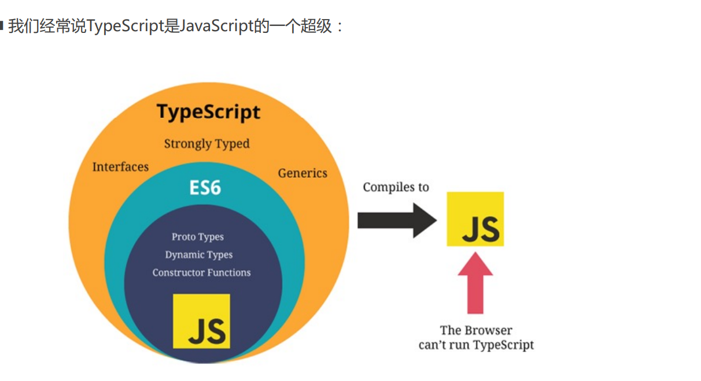
## 类型推断
### 数组
类型推断会表示数组内容值为字符串
```ts
const hd = ["hello", "hi"]; //const hd: string[]

hd.push(100); //因为类型不允许，所以报错
```
会推断数组允许的值为字符串或数值或布尔值

```ts
let array = ["hello", 2, true]; //let array: (string | number | boolean)[]

array.push(2); //数组允许数值、字符串类型，所以编译通过
array.push("bye");
```
### 对象
```ts
const user = {
  name: "frank",
  age: 18,
  visible: true,
  lessons: [{ title: "js" }, { title: "vue" }],
};
user.lessons.push({ title: "css" });
```
类型推断结果为
```
const user: {
  name: string,
  age: number,
  visible: boolean,
  lessons:{ title: string }[]
}
```
## 基本类型
除了上面的类型自动推断外，还是要明确设置变量类型
### 数组
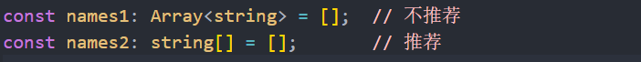
```ts
let array:string[]
array = []
array.push('hi')
```
还可以用泛型
```ts
let array:Array<string> = []
array.push('hi')
```
### 对象
对象类型但不限制值类型
```ts
let user1:object
user1 = []
user1 = {}
user1 = function (){}
```
但开发中不推荐使用这种方法
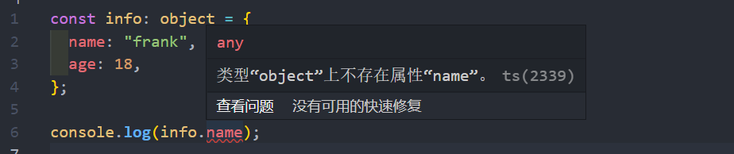
属性后面加 **`?`**,这样的属性是非必填项
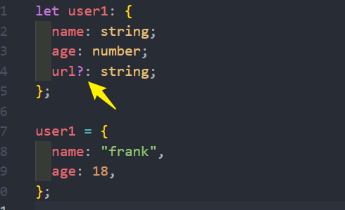
### tuple 
明确数组每个成员值类型的数组为元组

那么tuple和数组有什么区别呢？
* 首先，数组中通常建议存放相同类型的元素，不同类型的元素是不推荐放在数组中。（可以放在对象或者元组
中）
* 其次，元组中每个元素都有自己特性的类型，根据索引值获取到的值可以确定对应的类型

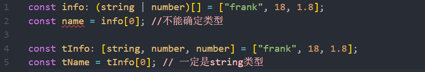
### null & undefined
在 JavaScript 中，undefined 和 null 是两个基本数据类型。

在TypeScript中，它们各自的类型也是undefined和null，也就意味着它们既是实际的值，也是自己的类型：

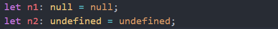
### symbol 
* 我们不可以在对象中添加相同的属性名

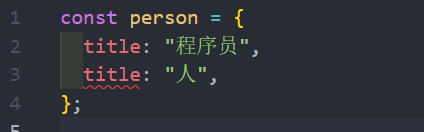
* 通常我们的做法是定义两个不同的属性名字：比如 title1 和 title2
* 但是我们也可以通过 symbol 来定义相同的名称，因为 Symbol 函数返回的是不同的值 

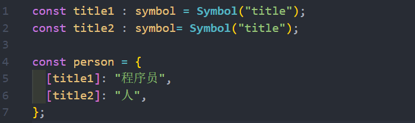

### any

使用 any 指包含所有值的顶部类型，所以any不进行类型检查，等于关闭了 TS 对该变量的严格类型校验

* 使用any 类型等同于使用纯 JavaScript 的开发方式
* any 类型是**顶部类型**，所有其他类型是他的子类型
* 使用any类型将**失去** typescript 静态类型的强制检测
* 只有在描述一个根本不知道的类型时使用 any

any 太过宽泛所以**不建议使用**，他会丢失 TS 的严格类型校验

*  如果对于某些情况的处理过于繁琐不希望添加规定的类型注解，或者在引入一些第三方库时，缺失了类型注解，这个时候
我们可以使用any
### unknown
unknown 类型也是顶部类型这与 any 一样

* unknown 用于表示未知的类型

* 与 any 的区别是 any 不进行 TS 校验，unknown 类型要安全得多，会进行 TS 的类型检查

* 使用 unknown 类型时一般需要 **as 类型断言**来转换类型

unknown **赋值时要求明确类型**

```ts
let a:unknown  = 'frank'
let b:any = 'frank'

let c:string = a  //报错  Type 'unknown' is not assignable to type 'string'.
let d:string = b  //不报错
```
上面的 unknown 类型需要明确类型后赋值
```ts
let b:string = a as string
```
**借助 unknown 转换类型**
```ts
let a:string = 'frank'
let b:number = a //报错
```
这里需要使用 unknown 做个中间层转换
```ts
let a:string = 'frank'
let b:number = a as unknown as number  //不报错
```
### void
void类型的值为 null 或 undefined，常用于对函数返回值类型定义
* 严格模式下只能是 undefined
* 如果函数没有返回值请使用 void 类型，这会使用代码更易读，并可对不小心造成的函数返回内容进行校验
* 也可以将 void理解为对返回 null 或 undefined的函数返回值声明

注意: void 类型的值可以是 null 或 undefined，但如果 TS 配置开启了 `strict` 或 `strictNullChecks` 则*不允许* void 为null
```ts
let a: void = undefined;
let b:void = null;    //严格模式下void不允许是null
```
通常用于函数的返回值是null
```ts
function run():void {
  return 123   //报错 Type 'number' is not assignable to type 'void'.
}
```
### never
相比其他类型来讲 never 使用的机会相对较少。

函数返回值使用never与 void 的区别是

* void 是有null 或 undefined 值的
* never 是永远不会结束的函数，所以也不会有返回值
* 如果一个函数中是一个死循环或者抛出一个异常，那么这个函数会返回东西吗？
* 不会，那么写void类型或者其他类型作为返回值类型都不合适，我们就可以使用never类型

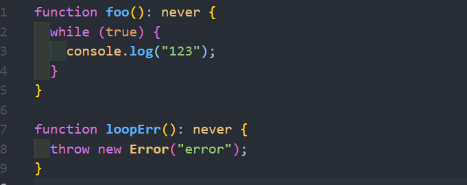
## 函数
### 函数参数的可选类型
如果参数是可选的，使用 `?` 修饰
* 下面的ratio 参数可以不传
* 不传时ratio 值为 undefined
```ts
function sum(a:number , b:number , ratio?:number){
  ratio = ratio || 0.6
  return (a + b) * ratio
}
```
但如果参数有默认值了 , 那不需要用`?`修饰
```ts
function sum(a:number , b:number , ratio:number = 0.6){
  return (a + b) * ratio
}
```

* 其实上，可选类型可以看做是 类型 和 undefined 的联合类型

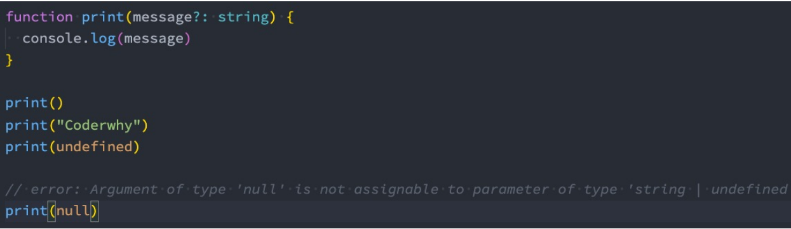
### 函数参数的联合类型
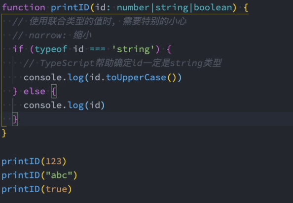
### 函数的返回值的类型
系统自动推算返回值类型
```ts
function sum(a:number , b:number ){
  return a + b
}
//function sum(a: number, b: number):  number
```
可以明确指定返回值的类型
```ts
function sum(a: number, b: number): string {
    return `计算结果是：${a + b}`;
}
console.log(sum(3, 3));
```
在箭头函数里面
```ts
let sum = (a: number, b: number): string => `计算结果是：${a + b}`
```
当函数没有明确返回值时，最好明确使用 void 类型。
```ts
function run():void {
  console.log('没有返回值 , 最好明确使用void')
}
```
### 使用 type 对函数参数声明(类型别名)
```ts
let addUser = (user:{name:string , age:number}):void =>{
   console.log('添加用户')
}
let updateUser = (user:{name:string , age:number}):void =>{
  console.log('更新用户')
}
updateUser({name:'frank' , age:18})
```
可以使用 type 对参数对象进行声明，通过这种复用的手段可以很好的优化代码
```ts{1-4}
type UserType = {
  name: string,
  age: number
}
let addUser = (user: UserType): void => {
  console.log('添加用户');
};
let updateUser = (user: UserType): void => {
  console.log('更新用户');
};
updateUser({name: 'frank', age: 18});
```
### 函数结构定义
* 没有返回值的函数的定义
```ts
let fn:() => void
fn = () => {
  console.log('hi')
}
```
* 普通函数的定义 , 在具体实现函数时参数可以为任何名称
```ts
let  sum: (a:number , b:number) => number

sum = (x:number , y:number):number => {
  return x + y
}
```
也可以直接声明函数时定义
```ts
let  sum:(a:number , b:number) => number = (x:number , y:number):number => x+ y
```
* 参数为对象结构的函数定义
```ts
let addUser: (user: { name: string, age: number }) => boolean;

addUser = (user: { name: string, age: number }): boolean => {
  return true;
};

addUser({ name: 'frank', age: 18 })
```
参数使用 type 进行了描述，也可以将函数结构使用 type 进行描述
```ts
type UserType = {
  name:string,
  age:number
}
type  AddUserFn = (user : UserType) => boolean

let addUser:AddUserFn = (user: UserType): boolean => {
  console.log('添加用户')
  return true;
};

addUser({ name: 'frank', age: 18 })
```
### 剩余参数
```ts
function push(arr: any[], ...args: any[]): any[] {
  arr.push(...args); 
  return arr;
}

push([], 'frank', 'jack', 'john');
```