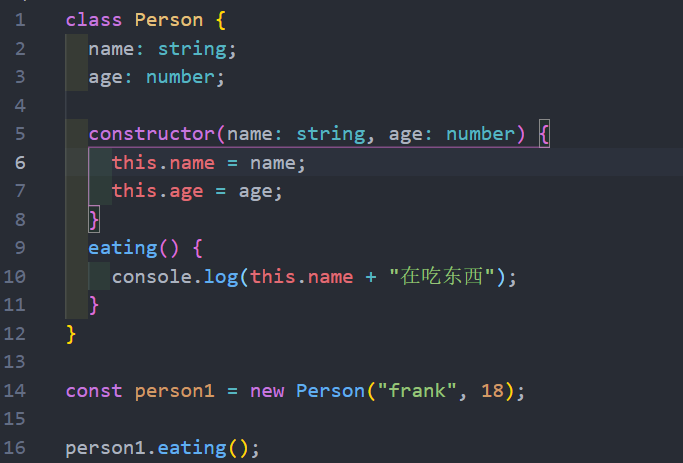
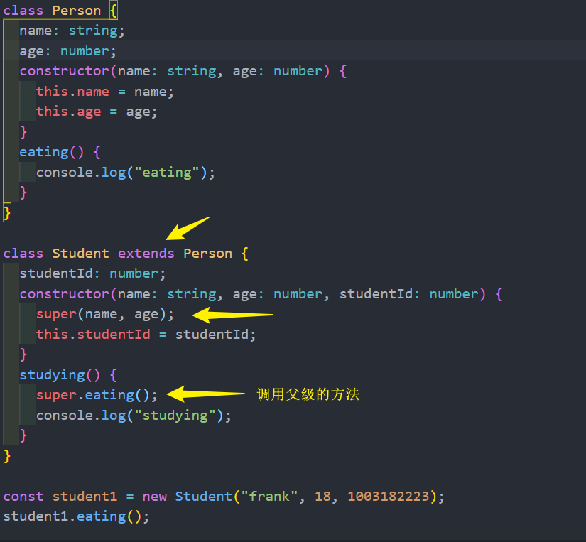
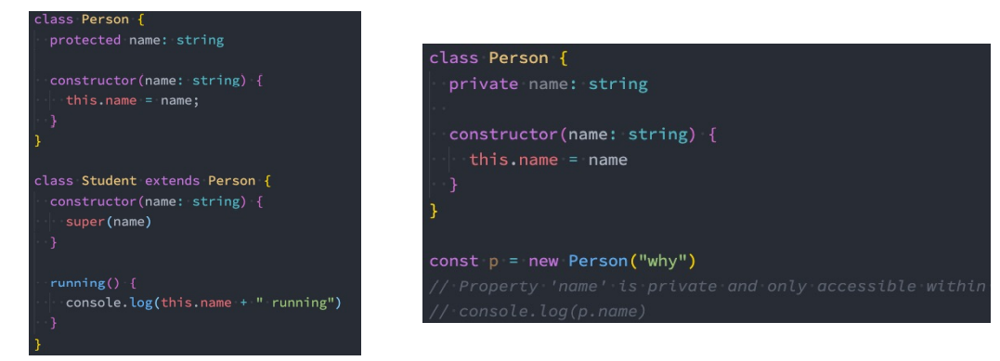
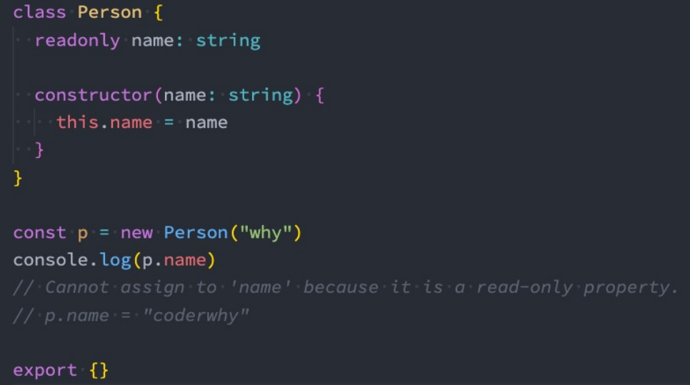
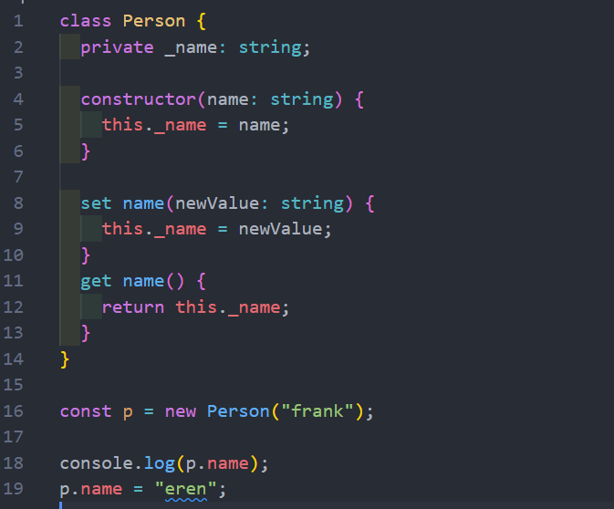
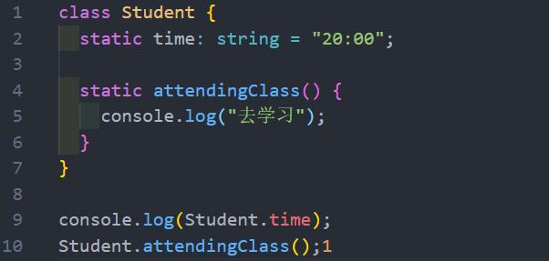
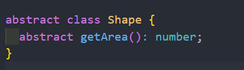
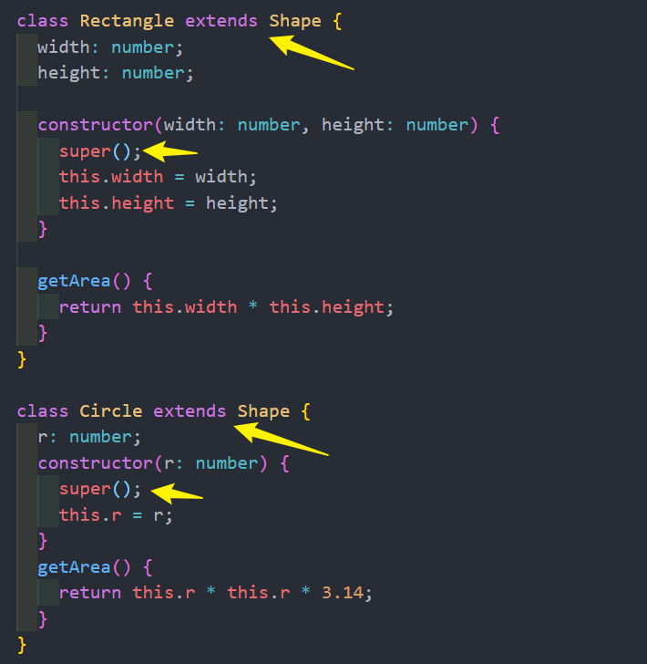
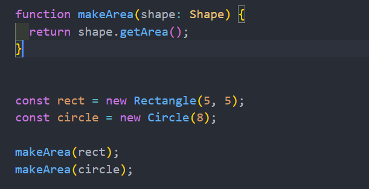
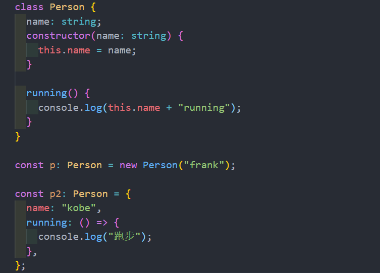

# 类 
使用class关键字来定义一个类；

我们可以声明一些类的属性：在类的内部声明类的属性以及对应的类型
* 如果类型没有声明，那么它们默认是any的；
* 我们也可以给属性设置初始化值；
* 在默认的 strictPropertyInitialization 模式下面我们的属性是必须初始化的，如果没有初始化，那么编译时就会报错；
  * 如果我们在 strictPropertyInitialization 模式下确实不希望给属性初始化，可以使用 name!: string语法；

类可以有自己的构造函数constructor，当我们通过new关键字创建一个实例时，构造函数会被调用；
* 构造函数不需要返回任何值，默认返回当前创建出来的实例；

类中可以有自己的函数，定义的函数称之为方法

## 类的继承
* 面向对象的其中一大特性就是继承，继承不仅仅可以减少我们的代码量，也是多态的使用前提。
* 使用extends关键字来实现继承，子类中使用super来访问父类。
* Student类继承自Person：
  * Student类可以有自己的属性和方法，并且会继承 Person 的属性和方法；
  * 在构造函数中，我们可以通过 super 来调用父类的构造方法，对父类中的属性进行初始化；

## 类的成员修饰符
在TypeScript中，类的属性和方法支持三种修饰符： public、private、protected
* public 修饰的是在任何地方可见、公有的属性或方法，默认编写的属性就是public的；
* private 修饰的是仅在同一类中可见、私有的属性或方法；
* protected 修饰的是仅在类自身及子类中可见、受保护的属性或方法；

### 只读属性 readonly
如果有一个属性我们不希望外界可以任意的修改，只希望确定值后直接使用，那么可以使用readonly

## getters/setters
在前面一些私有属性是不能直接访问的，或者某些属性我们想要监听它的获取(getter)和设置(setter)的过程，
这个时候我们可以使用存取器

## 静态成员
前面在类中定义的成员和方法都属于对象级别的, 在开发中, 有时候也需要定义类级别的成员和方法
* 在TypeScript中通过关键字static来定义

## 抽象类 abstract 
继承是多态使用的前提
* 所以在定义很多通用的调用接口时, 我们通常会让调用者传入父类，通过多态来实现更加灵活的调用方式。
* 但是，父类本身可能并不需要对某些方法进行具体的实现，所以父类中定义的方法,，我们可以定义为抽象方法。

什么是 抽象方法? 在TypeScript中没有具体实现的方法(没有方法体)，就是抽象方法。
* 抽象方法，必须存在于抽象类中；
* 抽象类是使用 abstract 声明的类；

抽象类有如下的特点：
* 抽象类是不能被实例的话（也就是不能通过new创建）
* 抽象方法必须被子类实现，否则该类必须是一个抽象类

## 类的类型 
类本身也是可以作为一种数据类型的

## 接口的声明