# 函数类型 
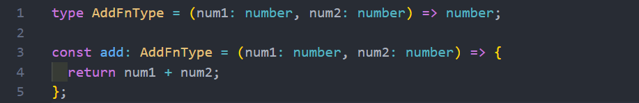
在某些语言中，可能参数名称num1和num2是可以省略，但是TypeScript是不可以的

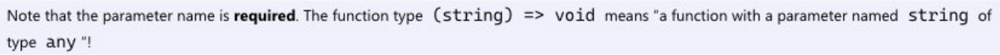

简单使用案例: 
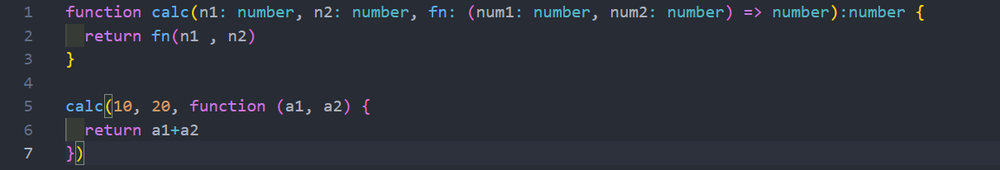
## 参数参数的可选类型
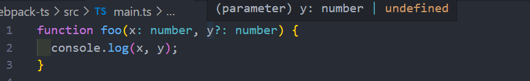
这个时候 y 依然是有类型的。它的类型是 number | undefined

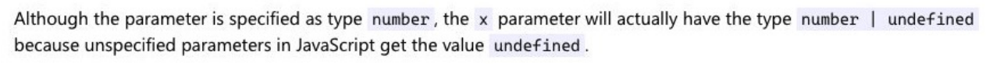
另外可选类型需要在必传参数的后面
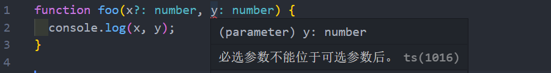
## 默认参数
从ES6开始，JavaScript是支持默认参数的，TypeScript也是支持默认参数的：
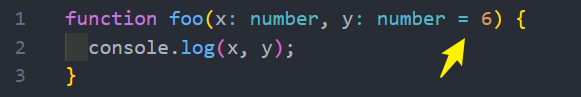  
## 剩余参数
从ES6开始，JavaScript也支持剩余参数，剩余参数语法允许我们将一个不定数量的参数放到一个数组中
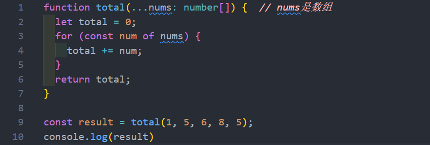
## 函数的重载
在TypeScript中，如果想编写了一个 add 函数，希望可以对字符串和数字类型进行相加，应该如何编写 ?

你可能会这样来编写，但是其实是错误的!! 
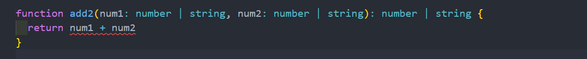
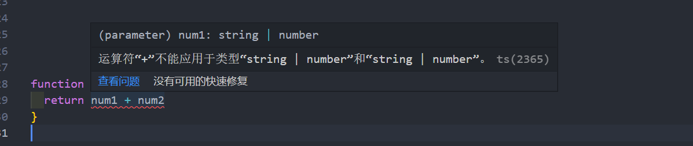

* 在TypeScript中，我们可以去编写不同的重载签名（overload signatures）来表示函数可以以不同的方式进行
调用；
* 一般是编写两个或者以上的重载签名，再去编写一个通用的函数以及实现

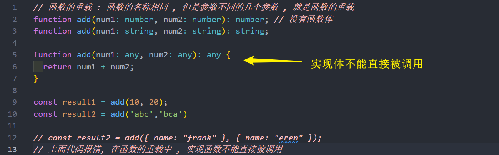

* **但是注意，有实现提的函数，是不能直接被调用的：**
## 联合类型和重载
现在有一个需求：定义一个函数，可以传入字符串或者数组，获取它们的长度

这里有两种实现方案：
* 方案一：使用联合类型来实现；
* 方案二：实现函数重载来实现；

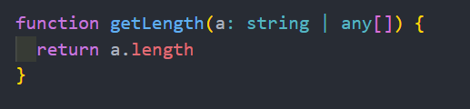
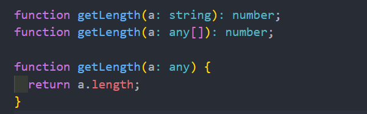

在可能的情况下，**尽量选择使用联合类型**来实现
