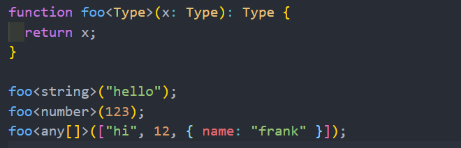
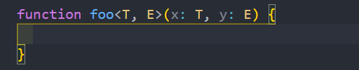
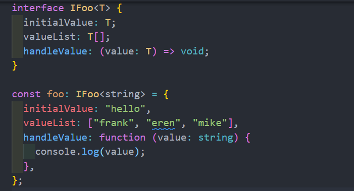
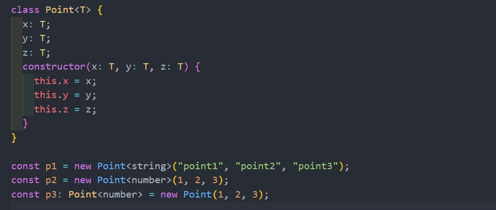
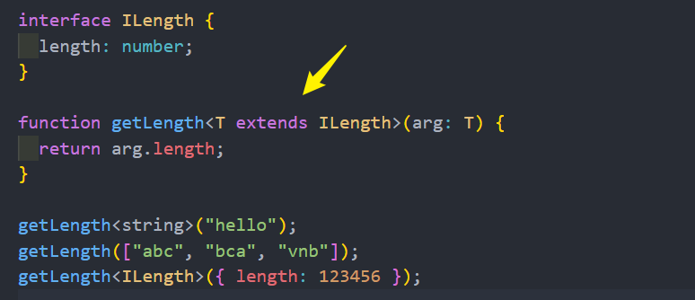

# 泛型
<!-- 泛型指使用时才定义类型，即类型可以像参数一样定义，主要解决类、接口、函数的复用性，让它们可以处理多种类型。`T`就是动态接受类型
## 基本使用
```ts
function fn<T>(arg: T): T {
  return arg;
}

let a = fn<string>('abc')
let b = fn<boolean>(true)
let c = fn<number>(123)
```
如果调用时不指定类型系统也会自动推断类型
```ts
...
let a = fn('abc') // let a: string
```
## 类型继承
泛型是不确定的类型，所以下面读取 length 属性将报错
```ts
function getLength<T>(arg: T): number {
  return arg.length;     //类型“T”上不存在属性“length”
}
```
可以用 `extends` 继承
```ts
function getLength<T extends string | any[]>(arg: T): number {  //联合类型
  return arg.length
}
```
TS也会自动推断，比如下面参数是 T[]，TS 会推断为数组类型，所以这时候是存在 length 的，不会报错
```ts
function getLength<T>(arg: T[]): number {
  return arg.length;
} 
```
## 类
**使用泛型复用类**
```ts
class collection<T> {
  data:T[] = []

  public push(...items:T[]){
      this.data.push(...items)
  }
  public shift():T | undefined {
    return this.data.shift()
  }
}

const a = new collection<number | string>()
a.push(1,2,3,'a','b')
a.shift()
console.log(a)
```
#### interface 结合泛型
```ts
class User<T> {
  public constructor( private _user:T) {
  }
  public get() :T{
    return this._user
  }
}
interface  UserInterface {
  name:string
  age:number
}

const user = new User({name:'frank',age:18})
```
## 接口
```ts
//文章接口
interface ArticleInterface<B, C> {
  title: string;
  isLock: B;
  comments: C[];
}
//评论接口
type comment = {
  content: string,
  author: string
}

const article: ArticleInterface<boolean, comment> = {
  title: '文章',
  isLock: true,
  comments: [
    {content: '一段内容', author: '作家'},
    {content: '一段内容2', author: '作家2'}
  ]
}; 
``` -->

在定义函数时 , 我不决定这些参数的类型 

而是让调用者已参数的形式告知 , 这里的参数应该是什么类型



当然我们也可以传入多个类型: 



平时在开发中我们可能会看到一些常用的名称：
* **T**：Type 的缩写，类型
* **K**、V：key和value的缩写，键值对
* **E**：Element的缩写，元素
* **O**：Object的缩写，对象

## 泛型接口
在定义接口的时候我们也可以使用泛型


## 泛型类 

## 泛型约束
有时候希望传入的类型有某些共性，但是这些共性可能不是在同一种类型中
* 比如 string 和 array 都是有 length 的，或者某些对象也是会有length属性的；
* 那么只要是拥有length的属性都可以作为我们的参数类型，那么应该如何操作 ?


