# 接口 
## 接口的声明 
前面通过type可以用来声明一个对象类型：

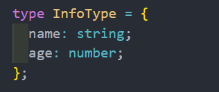

对象的另外一种声明方式就是通过接口来声明: 
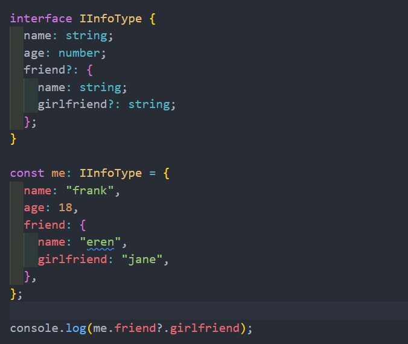
## 索引类型
是有时候会遇到类似下面的对象：
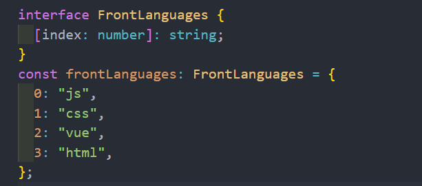
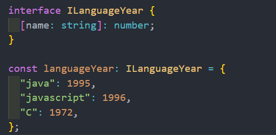
## 函数类型
，实际上 interface 也可以用来定义函数类型
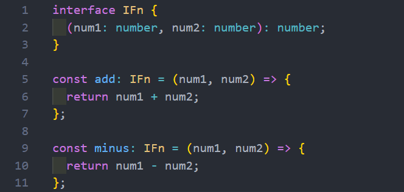

当然，除非特别的情况，还是推荐使用类型别名来定义函数

## 接口继承 
接口和类一样是可以进行继承的，也是使用 extends 关键字 

并且接口是支持多继承的（类不支持多继承) 

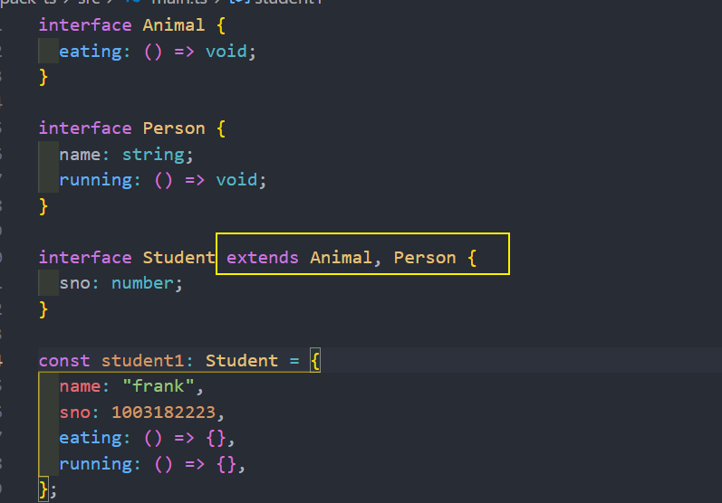
## 接口的实现
接口定义后，也是可以被类实现的
* 如果被一个类实现，那么在之后需要传入接口的地方，都可以将这个类传入
* 这就是面向接口开发

继承 : 只能实现单继承 
实现 : 实现接口 , 类可以实现多个接口 
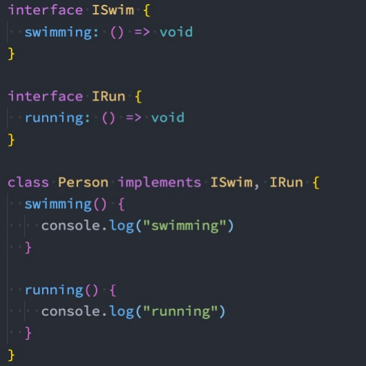  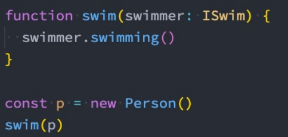

## 交叉类型
* 交叉类似表示需要满足多个类型的条件；
* 交叉类型使用 & 符号

在开发中，我们进行交叉时，通常是对对象类型进行交叉的
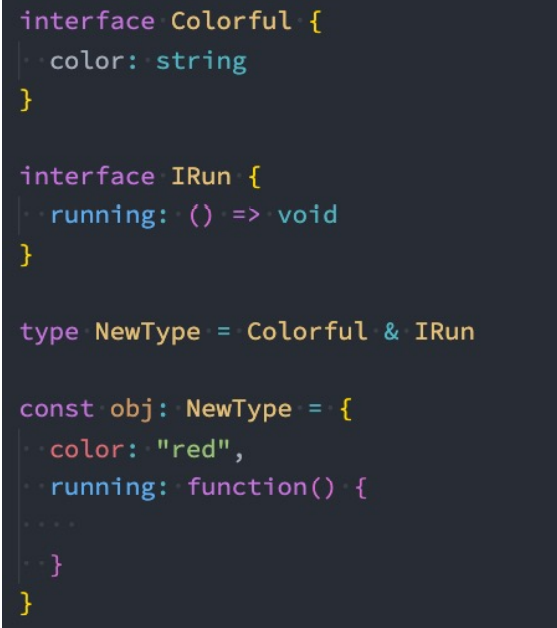
## type 和 interface 的区别 
发现interface和type都可以用来定义对象类型，那么在开发中定义对象类型时，到底选择哪一个呢？
* 如果是定义非对象类型，通常推荐使用type，比如Direction、Alignment、一些Function；

如果是定义对象类型，那么他们是有区别的：
* interface 可以**重复**的对某个接口来定义属性和方法；
* 而type定义的是别名，别名是**不能重复**的；

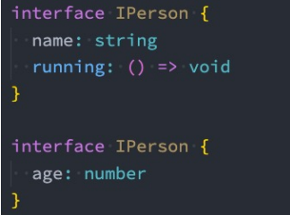 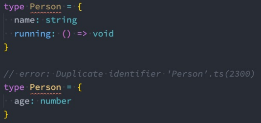
## 枚举类型
* 枚举其实就是将一组可能出现的值，一个个列举出来，定义在一个类型中，这个类型就是枚举类型；
* 枚举允许开发者定义一组命名常量，常量可以是数字、字符串类型

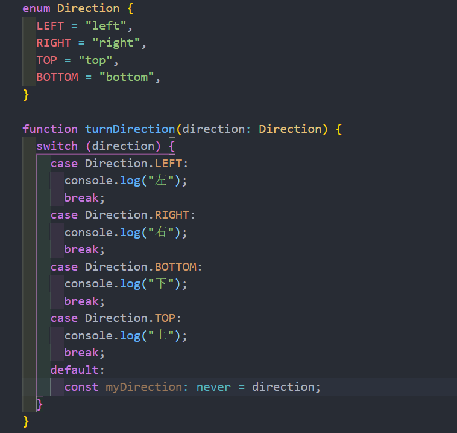

* 当然，我们也可以给枚举其他值：
* 这个时候会从100进行递增；
* 也可以给他们赋值其他的类型

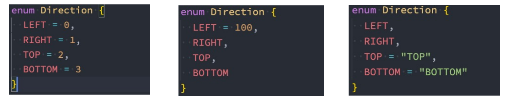

