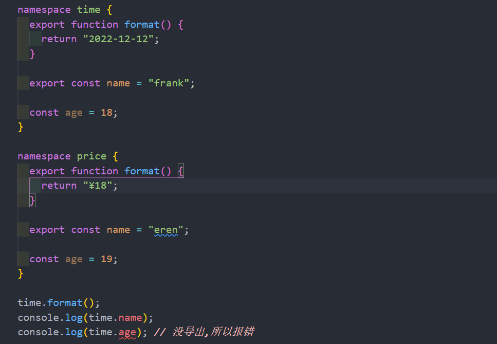
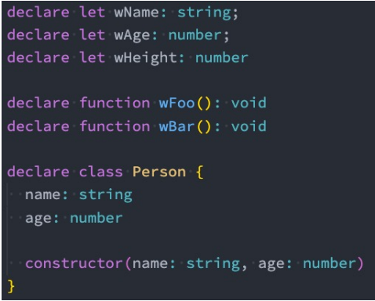
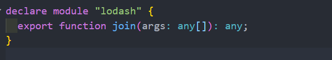
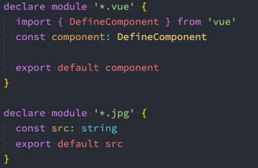
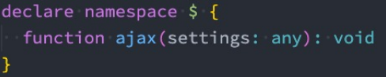
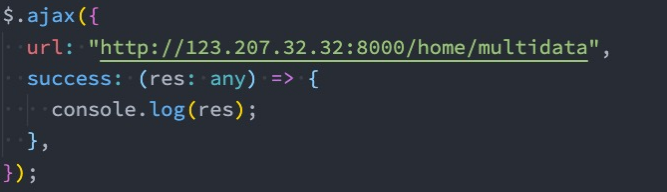

# 模块化开发
TypeScript支持两种方式来控制我们的作用域：
* 模块化：每个文件可以是一个独立的模块，支持ES Module，也支持CommonJS；
* 命名空间：通过 namespace 来声明一个命名空间
## 命名空间 namespace 
命名空间在TypeScript早期时，称之为内部模块，主要目的是将一个模块内部再进行作用域的划分，防止一些命名
冲突的问题

## 外部定义类型声明和自定义声明

外部类型声明通常是我们使用一些库（比如第三方库）时，需要的一些类型声明。
这些库通常有两种类型声明方式：

* 方式一：在自己库中进行类型声明（编写.d.ts文件），比如axios
* 方式二：通过社区的一个公有库DefinitelyTyped存放类型声明文件
  * 库的GitHub地址：[库](https://github.com/DefinitelyTyped/DefinitelyTyped/)
  * 库查找声明安装方式的地址：[搜索](https://www.typescriptlang.org/dt/search?search=)
  * 比如我们安装react的类型声明： npm i @types/react --save-dev

## 声明变量 , 函数 ,类

## 声明模块 
也可以声明模块，比如lodash模块默认不能使用的情况，可以自己来声明这个模块：

* 声明模块的语法: declare module '模块名' {}。
* 在声明模块的内部，我们可以通过 export 导出对应库的类、函数等
## declare文件
在某些情况下，我们也可以声明文件：
* 比如在开发vue的过程中，默认是不识别我们的.vue文件的，那么我们就需要对其进行文件的声明；
* 比如在开发中我们使用了 jpg 这类图片文件，默认typescript也是不支持的，也需要对其进行声明；

## declare命名空间
* 比如我们在index.html中直接引入了jQuery：

CDN地址： https://cdn.bootcdn.net/ajax/libs/jquery/3.6.0/jquery.js
* 我们可以进行命名空间的声明：

* 在main.ts中就可以使用了

