<!-- # 环境配置
## 项目中安装
项目中独立安装 typescript，这可以限定项目使用的 typescript 版本
```sh
yarn init -y
```
安装 typescript
```sh
yarn add -D typescript
```
查看版本
```sh
yarn tsc -v
```
## 编译TS
使用 tsc 命令可以将 ts 文件编译为js 文件，如果在编译过程中有 ts 错误将在命令行报出
```sh
tsc 1.ts  //会编译生成 1.js 文件
```
每次执行命令会过于繁琐 , 可以自动监听ts 文件内容并自动生成 js 文件
```sh
tsc 1.ts -w
```

## 配置文件
TS 支持对编译过程使用配置项自定义，要掌握TS 配置文件的创建与使用。
### 初始化
创建ts.config.json
```sh
tsc --init
```
配置项的定义进行监测
```sh
tsc -w 
``` -->

# TypeScript 的运行环境
* 方式一：通过 webpack，配置本地的 TypeScript 编译环境和开启一个本地服务，可以直接运行在浏览器上
* 方式二：通过 ts-node库，为 TypeScript 的运行提供执行环境
## webpack 配置
目录结构
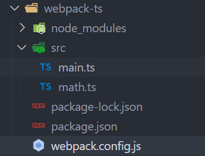
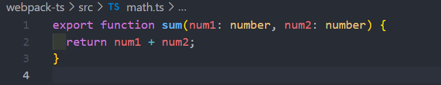
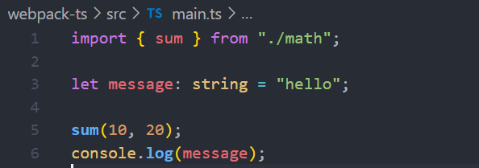

**现在来开始配置 webpack**

创建 package.json 文件
```sh
npm init
```
安装局部的webpack 
```sh
npm install webpack webpack-cli -D
```
package.json script脚本

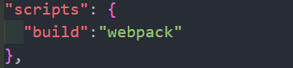

根目录下创建 webpack.config.js 配置文件
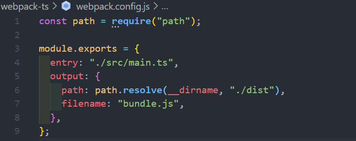

局部安装 ts-loader 和 typescript 
```sh
npm install ts-loader typescript -D
```
在配置一下 webpack.config.js
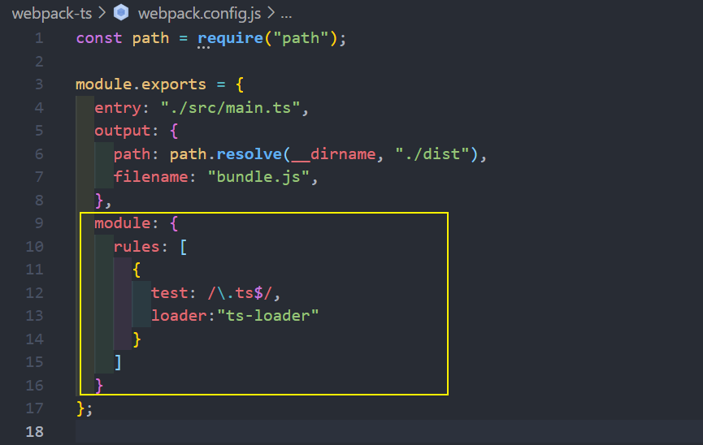
执行 **`npm run build`** , 报错缺少 tsconfig.json 文件
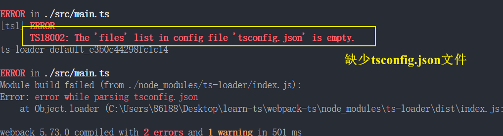
执行命令  **`tsc --init`** 生成 tsconfig.json 文件

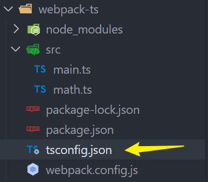

加上 extensions 
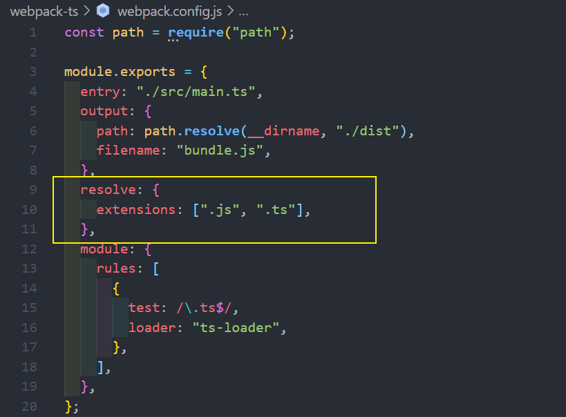

在用 webpack-dev-server 搭建本地服务
```sh
npm install webpack-dev-server -D
```
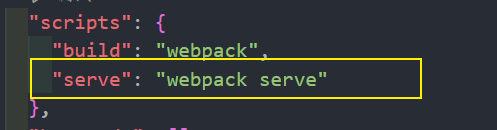
想要告诉他默认的模板是根目录下的index.html, 需要使用 html-webpack-plugin 插件
console.log(message);
安装 html-webpack-plugin 插件到根目录里
``` 
npm install html-webpack-plugin -D 
```
配置html-webpack-plugin 插件
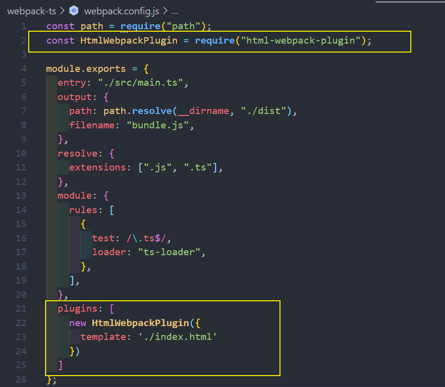


然后最终执行 `npm run serve` 
## 使用 ts-node
* 方式二：安装 ts-node
```
npm install ts-node -g
```
* 另外ts-node需要依赖 tslib 和 @types/node 两个包
```
npm install tslib @types/node -g
```
* 现在，可以直接通过 ts-node 来运行TypeScript的代码
```
ts-node math.ts
```

