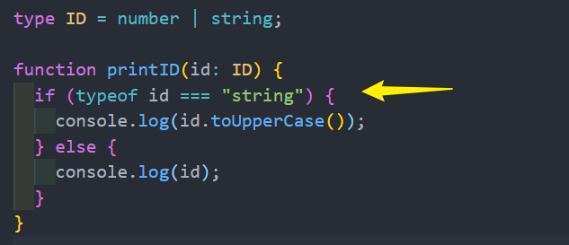
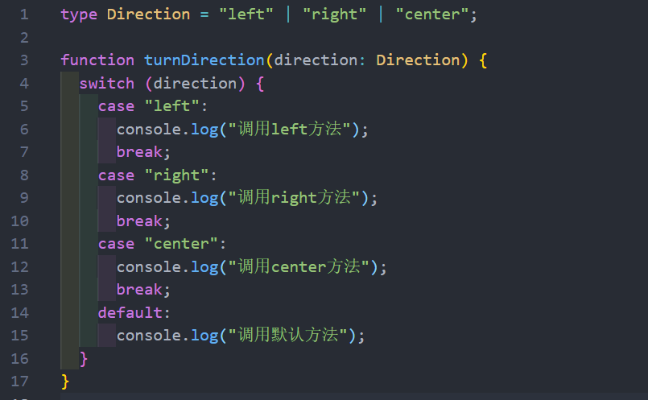
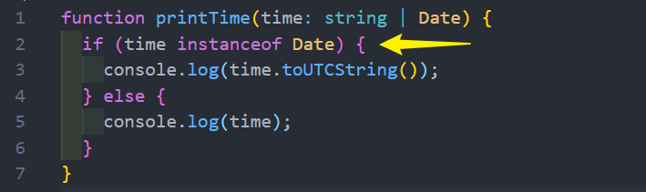
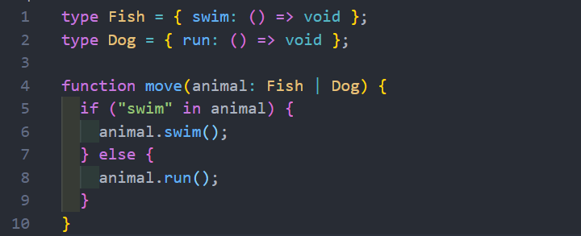

# 类型缩小
什么是**类型缩小**呢？
* 类型缩小的英文是 Type Narrowing
* 我们可以通过类似于 typeof padding === "number" 的判断语句，来改变TypeScript的执行路径
* 在给定的执行路径中，我们可以缩小比声明时更小的类型，这个过程称之为 缩小
* 而我们编写的 typeof padding === "number 可以称之为 类型保护（type guards）

**常见的类型保护**有如下几种：
* typeof
* 平等缩小（比如===、!==）
* instanceof
* in
* 等等..
## typeof 
在TypeScript 中，检查返回的值typeof是一种类型保护：因为 TypeScript 对如何typeof操作不同的值进行编码

## 平等缩小
可以使用Switch或者相等的一些运算符来表达相等性（比如===, !==）

## instanceof 
JavaScript 有一个运算符来检查一个值是否是另一个值的“实例”

## in
Javascript 有一个运算符，用于确定对象是否具有带名称的属性：in 运算符
* 如果指定的属性在指定的对象或其原型链中，则**in 运算符**返回 true

