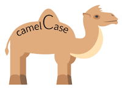

# 全局组件注册

## 全局组件注册
当要使用vue组件时 ,需要每次手动引入组件会很麻烦 , 所以用函数全部全局注册每个组件
还是那个熟悉的api `import.meta.globEager(pattern)`

src/plugins/index.ts
```ts{6,10-17}
import {App} from 'vue';
import {setupTailwindcss} from '@/plugins/tailwindcss';
import _ from 'lodash'
export function setupPlugins(app:App) {
  setupTailwindcss()
  autoRegisterComponent(app)
}

// 全局自动注册组件函数
function  autoRegisterComponent(app:App){
  const components= import.meta.globEager('../components/form/*.vue')
  //console.log(components)
  Object.keys(components).forEach((key)=>{
    const name = _.camelCase(key.split('/').pop()?.split('.').shift() as string)
    //console.log(name)
    app.component(name , components[key].default)   // 组件全局注册
  })
}
```


**小插曲**:`camelCase()`是"骆驼拼写法", 除了第一个每个单词第一个字母大写

## 自定义input组件和v-model
模板里使用input组件:
```ts{8}
<script setup lang="ts">
  const form = reactive({
    account:'',
    password:''
  })
</script>
<template>
    <hdInput  v-model="form.account"> 
    //等价于 下面代码( 细品 )
    <hdInput :modelValue="form.account" @update:modelValue="modelValue = $event"> 
</template>  
```
hdInput组件 :
<script setup lang="ts">
  const props = defineProps({
    modelValue:{
      type:string
    }
  })
</script>
<template>
  <input :value="props.modelValue" @input="$emit('update:modelValue' ,$event.target.value )">  <!--细品-->
</template>

