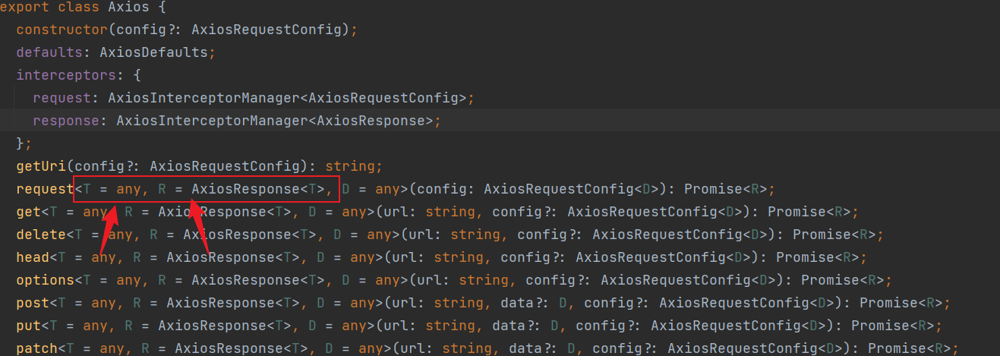
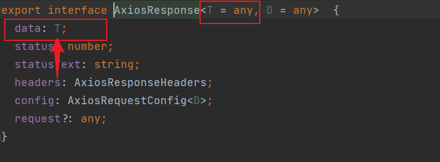

# Axios结合Typescript
[axios文档](https://github.com/axios/axios)
[中文文档](https://axios-http.com/zh/docs/instance)
```sh
yarn add axios
```
## 封装axios请求
mock/user.ts  模拟的后台数据
```ts
import {MockMethod} from 'vite-plugin-mock';

export default [
  {
    url: '/api/user/info',
    method: 'get',
    response: ({ query }) => {
      return {       // axios的response.data返回的格式
        code: 200,
        message:'请求成功',
        type:'success',
        result: {
          name: 'frank',
          age:18
        },
      }
    },
  },
  {
    url:'/api/login,
    method:'post',
    response:({query}=>{
      return {
        code:200,
        message:'登录成功',
        type:'success',
        result:{
          token:Random.string(10)
        }
      }
    })
  }
] as MockMethod[];
```
types/ResponseResult.ts   response.data 的类型
```ts
interface ResponseResult<T> {   // 请求返回的数据
  code: number,
  message:string,
  type:'success' | 'error',
  result: T     // 返回的类型要定制
}
```

src/plugins/axios/Axios.ts  axios配置
```ts{11-21}
import axios, {AxiosRequestConfig} from 'axios';

export class Axios {   //导出
  private instance;

  constructor(config:AxiosRequestConfig) {   // 类型 config : AxiosRequestConfig
    this.instance = axios.create(config);
    this.interceptors()
  }

  public async request<T,D=ResponseResult<T>>(config:AxiosRequestConfig):Promise<D>{   // 类型 router/types/ResponseResult.ts
    //return  await this.instance.request<D>(config)
    return new Promise(async (resolve,reject)=> {       //用Promise优化处理 直接返回 response.data
      try {
        const response = await this.instance.request<D>(config)
        resolve(response.data)
      }catch (error){
        reject(error)
      }
    })
  }

  private interceptors() {   //  下面都是拦截器
    this.interceptorRequest();
    this.interceptorResponse();
  }

  private interceptorRequest() {
    this.instance.interceptors.request.use(config => {
      // 在发送请求之前做些什么
      return config;
    },error=> {
      // 对请求错误做些什么
      return Promise.reject(error);
    });
  }

  private interceptorResponse() {
    this.instance.interceptors.response.use(response=> {
      // 2xx 范围内的状态码都会触发该函数。
      // 对响应数据做点什么
      return response;
    }, error => {
      // 超出 2xx 范围的状态码都会触发该函数。
      // 对响应错误做点什么
      return Promise.reject(error);
    });
  }
}
```
瞅一下 , `axios实例.request<>(config)`的泛型 , 注意看第一个参数`T`是`response.data`的类型, 第二个参数是返回的response的类型

`T`是`response.data`的类型

src/plugins/axios/index.ts  创建axios实例, 把实例导出
```ts
import { Axios } from './Axios';

const http = new Axios({  // 创建axios实例, 下面把实例导出
  baseURL:'/api',
  timeout:10000,
  headers:{
  }
})

export  { http }  //把实例导出
```

apis/userApi.ts     关于user的请求api
```ts
import { http } from '../src/plugins/axios/index'

interface  User {
  name: string,
  age:number,
  avatar:string
}
 async function  info(){    //获取用户信息
   return  await http.request<User>({
    url:'user/info'
  })
}

async function login(){    //用户登录操作
  // await http.request({
  //   url:'login'
  // })
}

export default {info , login}
```

举个例子, 在组件里使用api时
```vue
<script setup lang="ts">
import userApi from '../apis/userApi'

const result = await userApi.info()   
console.log(result.result)
</script>
```
