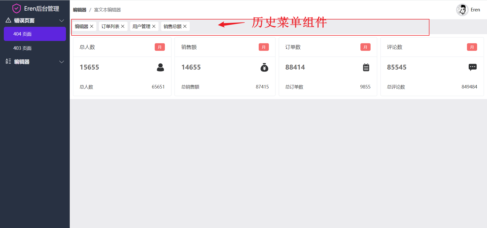
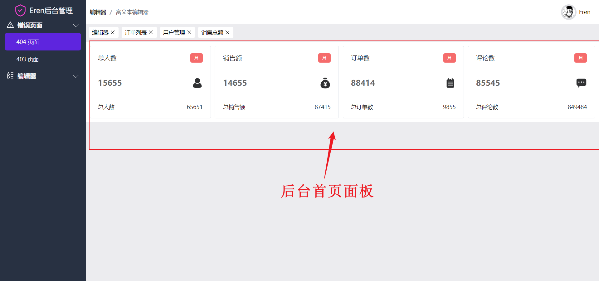
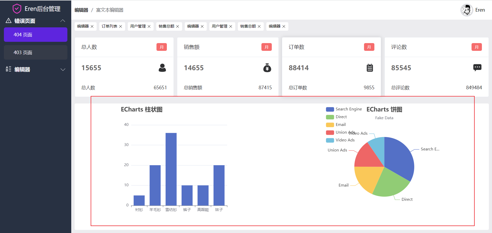

# 后台主体界面
## elementPlus安装
Vue 3 UI库 :[elementPlus官网](https://element-plus.gitee.io/zh-CN/guide/quickstart.html#%E7%94%A8%E6%B3%95)
```sh
yarn add element-plus
```
```
src/plugins/elementui
|--index.ts 入口文件
```
参考ElementPlus官网导入指南
```ts
import {App} from 'vue';
import ElementPlus from 'element-plus'
import 'element-plus/dist/index.css'

export default function setupElementPlus(app:App) {
  app.use(ElementPlus)
}
```
src/plugins/index.ts
```ts{4,8}
import {App} from 'vue';
import {setupTailwindcss} from '@/plugins/tailwindcss';
import _ from 'lodash'
import setupElementPlus from '@/plugins/elementui';

export function setupPlugins(app:App) {
  setupTailwindcss()
  setupElementPlus(app)
  autoRegisterComponent(app)
}

// 全局自动注册组件函数
function  autoRegisterComponent(app:App){
  const components= import.meta.globEager('../components/form/*.vue')
  Object.keys(components).forEach((key)=>{
    const name = _.camelCase(key.split('/').pop()?.split('.').shift() as string)
    console.log(name)
    app.component(name , components[key].default)
  })
}
```
## 顶部导航样式处理
导航使用了`ElementPlus`的面包屑组件 , 右侧有avatar, 鼠标浮上头像处出现额外的操作项

```vue
<script setup lang="ts">
</script>
<template>
<div class="navbar">
  <el-breadcrumb separator="/">
    <el-breadcrumb-item :to="{ path: '/' }">编辑器</el-breadcrumb-item>
    <el-breadcrumb-item><a href="">富文本编辑器</a></el-breadcrumb-item>
  </el-breadcrumb>
  <div class="avatar-wrapper">
    <div class="avatar">
      <div class="info">
        
        <span>Eren</span>
      </div>
      <div class="actions">
        <div>文档资料</div>
        <div>用户管理</div>
        <div>会员中心</div>
      </div>
    </div>
  </div>
</div>
</template>
<style lang="scss" scoped>
.navbar {
  padding: 10px;
  background: white;
  display: flex;
  align-items: center;
  justify-content: space-between;
  .avatar-wrapper{
    display: inline-block;
    &:hover {
      .actions {
        display: inline-block;
      }
    }
    .avatar {
      display: flex;
      font-size: 14px;
      padding:0 12px;
      position: relative;
      .info{
        cursor: pointer;
        display: flex;
        align-items: center;
      }
      img{
        cursor: pointer;
        width: 40px;
        height:40px;
        border-radius: 100%;
        border: 4px solid #dcdde1;
        margin-right:6px;
      }
    }
    .actions {
      display: none;
      position: absolute;
      background: white;
      border: 1px solid #718093;
      border-radius:4px ;
      top: 100%;
      &:hover{
        display: block;
      }
      >div {
        cursor: pointer;
        transition: all 0.25s ease;
        padding: 4px 10px;
        &:hover {
          background: #dcdde1;
        }
      }
    }
  }
}
</style>
```
## 历史菜单组件

src/layouts/admin/historyLink.vue
```vue
<script lang="ts" setup>
import {ref} from 'vue';
import Icon from '@/components/Icon.vue';

const links = ref<{ title: string }[]>([
  {title: '编辑器'},
  {title: '订单列表'},
  {title: '用户管理'},
  {title: '销售总额'},
]);
</script>

<template>
  <div class="historyLinks">
    <a href="" class="link" v-for="(link,index) in links" :key="index">
      {{ link.title }}
      <Icon name="delete"/>
    </a>
  </div>
</template>
<style lang="scss" scoped>
.historyLinks {
  margin-top: 8px;
  margin-left: 8px;
  display: flex;
  overflow: auto;
  max-width: calc(100vw - 230px);
  .link {
    display: flex;
    align-items: center;
    background: white;
    padding: 4px 8px;
    margin-right: 8px;
    border-radius: 4px;
    white-space: nowrap;
    font-size: 14px;
    >svg {
      border-radius: 100%;
      margin-left: 4px;
      transition:all .25s ease;
       &:hover {
        fill: white;
        background: black;
      }
    }
  }
}
</style>
```
## 后台首页面板

面板中使用到了`ElementPlus`的`Card`组件和`tag`组件 , 并且`v-for`循环展示动态的数据
```vue
<script lang="ts" setup>
import  Icon from '@/components/Icon.vue'
import {ref} from 'vue';
interface ICard {
  title:string,
  price:number,
  iconName:string,
  totalTitle:string,
  total:number
}

const cards = ref<ICard[]>([   // 响应式数据 
  {title:'总人数',price:15655,iconName:'account',totalTitle:'总人数',total:65651},
  {title:'销售额',price:14655,iconName:'amount',totalTitle:'总销售额',total:87415},
  {title:'订单数',price:88414,iconName:'dingdan',totalTitle:'总订单数',total:9855},
  {title:'评论数',price:85545,iconName:'pinglun',totalTitle:'总评论数',total:849484},
])
</script>
<template>
 <div class="wrapper">
   <el-card class="box-card" shadow="hover" v-for="(card,index) of cards " :key="index" :body-style="{padding:'0px'}">
     <template #header>
       <div class="card-header">
         <span>{{card.title}}</span>
         <el-tag class="ml-2" type="danger" effect="dark">月</el-tag>
       </div>
     </template>
     <section class="price">
       <span class="text">{{card.price}}</span>
       <Icon :name="card.iconName" />
     </section>
     <section class="account">
       <span class="text">{{card.totalTitle}}</span>
       <span class="text">{{card.total}}</span>
     </section>
   </el-card>
 </div>
</template>
<style lang="scss" scoped>
.wrapper {
  cursor: pointer;
  font-size: 14px;
  display: grid;
  grid-gap:10px ;
  grid-auto-flow: column;
  margin-top: 10px;
  padding: 10px 10px 0 10px ;
  background: white;
  flex-wrap: wrap;
  .box-card {
    margin-bottom:10px;
    .card-header {
      font-size: 16px;
      display: flex;
      justify-content: space-between;
    }
  }
  .price {
    padding: 18px 20px;
    display: flex;
    align-items: center;
    justify-content: space-between;
    .text{font-size: 20px;font-weight: bolder;color: #696767
    }
    > svg{
      width:2em;
      height:2em;
    }
  }
  .account {
    display: flex;
    padding: 18px 20px;
    align-items: center;
    justify-content: space-between;
  }
}
</style>
```
## echart图表
[echart官网](https://echarts.apache.org/handbook/zh/get-started/)


具体使用方法参考文档 , 

使用了柱状图和饼图 , 注意要使用了`nextTick`函数获取dom 
```vue{20-30}
<script lang="ts" setup>
import Icon from '@/components/Icon.vue';
import {nextTick, ref} from 'vue';

interface ICard {
  title: string,
  price: number,
  iconName: string,
  totalTitle: string,
  total: number
}

const cards = ref<ICard[]>([
  {title: '总人数', price: 15655, iconName: 'account', totalTitle: '总人数', total: 65651},
  {title: '销售额', price: 14655, iconName: 'amount', totalTitle: '总销售额', total: 87415},
  {title: '订单数', price: 88414, iconName: 'dingdan', totalTitle: '总订单数', total: 9855},
  {title: '评论数', price: 85545, iconName: 'pinglun', totalTitle: '总评论数', total: 849484},
]);

import * as echarts from 'echarts';
import {echart1 , echart2} from '@/layouts/admin/echart';
// 基于准备好的dom，初始化echarts实例
nextTick(()=>{
  var myChart1 = echarts.init(document.getElementById('echart1') as HTMLDivElement);
  var myChart2 = echarts.init(document.getElementById('echart2') as HTMLDivElement);
// 绘制图表
  myChart1.setOption(echart1);
  myChart2.setOption(echart2);
})

</script>
<template>
  <div class="wrapper">
    <el-card class="box-card" shadow="hover" v-for="(card,index) of cards " :key="index" :body-style="{padding:'0px'}">
      <template #header>
        <div class="card-header">
          <span>{{ card.title }}</span>
          <el-tag class="ml-2" type="danger" effect="dark">月</el-tag>
        </div>
      </template>
      <section class="price">
        <span class="text">{{ card.price }}</span>
        <Icon :name="card.iconName"/>
      </section>
      <section class="account">
        <span class="text">{{ card.totalTitle }}</span>
        <span class="text">{{ card.total }}</span>
      </section>
    </el-card>
  </div>
  <div class="echart">
    <el-card class="echart-card" >
      <template #header>
        <div class="card-header">
          <span>用户统计</span>
        </div>
      </template>
      <div id="echart1" style="width:100%;height:288px;"></div>
    </el-card>
    <el-card class="echart-card">
      <template #header>
        <div class="card-header">
          <span>销售额</span>
        </div>
      </template>
      <div id="echart2" style="width:100%;height:288px;"></div>
    </el-card>
  </div>
</template>
<style lang="scss" scoped>
.wrapper {
  cursor: pointer;
  font-size: 14px;
  display: grid;
  grid-gap: 10px;
  grid-auto-flow: column;
  margin-top: 10px;
  padding: 10px 10px 0 10px;
  background: #ececef;
  flex-wrap: wrap;
  .box-card {
    margin-bottom: 10px;
    .card-header {
      font-size: 16px;
      display: flex;
      justify-content: space-between;
    }
  }
  .price {
    padding: 18px 20px;
    display: flex;
    align-items: center;
    justify-content: space-between;

    .text {
      font-size: 20px;
      font-weight: bolder;
      color: #696767
    }

    > svg {
      width: 2em;
      height: 2em;
    }
  }
  .account {
    display: flex;
    padding: 18px 20px;
    align-items: center;
    justify-content: space-between;
  }
}
.echart {
  border-radius:4px ;
  margin: 10px;
  background:#e9e9ec ;
  display: flex;
  grid-gap: 10px;
  align-items: center;
 .echart-card {
   width:100%;
 }
}

@media  (max-width: 1000px) {
  .wrapper {
    grid-auto-flow: row;
  }
  .echart {
    flex-direction: column;
  }
}
</style>
```
把`echart`的配置抽离出来 , 并`export`导出 

src/layouts/admin/echart.ts
```ts
export const echart1 = {
  title: {
    text: 'ECharts 柱状图'
  },
  tooltip: {},
  xAxis: {
    data: ['衬衫', '羊毛衫', '雪纺衫', '裤子', '高跟鞋', '袜子']
  },
  yAxis: {},
  series: [
    {
      name: '销量',
      type: 'bar',
      data: [5, 20, 36, 10, 10, 20]
    }
  ]
}
export const echart2 =  {
  title: {
    text: 'ECharts 饼图',
    subtext: 'Fake Data',
    left: 'center'
  },
  tooltip: {
    trigger: 'item'
  },
  legend: {
    orient: 'vertical',
    left: 'left'
  },
  series: [
    {
      name: 'Access From',
      type: 'pie',
      radius: '50%',
      data: [
        { value: 1048, name: 'Search Engine' },
        { value: 735, name: 'Direct' },
        { value: 580, name: 'Email' },
        { value: 484, name: 'Union Ads' },
        { value: 300, name: 'Video Ads' }
      ],
      emphasis: {
        itemStyle: {
          shadowBlur: 10,
          shadowOffsetX: 0,
          shadowColor: 'rgba(0, 0, 0, 0.5)'
        }
      }
    }
  ]
};
```
